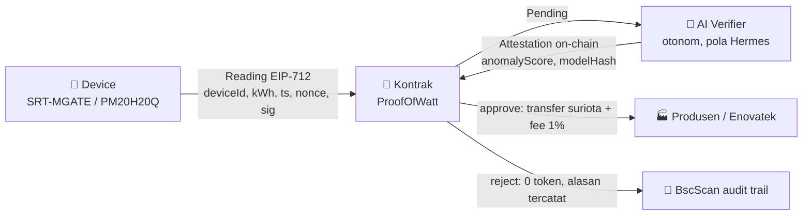

<div align="center">

[](https://web3.gifariksuryo.xyz)
&nbsp;

&nbsp;


# ⚡ Indonesia Web3 Hackathon 2026

### Workspace SURIOTA · Track Finance & Commerce · Tema AI × Web3

**Builder:** Gifari Kemal Suryo, CEO PT Surya Inovasi Prioritas (SURIOTA)
**Chain:** BNB Smart Chain Testnet (chainId 97) · **Demo Day:** 31 Oktober 2026

`AI Agents` · `Finance & Commerce` · `Consumer Apps` · Prize pool USD 5.000 (3 track)

🔗 **Repo:** [github.com/GifariKemal/wattsettle](https://github.com/GifariKemal/wattsettle) · 🌐 **Live:** [web3.gifariksuryo.xyz](https://web3.gifariksuryo.xyz)

</div>

---

## 🎯 Fokus Aktif

Workspace ini menyimpan banyak opsi. Yang **aktif dikerjakan** hanya tiga blok berikut. Sisanya sudah dipindah ke [`docs/Archive/`](docs/Archive/) sebagai referensi dan amunisi roadmap.

| Fokus | Peran | Dokumen | Status |
|:--|:--|:--|:--:|
| ⭐ **Opsi 5 WattSettle** | Visi platform (rel M2M energy settlement) | [`docs/02 Opsi 5 WattSettle.md`](<docs/02 Opsi 5 WattSettle.md>) | 🟢 Aktif |
| ⭐ **Opsi 6 Enovatek** | Mesin demo (PM20H20Q, Cooling as a Service) | [`docs/03 Opsi 6 Enovatek.md`](<docs/03 Opsi 6 Enovatek.md>) | 🟢 Aktif |
| 🔬 **Codex Opsi 7 dan 8** | Analisa challenger agentic commerce | [`docs/Codex Opsi 7 8/`](<docs/Codex Opsi 7 8/>) | 🟡 Riset |

> 🧭 **Keputusan submission:** bangun **Opsi 6** sebagai mesin demo (satu kasus konkret, deterministik, live), pitch **Opsi 5** sebagai visi platform. Codex Opsi 7 dan 8 disimpan sebagai kandidat pivot jika track energi ternyata padat.
> *"Di panggung: satu keran jalan sempurna (Enovatek). Di slide: pipa ke semua pasar (WattSettle)."*

---

## 📊 Papan Skor (red team calibrated)

```
Opsi 7.5 AgentCart TrustPay  ███████████████████░  92.5   challenger terkuat (codex)
Opsi 5/6 WattSettle+Enovatek ██████████████████░░  90.0   moat nyata paling kuat  ⭐ ENTRI UTAMA
Opsi 7   AgentCart SafePay    ██████████████████░░  89.5   hype tertinggi, moat lemah
Opsi 8   TrustCart Escrow     █████████████████░░░  86.5   pain jelas, novelty rendah
Opsi 1   ProofOfWatt          ███████████████░░░░░  74.5   base contract siap (arsip)
Opsi 3   ProofOfAlpha         ████████████░░░░░░░░  54.0   arsip
Opsi 2   JanjiChain           ██████████░░░░░░░░░░  48.0   arsip
```

<table>
<tr><th>Metrik</th><th>Nominasi / finalist</th><th>Juara 1 in-track</th></tr>
<tr><td>Probabilitas jujur</td><td>🟢 84% sampai 90%</td><td>🟡 45% sampai 58%</td></tr>
</table>

> Codex menempatkan AgentCart TrustPay 2.5 poin di atas WattSettle, tetapi menyimpulkan **WattSettle tetap paling defensible** karena hardware, partner, dan revenue nyata. Detail: [`docs/Codex Opsi 7 8/Deep Analysis.md`](<docs/Codex Opsi 7 8/Deep Analysis.md>).

---

## 🏗️ Arsitektur Settlement



Setiap langkah menghasilkan transaksi on-chain. Meter **adalah** transaksi yang di-settle, sehingga tidak ada celah oracle antara bukti fisik dan pembayaran.

---

## 🗂️ Peta Direktori

```
Web3 Hackathon 2026/
├── README.md                     👈 hub ini
├── docs/
│   ├── README.md                 index dokumen + cara baca
│   ├── 01 Master Strategi.md     ⭐ ringkasan strategi lintas opsi
│   ├── 02 Opsi 5 WattSettle.md   ⭐ master doc WattSettle (detail penuh)
│   ├── 03 Opsi 6 Enovatek.md     ⭐ produk demo Enovatek / PM20H20Q
│   ├── 04 SWOT Opsi 5 6.md       ⭐ SWOT + peta kompetitor
│   ├── Codex Opsi 7 8/           🔬 analisa challenger agentic commerce
│   └── Archive/                  🗄️ opsi 1, 2, 3, 4, 9 sampai 13 (referensi)
├── proofofwatt/                  📄 kontrak Foundry (ProofOfWatt.sol, 6 test PASS)
├── web/                          🌐 website pemaparan produksi (Astro, 17 halaman)
├── Presentasi Opsi 5 6/           🌐 website statis v1 (fallback offline)
└── .secrets/                     🔐 kredensial testnet (gitignored, jangan commit)
```

---

## ⛓️ State On-Chain (BSC Testnet, chainId 97)

| Aset | Alamat | Catatan |
|:--|:--|:--|
| 👛 Wallet (Rabby) | `0x52317162A7a228D01353e8907a5C068A6D9a0F2e` | saldo faucet tBNB |
| 🪙 Token `suriota` | `0x5f730750388176206cC3A7FE894c413675381B05` | ERC20, verified di BscScan, supply 1.000.000 |
| 📄 ProofOfWatt.sol | belum deploy | rencana Sesi 3, 6 test lokal PASS |

<details>
<summary><b>🔐 Catatan keamanan (klik untuk buka)</b></summary>

- Private key wallet dan password ada di [`.secrets/Wallet Testnet.txt`](<.secrets/Wallet Testnet.txt>). **Testnet only.** Jangan pernah pakai pola kredensial yang sama di mainnet.
- Folder `.secrets/` masuk `.gitignore`. Jangan commit dan jangan tempel di dokumen mana pun.
- Sebelum demo: **pre-fund reward pool** kira kira 500.000 `suriota` ke kontrak (payout memakai `transfer` dari saldo kontrak, bukan mint).

</details>

---

## 🚀 Cara Menjalankan

<table>
<tr><th>Komponen</th><th>Perintah</th></tr>
<tr><td>🌐 Website produksi</td><td><code>cd web &amp;&amp; npm install &amp;&amp; npm run dev</code> (buka :4321)</td></tr>
<tr><td>🌐 Website fallback</td><td>double-click <code>Presentasi Opsi 5 6/index.html</code></td></tr>
<tr><td>📄 Kontrak (Foundry, Git Bash)</td><td><code>cd proofofwatt &amp;&amp; forge test</code></td></tr>
</table>

---

## 🗓️ Roadmap 9 Sesi

| Sesi | Tanggal | Materi | Status |
|:--:|:--|:--|:--:|
| 1 | 5 Jul | Foundations 1, environment dan first deploy | ✅ |
| 2 | 12 Jul | Foundations 2, Solidity via Guestbook | ⬜ |
| 3 | 19 Jul | Smart Contract 1, Foundry, token, Bounty Board | ⬜ |
| 4 | 26 Jul | Smart Contract 2, full bounty dan security | ⬜ |
| 5 | 2 Ags | Backend 1, reading chain dan indexing | ⬜ |
| 6 | 9 Ags | Backend 2, API dan AI auto verify | ⬜ |
| 7 | 16 Ags | Frontend, dApp UI | ⬜ |
| 8 | 25 Ags | AI integration dan scope ideas | ⬜ |
| 9 | 30 Ags | Pitch training menuju Demo Day (31 Okt) | ⬜ |

<div align="center">

**Bismillah.** 🤲

<sub>Update terakhir: 7 Juli 2026 · disusun ulang dan diaudit end to end</sub>

</div>
