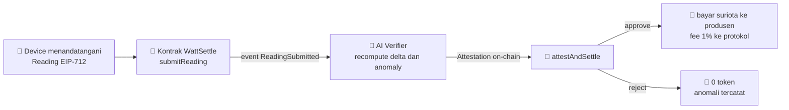

<div align="center">


&nbsp;

&nbsp;


# ⚡ Ikhtisar WattSettle

### Rel pembayaran mesin ke mesin untuk energi terverifikasi

</div>

**Navigasi:** [Hub](README.md) · [Berikutnya: 01 Latar Belakang](<01 Latar Belakang.md>)

---

## 💡 Satu Paragraf

WattSettle adalah **rel settlement on-chain untuk energi fisik**. Perangkat SURIOTA yang terpasang di lapangan menandatangani angka kWh secara kriptografis, sebuah verifier AI otonom memeriksa ulang bacaan itu terhadap baseline perangkat, menuliskan alasannya sebagai attestation on-chain, lalu kontrak membayar produsen energi secara otomatis dan memungut fee protokol. Setiap langkah menjadi transaksi yang bisa dicek publik di BscScan. Tagline kerja: **zkPull untuk energi fisik**.

---

## 🔁 Satu Loop

<div align="center">

</div>

> 💡 Diagram di atas beranimasi. Bila GitHub menampilkannya statis, versi presisi ada di diagram Mermaid berikut.



Karena yang di-settle adalah bacaan meter itu sendiri, tidak ada celah oracle antara bukti fisik dan pembayaran. Meter **adalah** transaksi.

---

## 🧭 Keputusan Kunci

| Topik | Keputusan | Detail |
|:--|:--|:--|
| Ide | Opsi 5 dan 6 digabung | [22 Decision Log](<22 Decision Log.md>) |
| Nama | **WattSettle** (Enovatek adalah use case demo) | [22 Decision Log](<22 Decision Log.md>) |
| Token | `suriota` default, MockUSD cadangan | [08 Tokenomics](<08 Tokenomics.md>) |
| Tooling | Foundry dan OpenZeppelin Contracts | [04 Setup Lingkungan](<04 Setup Lingkungan.md>) |
| Track | Finance and Commerce, AI Agents fallback | [01 Latar Belakang](<01 Latar Belakang.md>) |
| Chain | BSC testnet, chainId 97, UI via BscScan | [10 Deployment](<10 Deployment dan On-chain Ops.md>) |

---

## 📊 Posisi dan Peluang

```
Opsi 5 dan 6 WattSettle  ██████████████████░░  90.0   entri utama, moat nyata
```

| Metrik | Angka jujur | Syarat |
|:--|:--:|:--|
| Nominasi atau finalis | 🟢 84% sampai 90% | eksekusi flawless dan semua fix kill-shot |
| Juara 1 in-track | 🟡 45% sampai 58% | tidak dijanjikan, bergantung faktor tak terkontrol |

Detail kalibrasi ada di [16 Risiko dan Kill-shots](<16 Risiko dan Kill-shots.md>).

---

## 🚦 Status Terkini (7 Juli 2026)

| Komponen | Status |
|:--|:--|
| 📄 Kontrak `ProofOfWatt.sol` (base) | 6 test PASS, belum deploy |
| 🪙 Token `suriota` (ERC20) | deployed dan verified di BscScan testnet 97 |
| 🌐 Website pemaparan | live di web3.gifariksuryo.xyz |
| 🤖 AI Verifier (Hermes) | infra ada, integrasi WattSettle direncanakan |

> 💡 Mulai membangun dari [04 Setup Lingkungan](<04 Setup Lingkungan.md>), lalu ikuti peta per sesi di [13 Workflow Build](<13 Workflow Build.md>).

---

<div align="center">
<sub>© 2026 PT Surya Inovasi Prioritas (SURIOTA) · <a href="README.md">Hub WattSettle</a> · Update 7 Juli 2026</sub>
</div>
