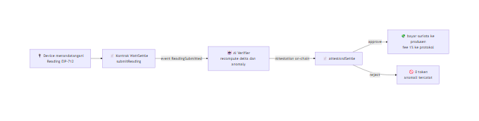

<div align="center">


&nbsp;

&nbsp;


# ⚡ Ikhtisar WattSettle

### Rel pembayaran mesin ke mesin untuk energi terverifikasi

</div>

**Navigasi:** [Hub](README.md) · [Berikutnya: 01 Latar Belakang](<01 Latar Belakang.md>)

---

## 💡 Satu Paragraf

WattSettle adalah **rel settlement on-chain untuk energi fisik**. Perangkat SURIOTA yang terpasang di lapangan menandatangani angka kWh secara kriptografis, sebuah verifier AI otonom memeriksa ulang bacaan itu terhadap baseline perangkat dan menuliskan alasannya sebagai attestation on-chain, lalu kontrak menghitung penilaiannya sendiri terhadap baseline yang tersimpan di rantai dan hanya membayar bila kedua penilaian sepakat, sekaligus memungut fee protokol. Setiap langkah menjadi transaksi yang bisa dicek publik di BscScan. Tagline kerja: **zkPull untuk energi fisik**.

---

## 🔁 Satu Loop

<div align="center">

</div>

> 💡 Diagram di atas beranimasi. Versi diagram statis yang presisi ada di bawah.

<div align="center">

</div>

Karena yang di-settle adalah bacaan meter itu sendiri, tidak ada celah oracle antara bukti fisik dan pembayaran. Meter **adalah** transaksi.

---

## 🧭 Keputusan Kunci

| Topik | Keputusan | Detail |
|:--|:--|:--|
| Ide | Opsi 5 dan 6 digabung | [22 Decision Log](<22 Decision Log.md>) |
| Nama | **WattSettle** (Enovatek adalah use case demo) | [22 Decision Log](<22 Decision Log.md>) |
| Token | `suriota` default, MockUSD cadangan | [08 Tokenomics](<08 Tokenomics.md>) |
| Tooling | Foundry dan OpenZeppelin Contracts | [04 Setup Lingkungan](<04 Setup Lingkungan.md>) |
| Track | Finance & Commerce, AI Agents fallback | [01 Latar Belakang](<01 Latar Belakang.md>) |
| Chain | BSC testnet, chainId 97, UI via BscScan | [10 Deployment](<10 Deployment dan On-chain Ops.md>) |

---

## 📊 Posisi dan Peluang

```
WattSettle  ██████████████████░░  90.0   entri utama, moat nyata
```

| Metrik | Angka jujur | Syarat |
|:--|:--:|:--|
| Nominasi atau finalis | 🟢 84% sampai 90% | eksekusi flawless dan semua fix kill-shot |
| Juara 1 in-track | 🟡 45% sampai 58% | tidak dijanjikan, bergantung faktor tak terkontrol |

Detail kalibrasi ada di [16 Risiko dan Kill-shots](<16 Risiko dan Kill-shots.md>).

---

## 🚦 Status Terkini (5 September 2026)

Kontrak sudah **live di BSC testnet chainId 97**. Baris di bawah bukan rencana, semuanya
punya transaksi yang bisa dibuka di BscScan.

| Komponen | Status |
|:--|:--|
| 📄 Kontrak `WattSettle.sol` | **LIVE** di `0xCA0A97a70fF720447051bDa247F8EE87e7B8Bb12`, 28 test PASS, ukuran 8322 byte |
| 🪙 Token `suriota` (ERC20) | deployed dan verified di BscScan testnet 97, reward pool sudah di-fund 50000 `suriota` |
| 🤖 AI Verifier (Hermes) | wallet `0xce4D51524eDECD04B5417F6C8B6E6B6b9e594291` memegang `VERIFIER_ROLE`, sudah menyelesaikan satu approve dan dua reject on-chain |
| 🔒 Gate dua lapis | kontrak menyimpan `baselineKwh` per perangkat dan menghitung penilaiannya sendiri, jadi **verifier yang berbohong memegang hak veto, bukan kuasa menyetujui**, dan itu sudah dibuktikan di rantai |
| 🔗 ERC-8004 | agent terdaftar di Identity Registry live chain 97, **agentId 2116** |
| 🔍 Verifikasi sumber | Terverifikasi di **BscScan** chain 97 (solc 0.8.30, optimizer 200 runs) dan di **Sourcify** dengan hasil `exact_match` untuk creation maupun runtime |
| 🌐 Website pemaparan | live di web3.gifariksuryo.xyz |

> [!NOTE]
> Loop lengkapnya sudah pernah berjalan sungguhan: bacaan 105 kWh disetujui dan membayar
> 103,95 `suriota` ke produsen plus 1,05 `suriota` fee ke treasury, sedangkan bacaan
> 4200 kWh ditolak on-chain tanpa satu token pun berpindah. Rincian alamat, transaksi,
> dan sisa saldo pool ada di [10 Deployment](<10 Deployment dan On-chain Ops.md>).

> [!IMPORTANT]
> Bukti terkuatnya bacaan ketiga. Sebuah attestation **sengaja dibuat berbohong** untuk
> bacaan 900 kWh terhadap baseline 100, mengaku delta 0 dan anomali 0. Kontrak menghitung
> sendiri 800 dan 10000 bps dari baseline yang tersimpan on-chain, lalu menolak tanpa
> membayar apa pun, lewat tx
> `0x7e8ba5a7b1e09f33a8015c043383500276fda8ad59e61bac861f78ce98391781`. Sifatnya di
> [09 Keamanan](<09 Keamanan.md>).

> 💡 Mulai membangun dari [04 Setup Lingkungan](<04 Setup Lingkungan.md>), lalu ikuti peta per sesi di [13 Workflow Build](<13 Workflow Build.md>).

---

<div align="center">
<sub>© 2026 PT Surya Inovasi Prioritas (SURIOTA) · <a href="README.md">Hub WattSettle</a> · Update 5 September 2026</sub>
</div>
