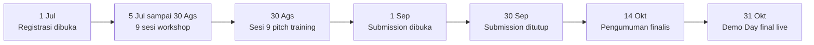

&nbsp;

&nbsp;

# 📖 Latar Belakang

### Kenapa oracle problem energi belum terpecahkan, dan kenapa justru SURIOTA yang bisa menutupnya

**Navigasi:** [Hub](README.md) · [Sebelumnya: 00 Ikhtisar](<00 Ikhtisar.md>) · [Berikutnya: 02 Konsep dan Cara Kerja](<02 Konsep dan Cara Kerja.md>)

---

## 🧩 Oracle Problem untuk Kerja Fisik

Smart contract bersifat deterministik dan tertutup. Ia bisa memverifikasi tanda tangan, saldo, dan logika di dalam rantai secara sempurna, tetapi ia buta total terhadap dunia fisik. Ketika sebuah kontrak harus tahu apakah sebuah panel surya benar-benar memproduksi 512 kWh, atau apakah sebuah AC benar-benar menyala selama 8 jam, ia terpaksa mempercayai sebuah pesan dari luar. Pesan itulah oracle, dan di situ letak lubangnya.

Untuk data harga aset kripto, masalah ini sudah relatif matang karena banyak sumber independen bisa saling silang cek. Untuk **kerja fisik**, ceritanya berbeda. Tidak ada Chainlink untuk membuktikan bahwa sebuah mesin di sebuah pabrik di Cikarang betul betul menghasilkan energi sebanyak yang diklaim. Angka kWh gampang dipalsukan di lapisan software, dan begitu angka palsu masuk ke kontrak, pembayaran otomatis akan mengeksekusi kebohongan itu dengan patuh.

> 💡 Inilah **oracle problem untuk kerja fisik**: sebuah kontrak tidak bisa mempercayai sensor. Selama jarak antara bukti fisik dan pembayaran diisi oleh pihak yang bisa berbohong, seluruh janji settlement otomatis runtuh.

WattSettle menutup lubang ini dengan dua lapis pertahanan. Pertama, angka kWh ditandatangani secara kriptografis oleh perangkat di titik sumber, sehingga tidak bisa diubah tanpa ketahuan. Kedua, sebuah verifier AI otonom memeriksa ulang angka itu terhadap baseline perangkat dan menuliskan alasan keputusannya sebagai attestation on-chain sebelum kontrak membayar. Cara kerja penuhnya dibahas di [02 Konsep dan Cara Kerja](<02 Konsep dan Cara Kerja.md>).

---

## 🗓️ Konteks Hackathon

WattSettle dibangun untuk **Indonesia Web3 Hackathon 2026**, kolaborasi Binance Academy, BNB Chain, Coinvestasi, dan Dev Web3 Jogja. Event ini gratis, online, dengan prize pool total USD 5.000 yang terbagi ke 3 track. Tema besarnya adalah **AI x Web3**.

| Aspek | Detail |
|:--|:--|
| Tema | AI x Web3 |
| Track WattSettle | **Finance & Commerce** (AI Agents sebagai fallback sah) |
| Track lain | AI Agents, Consumer Apps |
| Chain | BNB Smart Chain Testnet, chainId 97 |
| Prize pool | USD 5.000 total, terbagi 3 track (kira-kira 1 pemenang per track) |
| Field peserta | Mayoritas pemula, banyak fork chatbot dan template |

Timeline resmi (terverifikasi dari kanal Coinvestasi dan Luma, mengoreksi asumsi awal yang keliru):

> 💡 Implikasi terbesar dari timeline ini: ada **satu bulan penuh di September** untuk membangun setelah 9 sesi workshop selesai, lalu dua minggu penjurian sebelum finalis diumumkan. Jadwalnya longgar, sehingga tidak ada alasan gate hygiene tidak tuntas.

Kenapa memilih track **Finance & Commerce** dan bukan AI Agents. Track AI Agents diperkirakan akan penuh dengan fork chatbot dan template, sedangkan Finance & Commerce adalah tempat hampir tidak ada pemula yang mampu mengirimkan kontrak settlement yang benar-benar bekerja. Track ini juga tepat di tengah selera juri Dev Web3 Jogja yang terbukti condong ke RWA, DePIN, dan payments. Rincian kill-shot dan validasi densitas track ada di [16 Risiko dan Kill-shots](<16 Risiko dan Kill-shots.md>).

---

## 🏭 Kenapa Justru SURIOTA yang Bisa Membangun Ini

Sebagian besar peserta hackathon adalah software builder murni. Mereka hanya bisa mensimulasikan dunia fisik. SURIOTA (PT Surya Inovasi Prioritas) berdiri di posisi yang berbeda karena memiliki tiga aset nyata yang saling menyambung menjadi rantai penuh dari silikon sampai settlement.

| Aset | Wujud nyata | Peran di WattSettle |
|:--|:--|:--|
| 🔌 Hardware lapangan | **SRT-MGATE-1210** (gateway ESP32, Modbus RTU/TCP ke MQTT) sudah dijual dan ter-deploy | Device signer yang menandatangani `Reading` EIP-712 di titik sumber |
| 🗺️ Produk energi | surge-energy-map, monitoring energi ke customer B2B industri | Sumber baseline dan data metered dunia nyata |
| 🤖 Infra AI | **Hermes** agent di VPS SURIOTA (cron, tool-calling, watchdog) | Basis verifier AI otonom yang memeriksa ulang dan menulis attestation |

Karena SURIOTA menguasai seluruh stack dari silikon, firmware, gateway, verifier, kontrak, sampai settlement token, tidak ada oracle, facilitator, atau vendor eksternal yang harus diajak berbagi margin atau yang bisa memblokir alur. Inilah yang membuat WattSettle bukan sekadar ide, melainkan produk yang bisa dipasang di installed base yang sudah ada.

---

## 🛡️ Moat sebagai 5 Hal Langka yang Dipegang Sekaligus

Moat WattSettle bukan satu keunggulan tunggal, melainkan kombinasi lima hal langka yang harus dimiliki bersamaan. Setiap hal secara terpisah bisa ditiru, tetapi kelimanya sekaligus jatuh di celah yang kosong, yaitu terlalu enterprise untuk builder crypto, dan terlalu crypto untuk perusahaan energi.

| # | Hal langka | Kenapa sulit ditiru |
|:--:|:--|:--|
| 01 | **Hardware nyata** | Builder crypto berbasis software saja, hanya bisa mensimulasikan device. SURIOTA sudah mengapalkan meter fisik |
| 02 | **Domain energi dan OT** | Butuh pengetahuan Operational Technology, Modbus, dan perilaku meter, bukan sekadar Solidity |
| 03 | **Last-mile physical trust** | Membuktikan kerja fisik butuh device plus pemahaman lapangan, bukan kode belaka |
| 04 | **Customer dan distribusi** | Sudah ada pihak yang memasang meter dan membayar. Cold-start nol |
| 05 | **Timing regulasi** | CBAM dan supervisi kripto OJK sama-sama aktif Januari 2026, jendela yang tepat |

> ⚠️ Prior art yang mirip memang ada, seperti WeatherXM, Arkreen, dan Powerledger. Namun kombinasi industrial plus AI-reasoning plus pasar Indonesia plus owned-hardware belum ada satu pun yang memegangnya utuh. Detail peta kompetitor ada di [17 SWOT dan Kompetitor](<17 SWOT dan Kompetitor.md>).

Referensi pemenang yang menegaskan selera juri: **zkPull** (juara Mantle 2025) memakai pola real-world event yang diverifikasi lalu kontrak melepas reward otomatis, struktur yang identik dengan WattSettle, sehingga tagline kerja kami adalah **zkPull untuk energi fisik**. **OwnaFarm** (juara RWA invoice financing) menang dengan satu kasus konkret plus visi besar, pola yang kami tiru satu level di atas karena kami punya hardware dan revenue nyata.

---

## 📊 Pasar dan Regulasi sebagai Ceiling, Bukan Klaim

Angka pasar di bawah ini dipakai untuk membingkai **plafon** peluang, bukan sebagai klaim pendapatan. SOM yang jujur secara bottom-up adalah fleet SRT-MGATE-1210 milik SURIOTA sendiri dikalikan fee per gateway, yaitu beachhead di kisaran puluhan ribu sampai ratusan ribu ARR, bukan mengejar TAM miliaran dolar.

| Anchor pasar | Angka | Sifat |
|:--|:--|:--|
| M2M payments (TAM) | ~$11,29B (2026) menuju ~$54,95B (2034), CAGR 21,9% | Ceiling makro, micropayment viable di BNB |
| Agentic commerce | ~$8B (2026) menuju ~$1,5T (2030, Juniper) | Arah gelombang AI x settlement |
| DePIN | ~$9B sampai $11B kapitalisasi, energi ~38% deployment | Vertikal energi terbesar di DePIN |
| Meter market Indonesia | ~$180M sampai $220M (2026) | Pasar lokal yang bisa dijangkau |
| IoT energy/utilities Indonesia | sub-sektor CAGR 18,11% | Flywheel hardware yang searah |

Regulasi justru menjadi tailwind, bukan hambatan, karena perusahaan berlisensi yang menaruh energi metered on-chain adalah persis wujud Web3 matang yang diinginkan regulator maupun BNB.

| Regulasi | Waktu | Relevansi ke WattSettle |
|:--|:--|:--|
| **EU CBAM** | Live 1 Januari 2026 | Menciptakan permintaan atas bukti energi dan karbon yang machine-verified untuk eksportir |
| **Supervisi kripto OJK** | Januari 2026 | Rezim financial-asset, plus sandbox RWA (POJK 3/2024), memberi jalur kepatuhan |
| **PR 110/2025** | Berlaku | Kerangka kebijakan energi yang mendukung monetisasi produksi bersih |

> 💡 Positioning yang lahir dari kombinasi ini: sebuah PT Indonesia berlisensi yang men-settle kilowatt-hour nyata, machine-to-machine, di atas rantai yang sedang didorong regulator ke arah RWA dan Agentic Finance. Itu bukan narasi yang bisa dipalsukan oleh entrant lain.

---

© 2026 PT Surya Inovasi Prioritas (SURIOTA) · <a href="README.md">Hub WattSettle</a> · Update 7 Juli 2026

