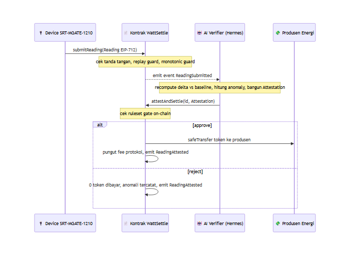

&nbsp;

&nbsp;

# 💡 Konsep dan Cara Kerja

### Rel settlement plus wasit AI untuk energi terverifikasi, tanpa celah oracle

**Navigasi:** [Hub](README.md) · [Sebelumnya: 01 Latar Belakang](<01 Latar Belakang.md>) · [Berikutnya: 03 Arsitektur](<03 Arsitektur.md>)

---

## 🧠 Mental Model

WattSettle paling mudah dipahami sebagai gabungan dua benda yang selama ini dianggap terpisah, yaitu **sebuah rel pembayaran** dan **seorang wasit AI**, keduanya khusus untuk energi terverifikasi.

Rel pembayaran adalah bagian yang men-settle. Ketika sebuah bacaan energi dinyatakan sah, kontrak otomatis mentransfer token settlement ke produsen energi dan memungut fee protokol. Tidak ada invoice manual, tidak ada bank sebagai perantara, tidak ada klik manusia.

Wasit AI adalah bagian yang menilai. Sebelum rel membayar, sebuah verifier AI otonom memeriksa ulang angka yang masuk terhadap baseline perangkat, menghitung seberapa jauh angka itu menyimpang, lalu menuliskan alasan keputusannya ke rantai. Wasit ini tidak sekadar menekan tombol setuju, ia mengevaluasi, dan ia bisa menolak.

> 💡 Perbedaan inti dengan sistem lama: keputusan verifier bukan lagi boolean tak terbaca `true` atau `false`, melainkan sebuah **rationale yang legible on-chain**. Angka delta, skor anomali, dan hash model semuanya tercatat, sehingga siapa pun bisa memeriksa kenapa sebuah pembayaran terjadi atau ditolak.

---

## 📥 Struktur Reading, Apa yang Ditandatangani Perangkat

Semuanya bermula dari sebuah `Reading`. Ini adalah paket data yang ditandatangani secara kriptografis oleh perangkat SRT-MGATE-1210 di titik sumber, memakai skema EIP-712 di domain `ProofOfWatt/1`. Karena ditandatangani di perangkat, angka di dalamnya tidak bisa diubah oleh siapa pun di sepanjang jalur tanpa merusak tanda tangan.

| Field | Tipe | Makna |
|:--|:--|:--|
| `deviceId` | `bytes32` | Identitas unik perangkat yang sudah terdaftar via `registerDevice` |
| `kWh` | `uint256` | Angka energi yang diklaim untuk periode ini |
| `timestamp` | `uint64` | Waktu bacaan, dijaga monotonik naik agar tidak bisa mundur |
| `nonce` | `uint256` | Penghitung unik per perangkat, penjaga terhadap replay |
| `signature` | `bytes` | Tanda tangan ECDSA atas keempat field di atas |

Dua penjaga keamanan bekerja saat `Reading` masuk. Penjaga **replay** memakai `usedDigest` untuk menolak digest yang sama dua kali. Penjaga **monotonic** memakai `lastTs` untuk menolak timestamp yang tidak lebih baru dari bacaan sebelumnya. Kombinasi tuple `deviceId`, `nonce`, dan `timestamp` yang selalu segar memastikan tidak ada bacaan lama yang bisa dipakai ulang untuk memicu pembayaran ganda.

---

## 📝 Struktur Attestation, Apa yang Ditulis Verifier

Setelah verifier AI selesai memeriksa, ia tidak hanya menyimpulkan sah atau tidak. Ia membangun sebuah `Attestation`, yaitu rekaman alasan yang ditulis ke rantai. Struktur inilah yang mengubah autonomy AI dari sesuatu yang tak terlihat menjadi sesuatu yang bisa diaudit publik.

| Field | Tipe | Makna |
|:--|:--|:--|
| `kwhDeltaVsBaseline` | `int256` | Selisih antara kWh yang diklaim dan baseline perangkat, rationale numerik |
| `anomalyScoreBps` | `uint16` | Skor anomali dalam basis poin, rentang 0 sampai 10000 |
| `modelVersionHash` | `bytes32` | keccak256 dari versi model atau logika yang dipin, auditable dan tidak sekadar diklaim |
| `rulesetHash` | `bytes32` | keccak256 dari file ruleset yang dipublikasikan, cocok dengan file di repo |
| `evaluatedAt` | `uint64` | Waktu evaluasi dilakukan oleh verifier |

Dua field terakhir penting untuk kredibilitas. Karena `modelVersionHash` dan `rulesetHash` tertulis di rantai dan cocok dengan file di repo, juri atau auditor bisa memverifikasi bahwa keputusan itu **dihitung, bukan di-hardcode**. Gerbang persetujuan di kontrak lalu bersifat sederhana dan transparan, yaitu approve jika `anomalyScoreBps` di bawah ambang dan besar `kwhDeltaVsBaseline` masih di dalam batas yang ditetapkan.

---

## 🔁 Satu Loop Penuh, dari Ujung ke Ujung

Berikut satu putaran lengkap dari perangkat menandatangani sampai pembayaran atau penolakan tercatat di rantai. Aktor manusia sama sekali tidak menyentuh tombol di jalur kritis ini.

Urutan langkahnya. Perangkat memanggil `submitReading` dengan `Reading` yang sudah ditandatangani. Kontrak memverifikasi tanda tangan lalu melewatkannya melalui replay guard dan monotonic guard, kemudian memancarkan event `ReadingSubmitted`. Verifier AI Hermes yang berlangganan event itu bangun sendiri lewat cron tanpa klik, menghitung ulang delta terhadap baseline, mengukur anomali, lalu membangun `Attestation`. Verifier memanggil `attestAndSettle` dengan `VERIFIER_ROLE`. Kontrak memeriksa ruleset gate on-chain. Jika lolos, kontrak membayar produsen memakai `safeTransfer` dan memungut fee protokol. Jika tidak lolos, nol token dibayar dan anomali tetap tercatat sebagai bukti abadi. Kedua cabang sama-sama memancarkan `ReadingAttested` dengan rationale yang bisa didecode di BscScan.

---

## 🎯 Kenapa Meter ADALAH Transaksi

Di sistem oracle biasa, ada jarak antara bukti fisik dan pembayaran, dan jarak itu diisi oleh sebuah pihak perantara yang bisa berbohong. Di WattSettle jarak itu hilang.

> 💡 Yang di-settle bukan sebuah klaim tentang bacaan meter, melainkan **bacaan meter yang ditandatangani itu sendiri**. Objek yang dibayar dan objek yang dibuktikan adalah satu benda yang sama. Karena itu tidak ada celah oracle yang bisa disusupi. Meter **adalah** transaksi.

Tiga sifat membuat klaim ini kokoh. Pertama, angka kWh ditandatangani di perangkat, sehingga integritasnya terjaga sejak titik nol. Kedua, verifier AI menghitung ulang secara independen dan menulis alasannya, sehingga persetujuan bukan stempel karet. Ketiga, seluruh keputusan dan pembayaran terjadi sebagai transaksi on-chain yang bisa dicek publik. Tidak ada satu pun langkah yang bergantung pada kepercayaan buta terhadap pihak luar.

<b>🔤 Glosarium singkat istilah kunci</b>

| Istilah | Arti ringkas |
|:--|:--|
| EIP-712 | Skema tanda tangan terstruktur, dipakai perangkat untuk menandatangani `Reading` |
| Attestation | Rekaman rationale keputusan verifier yang ditulis on-chain |
| `attestAndSettle` | Fungsi kontrak yang menerima Attestation lalu membayar atau menolak |
| VERIFIER_ROLE | Role akses yang hanya dipegang verifier AI untuk memanggil settle |
| Ruleset gate | Ambang on-chain yang menentukan approve atau reject |
| Oracle gap | Celah antara bukti fisik dan pembayaran yang WattSettle tutup |

Daftar lengkap istilah dan singkatan ada di [20 Glosarium](<20 Glosarium.md>).

---

© 2026 PT Surya Inovasi Prioritas (SURIOTA) · <a href="README.md">Hub WattSettle</a> · Update 7 Juli 2026

