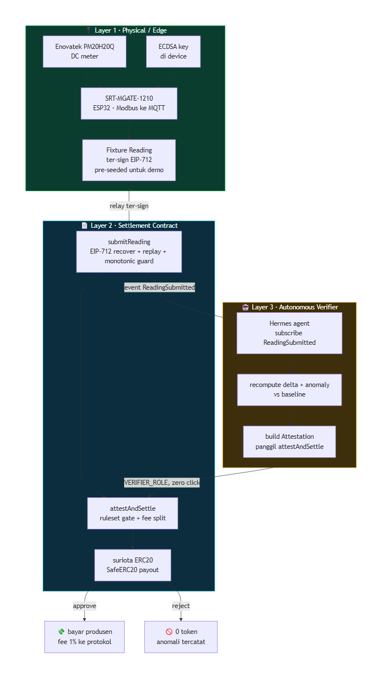
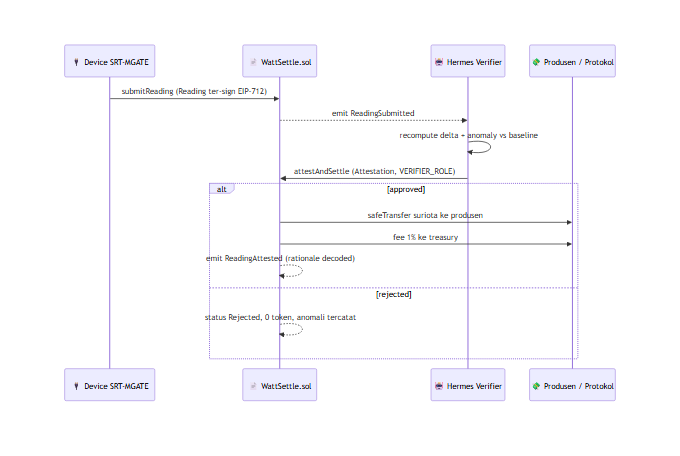

&nbsp;

&nbsp;

# 🏗️ Arsitektur WattSettle

### Tiga layer, satu loop, nol dependency eksternal di critical path

**Navigasi:** [Hub](README.md) · [Sebelumnya: 02 Konsep dan Cara Kerja](<02 Konsep dan Cara Kerja.md>) · [Berikutnya: 04 Setup Lingkungan](<04 Setup Lingkungan.md>)

---

## 💡 Prinsip Desain

WattSettle dibangun di atas satu keyakinan arsitektural: **yang di-settle adalah bacaan meter itu sendiri**, sehingga tidak ada celah oracle antara bukti fisik dan pembayaran. Untuk menjaga demo tetap deterministik dan tahan gagal, seluruh sistem dipecah menjadi tiga layer yang jelas batasnya, dengan aturan keras bahwa **tidak ada satupun dependency runtime eksternal yang berdiri di jalur kritis demo**.

> 💡 Filosofi build proyek ini adalah evolve, bukan rewrite. Layer 2 tumbuh dari kontrak `ProofOfWatt.sol` yang sudah 6 test PASS, Layer 3 memakai ulang infra Hermes yang sudah berjalan, dan Layer 1 memakai ulang hardware SRT-MGATE-1210 yang sudah dijual SURIOTA. Semua moat berasal dari aset yang sudah ada, bukan dari kode baru yang rapuh.

---

## 🗺️ Peta Tiga Layer

---

## 🔌 Layer 1, Physical dan Edge

Layer paling bawah adalah dunia fisik. Di sinilah moat WattSettle berdiri, karena membutuhkan hardware nyata, pengetahuan domain energi, dan akses lapangan yang tidak dimiliki builder software murni.

- **SRT-MGATE-1210** adalah gateway IoT SURIOTA berbasis ESP32 yang menjembatani Modbus RTU atau TCP ke MQTT. Di WattSettle perannya naik kelas menjadi **device signer**: ia memegang sebuah private key ECDSA dan menandatangani bacaan kWh dengan skema EIP-712 di domain `ProofOfWatt/1`.
- **Enovatek PM20H20Q** adalah DC meter untuk Hybrid HVAC (use case demo Cooling as a Service). Meter ini yang memberi angka kWh mentah yang kemudian ditandatangani gateway.
- Struktur yang ditandatangani adalah `Reading{deviceId, kWh, timestamp, nonce}`. Detail signing dibahas tuntas di [05 Device dan Firmware](<05 Device dan Firmware.md>).

**Mocked for demo, tetapi signer nyata.** Untuk live run di panggung, bacaan tidak diambil live dari device atau MQTT atau RPC. Sebaliknya, bacaan sudah **pre-seeded** sebagai fixture yang sudah ditandatangani. Ini menjaga demo deterministik, tetapi tanda tangannya tetap berasal dari kunci device sungguhan.

> ⚠️ Fix kill-shot 3 (moat melayang): tangkap **satu** tanda tangan EIP-712 nyata dari unit SRT-MGATE-1210 di lapangan, lalu pakai fixture ITU sebagai demo reading. Dengan begitu device yang muncul di klip lapangan adalah device yang sama dengan yang menandatangani transaksi on-chain, sehingga klaim moat menjadi properti sistem yang terdemonstrasi, bukan sekadar narasi di atas video. Ini tugas firmware satu tanda tangan, bukan rebuild.

---

## 📄 Layer 2, Settlement Contract

Inti on-chain adalah `WattSettle.sol` yang di-deploy ke BSC testnet chainId 97. Kontrak ini adalah evolusi dari `ProofOfWatt.sol`, dengan delta yang sengaja dijaga sekecil mungkin (kira-kira satu hari kerja) di atas base yang sudah teruji.

| Bagian | Perlakuan |
|:--|:--|
| `submitReading()` | dipertahankan verbatim, termasuk EIP-712 recover, replay guard `usedDigest`, dan monotonic guard `lastTs` |
| `registerDevice`, `READING_TYPEHASH`, struct, events, AccessControl roles | dipertahankan apa adanya |
| `verifyReading(id, bool)` | **diganti** menjadi `attestAndSettle(id, Attestation calldata a)` |
| `SafeERC20` dan `ReentrancyGuard` | ditambahkan (keduanya sudah ada di lib OpenZeppelin, zero new deps) |
| `Attestation` struct, `deviceReputation` mapping, fee split | ditambahkan sebagai substansi Finance |

Fungsi baru `attestAndSettle` menuliskan alasan AI sebagai attestation on-chain yang bisa di-decode di BscScan, menerapkan ruleset gate di dalam kontrak, membayar produsen via `safeTransfer`, dan memungut fee protokol. Detail penuh contract surface ada di [06 Kontrak WattSettle](<06 Kontrak WattSettle.md>).

---

## 🤖 Layer 3, Autonomous Verifier Agent

Layer teratas adalah verifier AI otonom yang memakai ulang infra **Hermes**, agent Python berbasis cron dan tool-calling yang berjalan di VPS SURIOTA. Ini adalah moat operasional yang sulit ditiru karena butuh infrastruktur yang sudah berjalan, bukan skrip sekali pakai.

Alur kerja agent:

1. **Subscribe** event `ReadingSubmitted` lewat BSC testnet RPC (web3.py).
2. **Recompute** `kwhDeltaVsBaseline` terhadap baseline perangkat plus menjalankan anomaly ruleset.
3. **Build** struct `Attestation` (delta, anomaly score, hash model, hash ruleset, timestamp evaluasi).
4. **Panggil** `attestAndSettle()` memakai `VERIFIER_ROLE`, **tanpa klik manusia**.

Di panggung, state di-seed deterministik sehingga hasil sudah bisa diprediksi, tetapi keputusan tetap dihitung oleh agent (bukan di-hardcode). Integrasi ke ERC-8004 Validation Registry yang live dibahas di [07 AI Verifier](<07 AI Verifier.md>).

> 💡 Autonomy yang legible: `rulesetHash` on-chain harus cocok dengan file ruleset di repo, sehingga juri bisa memverifikasi bahwa keputusan dihitung, bukan di-hardcode. Menunjukkan satu penolakan (reject) on-chain jauh lebih meyakinkan daripada hanya approval.

---

## 🔁 Satu Loop, End to End

---

## 🧩 Komponen dan Tanggung Jawab

| Komponen | Layer | Tanggung jawab | Reuse |
|:--|:--:|:--|:--|
| SRT-MGATE-1210 | 1 | tanda tangan `Reading` EIP-712, jembatan Modbus ke MQTT | hardware SURIOTA existing |
| Enovatek PM20H20Q | 1 | ukur kWh DC untuk use case HVAC | produk partner Enovatek |
| Fixture Reading | 1 | bacaan pre-seeded ter-sign untuk demo deterministik | satu tanda tangan lapangan |
| `WattSettle.sol` | 2 | verifikasi, ruleset gate, payout, fee, reputation | evolusi `ProofOfWatt.sol` |
| `suriota` ERC20 | 2 | settlement token (payout dan fee) | sudah verified di BscScan |
| Hermes agent | 3 | subscribe, recompute, build Attestation, kirim tx | infra Hermes existing |
| ERC-8004 Validation Registry | 3 | tulis `validationResponse` ke registry BNB yang live | integrate, bukan mirror |
| BscScan | UI | tampilkan tx dan attestation ter-decode | tanpa custom frontend |

---

## 🔒 Catatan Dependency

Prinsip **zero external runtime dependency di critical path** adalah pertahanan utama terhadap kegagalan demo. Selama loop utama (submit sampai settle), sistem tidak bergantung pada:

- device atau sensor live (bacaan sudah pre-seeded sebagai fixture ter-sign),
- broker MQTT live,
- price oracle atau data feed pihak ketiga,
- indexer live (transaksi confirmed di-pin sebelumnya di tab BscScan).

Satu-satunya jaringan yang tetap live di jalur kritis adalah BSC testnet 97 itu sendiri untuk mengirim transaksi. Semua risiko flaky lain dimitigasi dengan pre-seed, pin transaksi confirmed, dan video fallback satu keystroke. Detail runbook determinisme ada di [15 Demo dan Pitch](<15 Demo dan Pitch.md>).

Integrasi ke ERC-8004 Validation Registry yang live diposisikan sebagai **act-2** demo, dijalankan setelah loop settlement inti selesai, dan bisa di-pre-record bila perlu. Jadi kegagalan pada leg itu tidak pernah menjatuhkan loop utama.

---

## 🔭 Jalur Skala opBNB (Roadmap, Bukan Demo)

Untuk hackathon, seluruh sistem berjalan di BSC testnet 97 karena itulah tempat ERC-8004 dan x402 sudah live, dan itu chain yang dinilai juri. Skala ke **opBNB** adalah arah produk pasca-hackathon, **bukan** scope demo.

| Aspek | Hackathon (BSC testnet 97) | Roadmap (opBNB) |
|:--|:--|:--|
| Tujuan | demo deterministik, penilaian juri | throughput settlement massal per-meter |
| Volume | beberapa transaksi loop | ribuan pembayaran mikro per hari per fleet |
| Biaya gas | murah, cukup untuk demo | jauh lebih murah, micropayment per kWh viable |
| Kontrak | sama, byte for byte kompatibel EVM | deploy ulang tanpa perubahan logika |

Karena `WattSettle.sol` adalah kontrak EVM standar, migrasi ke opBNB tidak menuntut penulisan ulang logika, hanya deploy ulang. Ini menjaga scope hackathon tetap beku sambil menyisakan cerita skala yang kredibel untuk pitch dan roadmap. Detail arah produk ada di [18 Roadmap Pasca-Hackathon](<18 Roadmap Pasca-Hackathon.md>).

---

© 2026 PT Surya Inovasi Prioritas (SURIOTA) · <a href="README.md">Hub WattSettle</a> · Update 7 Juli 2026

