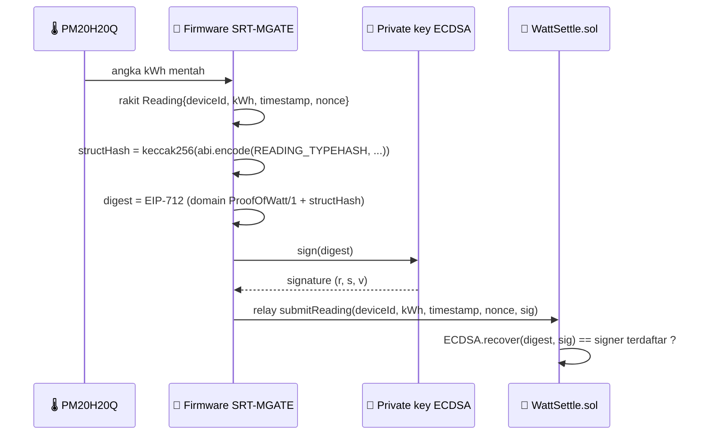

<div align="center">


&nbsp;

&nbsp;


# 🔌 Device dan Firmware

### Mesin yang menandatangani kWh, tulang punggung moat

</div>

**Navigasi:** [Hub](README.md) · [Sebelumnya: 04 Setup Lingkungan](<04 Setup Lingkungan.md>) · [Berikutnya: 06 Kontrak WattSettle](<06 Kontrak WattSettle.md>)

---

## 💡 Kenapa Layer Ini Penting

Di layer ini terletak moat yang tidak bisa ditiru builder software murni. Sebuah smart contract tidak bisa mempercayai sensor begitu saja, itulah oracle problem untuk kerja fisik. WattSettle menutup celah itu dengan membuat device menandatangani bacaannya sendiri secara kriptografis, sehingga kontrak hanya membayar bacaan yang benar-benar berasal dari perangkat terdaftar.

> 💡 Bab ini menjelaskan peran hardware, domain EIP-712, cara device menyimpan dan memakai kunci ECDSA, serta rencana menangkap satu tanda tangan lapangan nyata sebagai fixture demo. Kunci privat device tidak pernah meninggalkan perangkat.

---

## 🏭 Peran SRT-MGATE-1210

**SRT-MGATE-1210** adalah gateway IoT SURIOTA berbasis **ESP32**. Fungsi aslinya adalah menjembatani protokol industri Modbus (RTU atau TCP) ke MQTT, sehingga data energi dari meter lapangan bisa mengalir ke sistem monitoring. Perangkat ini sudah dijual dan ter-deploy di customer B2B industri nyata, itulah razor dalam model razor and blades WattSettle.

Di WattSettle, peran gateway naik kelas: selain menjembatani data, ia menjadi **device signer**. Gateway memegang sebuah private key ECDSA dan menandatangani setiap bacaan kWh sebelum bacaan itu direlay ke kontrak on-chain.

| Atribut | Nilai |
|:--|:--|
| Platform | ESP32 |
| Fungsi asli | jembatan Modbus RTU atau TCP ke MQTT |
| Peran WattSettle | device signer, pemegang kunci ECDSA |
| Status | produk SURIOTA yang sudah dijual dan ter-deploy |

---

## 🌡️ Peran Enovatek PM20H20Q

**Enovatek PM20H20Q** adalah DC meter dari PT Enovatek Energy, dipakai pada Hybrid HVAC dalam skenario demo Cooling as a Service. Meter ini memberi angka kWh mentah yang menjadi input bacaan. Dalam demo, PM20H20Q mengukur pemakaian, gateway SRT-MGATE menandatangani angkanya, lalu kontrak menyelesaikan pembayaran per pemakaian secara otomatis.

> ⚠️ Grounding: spesifikasi publik PM20H20Q belum sepenuhnya tervalidasi. Perlakukan detail teknis meter ini sebagai indikatif sampai dikonfirmasi langsung ke Enovatek. Yang load bearing untuk WattSettle adalah bahwa PM20H20Q memberi angka kWh yang kemudian ditandatangani gateway, bukan spesifikasi internal meter itu sendiri.

---

## 🔑 Kunci ECDSA di Device

Setiap unit SRT-MGATE-1210 memegang sepasang kunci ECDSA. Kunci privat disimpan di perangkat dan **tidak pernah meninggalkan device**. Alamat publik yang diturunkan dari kunci itu didaftarkan on-chain lewat `registerDevice`, sehingga kontrak tahu tanda tangan mana yang sah untuk sebuah `deviceId`.

Relasi antara device, kunci, dan kontrak:

| Elemen | Peran |
|:--|:--|
| Private key ECDSA | tersimpan di device, menandatangani `Reading`, tidak pernah keluar |
| Signer address | alamat publik hasil recover, didaftarkan on-chain per device |
| `deviceId` | identitas device di kontrak (contoh `keccak256("SRT-MGATE-1210-#001")`) |
| `owner` | alamat yang menerima pembayaran saat bacaan disetujui |

---

## 📐 Domain EIP-712 dan Typehash

WattSettle memakai skema tanda tangan terstruktur **EIP-712**. Domain sudah tetap dari kontrak base dan **tidak diubah**, sehingga fixture dari base tetap valid di WattSettle.

Domain:

```
name    : "ProofOfWatt"
version : "1"
chainId : 97   (BSC testnet)
verifyingContract : alamat kontrak WattSettle
```

Typehash untuk `Reading` (persis seperti di kontrak):

```solidity
bytes32 private constant READING_TYPEHASH =
    keccak256("Reading(bytes32 deviceId,uint256 kWh,uint64 timestamp,uint256 nonce)");
```

Struktur yang ditandatangani adalah `Reading{deviceId, kWh, timestamp, nonce}`. Empat field ini yang menjadi input tanda tangan, dan kontrak akan merekonstruksi digest yang sama untuk memverifikasi.

---

## ✍️ Cara Device Menandatangani Reading

Alur signing di device mengikuti pola EIP-712 standar:



Di sisi kontrak, `submitReading` merekonstruksi digest dari field yang dikirim, lalu `ECDSA.recover` memastikan tanda tangan cocok dengan signer yang terdaftar untuk `deviceId`. Ditambah replay guard (`usedDigest`) dan monotonic guard (`lastTs`), sistem menolak bacaan palsu, bacaan yang diulang, dan bacaan dengan timestamp mundur.

> 💡 Karena `timestamp` dan `nonce` masuk ke tanda tangan, tiap bacaan unik. Untuk demo, siapkan beberapa fixture dengan timestamp berbeda dan menaik agar tidak kena `StaleTimestamp` saat rehearsal berulang.

---

## 🎯 Fixture Lapangan Nyata (Fix Kill-shot 3)

Mocked for demo tidak berarti signer palsu. Rencana kunci untuk memperkuat moat adalah **menangkap satu tanda tangan EIP-712 nyata dari unit SRT-MGATE-1210 di lapangan**, lalu memakai fixture ITU sebagai demo reading.

Kenapa ini penting:

- **Masalah (kill-shot 3, moat melayang):** kalau klip lapangan hanya video kotak di dinding sementara bacaan berasal dari skrip Python, dua artefak itu tidak terhubung. Pertanyaan juri "apakah device di klip yang menandatangani transaksi ini?" akan dijawab jujur: tidak.
- **Fix:** pakai satu tanda tangan nyata dari device lapangan sebagai fixture demo. Dengan begitu device yang muncul di klip adalah device yang sama dengan yang menandatangani transaksi on-chain, sehingga klaim moat bisa dibilang jujur.
- **Sifat tugas:** ini tugas firmware satu tanda tangan, bukan rebuild. Minimal, `registerDevice` dengan signer key device nyata, lalu tunjukkan alamat signer di BscScan cocok dengan unit fisik.

Hasilnya: moat berubah dari klaim di atas video menjadi properti sistem yang terdemonstrasi. Klip lapangan dan transaksi on-chain menunjuk ke satu device yang sama.

| Aspek | Sebelum fix | Setelah fix |
|:--|:--|:--|
| Sumber tanda tangan demo | skrip generik | unit SRT-MGATE-1210 lapangan |
| Hubungan klip dengan tx | terputus | satu device yang sama |
| Jawaban juri "device sama?" | tidak | ya, bisa dibilang jujur |

---

## 🔗 Kaitan ke Bab Lain

Setelah paham bagaimana device menandatangani bacaan, langkah berikutnya adalah melihat sisi kontrak yang memverifikasi dan menyelesaikan pembayaran. Lanjut ke [06 Kontrak WattSettle](<06 Kontrak WattSettle.md>). Arsitektur tiga layer secara utuh ada di [03 Arsitektur](<03 Arsitektur.md>), dan verifier AI yang memproses event ada di [07 AI Verifier](<07 AI Verifier.md>).

---

<div align="center">
<sub>© 2026 PT Surya Inovasi Prioritas (SURIOTA) · <a href="README.md">Hub WattSettle</a> · Update 7 Juli 2026</sub>
</div>
