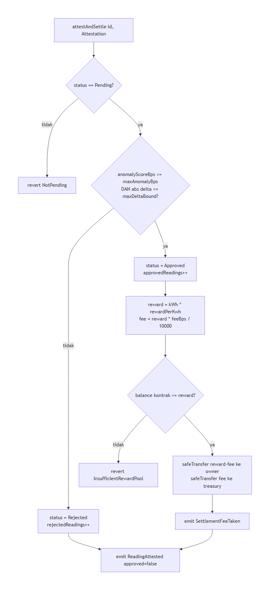

<div align="center">


&nbsp;

&nbsp;


# 📄 Kontrak WattSettle

### Evolusi dari ProofOfWatt, satu fungsi baru yang mengubah boolean jadi rationale on-chain

</div>

**Navigasi:** [Hub](README.md) · [Sebelumnya](<05 Device dan Firmware.md>) · [Berikutnya](<07 AI Verifier.md>)

---

## 💡 Prinsip Utama: EVOLVE, bukan REWRITE

Kontrak WattSettle bukan proyek greenfield. Ia adalah evolusi terkendali dari `ProofOfWatt.sol` yang sudah ada, sudah `6 test PASS` di Foundry v1.7.1, dan sudah diverifikasi ulang. Aturan mainnya keras dan disengaja. Kita menyentuh **sesedikit mungkin** permukaan kontrak. Delta yang benar adalah satu struct baru, satu event baru, dan satu fungsi yang menggantikan `verifyReading`. Sisanya tetap byte for byte.

Alasannya bukan kemalasan, tetapi strategi. Base yang sudah teruji adalah aset dengan nilai penjurian tinggi (Technical Implementation, bobot 30 persen). Menulis ulang dari nol membuang aset itu, memperkenalkan risiko regresi, dan membuat commit history terlihat seperti rewrite mendadak alih-alih pertumbuhan organik. Riwayat commit yang bersih dan berkelanjutan adalah salah satu hard gate submission, jadi disiplin ini membayar dua kali.

> 💡 Pegang mantra ini sepanjang bab: **satu contract, satu struct, satu event, satu mapping**. Setiap baris tambahan harus membeli sesuatu yang tidak bisa dibeli oleh baris yang sudah ada. Prinsip Ponytail berlaku penuh pada kode, tetapi keamanan, validasi, dan trust boundary tetap 100 persen tidak dipangkas.

---

## 🔒 Bagian yang DILARANG Disentuh

Base `ProofOfWatt.sol` sudah benar pada bagian yang paling rawan salah, yaitu kriptografi dan proteksi replay. Bagian-bagian ini sudah lolos test dan menahan beban trust boundary paling kritis. Mengutak-atiknya berarti mengundang bug di tempat yang paling mahal.

| Elemen | Peran | Kenapa jangan disentuh |
|:--|:--|:--|
| `submitReading()` | Relay bacaan device yang sudah ditandatangani | EIP-712 recover sudah benar, mengubahnya membuka celah signature |
| EIP-712 recover via `ECDSA.recover` | Membuktikan bacaan datang dari signer device sah | Inti trust boundary fisik ke on-chain |
| `usedDigest` replay guard | Mencegah bacaan yang sama diproses dua kali | Satu digest, satu kali, itu jaminan anti double pay |
| `lastTs` monotonic guard | Menolak timestamp yang tidak maju | Mencegah reorder dan replay bertopeng timestamp lama |
| `registerDevice()` | Mendaftarkan signer dan owner device | AccessControl sudah menjaga, tidak ada alasan mengubah bentuk |
| Roles `DEFAULT_ADMIN_ROLE`, `VERIFIER_ROLE` | Gating siapa boleh apa | Model izin sudah cukup, jangan tambah role tanpa kebutuhan |
| `READING_TYPEHASH`, `Device`, `Submission`, `Status`, events lama | Bentuk data dan sinyal | Konsumen off-chain (verifier) bergantung pada bentuk ini |

Konkretnya, blok berikut dari base tetap verbatim. Ini bukan kode yang kita tulis ulang, ini kode yang kita lindungi.

```solidity
// ── KEEP UNCHANGED (sudah teruji, jangan sentuh) ──
// submitReading(bytes32,uint256,uint64,uint256,bytes)
//   → EIP-712 _hashTypedDataV4 + ECDSA.recover == device.signer
//   → usedDigest[digest] replay guard
//   → timestamp > d.lastTs monotonic guard
// registerDevice, setRewardPerKwh
// READING_TYPEHASH, Device, Submission, Status, DeviceRegistered, ReadingSubmitted
// AccessControl roles: DEFAULT_ADMIN_ROLE, VERIFIER_ROLE
```

> ⚠️ Ada satu perubahan bentuk yang halus tetapi wajib. Di base, `submissions` adalah array `Submission[]` dan `submitReading` mengembalikan `id = submissions.length`. Struktur ini tetap dipertahankan. Yang bertambah hanya mapping baru untuk reputation, bukan pembongkaran struktur submission yang sudah ada.

---

## 🕳️ Dua Gap Terdokumentasi di Base

Base `ProofOfWatt.sol` sengaja minimal, dan dua keputusan minimalnya menjadi liability begitu kita naik ke rubrik hackathon. Keduanya sudah dipetakan persis ke nomor baris di kontrak asli.

### Gap 1: `verifyReading` boolean = autonomy tak terlihat

Di base, keputusan verifier adalah `verifyReading(uint256 id, bool approved)`. Sebuah boolean role-gated. Masalahnya bukan keamanan, tetapi legibility. Ketika juri membaca kontrak dan hanya melihat `bool approved`, tidak ada jejak on-chain tentang **kenapa** bacaan disetujui atau ditolak. Autonomy AI menjadi tak terlihat. Verifier bisa saja sebuah cap karet, dan kontrak tidak bisa membuktikan sebaliknya.

Ini adalah Kill-shot #2 (autonomy theater) dalam bentuk kode. Perbaikannya bukan menambah komentar, tetapi mengangkat rationale AI menjadi data on-chain yang bisa dibaca publik. Detail kalibrasi ada di [09 Keamanan](<09 Keamanan.md>).

### Gap 2: raw transfer = butuh SafeERC20

Di base, payout memakai `require(rewardToken.transfer(...), "reward xfer failed")`. Ini raw transfer ERC20. Sebagian token tidak mengembalikan boolean sesuai standar, sebagian mengembalikan false alih-alih revert, dan raw transfer tidak menangani kedua kasus itu dengan aman. Untuk settlement rail yang membayar uang sungguhan, ini permukaan yang tidak boleh dibiarkan.

Perbaikannya adalah `SafeERC20.safeTransfer`. Karena OpenZeppelin sudah ada di lib repo, ini **zero new deps**. Kita hanya mengimpor apa yang sudah tersedia.

---

## 🆕 Struct Attestation

Inti evolusi ada di sini. Alih alih `bool`, verifier menuliskan sebuah `Attestation` yang membawa rationale numerik AI ke on-chain. Nama field-nya sengaja mencerminkan semantik `validationResponse` ERC-8004, sehingga integrasi ke Validation Registry live (dibahas di [07 AI Verifier](<07 AI Verifier.md>)) menjadi natural, bukan tempelan.

```solidity
/// @notice Rationale AI yang ditulis on-chain, menggantikan boolean approve.
/// @dev Field-name mencerminkan semantik ERC-8004 validationResponse agar
///      integrasi ke Validation Registry live tidak perlu terjemahan tambahan.
struct Attestation {
    int256  kwhDeltaVsBaseline;  // selisih kWh terhadap baseline device (bisa negatif)
    uint16  anomalyScoreBps;     // skor anomali 0..10000 basis points
    bytes32 modelVersionHash;    // keccak256(versi model/logic yang dipin) → auditable
    bytes32 rulesetHash;         // keccak256(file ruleset yang dipublish) → match file repo
    uint64  evaluatedAt;         // kapan verifier mengevaluasi bacaan
}
```

Setiap field membawa beban makna, tidak ada yang dekoratif:

| Field | Tipe | Makna dan kenapa penting |
|:--|:--|:--|
| `kwhDeltaVsBaseline` | `int256` | Selisih bacaan terhadap baseline device, bisa negatif, ini "response" numerik AI |
| `anomalyScoreBps` | `uint16` | Skor anomali dalam basis points 0 sampai 10000, dasar keputusan gate |
| `modelVersionHash` | `bytes32` | Hash versi model yang dipin, membuat model auditable bukan sekadar diklaim |
| `rulesetHash` | `bytes32` | Hash file ruleset yang dipublish, bisa dicocokkan dengan file di repo |
| `evaluatedAt` | `uint64` | Timestamp evaluasi verifier, jejak waktu keputusan |

> 💡 Kunci legibility ada pada `modelVersionHash` dan `rulesetHash`. Karena keduanya adalah `keccak256` dari file yang benar-benar dipublish di repo, siapa pun bisa mengambil file ruleset, menghitung hash-nya, dan mencocokkan dengan nilai on-chain. Ini mengubah "percaya AI kami" menjadi "hitung sendiri dan buktikan". Itu jawaban terkuat untuk pertanyaan "apakah AI-nya sungguhan".

---

## ⚙️ Fungsi attestAndSettle

Ini fungsi tunggal yang menggantikan `verifyReading`. Ia menerima `Attestation`, menjalankan gate ruleset on-chain, memutuskan approve atau reject secara deterministik, lalu menyelesaikan pembayaran dengan disiplin checks-effects-interactions penuh.

```solidity
import {SafeERC20} from "@openzeppelin/contracts/token/ERC20/utils/SafeERC20.sol";
import {ReentrancyGuard} from "@openzeppelin/contracts/utils/ReentrancyGuard.sol";

// contract WattSettle is AccessControl, EIP712, ReentrancyGuard {
//     using SafeERC20 for IERC20;

error InsufficientRewardPool();

event ReadingAttested(uint256 indexed id, bytes32 indexed deviceId, bool approved, Attestation a);
event SettlementFeeTaken(uint256 indexed id, address indexed treasury, uint256 fee);

/// @notice Menerima rationale AI, menjalankan gate ruleset on-chain, lalu settle.
/// @dev Menggantikan verifyReading(id,bool). VERIFIER_ROLE only, nonReentrant.
///      Checks-effects-interactions: status di-set SEBELUM transfer apa pun.
function attestAndSettle(uint256 id, Attestation calldata a)
    external
    onlyRole(VERIFIER_ROLE)
    nonReentrant
{
    Submission storage s = submissions[id];
    if (s.status != Status.Pending) revert NotPending();

    // ── GATE RULESET ON-CHAIN (deterministik, bukan cap karet) ──
    // Approve hanya jika skor anomali di bawah batas DAN delta dalam bound fisik.
    bool approved = (a.anomalyScoreBps <= maxAnomalyBps)
                 && (_abs(a.kwhDeltaVsBaseline) <= maxDeltaBound);

    // ── EFFECTS: status di-set sebelum interaksi eksternal ──
    s.status = approved ? Status.Approved : Status.Rejected;

    // ── REPUTATION COUNTERS ──
    Reputation storage rep = deviceReputation[s.deviceId];
    if (approved) {
        rep.approvedReadings += 1;
    } else {
        rep.rejectedReadings += 1;
    }
    rep.avgAnomalyBps = _rollAvg(rep.avgAnomalyBps, a.anomalyScoreBps, rep.approvedReadings + rep.rejectedReadings);

    // ── INTERACTIONS: hitung reward, fee split, solvency, lalu transfer ──
    uint256 reward = 0;
    if (approved) {
        reward = s.kWh * rewardPerKwh;
        uint256 fee = (reward * feeBps) / 10_000;             // substansi Finance: take-rate on-chain

        if (rewardToken.balanceOf(address(this)) < reward) revert InsufficientRewardPool();

        rewardToken.safeTransfer(devices[s.deviceId].owner, reward - fee);   // SafeERC20 (fix gap 2)
        if (fee > 0) {
            rewardToken.safeTransfer(treasury, fee);
            emit SettlementFeeTaken(id, treasury, fee);
        }
    }

    emit ReadingAttested(id, s.deviceId, approved, a);        // rationale ter-decode di BscScan
}

function _abs(int256 x) internal pure returns (uint256) {
    return x >= 0 ? uint256(x) : uint256(-x);
}
```

### Alur logika, dibaca dari atas ke bawah

<div align="center">

</div>

### Apa yang membuat fungsi ini benar

- **Gate ruleset on-chain.** Keputusan approve bukan boolean yang di-supply mentah, melainkan hasil evaluasi dua kondisi terhadap parameter kontrak, `maxAnomalyBps` dan `maxDeltaBound`. Verifier memasok rationale, kontrak yang memutus. Ini yang membalik tuduhan "cap karet".
- **Checks-effects-interactions.** Status di-set sebelum transfer apa pun. Base sudah benar di sini, kita mempertahankannya dan menambahkan `nonReentrant` sebagai sabuk pengaman kedua.
- **Reputation counters.** `approvedReadings`, `rejectedReadings`, dan `avgAnomalyBps` per device. Ini bukan hiasan, ini health score dan trust score per unit yang menjadi produk after-sales.
- **Reward dan fee split.** `reward = kWh * rewardPerKwh`. `fee = reward * feeBps / 10000` masuk ke `treasury`. Ini substansi Finance, mengubah "transfer" menjadi "payment rail dengan revenue model" (Kill-shot #4 fix).
- **Solvency check.** Jika balance kontrak kurang dari reward, revert `InsufficientRewardPool`. Kontrak tidak pernah mencoba membayar uang yang tidak dimilikinya.
- **SafeERC20.** Semua transfer lewat `safeTransfer`, menutup gap 2.
- **Events legible.** `ReadingAttested` membawa seluruh `Attestation`, sehingga rationale ter-decode langsung di BscScan. `SettlementFeeTaken` membuat setiap potongan fee terlihat publik.

---

## 📦 Tambahan Lain (semua zero new deps)

| Tambahan | Sumber | Catatan |
|:--|:--|:--|
| `import SafeERC20` | OpenZeppelin lib (sudah ada) | Untuk `safeTransfer`, tutup gap 2 |
| `import ReentrancyGuard` | OpenZeppelin lib (sudah ada) | Modifier `nonReentrant` di payout |
| `error InsufficientRewardPool` | Kode kita | Solvency guard yang eksplisit |
| `mapping deviceReputation` | Kode kita | Counter approved/rejected/avgAnomaly per device |
| `treasury`, `feeBps`, `maxAnomalyBps`, `maxDeltaBound` | Kode kita | Parameter gate dan fee, admin-set |
| NatSpec penuh | Kode kita | `@notice`, `@dev`, `@param` di tiap fungsi baru |

> 💡 Tidak ada satu pun dependency baru ditambahkan. `SafeERC20` dan `ReentrancyGuard` sudah tersedia di OpenZeppelin Contracts yang sudah di-import base. Ini konsisten dengan disiplin Ponytail dan menjaga surface serangan tetap sekecil mungkin.

Sebagai catatan opsional, `MockUSD` dengan 6 desimal disiapkan in-repo sebagai swap konstruktor satu baris. Ia tidak di-wire secara default. Token `suriota` tetap default settlement token. Detailnya ada di [08 Tokenomics](<08 Tokenomics.md>).

---

## 🧪 Cross-link: Testing dan Keamanan

Setiap perilaku di atas harus ditutup test. Disiplin TDD berjalan pada delta, bukan pada base yang sudah hijau. Target sekitar 14 test deterministik mencakup approve-pays-via-SafeERC20, reject-when-anomaly-over-threshold, reject-when-delta-out-of-bound, reputation increment, reentrancy attempt reverts, insufficient-pool reverts, only-VERIFIER, fee split correct, dan event emits decoded Attestation. Matriks lengkapnya ada di [11 Testing dan QA](<11 Testing dan QA.md>).

Sisi trust boundary, threat model, dan alasan setiap guard dipertahankan dibahas tuntas di [09 Keamanan](<09 Keamanan.md>). Bab ini menulis kontraknya, bab keamanan membuktikan kenapa kontrak ini aman.

---

<div align="center">
<sub>© 2026 PT Surya Inovasi Prioritas (SURIOTA) · <a href="README.md">Hub WattSettle</a> · Update 7 Juli 2026</sub>
</div>
