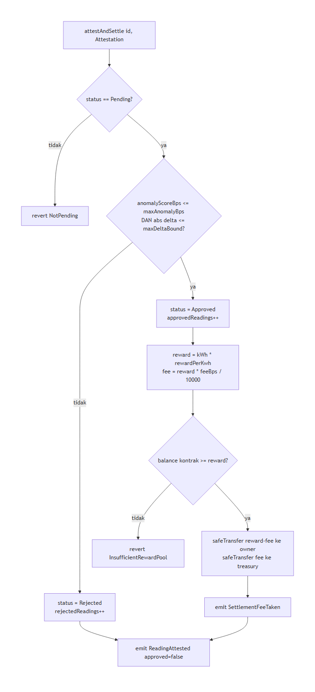

<div align="center">


&nbsp;

&nbsp;


# 📄 Kontrak WattSettle

### Evolusi dari ProofOfWatt, satu fungsi baru yang mengubah boolean jadi rationale on-chain

</div>

**Navigasi:** [Hub](README.md) · [Sebelumnya](<05 Device dan Firmware.md>) · [Berikutnya](<07 AI Verifier.md>)

---

## 💡 Prinsip Utama: EVOLVE, bukan REWRITE

Kontrak WattSettle bukan proyek greenfield. Ia adalah evolusi terkendali dari `ProofOfWatt.sol` yang sudah ada, sudah `6 test PASS` di Foundry v1.7.1, dan sudah diverifikasi ulang. Aturan mainnya keras dan disengaja. Kita menyentuh **sesedikit mungkin** permukaan kontrak. Delta yang benar adalah satu struct baru (`Attestation`), event rationale baru (`ReadingAttested` plus `SettlementFeeTaken` untuk transparansi fee), dan satu fungsi yang menggantikan `verifyReading`. Sisanya tetap byte for byte.

Alasannya bukan kemalasan, tetapi strategi. Base yang sudah teruji adalah aset dengan nilai penjurian tinggi (Technical Implementation, bobot 30 persen). Menulis ulang dari nol membuang aset itu, memperkenalkan risiko regresi, dan membuat commit history terlihat seperti rewrite mendadak alih-alih pertumbuhan organik. Riwayat commit yang bersih dan berkelanjutan adalah salah satu hard gate submission, jadi disiplin ini membayar dua kali.

> 💡 Pegang mantra ini sepanjang bab: **satu contract, satu struct, satu event, satu mapping**. Setiap baris tambahan harus membeli sesuatu yang tidak bisa dibeli oleh baris yang sudah ada. Prinsip Ponytail berlaku penuh pada kode, tetapi keamanan, validasi, dan trust boundary tetap 100 persen tidak dipangkas.

---

## 🔒 Bagian yang DILARANG Disentuh

Base `ProofOfWatt.sol` sudah benar pada bagian yang paling rawan salah, yaitu kriptografi dan proteksi replay. Bagian-bagian ini sudah lolos test dan menahan beban trust boundary paling kritis. Mengutak-atiknya berarti mengundang bug di tempat yang paling mahal.

| Elemen | Peran | Kenapa jangan disentuh |
|:--|:--|:--|
| `submitReading()` | Relay bacaan device yang sudah ditandatangani | EIP-712 recover sudah benar, mengubahnya membuka celah signature |
| EIP-712 recover via `ECDSA.recover` | Membuktikan bacaan datang dari signer device sah | Inti trust boundary fisik ke on-chain |
| `usedDigest` replay guard | Mencegah bacaan yang sama diproses dua kali | Satu digest, satu kali, itu jaminan anti double pay |
| `lastTs` monotonic guard | Menolak timestamp yang tidak maju | Mencegah reorder dan replay bertopeng timestamp lama |
| `registerDevice()` | Mendaftarkan signer dan owner device | AccessControl sudah menjaga, model izinnya tetap. Satu parameter `baselineKwh` ditambahkan belakangan, lihat bagian As-Built |
| Roles `DEFAULT_ADMIN_ROLE`, `VERIFIER_ROLE` | Gating siapa boleh apa | Model izin sudah cukup, jangan tambah role tanpa kebutuhan |
| `READING_TYPEHASH`, `Device`, `Submission`, `Status`, events lama | Bentuk data dan sinyal | Konsumen off-chain (verifier) bergantung pada bentuk ini |

Konkretnya, blok berikut dari base tetap verbatim. Ini bukan kode yang kita tulis ulang, ini kode yang kita lindungi.

```solidity
// ── KEEP UNCHANGED (sudah teruji, jangan sentuh) ──
// submitReading(bytes32,uint256,uint64,uint256,bytes)
//   → EIP-712 _hashTypedDataV4 + ECDSA.recover == device.signer
//   → usedDigest[digest] replay guard
//   → timestamp > d.lastTs monotonic guard
// registerDevice, setRewardPerKwh
// READING_TYPEHASH, Device, Submission, Status, DeviceRegistered, ReadingSubmitted
// AccessControl roles: DEFAULT_ADMIN_ROLE, VERIFIER_ROLE
```

> ⚠️ Ada satu perubahan bentuk yang halus tetapi wajib. Di base, `submissions` adalah array `Submission[]` dan `submitReading` mengembalikan `id = submissions.length`. Struktur ini tetap dipertahankan. Yang bertambah hanya mapping baru untuk reputation, bukan pembongkaran struktur submission yang sudah ada.

---

## 🕳️ Dua Gap Terdokumentasi di Base

Base `ProofOfWatt.sol` sengaja minimal, dan dua keputusan minimalnya menjadi liability begitu kita naik ke rubrik hackathon. Keduanya sudah dipetakan persis ke nomor baris di kontrak asli.

### Gap 1: `verifyReading` boolean = autonomy tak terlihat

Di base, keputusan verifier adalah `verifyReading(uint256 id, bool approved)`. Sebuah boolean role-gated. Masalahnya bukan keamanan, tetapi legibility. Ketika juri membaca kontrak dan hanya melihat `bool approved`, tidak ada jejak on-chain tentang **kenapa** bacaan disetujui atau ditolak. Autonomy AI menjadi tak terlihat. Verifier bisa saja sebuah cap karet, dan kontrak tidak bisa membuktikan sebaliknya.

Ini adalah Kill-shot #2 (autonomy theater) dalam bentuk kode. Perbaikannya bukan menambah komentar, tetapi mengangkat rationale AI menjadi data on-chain yang bisa dibaca publik. Detail kalibrasi ada di [09 Keamanan](<09 Keamanan.md>).

### Gap 2: raw transfer = butuh SafeERC20

Di base, payout memakai `require(rewardToken.transfer(...), "reward xfer failed")`. Ini raw transfer ERC20. Sebagian token tidak mengembalikan boolean sesuai standar, sebagian mengembalikan false alih-alih revert, dan raw transfer tidak menangani kedua kasus itu dengan aman. Untuk settlement rail yang membayar uang sungguhan, ini permukaan yang tidak boleh dibiarkan.

Perbaikannya adalah `SafeERC20.safeTransfer`. Karena OpenZeppelin sudah ada di lib repo, ini **zero new deps**. Kita hanya mengimpor apa yang sudah tersedia.

---

## 🆕 Struct Attestation

Inti evolusi ada di sini. Alih alih `bool`, verifier menuliskan sebuah `Attestation` yang membawa rationale numerik AI ke on-chain. Nama field-nya sengaja mencerminkan semantik `validationResponse` ERC-8004, sehingga saat Validation Registry akhirnya ter-deploy di chain 97 (per 5 September 2026 belum ada, lihat [07 AI Verifier](<07 AI Verifier.md>)), migrasinya cukup pemetaan field, bukan penulisan ulang.

```solidity
/// @notice Rationale AI yang ditulis on-chain, menggantikan boolean approve.
/// @dev Field-name mencerminkan semantik ERC-8004 validationResponse agar
///      migrasi ke Validation Registry siap begitu registry-nya ter-deploy.
struct Attestation {
    int256  kwhDeltaVsBaseline;  // selisih kWh terhadap baseline device (bisa negatif)
    uint16  anomalyScoreBps;     // skor anomali 0..10000 basis points
    bytes32 modelVersionHash;    // keccak256(versi model/logic yang dipin) → auditable
    bytes32 rulesetHash;         // keccak256(file ruleset yang dipublish) → match file repo
    uint64  evaluatedAt;         // kapan verifier mengevaluasi bacaan
}
```

Setiap field membawa beban makna, tidak ada yang dekoratif:

| Field | Tipe | Makna dan kenapa penting |
|:--|:--|:--|
| `kwhDeltaVsBaseline` | `int256` | Selisih bacaan terhadap baseline device, bisa negatif, ini "response" numerik AI |
| `anomalyScoreBps` | `uint16` | Skor anomali dalam basis points 0 sampai 10000, dasar keputusan gate |
| `modelVersionHash` | `bytes32` | Hash versi model yang dipin, membuat model auditable bukan sekadar diklaim |
| `rulesetHash` | `bytes32` | Hash file ruleset yang dipublish, bisa dicocokkan dengan file di repo |
| `evaluatedAt` | `uint64` | Timestamp evaluasi verifier, jejak waktu keputusan |

> 💡 Kunci legibility ada pada `modelVersionHash` dan `rulesetHash`. Karena keduanya adalah `keccak256` dari file yang benar-benar dipublish di repo, siapa pun bisa mengambil file ruleset, menghitung hash-nya, dan mencocokkan dengan nilai on-chain. Ini mengubah "percaya AI kami" menjadi "hitung sendiri dan buktikan". Itu jawaban terkuat untuk pertanyaan "apakah AI-nya sungguhan".

---

## ⚙️ Fungsi attestAndSettle

Ini fungsi tunggal yang menggantikan `verifyReading`. Ia menerima `Attestation`, menjalankan gate dua lapis on-chain, memutuskan approve atau reject secara deterministik, lalu menyelesaikan pembayaran dengan disiplin checks-effects-interactions penuh.

```solidity
import {SafeERC20} from "@openzeppelin/contracts/token/ERC20/utils/SafeERC20.sol";
import {ReentrancyGuard} from "@openzeppelin/contracts/utils/ReentrancyGuard.sol";

// contract WattSettle is AccessControl, EIP712, ReentrancyGuard {
//     using SafeERC20 for IERC20;

error InsufficientRewardPool();

event ReadingAttested(
    uint256 indexed id,
    bytes32 indexed deviceId,
    bool approved,
    Attestation a,
    int256 chainDelta,          // hitungan kontrak sendiri, di samping hitungan verifier
    uint16 chainAnomalyBps
);
event SettlementFeeTaken(uint256 indexed id, address indexed treasury, uint256 fee);

/// @notice Menerima rationale AI, menjalankan gate dua lapis on-chain, lalu settle.
/// @dev Menggantikan verifyReading(id,bool). VERIFIER_ROLE only, nonReentrant.
///      Checks-effects-interactions: status di-set SEBELUM transfer apa pun.
function attestAndSettle(uint256 id, Attestation calldata a)
    external
    onlyRole(VERIFIER_ROLE)
    nonReentrant
{
    Submission storage s = submissions[id];
    if (s.status != Status.Pending) revert NotPending();

    // ── GATE DUA LAPIS (deterministik, bukan cap karet) ──
    // Lapis satu, hitungan kontrak sendiri dari baseline on-chain. Verifier tidak bisa mempengaruhinya.
    (int256 chainDelta, uint16 chainAnomalyBps) = _assess(devices[s.deviceId].baselineKwh, s.kWh);
    bool contractApproves = (chainAnomalyBps <= maxAnomalyBps) && (_abs(chainDelta) <= maxDeltaBound);

    // Lapis dua, penilaian verifier. Hanya bisa memperketat, tidak pernah melonggarkan.
    bool verifierApproves = (a.anomalyScoreBps <= maxAnomalyBps) && (_abs(a.kwhDeltaVsBaseline) <= maxDeltaBound);

    bool approved = contractApproves && verifierApproves;

    // ── EFFECTS: status di-set sebelum interaksi eksternal ──
    s.status = approved ? Status.Approved : Status.Rejected;

    // ── REPUTATION COUNTERS ──
    Reputation storage rep = deviceReputation[s.deviceId];
    if (approved) {
        rep.approvedReadings += 1;
    } else {
        rep.rejectedReadings += 1;
    }
    // Yang dicatat adalah skor anomali TERBURUK di antara keduanya, jadi verifier yang
    // longgar tidak bisa memoles rekam jejak sebuah perangkat.
    uint16 worstBps = chainAnomalyBps > a.anomalyScoreBps ? chainAnomalyBps : a.anomalyScoreBps;
    rep.avgAnomalyBps = _rollAvg(rep.avgAnomalyBps, worstBps, rep.approvedReadings + rep.rejectedReadings);

    // ── INTERACTIONS: hitung reward, fee split, solvency, lalu transfer ──
    uint256 reward = 0;
    if (approved) {
        reward = s.kWh * rewardPerKwh;
        uint256 fee = (reward * feeBps) / 10_000;             // substansi Finance: take-rate on-chain

        if (rewardToken.balanceOf(address(this)) < reward) revert InsufficientRewardPool();

        rewardToken.safeTransfer(devices[s.deviceId].owner, reward - fee);   // SafeERC20 (fix gap 2)
        if (fee > 0) {
            rewardToken.safeTransfer(treasury, fee);
            emit SettlementFeeTaken(id, treasury, fee);
        }
    }

    // Rationale ter-decode di BscScan, dan hitungan kontrak berdampingan dengan hitungan verifier.
    emit ReadingAttested(id, s.deviceId, approved, a, chainDelta, chainAnomalyBps);
}

function _abs(int256 x) internal pure returns (uint256) {
    return x >= 0 ? uint256(x) : uint256(-x);
}
```

### Alur logika, dibaca dari atas ke bawah

<div align="center">

</div>

### Apa yang membuat fungsi ini benar

- **Gate dua lapis, dan keduanya wajib lolos.** Kontrak tidak lagi menilai semata angka yang dipasok verifier. Ia menghitung sendiri delta dan skor anomali dari `baselineKwh` yang tersimpan on-chain, lalu meng-AND-kan hasilnya dengan penilaian verifier. Konsekuensinya lugas: **verifier yang berbohong tidak bisa lagi memaksa pembayaran, ia memegang hak veto, bukan kuasa menyetujui.** Ia tetap bisa menolak bacaan yang secara aritmetika terlihat wajar (karena ia melihat cuaca, kesehatan perangkat, atau sinyal kecurangan yang tidak terlihat di rantai), dan justru itulah yang membuat AI-nya tetap berguna. Yang tidak bisa ia lakukan adalah menyetujui apa yang kontraknya sendiri tolak.
- **Checks-effects-interactions.** Status di-set sebelum transfer apa pun. Base sudah benar di sini, kita mempertahankannya dan menambahkan `nonReentrant` sebagai sabuk pengaman kedua.
- **Reputation counters.** `approvedReadings`, `rejectedReadings`, dan `avgAnomalyBps` per device. Yang dicatat adalah skor anomali terburuk di antara hitungan kontrak dan hitungan verifier, jadi verifier yang longgar tidak bisa memoles rekam jejak sebuah unit. Ini bukan hiasan, ini health score dan trust score per unit yang menjadi produk after-sales.
- **Reward dan fee split.** `reward = kWh * rewardPerKwh`. `fee = reward * feeBps / 10000` masuk ke `treasury`. Ini substansi Finance, mengubah "transfer" menjadi "payment rail dengan revenue model" (Kill-shot #4 fix).
- **Solvency check.** Jika balance kontrak kurang dari reward, revert `InsufficientRewardPool`. Kontrak tidak pernah mencoba membayar uang yang tidak dimilikinya.
- **SafeERC20.** Semua transfer lewat `safeTransfer`, menutup gap 2.
- **Events legible.** `ReadingAttested` membawa seluruh `Attestation` **berdampingan dengan hitungan kontrak sendiri** (`chainDelta`, `chainAnomalyBps`), sehingga siapa pun bisa membaca apa yang verifier KATAKAN di sebelah apa yang kontrak HITUNG. Perbedaan di antara keduanya itu sendiri adalah sinyal. `SettlementFeeTaken` membuat setiap potongan fee terlihat publik.

---

## 📦 Tambahan Lain (semua zero new deps)

| Tambahan | Sumber | Catatan |
|:--|:--|:--|
| `import SafeERC20` | OpenZeppelin lib (sudah ada) | Untuk `safeTransfer`, tutup gap 2 |
| `import ReentrancyGuard` | OpenZeppelin lib (sudah ada) | Modifier `nonReentrant` di payout |
| `error InsufficientRewardPool` | Kode kita | Solvency guard yang eksplisit |
| `mapping deviceReputation` | Kode kita | Counter approved/rejected/avgAnomaly per device |
| `treasury`, `feeBps`, `maxAnomalyBps`, `maxDeltaBound` | Kode kita | Parameter gate dan fee, admin-set |
| NatSpec penuh | Kode kita | `@notice`, `@dev`, `@param` di tiap fungsi baru |

> 💡 Tidak ada satu pun dependency baru ditambahkan. `SafeERC20` dan `ReentrancyGuard` sudah tersedia di OpenZeppelin Contracts yang sudah di-import base. Ini konsisten dengan disiplin Ponytail dan menjaga surface serangan tetap sekecil mungkin.

Sebagai catatan opsional, `MockUSD` dengan 6 desimal disiapkan in-repo sebagai swap konstruktor satu baris. Ia tidak di-wire secara default. Token `suriota` tetap default settlement token. Detailnya ada di [08 Tokenomics](<08 Tokenomics.md>).

---

## 🏗️ Bentuk As-Built (per 5 September 2026)

Kontrak sudah ditulis, dikompilasi, dan di-deploy. Beberapa detail implementasinya berbeda
dari rancangan di atas, dan yang berlaku adalah yang di rantai. Alamat live-nya
`0xCA0A97a70fF720447051bDa247F8EE87e7B8Bb12` di chainId 97, ukuran bytecode 8322 byte.

### Baseline tersimpan on-chain, dan gerbangnya jadi dua lapis

Ini perubahan keamanan terpenting di seluruh kontrak, dan ia lahir dari satu pertanyaan
yang versi lama tidak bisa jawab: **bagaimana kalau verifier-nya yang berbohong?**

Sebelumnya, gerbang on-chain hanya menilai angka yang dipasok verifier. Kontrak tidak tahu
baseline perangkat, jadi ia tidak punya cara menghitung ulang deviasinya sendiri. Artinya
verifier yang berbohong bisa meloloskan bacaan palsu dan menguras reward pool, dan
kontraknya tidak akan pernah tahu.

Sekarang `Device` menyimpan `uint96 baselineKwh` di rantai, dan kontrak menghitung
penilaiannya sendiri. Gerbangnya dua lapis, dan **keduanya wajib lolos**.

```solidity
// Lapis satu, hitungan kontrak sendiri dari baseline on-chain. Verifier tidak bisa mempengaruhinya.
(int256 chainDelta, uint16 chainAnomalyBps) = _assess(devices[s.deviceId].baselineKwh, s.kWh);
bool contractApproves = (chainAnomalyBps <= maxAnomalyBps) && (_abs(chainDelta) <= maxDeltaBound);

// Lapis dua, penilaian verifier. Hanya bisa memperketat, tidak pernah melonggarkan.
bool verifierApproves = (a.anomalyScoreBps <= maxAnomalyBps) && (_abs(a.kwhDeltaVsBaseline) <= maxDeltaBound);

bool approved = contractApproves && verifierApproves;
```

> [!IMPORTANT]
> Sifat keamanannya, dinyatakan lugas: **verifier yang berbohong tidak bisa lagi memaksa
> pembayaran. Ia memegang hak veto, bukan kuasa menyetujui.** Ia tetap bisa menolak bacaan
> yang secara aritmetika terlihat wajar, karena ia melihat cuaca, kesehatan perangkat, atau
> sinyal kecurangan yang tidak terlihat di rantai, dan justru itulah yang membuat AI-nya
> tetap berguna. Yang tidak pernah bisa ia lakukan adalah menyetujui apa yang kontraknya
> sendiri tolak.

**Ini bukan klaim, ini sudah dibuktikan di rantai.** Sebuah attestation yang sengaja dibuat
tidak jujur dikirim untuk bacaan #2 (900 kWh terhadap baseline 100), mengaku
`kwhDeltaVsBaseline = 0` dan `anomalyScoreBps = 0`. Kontrak menghitung sendiri 800 dan
10000 bps, lalu **MENOLAK** tanpa membayar apa pun. Transaksinya
`0x7e8ba5a7b1e09f33a8015c043383500276fda8ad59e61bac861f78ce98391781`.

### Baseline nol berarti tidak terkalibrasi, dan tidak pernah dibayar

`baselineKwh` bernilai nol berarti perangkat itu **belum terkalibrasi**. Perangkat seperti
itu tidak akan pernah bisa dibayar, sebab pembaginya dipaksa menjadi 1 sehingga bacaan
sekecil apa pun langsung memperoleh skor anomali maksimum. Ini disengaja: lebih baik
menolak membayar daripada membayar terhadap baseline yang tidak pernah disetel.

### `registerDevice` empat parameter, `setDeviceBaseline`, dan `assess`

| Fungsi | Bentuk | Catatan |
|:--|:--|:--|
| `registerDevice` | `registerDevice(bytes32 deviceId, address signer, address owner, uint96 baselineKwh)` | Baseline ditetapkan sejak pendaftaran, jadi tidak ada jendela perangkat terdaftar tanpa acuan |
| `setDeviceBaseline` | `setDeviceBaseline(bytes32 deviceId, uint96 baselineKwh)`, admin saja, revert `UnknownDevice` | Baseline bergeser mengikuti musim dan beban, sedangkan mendaftarkan ulang perangkat akan mereset `lastTs` |
| `assess` | `assess(bytes32 deviceId, uint256 kWh) returns (int256 delta, uint16 anomalyBps)`, view publik | Siapa pun bisa mensimulasikan putusan kontrak dari tab Read Contract sebelum mengirim apa pun |

`DeviceRegistered` kini ikut membawa `baselineKwh`, dan ada event baru
`DeviceBaselineUpdated` supaya setiap penyesuaian baseline terbaca publik.

### `ImplausibleReading` dan `MAX_KWH_PER_READING`

Error baru `ImplausibleReading` dan konstanta `MAX_KWH_PER_READING = 1e12` ditegakkan di
`submitReading`. Batas ini **tidak pernah menolak bacaan yang sah**. Fungsinya menjaga
aritmetika di dalam `_assess` tetap jauh dari batas `uint256` dan `int256`, sehingga bacaan
raksasa tidak bisa dipakai untuk membuat perhitungannya melimpah.

### Tidak ada fungsi tarik dana untuk admin

Ini properti yang disengaja dan layak disebut sebagai kekuatan: **tidak ada fungsi withdraw
untuk reward pool**. Begitu token dikomitkan ke kontrak, admin tidak bisa menariknya
kembali. Produsen karena itu tahu bahwa uang yang sudah disisihkan untuk mereka tidak bisa
diambil lagi.

### Constructor satu argumen

Rancangan awal membayangkan constructor multi-parameter. Yang di-ship justru
`constructor(IERC20 _rewardToken)`, **satu argumen saja**. Semua parameter lain diberi
nilai awal di dalam constructor lalu bisa diubah lewat setter admin.

| Parameter | Nilai awal | Setter |
|:--|:--|:--|
| `rewardPerKwh` | `1 ether` (1 `suriota` per kWh) | `setRewardPerKwh(uint256)` |
| `treasury` | `msg.sender` (deployer) | `setTreasury(address)` |
| `feeBps` | `100` (1 persen) | `setFeeBps(uint16)` |
| `maxAnomalyBps` | `2000` | `setGateParams(uint16,uint256)` |
| `maxDeltaBound` | `500` | `setGateParams(uint16,uint256)` |

Alasannya dua. Pertama, constructor pendek berarti argumen deploy pendek, dan argumen
deploy pendek berarti `--constructor-args` untuk verifikasi hanya perlu satu `address`,
jadi peluang salah encode saat verify mendekati nol. Kedua, parameter gate memang perlu
disetel ulang setelah kalibrasi lapangan, jadi setter tetap dibutuhkan walaupun
constructor-nya panjang. Membawa keduanya berarti membayar dua kali untuk satu hal.

### Setter yang dibatasi, bukan setter bebas

Setter admin bukan pintu belakang. Dua batas keras ditanam di kode.

- `setFeeBps` menolak nilai di atas `MAX_FEE_BPS = 1000` bps (10 persen) dengan error
  `FeeTooHigh`. Admin tidak bisa menaikkan fee sampai produsen tidak menerima apa-apa.
- `setGateParams` menolak `maxAnomalyBps` di atas `10000` dengan error
  `InvalidAnomalyBound`, sebab basis points di atas 10000 berarti gate anomali mati total.

### Event `ParametersUpdated`

Setiap perubahan parameter terlihat publik.

```solidity
event ParametersUpdated(
    uint256 rewardPerKwh,
    address treasury,
    uint16  feeBps,
    uint16  maxAnomalyBps,
    uint256 maxDeltaBound
);
```

Event ini dipancarkan sekali saat konstruksi dan sekali di tiap setter. Jadi seluruh
riwayat parameter kontrak bisa direkonstruksi dari log tanpa perlu percaya klaim siapa
pun. Ini pasangan alami dari `rulesetHash`: ruleset off-chain auditable lewat hash, dan
parameter on-chain auditable lewat event.

### Error tambahan di luar spesifikasi

| Error | Kapan | Kenapa ditambah |
|:--|:--|:--|
| `ZeroAddress` | `setTreasury` atau `registerDevice` menerima alamat nol | Tanpa ini payout bisa terbakar ke `address(0)` |
| `FeeTooHigh` | `setFeeBps` di atas 1000 bps | Batas keras take-rate |
| `InvalidAnomalyBound` | `setGateParams` dengan bound anomali di atas 10000 | Mencegah gate anomali dimatikan diam-diam |
| `ImplausibleReading` | `submitReading` dengan kWh di atas `MAX_KWH_PER_READING` (1e12) | Menjaga aritmetika `_assess` jauh dari batas tipe |
| `UnknownDevice` | `setDeviceBaseline` untuk `deviceId` yang belum terdaftar | Baseline tidak bisa disetel untuk perangkat yang tidak ada |

> [!IMPORTANT]
> `registerDevice` sekarang menolak `signer` nol dan `owner` nol, dan menerima parameter
> keempat `baselineKwh`. Keduanya **menambah** pertahanan, bukan mencabutnya: validasi
> alamat nol menutup payout yang terbakar, dan baseline on-chain adalah yang membuat
> gerbang dua lapis mungkin ada. Model izinnya tetap `DEFAULT_ADMIN_ROLE` seperti semula,
> dan bentuk data `Reading` beserta seluruh jalur EIP-712 tidak disentuh sama sekali.

### Domain EIP-712 sengaja tidak ikut berganti nama

Kontraknya bernama `WattSettle`, tetapi domain EIP-712-nya tetap `ProofOfWatt` versi `1`.
Ini keputusan sadar, bukan kelalaian. Mengganti nama domain akan mengubah setiap digest,
sehingga seluruh fixture tanda tangan device yang sudah dikumpulkan menjadi tidak sah dan
harus ditandatangani ulang di lapangan. Harga rename kosmetik itu jauh lebih mahal
daripada manfaatnya.

### Toolchain yang dipatok

| Setelan | Nilai | Alasan |
|:--|:--|:--|
| `solc` | 0.8.30 | Versi tunggal yang dipatok agar bytecode reproducible |
| optimizer | aktif, 200 runs | Setelan default Foundry, tidak ada alasan menyimpang |
| `evm_version` | `shanghai` | Dipilih agar bytecode tidak memakai `MCOPY` atau `TSTORE`, sehingga jalan di semua node BSC testnet |

Sisa permukaan kontrak (struct `Attestation`, struct `Reputation`, mapping
`deviceReputation`, `attestAndSettle` dengan gate dua lapis, SafeERC20, ReentrancyGuard,
solvency check, event `ReadingAttested` dan `SettlementFeeTaken`) sesuai persis dengan
rancangan di bab ini.

---

## 🧪 Cross-link: Testing dan Keamanan

Setiap perilaku di atas ditutup test. Disiplin TDD berjalan pada delta, bukan pada base yang sudah hijau. Yang benar-benar di-ship adalah **28 test deterministik** dan semuanya hijau, mencakup approve-pays-via-SafeERC20, reject-when-anomaly-over-threshold, reject-when-delta-out-of-bound, reputation increment, reentrancy attempt reverts, insufficient-pool reverts, only-VERIFIER, fee split correct, dan event emits decoded Attestation. Yang paling penting di antaranya adalah `testLyingVerifierCannotForcePayout`, yang mengunci sifat keamanan gerbang dua lapis. Matriks lengkapnya ada di [11 Testing dan QA](<11 Testing dan QA.md>).

Sisi trust boundary, threat model, dan alasan setiap guard dipertahankan dibahas tuntas di [09 Keamanan](<09 Keamanan.md>). Bab ini menulis kontraknya, bab keamanan membuktikan kenapa kontrak ini aman.

---

<div align="center">
<sub>© 2026 PT Surya Inovasi Prioritas (SURIOTA) · <a href="README.md">Hub WattSettle</a> · Update 5 September 2026</sub>
</div>
