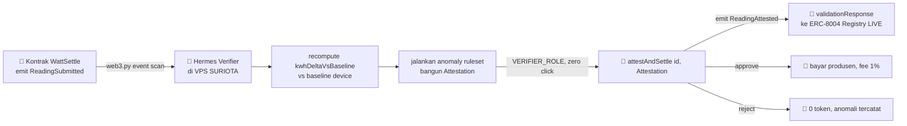

<div align="center">


&nbsp;

&nbsp;


# 🤖 AI Verifier

### Agent otonom yang membaca event, menghitung ulang, dan settle tanpa satu klik manusia

</div>

**Navigasi:** [Hub](README.md) · [Sebelumnya](<06 Kontrak WattSettle.md>) · [Berikutnya](<08 Tokenomics.md>)

---

## 💡 Peran Verifier dalam Satu Loop

Kontrak di [06 Kontrak WattSettle](<06 Kontrak WattSettle.md>) menyediakan `attestAndSettle`, tetapi kontrak tidak bisa memanggil dirinya sendiri. Yang menekan tombol itu adalah agent AI, dan agent itu harus otonom, tanpa manusia di tengah loop. Inilah Layer 3 arsitektur WattSettle, verifier yang memberi makna pada seluruh rel.

Agent dibangun di atas infrastruktur Hermes yang sudah beroperasi di VPS SURIOTA. Hermes sudah punya pola cron plus tool-calling, sudah punya watchdog, dan sudah menjadi asisten otonom yang jalan tanpa pengawasan. Kita tidak membangun agent dari nol, kita menambahkan satu kemampuan baru ke infra yang sudah teruji operasional. Ini moat operasional yang tidak bisa ditiru field pemula dalam timeline hackathon.



---

## ⚙️ Anatomi Agent Hermes

Agent adalah proses Python yang berjalan di server internal SURIOTA. Ia memakai `web3.py` untuk berbicara dengan BSC testnet 97 lewat RPC, dan berjalan sebagai job cron yang sama polanya dengan briefing harian Hermes yang sudah ada. Backend eksekusi bersifat lokal, agent memegang wallet dengan `VERIFIER_ROLE`, dan seluruh keputusan bersifat deterministik pada input yang dipatok saat demo.

Alur kerjanya empat langkah, dan tidak ada satu pun yang meminta klik manusia.

1. **Subscribe.** Agent memindai event `ReadingSubmitted` dari kontrak lewat `web3.py`, memakai block filter sederhana dari block terakhir yang sudah diproses.
2. **Recompute.** Untuk tiap bacaan baru, agent mengambil `kWh` dan menghitung `kwhDeltaVsBaseline` terhadap baseline device yang tersimpan, lalu menjalankan anomaly ruleset yang dipublish di repo.
3. **Build Attestation.** Agent merakit struct `Attestation` lengkap dengan `anomalyScoreBps`, `modelVersionHash`, `rulesetHash`, dan `evaluatedAt`.
4. **Settle.** Agent memanggil `attestAndSettle(id, attestation)` dengan wallet ber-`VERIFIER_ROLE`. Kontrak yang memutus approve atau reject lewat gate ruleset on-chain.

```python
import json
from pathlib import Path
from web3 import Web3

RPC_URL = "https://data-seed-prebsc-1-s1.bnbchain.org:8545"  # BSC testnet 97
w3 = Web3(Web3.HTTPProvider(RPC_URL))

wattsettle = w3.eth.contract(address=CONTRACT_ADDR, abi=ABI)
verifier = w3.eth.account.from_key(VERIFIER_PRIVATE_KEY)  # wallet ber-VERIFIER_ROLE

# Hash ruleset dan model dihitung dari file yang benar-benar dipublish di repo.
# rulesetHash on-chain HARUS cocok dengan hash file ini → "computed, not hardcoded".
RULESET_PATH = Path("ruleset/anomaly_v1.json")
RULESET = json.loads(RULESET_PATH.read_text())
RULESET_HASH = Web3.keccak(RULESET_PATH.read_bytes())
MODEL_VERSION_HASH = Web3.keccak(text="wattsettle-verifier/1.0.0")


def evaluate(device_id: bytes, kwh: int) -> dict:
    """Recompute delta vs baseline + skor anomali. Deterministik, tanpa LLM di jalur kritis."""
    baseline = RULESET["baselines"][device_id.hex()]
    delta = kwh - baseline["expected_kwh"]

    # Skor anomali dalam basis points: makin jauh dari baseline, makin tinggi.
    span = max(baseline["expected_kwh"], 1)
    anomaly_bps = min(10_000, abs(delta) * 10_000 // span)

    return {
        "kwhDeltaVsBaseline": int(delta),
        "anomalyScoreBps": int(anomaly_bps),
        "modelVersionHash": MODEL_VERSION_HASH,
        "rulesetHash": RULESET_HASH,
        "evaluatedAt": w3.eth.get_block("latest")["timestamp"],
    }


def on_reading_submitted(event) -> None:
    """Dipanggil cron untuk tiap event baru. ZERO klik manusia."""
    rid = event["args"]["id"]
    device_id = event["args"]["deviceId"]
    kwh = event["args"]["kWh"]

    att = evaluate(device_id, kwh)
    attestation = (
        att["kwhDeltaVsBaseline"],
        att["anomalyScoreBps"],
        att["modelVersionHash"],
        att["rulesetHash"],
        att["evaluatedAt"],
    )

    tx = wattsettle.functions.attestAndSettle(rid, attestation).build_transaction({
        "from": verifier.address,
        "nonce": w3.eth.get_transaction_count(verifier.address),
        "gas": 300_000,
        "gasPrice": w3.eth.gas_price,
    })
    signed = verifier.sign_transaction(tx)
    tx_hash = w3.eth.send_raw_transaction(signed.raw_transaction)
    w3.eth.wait_for_transaction_receipt(tx_hash)
```

> 💡 Perhatikan bahwa LLM tidak berada di jalur kritis keputusan. `evaluate()` sepenuhnya deterministik, aritmetika murni terhadap baseline. LLM yang menggerakkan Hermes dipakai untuk lapisan penjelasan dan operasional, bukan untuk memutuskan approve atau reject. Keputusan uang harus reproducible dan tahan audit, dan aritmetika deterministik memberi itu. Ini juga yang membuat demo bisa dipatok flawless.

---

## 🗂️ Indexing (Sesi 5)

Pendekatan indexing adalah **direct event scan via web3.py**, bukan subgraph. Ini keputusan YAGNI yang disengaja.

Untuk satu kontrak, satu jenis event yang relevan (`ReadingSubmitted`), dan volume demo yang kecil, subgraph adalah infrastruktur berat yang tidak membeli apa-apa. Ia menambah satu layanan yang harus di-deploy, di-monitor, dan dijaga sinkron, tepat di titik di mana demo solo paling rentan patah. Sebaliknya, `eth_getLogs` dengan block filter sederhana sudah cukup, tidak menambah dependency runtime di jalur kritis, dan bisa dipatok deterministik saat demo.

| Aspek | Direct web3.py scan (dipilih) | Subgraph (ditolak) |
|:--|:--|:--|
| Dependency runtime baru | tidak ada | butuh Graph node atau hosted service |
| Titik kegagalan tambahan | tidak ada | satu layanan lagi untuk dijaga sinkron |
| Cocok untuk volume demo | ya, kecil dan deterministik | overkill untuk satu kontrak |
| Konsisten dengan Ponytail | ya | tidak, menambah surface |

> 💡 Prinsipnya: infrastruktur harus membeli sesuatu yang tidak bisa dibeli oleh cara yang lebih sederhana. Untuk WattSettle di skala hackathon, subgraph tidak membeli apa-apa selain risiko. Kalau nanti volume produksi naik, subgraph masuk sebagai item roadmap, bukan scope hackathon. Lihat [18 Roadmap Pasca-Hackathon](<18 Roadmap Pasca-Hackathon.md>).

---

## 🔌 Keputusan API (Sesi 6)

Pendekatan API adalah **BscScan-first**, tanpa REST API custom di jalur kritis. Ini juga keputusan Ponytail yang disengaja.

Setiap keadaan yang perlu ditunjukkan sudah tersedia sebagai transaksi on-chain yang bisa dicek publik di BscScan. Event `ReadingAttested` membawa seluruh `Attestation` yang ter-decode. Transfer `suriota` terlihat. Fee ke treasury terlihat. Menambahkan REST API custom hanya untuk menyajikan data yang sudah publik berarti membangun layanan yang harus di-host, diamankan, dan dijaga hidup, tanpa menambah kepercayaan apa pun. BscScan sudah menjadi UI dan sudah menjadi API.

Detail bagaimana BscScan berperan sebagai UI dibahas di [12 Frontend dan dApp UI](<12 Frontend dan dApp UI.md>).

---

## 🎯 Determinisme untuk Demo (pre-seeded state)

Autonomy harus nyata, tetapi input harus dipatok. Ini bukan kontradiksi, ini disiplin demo. Agent benar-benar otonom, cron zero-click, tetapi bacaan yang masuk adalah fixture yang sudah ditandatangani sebelumnya, bukan device live atau MQTT live atau RPC read live di jalur kritis.

Kenapa begini. BSC testnet 97 bisa flaky. Monotonic dan replay guard di `submitReading` akan revert kalau slot bacaan sudah terpakai. Jaringan panggung tidak bisa dipercaya. Maka seluruh input dipatok, sementara mesin keputusan tetap otonom sungguhan.

Checklist determinisme untuk hari-H:

- **Pre-seed semua bacaan.** Tiga fixture dengan timestamp distinct berantre, sehingga monotonic guard tidak menolak. Tidak ada device, sensor, atau RPC read live di jalur kritis.
- **Pin confirmed tx.** Tab kedua adalah BscScan tx dari run sukses sebelumnya, event sudah ter-expand. Jangan pernah menunggu indexer live di panggung.
- **Lock state malam sebelumnya.** Kontrak masih verified, wallet agent punya tBNB cukup untuk lebih dari sepuluh kali gas, saldo `suriota` kontrak melebihi payout, dan reading id demo belum terpakai.
- **Tunjukkan rejection.** Jalankan dua bacaan, satu bersih yang settle, satu anomalous yang ditolak on-chain tanpa payout. Rejection sepuluh kali lebih meyakinkan daripada approval, dan menjawab Kill-shot #2.
- **Video fallback satu keystroke.** Rekam loop flawless sebelum hari-H. Kalau live tersendat, potong ke video di tengah kalimat tanpa minta maaf.

Runbook demo lengkap ada di [15 Demo dan Pitch](<15 Demo dan Pitch.md>).

---

## 🔗 Integrasi ERC-8004 (Validation Registry LIVE)

Ini perbaikan untuk Kill-shot #1, dan ini yang membuat WattSettle berhenti terlihat seperti mirror dan mulai terlihat seperti warga ekosistem BNB.

ERC-8004 dan BEP-620 sudah LIVE di BSC testnet 97 sejak 4 Februari 2026. Framing lama "self-contained mirror of ERC-8004" adalah bunuh diri di depan juri BNB, karena mereka tahu registry mereka sudah ada di rantai yang sama dengan tempat kita deploy. Pertanyaan mematikannya: kenapa hand-roll event bespoke yang meniru standar kami, alih-alih menulis ke Validation Registry yang live di testnet 97.

Jawabannya adalah **integrate, bukan mirror**. Setelah `attestAndSettle` emit `ReadingAttested`, Hermes JUGA memanggil `validationResponse` di Validation Registry ERC-8004 yang live untuk bacaan yang sama. Kontrak settlement self-contained tetap menjadi core pembayaran, tetapi rationale AI juga tercatat di registry resmi BNB. Kita tidak me-reimplement BEP-620, device physical-DePIN kita menjadi agent real-world pertama yang menulis ke registry live BNB, dan settlement rail kita menjadi payment layer di atasnya.

Signature fungsi yang dituju, terverifikasi dari forum BEP-620:

```solidity
// Validation Registry ERC-8004 / BEP-620, LIVE di BSC testnet 97.
// Kita INTEGRATE ke instance live ini, tidak deploy singleton baru.
function validationResponse(
    bytes32 requestHash,   // identitas request validasi
    uint8   response,      // skor 0..100
    string  responseUri,   // URI ke rationale off-chain
    bytes32 responseHash,  // hash konten response
    bytes32 tag            // label kategori validasi
) external;
```

Hermes memanggilnya sebagai leg kedua, tepat setelah settlement confirmed:

```python
validation_registry = w3.eth.contract(address=ERC8004_VALIDATION_REGISTRY, abi=ERC8004_ABI)

def post_validation_response(reading_id: int, anomaly_bps: int, response_uri: str) -> None:
    """Leg kedua: tulis rationale ke Validation Registry ERC-8004 yang LIVE.
    Bukan mirror, integrasi ke registry resmi BNB (fix Kill-shot #1)."""
    request_hash = Web3.solidity_keccak(["uint256"], [reading_id])
    score = 100 - min(100, anomaly_bps // 100)          # anomali rendah → skor tinggi
    response_hash = Web3.keccak(text=response_uri)
    tag = Web3.keccak(text="physical-energy")

    tx = validation_registry.functions.validationResponse(
        request_hash, score, response_uri, response_hash, tag
    ).build_transaction({
        "from": verifier.address,
        "nonce": w3.eth.get_transaction_count(verifier.address),
        "gas": 200_000,
        "gasPrice": w3.eth.gas_price,
    })
    signed = verifier.sign_transaction(tx)
    w3.eth.send_raw_transaction(signed.raw_transaction)
```

> ⚠️ Framing "self-contained mirror" harus MATI di seluruh materi. Pitch yang benar: saya tidak me-reimplement BEP-620, device physical-DePIN saya adalah agent real-world pertama yang menulis ke registry live BNB, dan settlement rail saya adalah payment layer di atasnya. Untuk keamanan panggung, leg registry ini bisa di-pre-record sebagai cadangan, tetapi framing integrasinya tetap. Kill-shot lengkap ada di [16 Risiko dan Kill-shots](<16 Risiko dan Kill-shots.md>).

---

## 🧪 Cross-link

Kontrak yang dipanggil agent ini didefinisikan di [06 Kontrak WattSettle](<06 Kontrak WattSettle.md>). Cara agent menjaga determinisme di panggung diperluas di [15 Demo dan Pitch](<15 Demo dan Pitch.md>). Sisi keamanan wallet verifier dan `VERIFIER_ROLE` dibahas di [09 Keamanan](<09 Keamanan.md>).

---

<div align="center">
<sub>© 2026 PT Surya Inovasi Prioritas (SURIOTA) · <a href="README.md">Hub WattSettle</a> · Update 7 Juli 2026</sub>
</div>
