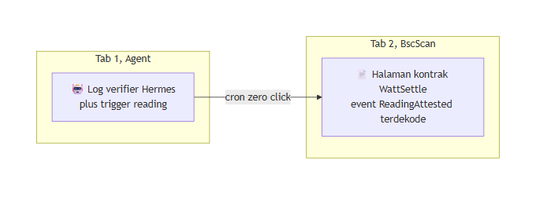

&nbsp;

&nbsp;

# 🖥️ Frontend dan dApp UI

### BscScan sebagai UI utama, viewer statis tipis, tanpa dApp berat di jalur kritis

**Navigasi:** [Hub](README.md) · [Sebelumnya: 11 Testing dan QA](<11 Testing dan QA.md>) · [Berikutnya: 13 Workflow Build](<13 Workflow Build.md>)

---

## 💡 Keputusan Inti

WattSettle **tidak membangun dApp custom yang berat**. UI utama saat demo adalah **BscScan**, ditambah **satu halaman viewer statis yang tipis** yang menampilkan dua hal saja, klip perangkat lapangan dan attestation yang sudah didekode. Ini keputusan Ponytail yang disengaja, bukan kompromi karena waktu.

Alasannya ada tiga.

> 💡 **Determinisme demo di atas segalanya.** Frontend custom adalah komponen tambahan yang bisa gagal saat live, provider RPC putus, wallet minta konfirmasi di waktu yang salah, indexer telat, state React desync. Setiap komponen di jalur kritis adalah satu titik kegagalan baru. BscScan sudah battle-tested, selalu online, dan menampilkan transaksi serta event yang sama persis yang akan dinilai juri.

Kedua, **BscScan justru lebih kredibel daripada UI buatan sendiri**. Kalau builder menampilkan dashboard yang mengklaim "pembayaran berhasil", juri harus percaya pada tampilan itu. Kalau builder membuka transaksi di BscScan dengan event `ReadingAttested` yang terdekode dan transfer token yang terlihat, tidak ada yang perlu dipercaya, semuanya on-chain dan bisa dicek publik. Bukti mengalahkan tampilan.

Ketiga, disiplin **Ponytail** melarang menaruh kode yang tidak perlu di jalur kritis. Membangun form submit reading, tabel event, dan tombol settle di React berarti mereplikasi apa yang BscScan sudah lakukan dengan sempurna, sambil menambah surface bug. Kontrak, `cast`, dan BscScan sudah cukup untuk loop penuh.

---

## 🌐 Hubungan dengan Website di `web/`

Ada kebingungan yang harus diluruskan sejak awal. Repo ini punya sebuah website di direktori [`web/`](../web/), tetapi **itu bukan dApp WattSettle**.

| Artefak | Apa itu | Apa yang bukan |
|:--|:--|:--|
| **Website di `web/`** | Situs pemaparan (pitch site) berbasis **Astro**, multi halaman, live di `web3.gifariksuryo.xyz`. Menjelaskan konsep, moat, scoring, dan menyediakan simulator interaktif untuk edukasi. | **Bukan** antarmuka yang membaca atau menulis ke kontrak on-chain. Simulator di situ adalah animasi konseptual, bukan transaksi nyata. |
| **BscScan** | UI operasional utama untuk loop settlement nyata. Menampilkan transaksi, event terdekode, saldo token, dan status kontrak yang sesungguhnya. | Bukan milik WattSettle, tetapi justru itu kekuatannya, netral dan tepercaya. |
| **Viewer statis tipis** | Halaman kecil satu file yang menyandingkan klip perangkat lapangan dengan attestation terdekode, sebagai jembatan visual moat ke on-chain. | Bukan aplikasi berstate, tidak connect wallet, tidak kirim transaksi. |

> ⚠️ Jangan pernah menyebut website `web/` sebagai "dApp" di depan juri. Sebut dengan jujur, situs pemaparan konsep. dApp yang sebenarnya adalah kontrak plus BscScan. Mengklaim situs Astro sebagai antarmuka on-chain akan runtuh saat ditanya "tunjukkan transaksi yang dipicu dari situ".

Situs `web/` melayani penonton yang berbeda dari BscScan. Situs itu menceritakan kenapa WattSettle penting kepada manusia. BscScan membuktikan bahwa WattSettle bekerja kepada mesin dan juri teknis. Keduanya hidup berdampingan, tidak saling menggantikan.

---

## 🎬 Apa yang Ditampilkan Saat Demo

Aturan disiplin dua tab (lihat runbook di [15 Demo dan Pitch](<15 Demo dan Pitch.md>)). Sepanjang loop demo, layar hanya berisi dua tab, tidak ada tab hunting.

**Tab 1, log dan trigger agent.** Terminal atau panel yang menampilkan verifier Hermes bangun sendiri lewat cron, membaca event `ReadingSubmitted`, menghitung ulang delta dan anomaly, lalu memanggil `attestAndSettle` tanpa klik manusia. Ini bukti autonomy, bukan tombol yang ditekan presenter.

**Tab 2, BscScan pre-loaded.** Halaman kontrak WattSettle sudah terbuka dengan event terdekode. Saat transaksi konfirmasi, `ReadingAttested` muncul dengan rationale terbaca, delta kWh, anomaly score, `modelVersionHash`, `rulesetHash`, disertai transfer token `suriota` ke produsen dan fee ke treasury. Tab ini juga menyimpan **transaksi konfirmasi nyata dari run sukses sebelumnya**, ter-pin dan ter-expand, sebagai jaring pengaman jika indexer live telat.

> 💡 Momen puncak demo adalah 2 sampai 3 detik hening di layar transaksi terkonfirmasi dengan attestation terdekode. Justru karena UI-nya BscScan dan bukan dashboard buatan sendiri, momen itu terasa jujur dan tidak bisa dituduh dipentaskan.

Viewer statis tipis, kalau dipakai, muncul sekejap untuk mengikat moat, klip SRT-MGATE-1210 di dinding pabrik di sisi kiri dan attestation terdekode yang sama di sisi kanan. Perannya hanya menjembatani, bukan menjadi panggung.

---

## 📋 Yang Ditampilkan versus Yang Dilewati

| Kita tampilkan | Kita lewati | Alasan |
|:--|:--|:--|
| BscScan sebagai UI utama loop | dApp React penuh dengan wallet connect | Determinisme, surface bug nol di jalur kritis, kredibilitas netral |
| Viewer statis satu file, klip plus attestation terdekode | Dashboard berstate real time yang query RPC live | Tidak ada RPC live di jalur kritis, tidak ada indexer yang bisa telat |
| Log agent Hermes plus trigger | Form submit reading di browser | Reading di-seed lewat fixture bertanda tangan, bukan input manual di panggung |
| Event `ReadingAttested` terdekode di BscScan | Komponen tabel event custom | BscScan sudah mendekode ABI dengan sempurna, gratis |
| Situs pemaparan `web/` untuk cerita ke manusia | Menyamakan situs pemaparan dengan dApp | Kejujuran framing, situs Astro bukan antarmuka on-chain |
| Transfer token `suriota` yang terlihat di BscScan | Widget saldo custom | Saldo asli on-chain lebih dipercaya daripada angka yang kita render sendiri |

Prinsipnya satu kalimat, **setiap piksel yang kita render sendiri adalah piksel yang harus dipercaya juri, setiap event terdekode di BscScan adalah bukti yang tidak perlu dipercaya.**

---

## 🧭 Kaitan ke Workshop Sesi 7

Materi ini memetakan ke **Sesi 7, Frontend dApp UI (16 Agustus 2026)**. Kurikulum mengajarkan cara membangun frontend dApp, tetapi keputusan WattSettle yang sah adalah menjawab kebutuhan itu dengan **jalur Ponytail**, BscScan sebagai UI plus viewer statis tipis, bukan dApp berat.

Deliverable Sesi 7 karena itu adalah, halaman viewer statis tipis selesai, minimal dua transaksi on-chain (`submitReading` dan `attestAndSettle`) sudah ditembakkan dan URL-nya disimpan, serta latihan disiplin dua tab. Peta lengkap ada di [13 Workflow Build](<13 Workflow Build.md>).

---

© 2026 PT Surya Inovasi Prioritas (SURIOTA) · <a href="README.md">Hub WattSettle</a> · Update 7 Juli 2026

