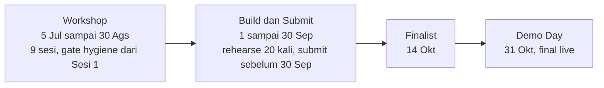

&nbsp;

&nbsp;

# 🗓️ Workflow Build

### Playbook per sesi workshop, gate hygiene, dan disiplin scope freeze sampai Demo Day

**Navigasi:** [Hub](README.md) · [Sebelumnya: 12 Frontend dan dApp UI](<12 Frontend dan dApp UI.md>) · [Berikutnya: 14 Bisnis dan GTM](<14 Bisnis dan GTM.md>)

---

## 💡 Kenapa Bab Ini Tulang Punggung

Bab ini adalah peta operasional WattSettle. Setiap sesi workshop dipetakan ke pekerjaan konkret, dengan bab rujukan, deliverable, dan gate yang harus ditutup. Saat membangun, buka bab ini dulu sebagai kompas, lalu lompat ke bab teknis yang dirujuk.

Prinsip yang menaungi seluruh jadwal, **delta kontrak dibentang natural mengikuti kurikulum**, gate hygiene dimulai sejak Sesi 1 bukan di akhir, dan bulan September dipakai untuk polish plus rehearse, bukan untuk fitur baru.

> 💡 Kurikulum hackathon adalah kunci jawaban. Sesi 3 sampai 4 mengajarkan token plus bounty plus security, Sesi 6 mengajarkan API plus AI auto-verify, Sesi 8 mengajarkan AI integration. WattSettle adalah jawaban kanonik atas kurikulum ini, jadi setiap sesi menaikkan project secara alami tanpa memaksa.

---

## 🧑‍🏫 Blok Mentor

Meet semua sesi di `meet.google.com/bjm-tvfy-esn`, Minggu 19.30 sampai 21.30 WIB kecuali Sesi 8 dan 9 yang jatuh di hari Selasa.

| Blok | Sesi | Mentor | Catatan |
|:--|:--|:--|:--|
| **Kontrak** | Sesi 1 sampai 4 | Axel Urwawuska Atarubby (@lexilexy) · **Yeheskiel Yunus Tame** (@yeheskieltame) | Yeheskiel co-founder OwnaFarm, juara Mantle, selera RWA dan real-world settlement, **kemungkinan besar juri**. Framing energi metered on-chain adalah bullseye seleranya. |
| **Backend dan AI** | Sesi 5 sampai 8 | Fajar Jati Nugroho (@Beatless16) · Fajar Ramadhan (@xfajarrr) | Blok tempat verifier Hermes, indexing, API, dan integrasi ERC-8004 dibangun. |
| **Pitch** | Sesi 9 | Dev Web3 Jogja dan Alumni | Taste anti clone keras, market non-crypto users. Pitch WattSettle diasah di sini. |

> 💡 Mentor kemungkinan besar juri. Perlakukan setiap sesi sebagai kesempatan menunjukkan progress on-chain nyata, bukan sekadar hadir. Builder yang sudah deploy produk teruji sudah top-decile sebelum penilaian dimulai.

---

## 📅 Peta Sesi ke Pekerjaan WattSettle

Kolom **Gate ditutup** menandai hard submission gate yang diselesaikan di sesi itu, tiap gate yang terlewat adalah disqualifier.

| Sesi | Tanggal | Topik Workshop | Task WattSettle | Bab Rujukan | Deliverable | Gate ditutup |
|:--|:--|:--|:--|:--|:--|:--|
| **1** | 5 Jul | Environment + First Deploy | Repo public LIVE, commit harian mulai, README skeleton, checklist gate disiapkan | [04 Setup Lingkungan](<04 Setup Lingkungan.md>) | Repo public, tweet peserta | ✅ open-source dengan commit history terlihat (mulai) |
| **2** | 12 Jul | Solidity via Guestbook | Branch `wattsettle`, tulis `Attestation` struct plus event `ReadingAttested` (TDD red) | [06 Kontrak WattSettle](<06 Kontrak WattSettle.md>) | Branch aktif, test merah dulu | (tidak ada) |
| **3** | 19 Jul | Foundry + Token + Bounty Board | `attestAndSettle` gantikan `verifyReading`, on-chain ruleset gate, 6 test lama hijau lagi | [06 Kontrak WattSettle](<06 Kontrak WattSettle.md>) · [08 Tokenomics](<08 Tokenomics.md>) | Kontrak evolve, test hijau | (tidak ada) |
| **4** | 26 Jul | Full Bounty + Security | SafeERC20, ReentrancyGuard, solvency check, fee split, test reentrancy dan solvency dan fee. Jalankan `/ponytail-review` | [09 Keamanan](<09 Keamanan.md>) · [11 Testing dan QA](<11 Testing dan QA.md>) | ~14 test deterministik | (tidak ada) |
| **5** | 2 Ags | Reading the Chain + Indexing | Hermes agent listen `ReadingSubmitted`, recompute delta plus anomaly, build Attestation off-chain | [07 AI Verifier](<07 AI Verifier.md>) | Agent membaca event dan menghitung | (tidak ada) |
| **6** | 9 Ags | API + AI Auto-verify | Agent panggil `attestAndSettle` via cron, ZERO click. Deploy `WattSettle` ke testnet 97, `forge verify-contract` plus screenshot | [07 AI Verifier](<07 AI Verifier.md>) · [10 Deployment](<10 Deployment dan On-chain Ops.md>) | Loop otonom jalan, deploy | ✅ deploy BSC testnet 97 · ✅ contract VERIFIED |
| **7** | 16 Ags | Frontend dApp UI | Jalur Ponytail, BscScan sebagai UI plus halaman statis tipis (klip plus attestation terdekode). Fire minimal 2 tx, simpan URL | [12 Frontend dan dApp UI](<12 Frontend dan dApp UI.md>) | Viewer tipis, disiplin dua tab | ✅ minimal 2 real on-chain tx |
| **8** | Selasa 25 Ags | AI Integration + Scope Ideas | **Integrasi ERC-8004 Validation Registry LIVE** (`validationResponse`) sebagai act-2. Tangkap 1 signature hardware nyata dari SRT-MGATE-1210 | [07 AI Verifier](<07 AI Verifier.md>) · [05 Device dan Firmware](<05 Device dan Firmware.md>) | Registry leg jalan, moat terikat ke chain | fix Kill-shot #1 dan #3 |
| **9** | Selasa 30 Ags | Learn How to Pitch | Pitch deck plus skrip 3 menit. Rekam demo video fallback (loop identik, flawless) | [15 Demo dan Pitch](<15 Demo dan Pitch.md>) | Deck, skrip, video fallback | (tidak ada) |
| **September** | 1 sampai 30 Sep | Build month | Rehearse loop 20 kali, harden determinism, scout track density, submit sebelum 30 Sep | [16 Risiko dan Kill-shots](<16 Risiko dan Kill-shots.md>) · [21 Checklist Submission](<21 Checklist Submission.md>) | Semua gate ter-proof, submission masuk | ✅ README + roadmap · ✅ demo video · ✅ tweet tag |
| **Finalis** | 14 Okt | Window pengumuman | Jika finalis, final rehearsal untuk Demo Day | [15 Demo dan Pitch](<15 Demo dan Pitch.md>) | Kesiapan Demo Day | (tidak ada) |

---

## 🗓️ Milestone Resmi dan Timeline

> ⚠️ Koreksi fatal terhadap asumsi awal. Demo Day **bukan** 30 Agustus. Sesi 9 (30 Ags) adalah pitch training. Submission dibuka 1 September dan ditutup 30 September, finalis diumumkan 14 Oktober, Demo Day live 31 Oktober 2026. Ada satu bulan penuh untuk build setelah workshop, jadwal jauh lebih longgar dari yang diasumsikan. Tidak ada alasan gate hygiene tidak tuntas.

---

## ✅ Gate Hygiene Checklist

Tiap item di bawah adalah hard submission gate. Satu yang terlewat menihilkan entry yang secara teknis menang. Kerjakan lebih awal dan simpan bukti dengan link.

| # | Gate | Kapan | Bukti |
|:--|:--|:--|:--|
| 1 | Repo open-source dengan commit history terlihat | Mulai Sesi 1, jaga sampai submit | URL repo public, riwayat commit harian |
| 2 | Deploy ke BSC testnet 97 | Sesi 6 | Alamat kontrak, chainId 97 |
| 3 | Contract VERIFIED di BscScan | Sesi 6 | Screenshot `forge verify-contract` sukses |
| 4 | Minimal 2 real on-chain tx (`submitReading` plus `attestAndSettle`) | Sesi 7 | URL transaksi BscScan |
| 5 | README plus roadmap | September | Link file di repo |
| 6 | Demo video | September | Link video, loop flawless |
| 7 | Tweet tag `@BNBChain @BinanceAcademy @coinvestasi @devweb3jogja #IndonesiaWeb3Hackathon` | September | Screenshot tweet |

Detail tick-with-proof ada di [21 Checklist Submission](<21 Checklist Submission.md>).

---

## 🧭 Prinsip Kerja yang Tidak Bisa Ditawar

**Commit harian genuine, jangan squash.** Riwayat commit yang menumpuk dalam satu ledakan terbaca sebagai pola backdated dan menjadi red flag di mata juri. Commit kecil setiap hari sejak Sesi 1 membuktikan proses build yang jujur dan berjalan sepanjang timeline.

**Hard scope freeze.** Scope dibekukan, satu signer, satu verifier, satu attestation contract, satu settlement loop, satu reputation counter. Tidak ada cross-chain, tidak ada self-deploy singleton ERC-8004 baru (pakai yang sudah live), tidak ada hard-wire x402 eksternal di jalur kritis. Setiap varian yang lebih kaya (WattBond, Karya-8004, dan lainnya) adalah roadmap pasca-hackathon di [18 Roadmap Pasca-Hackathon](<18 Roadmap Pasca-Hackathon.md>), bukan scope hackathon.

> ⚠️ Musuh terbesar solo builder bukan kekurangan fitur, melainkan over-scoping yang mematahkan determinisme demo dan lupa mencentang satu checkbox gate. Tahan garis. Delta kontrak paling kecil di atas base 6-test PASS adalah pilihan yang benar, bukan pilihan malas.

**Evolve, bukan rewrite.** Semua pekerjaan kontrak adalah delta di atas `ProofOfWatt.sol` yang sudah 6 test PASS. `submitReading` dan guard-nya tidak disentuh. Yang berubah hanya struct plus event, `attestAndSettle`, SafeERC20 plus ReentrancyGuard plus solvency, reputation, fee, dan NatSpec.

---

© 2026 PT Surya Inovasi Prioritas (SURIOTA) · <a href="README.md">Hub WattSettle</a> · Update 7 Juli 2026

