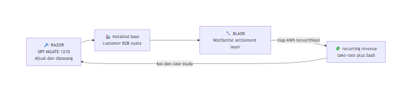
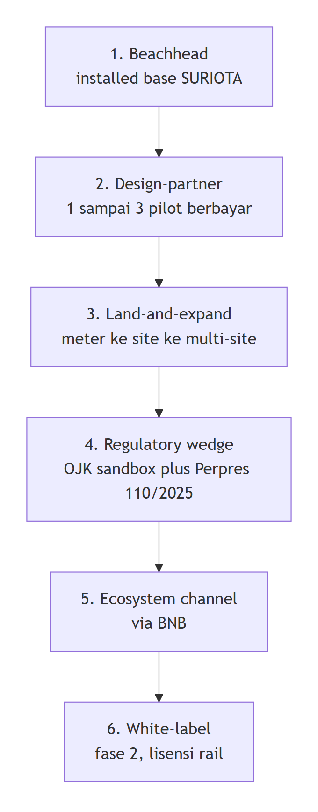
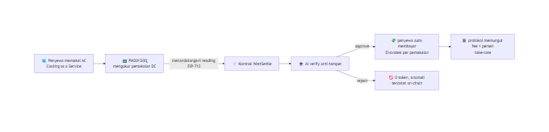

&nbsp;

&nbsp;

# 🏢 Bisnis dan GTM

### Kenapa hardware SURIOTA adalah pisau cukur dan WattSettle adalah silet yang terus dibeli

**Navigasi:** [Hub](README.md) · [Sebelumnya: 13 Workflow Build](<13 Workflow Build.md>) · [Berikutnya: 15 Demo dan Pitch](<15 Demo dan Pitch.md>)

---

## 💡 Intisari Bab

Model bisnis WattSettle berdiri di atas satu kenyataan yang tidak bisa ditiru peserta lain, SURIOTA sudah menjual dan memasang hardware ke customer B2B industri nyata. Bab ini menjelaskan tiga hal. Pertama, kenapa struktur razor and blades membuat setiap gateway yang terjual menjadi anuitas settlement. Kedua, dari mana revenue benar-benar datang dan lapisan after sales apa yang hanya bisa ditawarkan sebuah perusahaan hardware. Ketiga, jalur go to market enam langkah yang berangkat dari installed base sendiri, ditutup dengan use case Enovatek PM20H20Q sebagai bukti panggung yang konkret.

> 💡 TAM miliaran dolar dipakai sebagai plafon, bukan klaim. Angka yang dijanjikan ke juri adalah SOM bottom up yang jujur, fleet SURIOTA sendiri dikali fee per gateway.

---

## 🪒 Model Razor and Blades

SURIOTA menjual dan men-deploy **SRT-MGATE-1210** serta mengoperasikan produk energy monitoring (surge-energy-map) ke customer industri. Itulah **razor**, aset yang sudah terpasang di lapangan dengan relasi, kontrak support, dan data metered yang berjalan. **WattSettle adalah blade**, lapisan settlement plus attestation on-chain yang mengubah tiap kWh terverifikasi menjadi payment event yang bisa dibuktikan di BNB Chain.

Karena SURIOTA menguasai seluruh stack, dari silicon, firmware, gateway, verifier Hermes, smart contract, sampai settlement token, tidak ada oracle, facilitator, atau vendor eksternal yang ikut memotong margin atau bisa memblokir aliran. Setiap gateway yang sudah terpasang berubah dari penjualan satu kali menjadi sumber recurring, sebab tiap kWh yang lewat memicu settlement yang memungut fee.

Alur ini adalah flywheel. Hardware menaburkan blade, blade menghasilkan recurring, recurring membiayai penjualan hardware berikutnya. Field pesaing yang berupa software murni tidak punya razor, jadi tidak pernah bisa memasuki loop ini.

---

## 💰 Revenue Streams

Enam aliran pendapatan, diurut dari yang paling dekat ke kas hari ini sampai yang paling jauh di roadmap. Fee split take-rate ditulis on-chain di dalam `attestAndSettle`, sehingga revenue model bukan janji slide melainkan properti kontrak yang bisa dicek di BscScan.

| Stream | Mekanisme | Sifat |
|:--|:--|:--|
| 💸 **Settlement take-rate** (primary) | fee bps on-chain tiap payout yang AI-verified, kisaran 0.5 sampai 2 persen | Scale mengikuti volume kWh, viable untuk micropayment karena median fee BNB sekitar 0.0038 dolar |
| 📟 **Per-device attestation SaaS** | subscription bulanan atau tahunan per gateway | Tulang punggung ARR, upsell di atas kontrak hardware yang sudah ada |
| 🌱 **RWA dan green-attestation premium** | jual proof source-class plus CO2e ke pembeli ESG, ekstensi CarbonProof | Terikat sandbox RWA OJK dan Perpres 110/2025 |
| 🔑 **Infrastructure licensing atau white-label** | lisensi kontrak plus verifier ke operator energy-DePIN lain | Software B2B2X, CAC rendah |
| 🔌 **Hardware pull-through** (indirect) | meter yang bisa auto-bill dan membuktikan output menaikkan penjualan gateway | Flywheel DePIN |
| 🏦 **Financing atau yield spread** (roadmap) | WattBond machine-yield note yang di-gate oleh kWh | Plafon tertinggi, sengaja di luar critical path demo |

> 💡 Primary revenue hari ini adalah take-rate plus SaaS. Green-attestation dan financing adalah upside yang diceritakan sebagai arah, bukan scope hackathon. Menahan diri di dua stream inti menjaga demo tetap deterministik.

---

## 🛎️ Keunggulan Struktural After-Sales

Pertanyaan sustainability dari juri hampir selalu roboh di startup software. Untuk WattSettle pertanyaan itu terjawab secara struktural, karena SURIOTA memang sudah perusahaan hardware dengan after-sales yang berjalan. Lima keunggulan berikut tidak bisa dipalsukan oleh peserta yang tidak memiliki lini hardware.

1. **Device lifecycle dan key management.** Signing key di-provision saat manufaktur, `registerDevice` mendaftarkan unit on-chain, rotasi atau revoke dijalankan saat RMA. Reputation counter on-chain berfungsi sebagai health score dan trust score per unit.
2. **SLA-backed monitoring.** Verifier Hermes sudah berjalan dengan cron plus watchdog. Anomaly score di stream attestation menjadi sinyal predictive maintenance dan deteksi tamper, dijual sebagai tier managed-service berbayar.
3. **OTA firmware.** GatewaySuriotaOTA sudah ada, sehingga upgrade ruleset atau model bisa dilakukan tanpa truck-roll. `rulesetHash` dan `modelVersionHash` on-chain membuat tiap upgrade auditable dan terkunci ke versi.
4. **Settlement reconciliation.** Tiap payout on-chain disertai attestation yang human-readable. Sengketa mengenai kenapa suatu pembayaran disetujui atau ditolak diselesaikan dengan menunjuk record BscScan yang immutable, sehingga biaya support kolaps.
5. **Tiered support.** Tier standard, berupa email, dashboard, dan self-serve audit BscScan, di-bundle dengan hardware. Tier premium, berupa managed-verifier plus SLA plus predictive maintenance, menjadi upsell recurring.

---

## 🧭 Go To Market Enam Langkah

1. **Beachhead sama dengan installed base SURIOTA sendiri.** WattSettle dijual sebagai upgrade berbayar berupa verifiable auto-settled billing plus audit trail di gateway yang sudah ter-deploy. Cold-start nol, karena hardware, relasi, kontrak support, dan data metered sudah ada. Ini unfair advantage terbesar dibanding field manapun.
2. **Design-partner motion.** Konversi satu sampai tiga customer menjadi pilot berbayar, dalam skala puluhan gateway. Hasilnya adalah case study plus PO atau invoice yang di-redaksi, dua-duanya menjadi collateral pitch sekaligus amunisi sales enterprise.
3. **Land-and-expand per site.** Satu meter tumbuh menjadi full-site sub-metering, lalu menjadi multi-site, mengikuti CAGR IoT energy dan utilities sekitar 18.11 persen serta trajektori 60 sampai 80 juta smart-meter PLN.
4. **Regulatory-credibility wedge.** Eligibility sandbox RWA OJK, Perpres 110/2025, dan settlement yang BI-safe karena non-IDR. Pemicu pembelian bagi CFO atau ESG industri adalah kata compliant, auditable, dan machine-verified.
5. **Ecosystem channel via BNB.** Hackathon berfungsi sebagai GTM. Relasi dengan BNB, Binance Academy, Coinvestasi, dan Dev Web3 Jogja menjadi warm intro ke ekosistem RWA dan agentic finance BNB. Positioning-nya adalah published M2M-energy x402 case study milik BNB sendiri, yang sudah di-ship.
6. **White-label fase 2.** Lisensikan rail ke operator energy-DePIN lain di Asia Tenggara.

---

## 📊 Market Anchor sebagai Plafon, Bukan Klaim

Angka pasar besar dipakai untuk menunjukkan ceiling, bukan untuk dijanjikan. M2M payments TAM sekitar 11.29 miliar dolar pada 2026 menuju 54.95 miliar dolar pada 2034 di CAGR 21.9 persen. Agentic commerce sekitar 8 miliar dolar pada 2026 menuju 1.5 triliun dolar pada 2030 versi Juniper. DePIN sekitar 9 sampai 11 miliar dolar kapitalisasi dengan energi sebagai vertikal deployment terbesar. Pasar meter Indonesia sekitar 180 sampai 220 juta dolar pada 2026, dengan sub-sektor energy dan utilities tumbuh 18.11 persen.

> ⚠️ SOM yang jujur dihitung bottom up, bukan top down. Fleet SRT-MGATE-1210 sendiri dikali fee per gateway menghasilkan beachhead sekitar 10 ribu dolar menuju 100 ribu dolar ARR. TAM adalah plafon, moat adalah beachhead nyata yang tidak bisa ditiru. Jangan pernah mengejar angka miliaran di panggung.

---

## 🧊 Use Case Enovatek PM20H20Q, Cooling as a Service

WattSettle adalah rel generik. Enovatek adalah tempat rel itu dipasang di satu produk nyata, sehingga demo memiliki perusahaan, produk, dan revenue yang benar-benar ada. PT Enovatek Energy adalah mitra green energy dengan lini solar, wind turbine, LED, serta Hybrid HVAC. Produk **PM20H20Q** adalah DC meter untuk model rental AC yang disebut Cooling as a Service. Penyewa membayar per pemakaian, meter mengukur, kontrak dan AI memverifikasi, lalu pembayaran mengalir otomatis ke Enovatek beserta fee protokol.

Ada dua aliran nilai. Pertama, billing pemakaian sebagai revenue utama per kWh terukur. Kedua, carbon, REC, ESG, dan CBAM sebagai upside dari data yang sudah terverifikasi.

> ⚙️ **Catatan produksi.** Billing nyata memakai stablecoin, bukan token volatil, agar harga tidak berayun terhadap tagihan. Demo hackathon memakai `suriota` untuk menghindari risiko token baru. Siapkan jawaban konsistensi ini untuk juri, swap ke MockUSD di kontrak adalah perubahan satu baris.

Kombinasi rel generik pada slide dan satu keran sempurna di panggung inilah yang menutup skeptisisme juri dalam 15 detik pertama. Detail beat demo ada di [15 Demo dan Pitch](<15 Demo dan Pitch.md>).

---

© 2026 PT Surya Inovasi Prioritas (SURIOTA) · <a href="README.md">Hub WattSettle</a> · Update 7 Juli 2026

