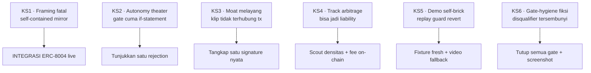

<div align="center">


&nbsp;

&nbsp;


# ⚠️ Risiko dan Kill-shots

### Enam cara proyek ini mati, cara menghindarinya, dan probabilitas yang jujur

</div>

**Navigasi:** [Hub](README.md) · [Sebelumnya: 15 Demo dan Pitch](<15 Demo dan Pitch.md>) · [Berikutnya: 17 SWOT dan Kompetitor](<17 SWOT dan Kompetitor.md>)

---

## 💡 Kenapa Bab Ini Ada di Depan

Sebagian besar entri hackathon mati bukan karena idenya lemah, melainkan karena satu asumsi awal yang keliru dibiarkan hidup sampai hari penjurian. Bab ini mengumpulkan enam titik mati WattSettle, disebut **kill-shot**, masing-masing dengan risiko yang jujur dan fix yang wajib diterapkan. Baca ini sebelum menyentuh kode apa pun. Skor 90 dan probabilitas nominasi di bab lain hanya berlaku jika keenam fix di bawah benar-benar dijalankan.

> ⚠️ Aturan main bab ini. Setiap kill-shot punya dua kolom, **Risiko** menjelaskan bagaimana juri membunuh entri ini, **Fix** adalah aksi konkret yang membalik risiko itu. Kill-shot yang fix-nya belum tuntas dianggap masih terbuka, dan satu gate terbuka membuat klaim nominasi di atas 90 persen mustahil.

---

## 🗺️ Peta Enam Kill-shot



---

## 🚫 KS1, Framing Fatal: "self-contained mirror" adalah bunuh diri

> ⚠️ Ini kill-shot paling mematikan. Kalau hanya satu yang diperbaiki, perbaiki yang ini.

| Aspek | Isi |
|:--|:--|
| **Risiko** | ERC-8004 dan BEP-620 sudah **LIVE di BSC testnet 97** sejak 4 Februari 2026, dan BNBAgent SDK live sejak Maret. Kalau WattSettle dipitch sebagai "attestation yang meniru vocabulary ERC-8004, self-contained, tanpa dependency singleton eksternal", framing itu terbalik di depan rep BNB yang tahu registry mereka ada di rantai yang sama. Pertanyaan mematikan: "kenapa hand-roll event bespoke yang meniru standar kami, alih-alih register device di Validation Registry yang sudah live di testnet 97?" Lever inovasi nomor satu berubah jadi dismissal nomor satu. |
| **Fix (WAJIB)** | **INTEGRASI registry live sebagai act-2 demo**, sementara kontrak self-contained tetap jadi settlement core. Setelah `attestAndSettle` meng-emit event, Hermes verifier JUGA memanggil `validationResponse(requestHash, response 0-100, responseUri)` di Validation Registry testnet 97 untuk reading yang sama. Pitch berubah jadi "saya tidak reimplement BEP-620, device physical DePIN saya adalah agent real-world PERTAMA yang menulis ke registry live BNB, dan settlement rail saya adalah payment layer di atasnya". Framing "self-contained mirror" HARUS MATI dari deck, skrip, dan README. |

---

## 🤖 KS2, Autonomy Theater: gate cuma if-statement, demo approval-only

| Aspek | Isi |
|:--|:--|
| **Risiko** | Juri membaca Solidity, melihat gate di `attestAndSettle` hanya threshold trivial pada nilai yang di-supply agent, lalu menyimpulkan "rubber stamp". Kalau juri minta "run unseeded live", entri terjebak: menolak terlihat staged, menerima lalu tersendat membunuh demo. |
| **Fix (WAJIB)** | **Tunjukkan satu rejection on-chain.** (1) Live run submit DUA reading, satu bersih yang di-settle, satu anomalous yang **DITOLAK on-chain tanpa payout**. Rejection sepuluh kali lebih meyakinkan daripada approval. (2) Tunjuk cron log dan `rulesetHash` on-chain yang match file ruleset di repo, jadi "computed, bukan hardcoded" bisa diverifikasi. (3) Rehearse jawaban "run one live now", siapkan reading ketiga yang unseeded tetapi known-good, lalu tawarkan. |

> 💡 Prinsipnya, biarkan AI mengubah **outcome** yang tidak bisa di-regex (approve versus reject atas input anomalous), bukan sekadar menulis alasan di atas keputusan yang sudah pasti. Approve yang mulus adalah teater, reject yang benar adalah bukti.

---

## 🔌 KS3, Moat Melayang: field clip bukan on-chain reading

| Aspek | Isi |
|:--|:--|
| **Risiko** | Klip lapangan adalah video kotak SRT-MGATE-1210 di dinding pabrik, sedangkan reading demo adalah signature dari script Python. Dua artefak ini TIDAK TERHUBUNG. Kalau juri bertanya "apakah device di klip itu yang menandatangani tx ini?", jawaban jujurnya adalah tidak, dan moat runtuh jadi klaim di atas video. |
| **Fix (WAJIB)** | **Tangkap SATU signature EIP-712 nyata** dari unit SRT-MGATE-1210 di lapangan, lalu pakai fixture itu sebagai demo reading, sehingga device di klip dan device di tx adalah unit yang sama dan bisa dibilang jujur. Ini task firmware satu-signature, bukan rebuild. Versi minimal: `registerDevice` dengan signer key device nyata, lalu tunjuk signer address di BscScan yang match unit fisik. |

---

## 💸 KS4, Track Arbitrage bisa jadi Liability

| Aspek | Isi |
|:--|:--|
| **Risiko** | Tidak ada data jumlah submission per track. RWA dan payments adalah jawaban kanonik kurikulum, jadi Finance and Commerce bisa justru jadi track TERPADAT dengan clone oracle atau settlement. Rail dua fungsi (attest plus transfer) juga bisa tampak TIPIS di mata juri dibanding builder DeFi dengan liquidity, pricing, dan counterparty. |
| **Fix (WAJIB)** | (1) **Scout densitas** submission nyata lewat kontak Dev Web3 Jogja atau Coinvestasi di akhir September, siapkan dua framing, lalu pilih berdasarkan data dan komposisi juri. Kalau Finance ramai, pindah ke AI Agents di mana autonomous verifier jadi standout. (2) **Tambah substansi finance on-chain**, yaitu fee split take-rate di dalam `attestAndSettle`, sehingga posisinya jadi "payment RAIL dengan revenue model", bukan sekadar transfer. |

---

## 🧨 KS5, Demo self-brick: replay guard dan network menghajar diri sendiri

| Aspek | Isi |
|:--|:--|
| **Risiko** | (1) `submitReading` punya monotonic guard dan replay guard, jadi re-run mengkonsumsi slot dan bikin REVERT `StaleTimestamp` atau `ReplayedReading` di panggung. (2) `attestAndSettle` melakukan safeTransfer dari balance kontrak plus solvency check, jadi gas rendah atau pool yang ke-drain saat rehearsal bikin revert. (3) BSC testnet 97 kadang flaky. |
| **Fix (WAJIB)** | (1) **Fixture fresh**, live reading pakai tuple distinct-timestamp, siapkan tiga fixture berantre, dan script yang refuse start kalau `usedDigest` atau `lastTs` bakal bikin revert. (2) **Checklist malam sebelumnya as code**, assert saldo `suriota` lebih besar sama dengan payout, wallet BNB lebih besar sama dengan sepuluh kali gas satu tx, kontrak masih verified. (3) **Video fallback** satu keystroke yang flawless, kalau live tersendat potong ke video di tengah kalimat tanpa minta maaf. (4) Pin prior confirmed tx di tab kedua, jangan pernah tunggu indexer live di panggung. Rehearse rantai penuh dua puluh kali melawan RPC nyata. |

---

## ✅ KS6, Gate-hygiene fiksi: disqualifier tersembunyi

> ⚠️ Solo builder gagal di sini karena lupa checkbox, bukan lupa fitur. Satu gate terbuka membuat entri technically-winning di-nol-kan.

| Aspek | Isi |
|:--|:--|
| **Risiko** | Commit history yang burst terlihat backdated. Kontrak baru `attestAndSettle` butuh re-verify karena base verified bukan berarti kontrak baru verified. Butuh dua tx atau lebih pada kontrak BARU. README plus roadmap wajib ada. Tweet wajib menandai empat handle plus hashtag yang tepat. Miss satu saja, entri gugur. |
| **Fix (WAJIB, kerjakan lebih awal dengan bukti screenshot)** | (1) Commit harian genuine mulai Sesi 1. (2) `forge verify-contract` plus screenshot saat deploy. (3) Fire minimal dua tx (`submitReading` dan `attestAndSettle`), simpan URL-nya. (4) README plus roadmap plus checklist tick dengan link bukti. (5) Tweet dengan handle persis `@BNBChain @BinanceAcademy @coinvestasi @devweb3jogja` plus `#IndonesiaWeb3Hackathon`, lalu screenshot. |

Detail tick list dengan kolom bukti ada di [21 Checklist Submission](<21 Checklist Submission.md>).

---

## 🎯 Path to 90 (diurut berdasarkan leverage)

Urutan ini penting. Item teratas memberi kenaikan probabilitas terbesar per jam kerja. Kerjakan dari atas.

| # | Aksi | Kill-shot | Leverage |
|:--:|:--|:--:|:--|
| 1 | **FLIP framing ERC-8004**, stop "self-contained mirror", integrasi Validation Registry LIVE sebagai act-2 | KS1 | 🟢 Tertinggi, satu perubahan paling menaikkan nominasi di mata juri BNB |
| 2 | **TIE moat ke chain**, tangkap satu signature EIP-712 nyata dari SRT-MGATE-1210 sebagai demo reading | KS3 | 🟢 Mengubah moat dari klaim atas video jadi properti sistem yang terdemonstrasi |
| 3 | **SHOW a rejection**, agent tolak reading anomalous on-chain di live loop | KS2 | 🟢 Refutasi terkuat atas pertanyaan "is the AI real" |
| 4 | **TUTUP semua gate minggu ini dengan proof link**, commit harian, re-verify kontrak baru, dua tx, README plus roadmap, tweet exact handle | KS6 | 🟡 Bukan menaikkan skor, tetapi mencegah nol otomatis |
| 5 | **VALIDASI track dengan data**, count per track nyata, siapkan dua framing, pilih by data | KS4 | 🟡 Menentukan medan tempur, kalau Finance ramai pindah ke AI Agents |
| 6 | **TAMBAH finance substance**, fee split take-rate on-chain | KS4 | 🟡 "Payment rail with revenue model", bukan sekadar transfer |
| 7 | **HARD-ENGINEER determinism**, script morning-of cek revert guard, tiga fixture berantre, assert saldo dan gas, video fallback, pin prior tx, rehearse dua puluh kali | KS5 | 🔵 Menjaga demo tidak self-brick di panggung |

```
Efek path-to-90 pada nominasi (ilustratif)

spec awal, gate terbuka   ████████████████░░░░  78 s.d 83%
+ KS1 flip framing        █████████████████░░░  85%
+ KS2/KS3 moat & reject   ██████████████████░░  88%
+ KS6 semua gate tutup    ██████████████████░░  84 s.d 90%
```

---

## 📊 Probabilitas yang Jujur

> 💡 Angka ini sengaja tidak di-inflate. Klaim naif 90 sampai 94 persen ditolak karena dua hal yang spec awal anggap kekuatan sebenarnya kondisional dan reversible.

| Metrik | Angka jujur | Syarat |
|:--|:--:|:--|
| **Nominasi atau finalis** | 🟢 84% sampai 90% | Eksekusi flawless plus SEMUA fix kill-shot diterapkan plus SEMUA hard gate ditutup |
| Finalis jika dibiarkan seperti spec awal | 🟡 78% sampai 83% | Mirror-framing, demo approval-only, field clip melayang, gate belum ditutup |
| **Juara 1 in-track** | 🟡 45% sampai 58% | Flawless plus fix plus track arbitrage tervalidasi data. TIDAK dijanjikan. |
| Juara 1 jika Finance ternyata ramai clone | 🔴 38% sampai 45% | Maka pindah ke AI Agents |

### Kenapa nominasi bukan di atas 90 persen

Dua alasan struktural. Pertama, framing "self-contained mirror of ERC-8004" adalah bunuh diri di depan juri BNB karena registry-nya sudah live di rantai yang sama (KS1), jadi klaim tinggi hanya masuk akal SETELAH framing itu diganti integrasi live. Kedua, angka di atas 90 persen sepenuhnya bergantung pada gate yang saat ini belum satu pun tuntas (KS6), dan probabilitas tidak boleh dihitung seolah gate itu sudah tertutup.

Tailwind strukturalnya nyata dan mengerjakan sebagian besar beban, yaitu field pemula tahap ide, pool sekitar 5 ribu dolar dibagi tiga track dengan kira-kira satu pemenang per track, konsep yang persis jawaban kanonik kurikulum, semua hard gate solo-controllable, dan moat real-company plus hardware yang tidak bisa dipalsukan siapa pun. Tailwind ini yang menahan angka di kisaran 84 sampai 90, bukan eksekusi heroik.

### Kenapa juara 1 tidak dijanjikan

Juara 1 bergantung pada faktor di luar kendali solo builder, yaitu standout track lain, kualitas delivery pitch di hari-H, dan komposisi juri. Engineering yang benar memberi kursi terbaik, bukan piala. Dua hal yang tidak bisa ditandingi entrant lain, yaitu **demo determinism** dan **moat hardware plus revenue di 15 detik pertama**, adalah tepat yang harus di-over-invest. Jangan pernah janjikan juara 1 di deck atau ke diri sendiri.

---

## 🧭 Ringkasan Satu Layar

| Kill-shot | Status yang harus dicapai |
|:--|:--|
| 🚫 KS1 framing fatal | Integrasi ERC-8004 live jadi act-2, "mirror" mati dari semua materi |
| 🤖 KS2 autonomy theater | Satu rejection on-chain terdemonstrasi di live loop |
| 🔌 KS3 moat melayang | Satu signature hardware nyata jadi seed demo |
| 💸 KS4 track liability | Densitas track di-scout, fee split on-chain terpasang |
| 🧨 KS5 demo self-brick | Fixture fresh, checklist as code, video fallback siap |
| ✅ KS6 gate-hygiene | Semua gate ditutup lebih awal dengan bukti screenshot |

---

<div align="center">
<sub>© 2026 PT Surya Inovasi Prioritas (SURIOTA) · <a href="README.md">Hub WattSettle</a> · Update 7 Juli 2026</sub>
</div>
