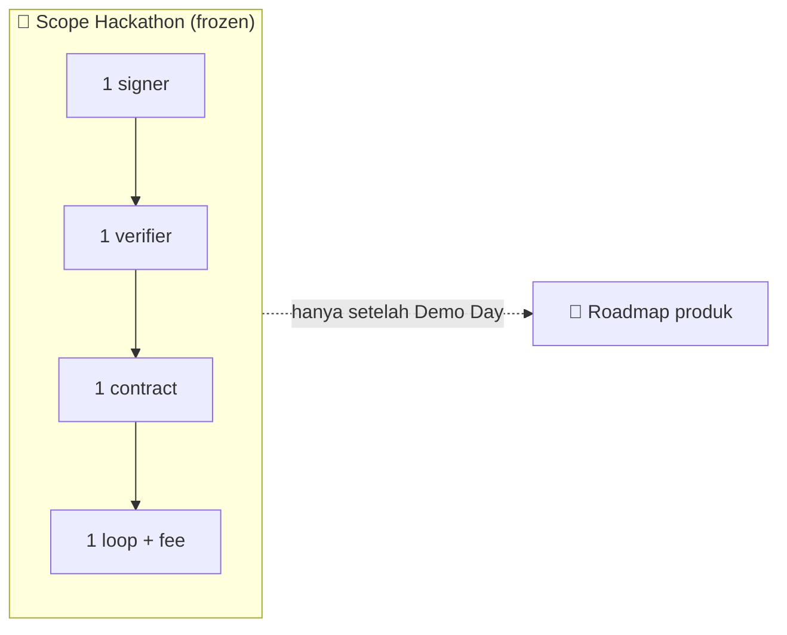
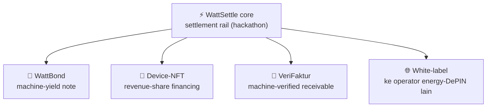
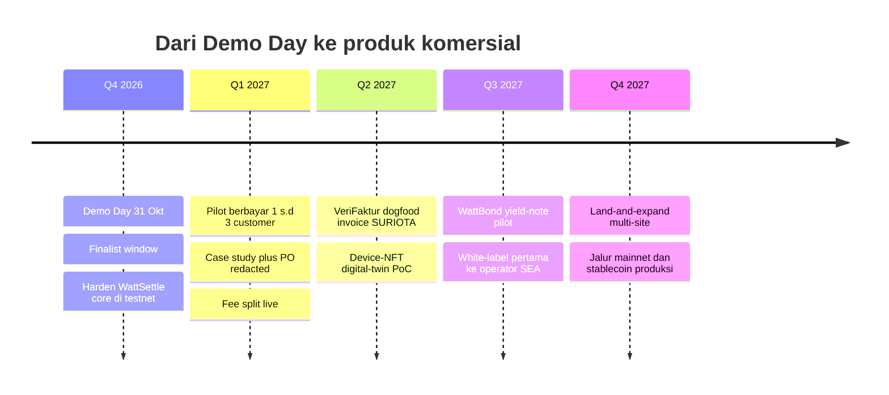

&nbsp;

&nbsp;

# 🔭 Roadmap Pasca-Hackathon

### Batas scope-freeze, lalu ke mana rel ini tumbuh setelah Demo Day

**Navigasi:** [Hub](README.md) · [Sebelumnya: 17 SWOT dan Kompetitor](<17 SWOT dan Kompetitor.md>) · [Berikutnya: 19 Referensi](<19 Referensi.md>)

---

## 💡 Prinsip Bab Ini

Roadmap yang baik dimulai dari sebuah garis yang jelas antara apa yang dikerjakan sekarang dan apa yang ditunda. Bagian pertama bab ini mengunci scope hackathon dengan tegas, karena over-scoping adalah kill-shot yang paling sering membunuh solo builder. Bagian kedua baru menceritakan produk pasca-hackathon, empat arah yang semuanya duduk di atas moat yang sama dan cocok dengan selera juri terhadap RWA.

> ⚠️ Semua yang ada di bagian roadmap adalah **stretch dan slide**, bukan scope demo. Menyeret satu pun item roadmap ke dalam critical path hackathon adalah pelanggaran disiplin Ponytail dan pintu masuk kill-shot demo self-brick.

---

## 🧊 Scope-Freeze Boundary Hackathon

Scope hackathon dibekukan pada permukaan sekecil mungkin di atas base yang sudah 6-test PASS. Berikut batas yang eksplisit.

| Di DALAM scope hackathon | Di LUAR scope hackathon |
|:--|:--|
| Satu signer device | Cross-chain apa pun |
| Satu verifier AI otonom (Hermes) | Self-deploy singleton ERC-8004 baru (pakai yang live) |
| Satu attestation contract (`WattSettle.sol`) | Hard-wire external x402 di critical path |
| Satu settlement loop deterministik | Staking, ZK proving, subgraph, deploy mainnet |
| Satu reputation counter on-chain | Multi-chain, multi-layer arsitektur ala PiggyCell |
| Fee split take-rate on-chain | Yield note, insurance pool, carbon accounting sebagai fitur |
| Integrasi ERC-8004 live sebagai act-2 | Investor retail, pool crowd, financing on critical path |

> 💡 Aturan praktis, kalau sebuah fitur menambah aktor kedua yang harus dijaga deterministik atau menambah accounting edge-case, ia otomatis roadmap, bukan hackathon. Itulah kenapa varian settlement-rail dipilih di atas varian yang lebih kaya.

---

## 🔭 Roadmap Produk Pasca-Hackathon

Empat arah di bawah menaikkan ceiling tanpa mengubah moat inti. Semuanya duduk di atas kombinasi lima hal langka yang sama, yaitu hardware nyata, domain OT, last mile trust, customer, dan timing regulasi.

### 🏦 WattBond, machine-yield note

Sebuah yield-note yang coupon-nya di-gate oleh kWh nyata yang di-settle. Ini narasi RWA terbaik karena underlying-nya adalah arus kas mesin yang terverifikasi on-chain, bukan janji. Sekaligus lift accounting terberat (share-accounting, coupon pro-rata), maka ia sengaja ditaruh off critical path dan hidup sebagai roadmap dengan ceiling tertinggi.

### 🧾 Device-NFT dan revenue-share financing

Terinspirasi model **Dominate-to-Earn** PiggyCell, yaitu Region NFT digital-twin per device dengan 70 persen revenue mengalir ke NFT holder berbasis revenue nyata, bukan inflasi token. Diterjemahkan ke konteks industrial, tiap gateway WattSettle bisa punya NFT digital-twin yang membagi settlement flow-nya ke pemodal. Ini cocok dengan selera juri pola OwnaFarm, yaitu membiayai aset produktif nyata, dan menjadi jalur pembiayaan RWA yang jelas.

### 📄 VeriFaktur, machine-verified receivable

Invoice financing yang tidak bisa bohong. Device SURIOTA menandatangani bukti commissioning EIP-712 sebagai syarat eligibility, underwriter AI komite Artha memutus advance-rate dinamis 60 sampai 85 persen secara legible on-chain, canonical field-hash mematikan double-financing, lalu waterfall settlement berjalan otomatis. Ini menjawab kolapsnya Investree dan TaniFund dari sisi asal data, bukan dari KYC yang lebih berat. VeriFaktur adalah kandidat cadangan terkuat sekaligus arah produk komersial paling nyata karena bisa mendogfood invoice B2B SURIOTA asli.

### 🌐 White-label ke operator energy-DePIN lain

Lisensikan kontrak plus verifier ke operator energy-DePIN SEA lain sebagai software B2B2X dengan CAC rendah. Rail yang sama, skin dan customer yang berbeda, tanpa perlu SURIOTA menaruh hardware sendiri di tiap site. Ini memperlebar TAM tanpa memperlebar beban operasional.

---

## 🗓️ Timeline Roadmap Indikatif

| Fase | Fokus | Sifat |
|:--|:--|:--|
| Q4 2026 | Harden core, tutup finalist window | Melanjutkan scope hackathon |
| Q1 2027 | Pilot berbayar, case study, fee live | Komersialisasi beachhead |
| Q2 2027 | VeriFaktur dogfood, device-NFT PoC | Ekspansi produk RWA |
| Q3 2027 | WattBond pilot, white-label pertama | Menaikkan ceiling |
| Q4 2027 | Multi-site, jalur mainnet | Skala dan produksi |

---

## 🎯 Tie ke Selera Juri (RWA)

Roadmap ini bukan hiasan slide, ia adalah sinyal langsung ke tesis yang para juri secara institusional sudah investasikan. Coinvestasi menjalankan akselerator Tokenize Indonesia bersama BRI Ventures, Pegadaian, dan MDI Telkom, dengan estimasi peluang sekitar 88 miliar dolar. Pemenang lokal seperti OwnaFarm (invoice tani ter-tokenisasi) dan zkPull (trustless auto-payout) mengkonfirmasi bahwa juri berpihak pada RWA plus real-world settlement Indonesia.

> 💡 Empat arah roadmap memetakan langsung ke tesis itu. WattBond dan VeriFaktur adalah machine-verified receivable yang paling rapat semantiknya, device-NFT adalah pembiayaan aset produktif nyata ala OwnaFarm, dan white-label adalah jalur skala rail yang sama. Ceritakan ini di slide penutup untuk menunjukkan bahwa hackathon hanya langkah pertama dari rel yang jauh lebih panjang.

---

## 🧭 Ringkasan Satu Layar

| Elemen | Isi |
|:--|:--|
| 🧊 Scope-freeze | 1 signer, 1 verifier, 1 contract, 1 loop, 1 counter, fee on-chain, integrasi ERC-8004 live |
| 🏦 WattBond | Machine-yield note, ceiling tertinggi, off critical path |
| 🧾 Device-NFT | Revenue-share financing ala Dominate-to-Earn PiggyCell |
| 📄 VeriFaktur | Machine-verified receivable, dogfood invoice SURIOTA |
| 🌐 White-label | Lisensi rail ke operator energy-DePIN SEA lain |
| 🎯 Tie juri | Semua arah memetakan ke tesis RWA Tokenize Indonesia |

---

© 2026 PT Surya Inovasi Prioritas (SURIOTA) · <a href="README.md">Hub WattSettle</a> · Update 7 Juli 2026

