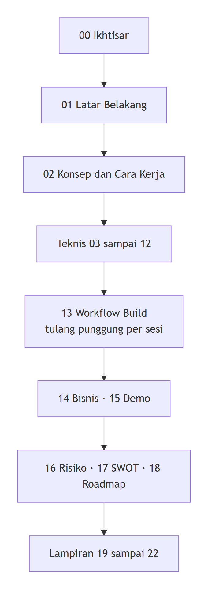

<div align="center">


&nbsp;

&nbsp;

&nbsp;


# ⚡ WattSettle Build Bible

### Dokumentasi tunggal dan mendalam untuk membangun WattSettle dari nol sampai Demo Day

**Builder:** Gifari Kemal Suryo, CEO PT Surya Inovasi Prioritas (SURIOTA)
**Event:** Indonesia Web3 Hackathon 2026 · Binance Academy × BNB Chain × Coinvestasi × Dev Web3 Jogja
**Demo Day:** 31 Oktober 2026

</div>

> 🧭 Ini rumah dokumentasi **aktif** untuk WattSettle. Seluruh dokumen strategi lama sudah dipindah ke [`../docs/Archive/`](../docs/Archive/). Bahasa Indonesia untuk narasi, English untuk istilah teknis dan kode.

<div align="center">

</div>

---

## 🗺️ Peta Baca

<div align="center">

</div>

Pembaca baru mulai dari `00`. Saat membangun tiap sesi workshop, buka `13 Workflow Build` sebagai peta, lalu lompat ke bab teknis yang dirujuk.

---

## 📚 Daftar Isi (24 file)

| # | File | Isi ringkas |
|:--:|:--|:--|
| ⚡ | [`00 Ikhtisar`](<00 Ikhtisar.md>) | TL;DR, satu loop, keputusan kunci, status terkini |
| 📖 | [`01 Latar Belakang`](<01 Latar Belakang.md>) | Oracle problem energi, konteks hackathon, moat 5 hal, pasar dan regulasi |
| 💡 | [`02 Konsep dan Cara Kerja`](<02 Konsep dan Cara Kerja.md>) | Mental model, one loop data flow, kenapa meter adalah transaksi |
| 🏗️ | [`03 Arsitektur`](<03 Arsitektur.md>) | 3 layer, dependency, jalur opBNB |
| 🧰 | [`04 Setup Lingkungan`](<04 Setup Lingkungan.md>) | Foundry, wallet, faucet, first test |
| 🔌 | [`05 Device dan Firmware`](<05 Device dan Firmware.md>) | SRT-MGATE-1210, PM20H20Q, EIP-712 signing |
| 📄 | [`06 Kontrak WattSettle`](<06 Kontrak WattSettle.md>) | Evolve ProofOfWatt, Attestation, attestAndSettle |
| 🤖 | [`07 AI Verifier`](<07 AI Verifier.md>) | Hermes agent, indexing, API, integrasi ERC-8004 |
| 🏦 | [`08 Tokenomics`](<08 Tokenomics.md>) | suriota vs MockUSD, fee split, pre-fund |
| 🔐 | [`09 Keamanan`](<09 Keamanan.md>) | Threat model, replay guard, reentrancy, roles |
| 🚀 | [`10 Deployment dan On-chain Ops`](<10 Deployment dan On-chain Ops.md>) | Deploy testnet 97, verify, state on chain |
| 🧪 | [`11 Testing dan QA`](<11 Testing dan QA.md>) | TDD, test matrix, rehearsal loop |
| 🖥️ | [`12 Frontend dan dApp UI`](<12 Frontend dan dApp UI.md>) | BscScan sebagai UI, viewer tipis |
| 🗓️ | [`13 Workflow Build`](<13 Workflow Build.md>) | Playbook per sesi, gate hygiene |
| 🏢 | [`14 Bisnis dan GTM`](<14 Bisnis dan GTM.md>) | Revenue, after sales, GTM, use case Enovatek |
| 🎤 | [`15 Demo dan Pitch`](<15 Demo dan Pitch.md>) | Pitch arc, runbook, know your judges |
| ⚠️ | [`16 Risiko dan Kill-shots`](<16 Risiko dan Kill-shots.md>) | 6 kill shot, path to 90, probabilitas jujur |
| 📊 | [`17 SWOT dan Kompetitor`](<17 SWOT dan Kompetitor.md>) | SWOT, peta kompetitor, verdict |
| 🔭 | [`18 Roadmap Pasca-Hackathon`](<18 Roadmap Pasca-Hackathon.md>) | Scope freeze, roadmap produk |
| 📚 | [`19 Referensi`](<19 Referensi.md>) | PiggyCell, zkPull, OwnaFarm, ERC-8004, x402 |
| 🔤 | [`20 Glosarium`](<20 Glosarium.md>) | Istilah dan singkatan |
| ✅ | [`21 Checklist Submission`](<21 Checklist Submission.md>) | Tick list hard gate dengan bukti |
| 🧭 | [`22 Decision Log`](<22 Decision Log.md>) | Keputusan kunci dan alasan |

---

## 🎨 Style Guide (wajib diikuti semua file)

Panduan ini menjaga seluruh bab tampak satu keluarga dan render sempurna di GitHub.

### Palet warna (badge dan tema Mermaid)

| Nama | Hex | Makna |
|:--|:--|:--|
| Watt hijau | `22c55e` | energi, approve, status aktif |
| Flow cyan | `06b6d4` | data, aliran, informasi |
| BNB gold | `f0b90b` | chain, on-chain, BNB |
| Riset ungu | `a855f7` | analisa, referensi |
| Bahaya merah | `ef4444` | reject, peringatan, kill-shot |

### Peta emoji (satu tema satu emoji)

⚡ WattSettle · 🤖 AI verifier · 📄 kontrak · 🔌 device · 💸 settlement · 🚫 reject · 🏦 tokenomics · 🔐 keamanan · 🚀 deploy · 🧪 testing · 🖥️ frontend · 🗓️ workflow · 🏢 bisnis · 🎤 pitch · ⚠️ risiko · 📊 SWOT · 🔭 roadmap · 📚 referensi · 🔤 glosarium · ✅ checklist · 🧭 decision.

### Aturan karakter (penting)

Di **prosa**, dilarang memakai em-dash, en-dash, serta hyphen atau underscore sebagai pemisah antar kalimat. Gunakan koma, titik, atau kata sambung seperti "sampai" dan "hingga". Di **kode, path, URL, dan identifier** (`attestAndSettle`, `ERC-8004`, `SafeERC20`, `forge verify-contract`, `chainId 97`), karakter `-` dan `_` tetap dipakai apa adanya karena itu sintaks yang benar.

### Elemen visual yang dipakai

Badge shields.io `for-the-badge`, Mermaid untuk flow, tabel untuk perbandingan, blockquote callout untuk catatan (`> 💡`) dan peringatan (`> ⚠️`), `<details>` untuk lipatan, **bold** untuk istilah kunci, `code` untuk identifier. Aset gambar disimpan di [`assets/`](assets/) dan dirujuk dengan path relatif.

### Template banner, nav, footer

Banner (ganti judul dan badge sesuai bab):

```html
<div align="center">


&nbsp;


# ⚡ Judul Bab

### Subjudul singkat

</div>
```

Nav (di bawah banner):

```markdown
**Navigasi:** [Hub](README.md) · [Sebelumnya](<file sebelumnya.md>) · [Berikutnya](<file berikutnya.md>)
```

Footer (akhir file):

```html
<div align="center">
<sub>© 2026 PT Surya Inovasi Prioritas (SURIOTA) · <a href="README.md">Hub WattSettle</a> · Update 7 Juli 2026</sub>
</div>
```

---

## ✅ Validasi

Jalankan dari root workspace:

```bash
node scripts/docs-check.mjs
```

Cek: prosa bebas em-dash dan en-dash, semua link internal valid, blok Mermaid tidak kosong.

---

<div align="center">
<sub>© 2026 PT Surya Inovasi Prioritas (SURIOTA) · Hub WattSettle Build Bible · Update 7 Juli 2026</sub>
</div>
