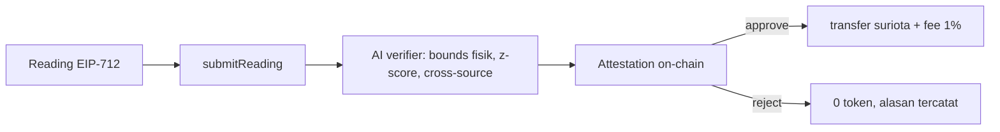

<svg width="100%" height="12" viewBox="0 0 1200 12" preserveAspectRatio="none" xmlns="http://www.w3.org/2000/svg" role="img" aria-label="accent">
  <defs><linearGradient id="msbar" x1="0" y1="0" x2="1" y2="0">
    <stop offset="0" stop-color="#22c55e"/><stop offset="0.5" stop-color="#06b6d4"/><stop offset="1" stop-color="#f59e0b"/>
    <animate attributeName="x1" values="0;0.5;0" dur="6s" repeatCount="indefinite"/>
  </linearGradient></defs>
  <rect width="1200" height="12" rx="6" fill="url(#msbar)"/>
</svg>

# 🧭 Master Strategi

### Peta seluruh opsi project · Indonesia Web3 Hackathon 2026

**Builder:** Gifari Kemal Suryo, PT Surya Inovasi Prioritas (SURIOTA)
**Track:** Finance & Commerce (default) · **Deploy:** BNB Smart Chain Testnet (chainId 97) · **Demo Day:** 31 Oktober 2026

> 📄 Dokumen ini adalah index master. Detail penuh ada di file per opsi. Update terakhir: 7 Juli 2026.

---

## 0. 🚀 Ringkasan Eksekutif

| # | Nama | Track | Skor | Nominasi | Juara 1 | Status |
|:--:|:--|:--|:--:|:--:|:--:|:--|
| **5** | **WattSettle** (rel M2M energy settlement) | Finance & Commerce | **90** | 84% s.d 90% | 45% s.d 58% | ⭐ Visi platform |
| **6** | **WattSettle × Enovatek / PM20H20Q** | Finance & Commerce | ~90 | sda | sda | ⭐ Mesin demo |
| 7.5 | AgentCart TrustPay (challenger codex) | Finance & Commerce | 92.5 | tinggi | belum | 🔬 kandidat pivot |
| 1 | ProofOfWatt (DePIN energy oracle) | AI Agents | 74.5 | 80% s.d 86% | 38% s.d 48% | 🗄️ arsip, base siap |
| 4 | Karmakhet (ERC-8004 validation) | AI Agents | 58 | 40% s.d 50% | 15% s.d 24% | 🗄️ arsip |
| 3 | ProofOfAlpha (proof of alpha oracle) | Finance & Commerce | 54 | 35% s.d 45% | 12% s.d 20% | 🗄️ arsip |
| 2 | JanjiChain (AI arbiter escrow) | Consumer / AI | 48 | 25% s.d 35% | 8% s.d 15% | 🗄️ arsip |

**Keputusan final:** bangun **Opsi 6 (Enovatek / PM20H20Q) sebagai mesin demo** (satu kasus konkret, deterministik, live) dan pitch **Opsi 5 (WattSettle) sebagai visi platform** (bisa ke solar, EV, CBAM, P2P). Track **Finance & Commerce**. Tagline: **"zkPull untuk energi fisik."**

> 💡 *"Di panggung: satu keran jalan sempurna (Enovatek). Di slide: pipa ke semua pasar (WattSettle)."*

<b>Opsi 9 sampai 13 (deep research 17 agen, 7 Jul 2026)</b>

Kandidat Finance & Commerce baru di luar 1 sampai 6. Skor red team (WattSettle=90):

| Opsi | Skor | Ringkas |
|:--|:--:|:--|
| VeriFaktur | 79 naik ~85 | invoice financing device-attested + underwriter Artha, pandora box "machine verified receivable" |
| TuntasCOD | 79.5 | settlement oracle retur COD, demo teatrikal, tetapi reskin WattSettle |
| Talangan | 71.5 | zkTLS payout factoring seller, moat lunak |
| Faktur402 | 64.5 | tax split e-Faktur di atas x402 BSC |
| Mandat | 63 | AP2 terbuka + AI CFO |

**Kesimpulan:** tak ada yang mengalahkan WattSettle apa adanya (meter = settlement, semantik rapat). VeriFaktur = cadangan terkuat dan arah produk komersial pasca hackathon. Detail: [`Archive/Opsi 9 sampai 13 Finance Commerce.md`](<Archive/Opsi 9 sampai 13 Finance Commerce.md>).

---

## 1. 🔍 Konteks Hackathon

- **Format:** lanjutan Web3 University Tour 2026. Tema AI × Web3. Hadiah USD 5.000, **3 track**, kemungkinan **1 pemenang per track**. Online, field mayoritas pemula (banyak fork chatbot dan template).
- **Track:** AI Agents · Finance & Commerce · Consumer Apps.
- **Kurikulum 9 sesi:** token, Solidity, Foundry + Bounty Board, security, indexing, API + AI auto verify, dApp UI, AI integration, Demo Day.
- **Juri:** mentor Dev Web3 Jogja (SWE elit) plus kemungkinan rep BNB, Binance, Coinvestasi.
- **Selera juri (bukti):** OwnaFarm (invoice financing RWA) juara, zkPull (real world event, verifikasi, auto release) juara 2 Mantle. Condong ke Finance, RWA, settlement.

---

## 2. ⭐ Opsi Unggulan

### OPSI 5, WattSettle (rel M2M Energy Settlement)

**Konsep:** rel pembayaran plus wasit AI untuk **energi terverifikasi**. Device tanda tangani kWh, AI verifier otonom cek keabsahan dan tulis **alasan keputusannya on-chain** (attestation), kontrak auto settle token, fee protokol.

**Moat (5 hal langka sekaligus):** hardware nyata · domain energi OT · penyelesaian last mile trust · customer dan distribusi · timing regulasi (CBAM dan OJK live Jan 2026).
**8 skenario:** solar ke pabrik REC · eksportir CBAM · P2P microgrid · EV charging · HVAC (Opsi 6) · ESCO performance · MRV karbon · diesel displacement.
📄 Detail: [`02 Opsi 5 WattSettle.md`](<02 Opsi 5 WattSettle.md>).

### OPSI 6, WattSettle × Enovatek / PM20H20Q (produk nyata)

**Konsep:** Opsi 5 dipasang di produk nyata. **PM20H20Q** = DC meter untuk Hybrid HVAC. **PT Enovatek Energy** menyewakan AC (Cooling as a Service), dimonitor via PM20H20Q. Penyewa auto bayar per pakai on-chain, protokol dan Enovatek ambil fee.
📄 Detail: [`03 Opsi 6 Enovatek.md`](<03 Opsi 6 Enovatek.md>).

---

## 3. 🗄️ Opsi Arsip

Sudah divalidasi, kalah skor, disimpan sebagai referensi. Semua di [`Archive/`](Archive/).

| Opsi | Track | Skor | Kenapa diarsip |
|:--|:--|:--:|:--|
| 1 ProofOfWatt | AI Agents | 74.5 | kuat, tetapi track ramai dan tanpa attestation on-chain. Base contract sudah lulus 6 test |
| 4 Karmakhet | AI Agents | 58 | dependency ERC-8004 dan platform eksternal berisiko |
| 3 ProofOfAlpha | Finance & Commerce | 54 | clonable, ERC-8004 singleton, near clone ada |
| 2 JanjiChain | Consumer / AI | 48 | mekanisme tidak novel, demo rapuh |

---

## 4. 🎯 Blackbox, 3 Lever ke Nominasi (fully controllable)

1. 🎪 **Track arbitrage.** Submit ke track paling sepi (Finance & Commerce, bukan AI Agents yang ramai). Cek densitas registrasi akhir September via kontak Dev Web3 Jogja.
2. 🏭 **Moat nyata di 15 detik pertama.** Satu satunya PT dengan hardware plus revenue nyata. Tampilkan klip lapangan (SRT-MGATE, PM20H20Q) plus invoice atau PO redacted.
3. 🤖 **AI autonomy legible on-chain.** Tulis rationale AI ke chain, dan **integrate** (bukan mirror) registry ERC-8004 atau BEP-620 BNB yang live di BSC testnet sejak 4 Feb 2026.

> ⚠️ **Koreksi fatal:** jangan pitch "self contained mirror of ERC-8004". Juri BNB tahu registry-nya live, jadi wajib integrate yang asli.

---

## 5. ✅ Path to 90 (checklist menang)

- [ ] Integrate live ERC-8004 registry (jangan mirror).
- [ ] Demo pakai **1 signature hardware asli** (SRT-MGATE atau PM20H20Q lapangan) sebagai seed.
- [ ] Tunjukkan **reject plus approve** (AI tolak anomali live), bukan approve saja.
- [ ] Tutup semua hard gate: commit harian ke repo public, verify contract di BscScan, minimal 2 tx on-chain, README, roadmap, video, tweet tag @BNBChain @BinanceAcademy @coinvestasi @devweb3jogja.
- [ ] Validasi track pakai data registrasi nyata.
- [ ] Taruh **fee split on-chain** (substansi Finance).
- [ ] Demo deterministik: pre-seed state, pre-fund reward pool, fallback RPC plus video rekaman, rehearse minimal 5 kali di real testnet.

---

## 6. 🏆 Referensi Pemenang (amunisi pitch)

- **zkPull** (juara Mantle 2025): PR GitHub merged, zkTLS verify, EigenLayer AVS enforce, auto payout, fee success based 5%. **Struktur persis WattSettle**, tagline *"WattSettle = zkPull untuk energi fisik."*
- **OwnaFarm** (juara RWA invoice financing): invoice tani jadi "benih" game. Founder dari UKDW Blockchain Club Yogyakarta (satu ekosistem Dev Web3 Jogja). Menang dengan **satu kasus konkret plus visi besar**, pola yang kita tiru tetapi satu level di atas (kita punya hardware dan revenue nyata).

---

## 7. 🔮 Kenapa Future Proof

BNB 2026 mendorong **Stablecoins + RWA + Agentic Finance** plus native ERC-8004 (BEP-620) dan x402. WattSettle memukul ketiganya: RWA (kWh nyata di-tokenisasi), Agentic Finance (AI verifier otonom), settlement (auto pay). Regulasi Indonesia (OJK ambil alih crypto Jan 2026, CBAM live Jan 2026) menjadikan "energi nyata terverifikasi on-chain oleh perusahaan berizin" persis arah Web3 matang yang regulator dan BNB mau.

---

Kembali ke <a href="../README.md">hub</a> · Index dokumen <a href="README.md">docs</a>

