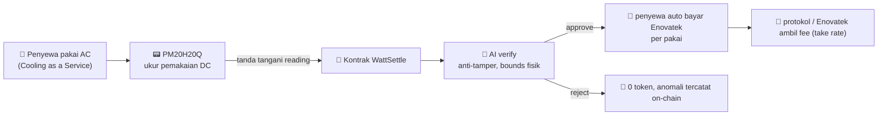
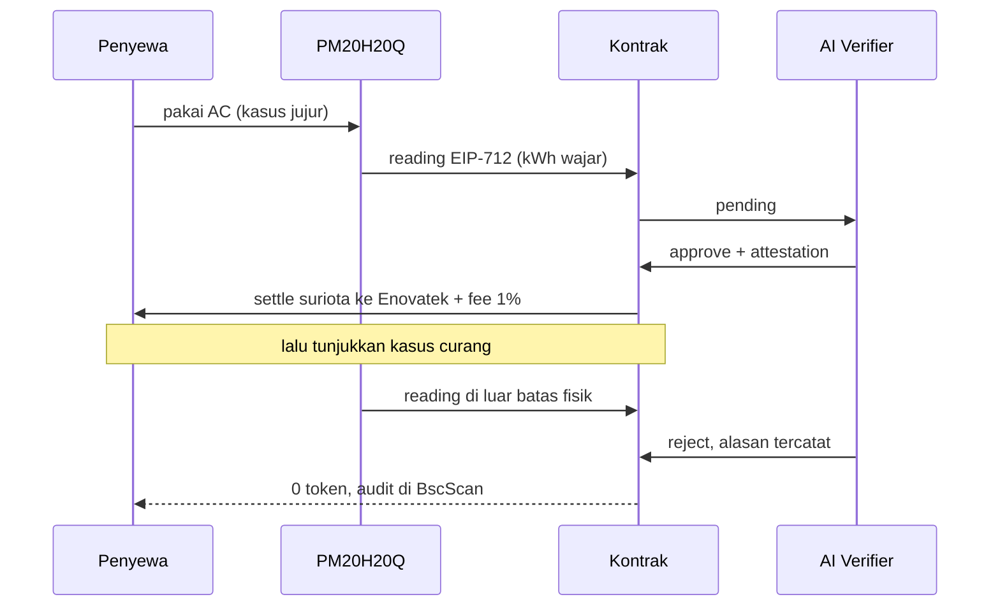

<svg width="100%" height="12" viewBox="0 0 1200 12" preserveAspectRatio="none" xmlns="http://www.w3.org/2000/svg" role="img" aria-label="accent">
  <defs><linearGradient id="e6bar" x1="0" y1="0" x2="1" y2="0">
    <stop offset="0" stop-color="#06b6d4"/><stop offset="1" stop-color="#0ea5e9"/>
    <animate attributeName="x2" values="1;1.6;1" dur="4s" repeatCount="indefinite"/>
  </linearGradient></defs>
  <rect width="1200" height="12" rx="6" fill="url(#e6bar)"/>
</svg>

# 🌬️ Opsi 6, WattSettle × Enovatek / PM20H20Q

### Mesin demo: Cooling as a Service dengan settlement on-chain

**Track:** Finance & Commerce · **Peran:** mesin demo konkret (Opsi 5 dipasang di produk nyata)

> 🧭 **Ringkas:** Opsi 5 (WattSettle) adalah rel generik. Opsi 6 memasangnya di **satu produk nyata** milik mitra PT Enovatek Energy, sehingga demo punya perusahaan, produk, dan revenue yang benar benar ada. Ini menutup skeptisisme juri dalam 15 detik pertama.

---

## 1. 🎬 Kenapa Opsi 6 Jadi Panggung

| Kekuatan | Dampak ke juri |
|:--|:--|
| 🏢 Perusahaan nyata (PT Enovatek Energy) | bukan startup imajiner |
| 🔧 Produk nyata (DC meter PM20H20Q) | hardware yang bisa ditunjuk |
| 💳 Pembayar jelas (penyewa AC) | bukan "bayangkan sebuah PLTS" |
| 🔁 Revenue recurring (billing per pakai) | model bisnis sudah jalan |
| 🛎️ After sales sudah ada (model rental) | pertanyaan sustainability terjawab |

> 💡 Opsi 5 kuat di slide (visi TAM besar), Opsi 6 kuat di panggung (bukti konkret). Gabungan keduanya = moat yang tak tertiru.

---

## 2. 🧩 Cara Kerja

**Dua aliran nilai:**

1. 💰 **Billing pemakaian** (revenue utama, per kWh terukur).
2. 🌱 **Carbon, REC, ESG, CBAM** (upside dari data terverifikasi).

> ⚙️ **Catatan produksi:** billing nyata memakai **stablecoin** (bukan token volatil). Demo hackathon memakai `suriota`. Siapkan jawaban konsistensi ini untuk juri.

---

## 3. 🏭 Profil Mitra: PT Enovatek Energy

Sumber: enovatekenergy.com (diverifikasi 7 Jul 2026 via argus).

| Lini produk | Keterangan |
|:--|:--|
| ☀️ Solar | aktivasi atap kosong jadi pembangkit bersih tanpa investasi awal |
| 🌬️ Wind turbine | turbin angin kecil untuk microgeneration |
| 💡 LED lights | hemat hingga 80% energi dibanding lampu konvensional |
| 🧊 Hybrid HVAC + PM20H20Q | DC meter untuk model rental AC (fokus demo Opsi 6) |

> 🔎 **Grounding jujur:** homepage Enovatek menonjolkan solar, wind, dan LED. Detail produk **PM20H20Q** dan angka model rental berasal dari pengetahuan internal SURIOTA dan **belum tervalidasi publik**. Lihat item wajib di bawah.

---

## 4. ⚠️ Yang Wajib Ditutup

- [ ] 📐 Riset dalam **spec PM20H20Q** (rentang ukur, akurasi, protokol) supaya angka demo tidak mengada ada.
- [ ] 🧮 Riset **model take rate dan tarif rental** Enovatek yang realistis.
- [ ] 🤝 Konfirmasi **komitmen partnership** Enovatek (di luar kendali penuh SURIOTA, ini konsentrasi 1 partner).
- [ ] 🧾 Siapkan **PO atau invoice redacted** sebagai collateral pitch.

---

## 5. 🎤 Demo Golden Path (sub 3 menit)

Tunjukkan **reject dulu, lalu approve** supaya AI terlihat benar benar memutuskan, bukan rubber stamp.

---

## 6. 🔗 Relasi dengan Opsi Lain

| Dokumen | Hubungan |
|:--|:--|
| [`02 Opsi 5 WattSettle.md`](<02 Opsi 5 WattSettle.md>) | rel generik yang di-vertikalkan di sini |
| [`04 SWOT Opsi 5 6.md`](<04 SWOT Opsi 5 6.md>) | SWOT dan peta kompetitor kedua opsi |
| [`01 Master Strategi.md`](<01 Master Strategi.md>) | posisi Opsi 6 di papan skor keseluruhan |

---

Kembali ke <a href="../README.md">hub</a> · Index <a href="README.md">docs</a> · Update 7 Juli 2026

