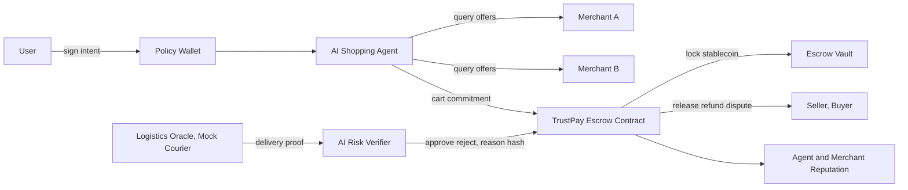

<div align="center">


</div>

> 🔬 **Riset challenger (Codex).** Analisa agentic commerce di luar Opsi 1 sampai 6. Rekomendasi codex: **AgentCart TrustPay 92.5**, tetapi WattSettle tetap paling defensible. Kembali: [hub](../../README.md) · [docs](../README.md) · [deep analysis](<Deep Analysis.md>) · [source ledger](<Source Ledger.md>) · [scoring matrix](<Scoring Matrix.csv>).

---

# Bismillah, Deep Analysis Opsi 7 dan 8

Indonesia Web3 Hackathon 2026, Track Finance & Commerce  
Tanggal riset: 7 Juli 2026  
Tujuan: mencari ide di luar opsi 1 sampai 6 yang masih di finance dan ecommerce, punya peluang mengalahkan opsi 5/6, dan layak dibangun end-to-end untuk grand prize.

---

## 1. Executive Verdict

Hasil riset menunjukkan "pandora box" terbesar di Finance & Commerce 2026 bukan sekadar stablecoin checkout, invoice NFT, atau escrow. Blackbox yang belum banyak diselesaikan adalah:

> **liability layer untuk agentic commerce:** bagaimana membuktikan user benar-benar mengizinkan AI agent membeli sesuatu, merchant benar-benar memenuhi pesanan, dan uang bisa settle/refund/dispute secara otomatis dengan audit trail on-chain.

Ini adalah gap antara AP2/x402/agent wallet yang sedang hype dan problem ecommerce Indonesia yang masih sangat nyata: trust, COD risk, refund abuse, seller reputation, cross-border settlement, dan pembiayaan UMKM.

Rekomendasi terbaik:

| Rank | Opsi | Nama | Track | Skor | Verdict |
|---:|---|---|---|---:|---|
| 1 | 7.5 | **AgentCart TrustPay** | Finance & Commerce | **92.5** | Paling kuat sebagai challenger ke opsi 5/6. Gabungkan agentic checkout + escrow/refund + proof-of-delivery. |
| 2 | 5/6 | WattSettle x Enovatek | Finance & Commerce | 90.0 | Masih moat paling nyata karena hardware + partner + revenue. |
| 3 | 7 | AgentCart SafePay | Finance & Commerce | 89.5 | Hype tertinggi, demo paling futuristik, tapi defensibility lebih rendah. |
| 4 | 8 | TrustCart Escrow | Finance & Commerce | 86.5 | Pain paling mudah dipahami, tapi novelty lebih rendah jika tidak digabung agentic commerce. |

Keputusan pragmatis:

- Jika ingin **paling aman menang**: tetap bangun opsi 6 sebagai demo utama, tapi simpan opsi 7.5 sebagai narasi cadangan jika track/peserta ternyata ramai ide RWA energi.
- Jika ingin **all-in ke hype masa depan**: bangun opsi 7.5, bukan opsi 7 atau 8 murni. Opsi 7.5 punya narasi "AI x Web3 x ecommerce Indonesia" yang lebih mudah viral dan lebih dekat ke arah BNB Chain 2026.
- Opsi 7 murni terlalu mudah dikloning sebagai "AI shopping wallet".
- Opsi 8 murni terlalu mudah dianggap escrow biasa.
- Opsi 7.5 menjadi kuat karena ia menyelesaikan **intent, payment, fulfillment, refund, reputation, and after-sales** dalam satu loop transaksi.

---

## 2. Sinyal Riset Utama

### 2.1 Arah BNB Chain 2026

Sumber resmi BNB Chain menunjukkan arah yang sangat eksplisit:

- BNB Chain mendukung **ERC-8004 untuk agent identity**, **x402 untuk autonomous payments**, dan **ERC-8183 untuk trustless agent commerce**.
- BNBAgent SDK punya modul identity, commerce, payment, dan memory.
- BEP-620 mengarah ke identity, reputation, dan validation registry untuk agent.
- BNB Agent Studio membuat agent punya wallet, identity, task interface, dan self-funding loop.

Implikasi: ide yang hanya "AI memberi rekomendasi" kalah. Ide harus menunjukkan agent yang:

1. punya identity on-chain,
2. punya budget/spend policy,
3. membuat atau menerima tugas commerce,
4. membayar atau dibayar,
5. punya reputasi/validasi setelah transaksi.

### 2.2 Arah Pembayaran Global 2026

Sumber Google AP2, Coinbase x402, Mastercard, Visa, Deloitte, Stripe/Shopify/Circle menunjukkan pola yang sama:

- AI agent mulai bisa melakukan pembayaran atas nama user.
- Stablecoin menjadi rail natural untuk transaksi programmable, 24/7, kecil, dan cross-border.
- Masalah utama bukan lagi "bisa bayar atau tidak", tapi **authorization, authenticity, accountability, risk, refund, dispute, and compliance**.
- Deloitte memprediksi stablecoin-enabled US retail purchases dapat menembus lebih dari USD 200B pada 2030.
- Google AP2 memakai mandate sebagai bukti kriptografis instruksi user.
- x402 membuat API/konten/service dapat meminta pembayaran stablecoin langsung via HTTP 402.

Implikasi: proyek grand-prize harus bicara tentang **trust layer untuk autonomous commerce**, bukan hanya checkout.

### 2.3 Arah Pasar Indonesia

Data pasar ecommerce Indonesia sangat mendukung opsi 7/8:

- Indonesia ecommerce diproyeksikan tumbuh dari USD 90.35B pada 2025 ke USD 104.21B pada 2026 dan USD 212.58B pada 2031.
- Smartphone memegang 69.40% transaksi ecommerce 2025.
- Digital wallets memimpin dengan 40.60% share, BNPL tumbuh paling cepat.
- COD masih sekitar 10% transaksi nasional dan return rate COD 2.5 sampai 3 kali prepaid order.
- Social commerce, live commerce, WhatsApp/Instagram commerce, dan tier-2/3 cities menjadi growth driver.
- Banyak bisnis ecommerce Indonesia adalah mikro dan kecil, sering tidak punya laporan keuangan formal.
- Financing UMKM menurun, sementara NPL UMKM naik. Ini membuat transaction reputation dan invoice/order history bernilai tinggi.

Implikasi: problem lokal yang bisa dibawa ke panggung adalah:

> "Indonesia bukan kekurangan checkout. Indonesia kekurangan trust untuk commerce yang makin cepat, sosial, mobile, dan agent-driven."

---

## 3. Pola Pemenang Hackathon

Dari benchmark BNB, Mantle, ETHGlobal, Interledger, dan proyek seperti OwnaFarm/zkPull/Paybot:

1. **Demo jalan mengalahkan pitch besar.** Juri ingin melihat smart contract, tx hash, wallet, UI, dan failure handling.
2. **Real-world loop menang.** Ada uang masuk, aturan dieksekusi, bukti tercatat, dan hasil finansial keluar.
3. **AI harus bertindak.** AI yang hanya menjawab chat terlihat lemah. AI harus memutuskan, mengeksekusi, menolak, atau mengeskalasi.
4. **Partner/ecosystem fit penting.** Di BNB 2026, gunakan ERC-8004/x402/ERC-8183/BNBAgent SDK jika memungkinkan.
5. **RWA/payments/escrow tetap disukai.** Tapi harus dibungkus dengan novelty dan UX yang jelas.
6. **Problem yang mudah dipahami lebih cepat menang.** "Agent beli barang tapi uang aman sampai barang sampai" lebih cepat dimengerti daripada mekanisme DeFi abstrak.

---

## 4. Kandidat Ide Awal

| # | Kandidat | Konsep | Skor awal |
|---:|---|---|---:|
| 1 | AgentCart SafePay | Wallet policy untuk AI shopping agent: budget, merchant allowlist, intent mandate, receipt, refund rule. | 89.5 |
| 2 | TrustCart Escrow | Escrow ecommerce/social commerce: release setelah proof-of-delivery, dispute bond, seller reputation. | 86.5 |
| 3 | InvoiceMint | Tokenized invoice + early payout untuk UMKM/supplier. | 79.0 |
| 4 | ReturnBond | Bond kecil untuk mengurangi refund abuse/return fraud. | 77.0 |
| 5 | CreatorSplit Commerce | Live commerce checkout dengan split otomatis ke creator, supplier, platform, fulfillment. | 76.0 |
| 6 | MerchantRisk Passport | Reputasi seller lintas marketplace untuk credit/BNPL merchant. | 74.0 |
| 7 | LoyaltyMesh | Loyalty/cashback stablecoin-backed lintas merchant. | 71.0 |
| 8 | GroupBuy Vault | Escrow group-buy sampai minimum order quantity tercapai. | 70.0 |

Kandidat 1 dan 2 paling kuat. Namun versi paling kompetitif adalah menggabungkan keduanya menjadi **AgentCart TrustPay**.

---

## 5. Opsi 7, AgentCart SafePay

### One-liner

**AgentCart SafePay adalah policy wallet untuk AI shopping agent: user memberi intent dan batas belanja, agent memilih merchant, contract mengunci stablecoin, lalu settlement/refund hanya terjadi sesuai aturan yang bisa diaudit on-chain.**

### Masalah

Agentic commerce akan membuat AI agent membeli barang, API, tiket, subscription, atau service atas nama user. Tapi muncul masalah baru:

- Apakah user benar-benar mengizinkan pembelian ini?
- Apakah agent keluar dari budget atau kategori yang diizinkan?
- Bagaimana merchant tahu agent ini valid, bukan bot fraud?
- Bagaimana refund dilakukan jika barang salah atau tidak dikirim?
- Bagaimana after-sales dilacak setelah AI menyelesaikan checkout?

### Produk

AgentCart SafePay membuat "mandate" versi hackathon:

```text
IntentMandate {
  buyer,
  agentId,
  maxSpend,
  category,
  merchantAllowlist,
  deadline,
  refundPolicy,
  humanApprovalRequired,
  nonce,
  signature
}
```

Agent lalu:

1. mencari produk dari 2-3 mock merchant,
2. memilih cart yang memenuhi policy,
3. membuat CartCommitment,
4. mengunci stablecoin/test token di contract,
5. merchant menerima payment authorization,
6. receipt dan policy compliance tercatat,
7. refund dapat dilakukan jika condition gagal.

### Demo 3 menit

1. User mengetik: "Beli powerbank <= 250 ribu, official store, tiba <= 3 hari."
2. AI agent membandingkan Merchant A, B, C.
3. Agent mencoba checkout Merchant B, tapi ditolak karena seller risk tinggi.
4. Agent checkout Merchant A, contract lock stablecoin.
5. UI menampilkan tx hash, policy, cart hash, merchant, budget used.
6. Skenario kedua: agent mencoba pembelian di luar kategori. Contract menolak.
7. Skenario ketiga: merchant gagal fulfillment. Refund otomatis atau dispute dibuka.

### Kenapa kuat

- Sangat selaras dengan BNB: ERC-8004 identity, x402 payment, ERC-8183 commerce.
- Demo futuristik dan mudah dipahami.
- Bisa diposisikan sebagai "Visa/Google AP2 versi open Web3 untuk merchant Indonesia".
- Finance & Commerce jelas: spend control, escrow, settlement, refund, fee.
- Bisa punya revenue model dari merchant fee, agent fee, risk API, dan SaaS dashboard.

### Kelemahan

- Banyak perusahaan besar sedang membangun agentic payments. Harus fokus ke local commerce trust layer, bukan bersaing sebagai AP2 universal.
- Tanpa merchant nyata, bisa terlihat seperti simulasi.
- AI shopping demo rentan dianggap wrapper jika agent tidak benar-benar membuat keputusan dan tx.
- Perlu UX spend policy yang sangat jelas agar tidak terlihat berbahaya.

---

## 6. Opsi 8, TrustCart Escrow

### One-liner

**TrustCart Escrow adalah settlement engine untuk social commerce Indonesia: buyer membayar prepaid/stablecoin ke escrow, seller mendapat release setelah proof-of-delivery, dan AI risk engine menangani refund/dispute/reputation.**

### Masalah

Ecommerce Indonesia masih punya masalah trust:

- COD dipakai karena buyer tidak percaya seller.
- COD return rate jauh lebih tinggi dari prepaid.
- Social commerce lewat WhatsApp/Instagram/TikTok sering informal.
- Seller kecil sulit membangun reputasi lintas channel.
- Merchant menghadapi friendly fraud, return abuse, dan chargeback.
- Buyer takut transfer langsung karena risiko barang tidak dikirim.

### Produk

TrustCart mengubah transaksi social commerce menjadi flow:

1. seller membuat checkout link,
2. buyer membayar ke escrow,
3. seller mengirim barang,
4. delivery proof ditandatangani oleh logistics oracle/mock courier,
5. AI verifier mengecek anomaly: delivery time, address mismatch, duplicate tracking, seller risk, buyer risk,
6. contract release dana ke seller atau buka dispute,
7. reputasi seller/buyer diperbarui.

### Demo 3 menit

1. Seller membuat invoice/order link untuk barang.
2. Buyer membayar test stablecoin ke escrow.
3. Courier mock menandatangani proof-of-delivery.
4. AI verifier approve, dana release ke seller.
5. Skenario fraud: tracking duplicate atau delivered terlalu cepat. AI menolak, dispute dibuka.
6. UI menampilkan seller trust score dan order audit trail.

### Kenapa kuat

- Problem sangat lokal dan mudah dipahami.
- Finance & Commerce kuat: escrow, settlement, refund, risk fee, reputation.
- Cocok untuk WhatsApp/Instagram/TikTok seller, bukan hanya marketplace besar.
- Bisa dibuat dengan deterministic demo.
- Bisa punya after-sales jelas: dispute dashboard, seller scoring, merchant analytics.

### Kelemahan

- Escrow bukan ide baru.
- Tanpa agentic commerce, hype Web3 2026 kurang tinggi.
- Proof-of-delivery real-world membutuhkan integrasi logistik.
- Regulasi escrow/payment di produksi harus hati-hati.

---

## 7. Opsi 7.5, AgentCart TrustPay

### One-liner final

**AgentCart TrustPay adalah escrow dan refund layer untuk agentic ecommerce: AI agent boleh membeli atas nama user, tetapi setiap transaksi harus melewati on-chain intent, spend policy, merchant risk score, proof-of-delivery, dan programmable refund.**

Tagline:

> **"AP2/x402 untuk social commerce Indonesia, dengan escrow dan after-sales yang bisa diaudit."**

Alternatif tagline:

> **"A safe checkout rail for AI agents and human merchants."**

### Kenapa ini pandora box

Agentic commerce akan membuat pembelian makin cepat, tetapi trust problem pindah dari "apakah manusia klik buy?" menjadi:

- siapa yang memberi mandat?
- agent mana yang bertindak?
- merchant mana yang menerima?
- apa batas pembelian?
- apakah barang/jasa benar-benar terpenuhi?
- siapa bertanggung jawab saat salah beli, refund, atau fraud?

Payment rail besar seperti Visa/Mastercard/Google/Stripe bisa membangun ini untuk dunia enterprise. Celah hackathon Web3 adalah membuat versi open, composable, on-chain, dan cocok untuk merchant kecil Indonesia.

### Architecture



### Smart contract modules

1. `IntentRegistry`
   - stores signed intent hash,
   - validates buyer signature,
   - checks deadline, category, max spend, nonce.

2. `TrustPayEscrow`
   - creates order,
   - locks stablecoin/test token,
   - releases to seller after approval,
   - refunds buyer after failure,
   - supports partial refund/dispute status.

3. `MerchantReputation`
   - records completed orders,
   - stores delivery/rejection counts,
   - prevents self-review,
   - emits events for indexer.

4. `AgentPolicyGuard`
   - maps ERC-8004 agent ID or demo agent address to allowed actions,
   - verifies agent cannot exceed policy.

### Off-chain modules

1. AI shopping agent:
   - reads product offers,
   - chooses offer that satisfies policy,
   - produces rationale,
   - signs/submits cart.

2. AI risk verifier:
   - checks delivery proof,
   - detects duplicate tracking,
   - checks seller/buyer risk,
   - writes reason hash and decision on-chain.

3. Demo merchant simulator:
   - 3 merchants,
   - 5 products,
   - different risk scores,
   - deterministic logistics events.

4. UI:
   - buyer intent panel,
   - agent decision panel,
   - escrow timeline,
   - BscScan tx links,
   - approve/reject scenarios.

### Demo MVP

Must show 4 transactions:

1. `createIntent`: user signs budget/policy.
2. `createOrder`: agent picks valid merchant and locks payment.
3. `attestDelivery`: verifier approves valid delivery.
4. `settle`: seller receives funds and fee split goes to protocol.

Must also show 2 failure paths:

1. Agent tries to buy outside budget/category: rejected.
2. Merchant has invalid proof: refund or dispute.

### Why judges may love it

- It hits Finance & Commerce directly.
- It is current with BNB Chain's agent roadmap.
- It maps to Google AP2 and x402 without pretending to replace them.
- It solves Indonesian ecommerce trust, COD, and social commerce friction.
- It shows AI autonomy plus on-chain accountability.
- It has after-sales and revenue model.
- It is easier for audience to understand than energy settlement.

### Why it may lose to WattSettle

- No physical hardware moat unless you bring a real merchant/order.
- Incumbents are already circling agentic commerce.
- It may look like a mocked ecommerce demo if not polished.
- Energy settlement has stronger "this founder uniquely can build this" defensibility.

---

## 8. SWOT

### AgentCart TrustPay

| Strengths | Weaknesses |
|---|---|
| Extremely aligned with 2026 agentic commerce hype. | No hardware moat. |
| Strong Finance & Commerce loop: intent, escrow, payment, refund, fee. | Merchant/logistics integrations are mocked in hackathon. |
| Easy for judges to understand in 15 seconds. | Could be seen as escrow + AI wrapper if agent actions are weak. |
| BNB-native story: ERC-8004, x402, ERC-8183, stablecoin. | Compliance complexity for production escrow/payment. |
| Local market fit: social commerce, COD risk, MSME sellers. | Big payment networks can build similar layers for enterprise. |

| Opportunities | Threats |
|---|---|
| AI agents become shopping interface. | Protocol fragmentation: AP2, x402, MPP, card token rails. |
| Indonesian sellers need trust layer outside big marketplaces. | Marketplace incumbents may keep transactions closed. |
| Merchant risk score can become data asset. | Fraudsters may attack oracle/proof flow. |
| Expand to creator split, invoice finance, BNPL merchant risk. | Stablecoin regulation and consumer protection questions. |
| Can become B2B SaaS for merchant checkout links. | Juri may prefer real hardware/RWA moat from WattSettle. |

---

## 9. Scoring Matrix

Rubric: Innovation 12, Feasibility 15, Live demo 16, Real-world impact 12, BNB fit 12, Moat 10, Business/after-sales 10, Judge appeal 8, Distinctness 5.

| Opsi | Innovation | Feasibility | Demo | Impact | BNB fit | Moat | Business | Judge | Distinct | Total |
|---|---:|---:|---:|---:|---:|---:|---:|---:|---:|---:|
| 7.5 AgentCart TrustPay | 11.5 | 13.0 | 15.0 | 11.0 | 12.0 | 8.0 | 9.0 | 8.0 | 5.0 | **92.5** |
| 5/6 WattSettle x Enovatek | 11.0 | 12.5 | 14.5 | 11.0 | 11.0 | 10.0 | 9.5 | 7.5 | 3.0 | **90.0** |
| 7 AgentCart SafePay | 11.5 | 13.5 | 15.0 | 10.0 | 12.0 | 6.5 | 8.0 | 8.0 | 5.0 | **89.5** |
| 8 TrustCart Escrow | 9.0 | 14.0 | 15.0 | 11.0 | 10.0 | 7.0 | 9.0 | 7.5 | 4.0 | **86.5** |
| 1 ProofOfWatt | 9.0 | 12.0 | 13.5 | 10.0 | 9.0 | 9.0 | 7.0 | 6.0 | 4.0 | 79.5 |
| 3 ProofOfAlpha | 7.0 | 10.0 | 10.0 | 7.0 | 8.0 | 5.0 | 6.0 | 5.0 | 3.0 | 61.0 |
| 2 JanjiChain | 6.0 | 11.0 | 9.0 | 8.0 | 7.0 | 4.0 | 5.0 | 5.0 | 2.0 | 57.0 |

Catatan: skor 7.5 bisa turun ke 85 jika demo hanya mock tanpa on-chain policy guard dan failure path. Skor bisa naik jika ada real merchant/seller lokal atau rekaman order WhatsApp/TikTok yang disimulasikan ulang.

---

## 10. Benchmark Kompetitor dan Prior Art

| Referensi | Apa yang mereka lakukan | Gap untuk AgentCart TrustPay |
|---|---|---|
| Google AP2 | Mandate untuk authorization/authenticity/accountability agent payments. | Enterprise protocol, bukan productized escrow untuk UMKM/social commerce Indonesia. |
| Coinbase x402 | Stablecoin payment via HTTP 402 untuk agent/API. | Fokus payment request, bukan fulfillment/refund/reputation. |
| Visa/Mastercard agentic commerce | Agent payments dengan card/stablecoin rails, risk, controls. | Closed network, enterprise-led. Hackathon bisa ambil open Web3 niche. |
| Shopify/Coinbase USDC checkout | Merchant stablecoin checkout. | Checkout saja, bukan AI buyer policy + proof-of-delivery escrow. |
| Circle Refund Protocol | Non-custodial dispute/refund primitives. | Bisa jadi inspirasi, tapi belum digabung ke local social commerce AI agent. |
| Trustap/marketplace escrow apps | Escrow untuk marketplace/C2C. | Biasanya Web2 closed escrow, bukan agent identity + on-chain audit trail. |
| OwnaFarm | Tokenized invoice with GameFi wrapper. | RWA financing, bukan checkout/refund/agent commerce. |
| WattSettle | Settlement energi berbasis physical proof. | Lebih kuat moat, tapi bukan consumer/ecommerce agentic trend. |

---

## 11. Business Model dan After-Sales

### Customer segments

1. Social commerce seller:
   - WhatsApp seller,
   - Instagram shop,
   - TikTok affiliate seller,
   - komunitas preorder.

2. Buyer:
   - buyer yang takut transfer langsung,
   - buyer yang ingin AI agent mencari deal.

3. Merchant/brand:
   - ingin menerima agent-led checkout,
   - ingin mengurangi refund abuse,
   - ingin checkout stablecoin/cross-border.

4. Agent builders:
   - perlu payment and trust layer untuk agent mereka.

### Revenue

| Stream | Model |
|---|---|
| Escrow fee | 0.5% sampai 1.5% per settled order. |
| Merchant SaaS | Dashboard seller risk, order analytics, dispute management. |
| Agent policy API | Charge per x402 request untuk validate policy/risk. |
| Reputation API | Paid lookup untuk merchant/agent trust score. |
| Premium dispute | Fee untuk advanced AI review/manual review partner. |
| Creator/live commerce split | Take-rate kecil dari automated split settlement. |

### After-sales

- Dispute dashboard.
- Refund management.
- Seller trust score growth.
- Buyer protection history.
- Export order receipts untuk accounting.
- Merchant onboarding template.
- API/webhook untuk logistics proof.

---

## 12. Skenario Masa Depan

### Skenario A: Agentic commerce meledak cepat

AgentCart TrustPay menjadi middleware untuk agent agar bisa membeli dari merchant kecil tanpa integrasi enterprise AP2.

Strategi: fokus ke agent identity, spend policy, and merchant risk API.

### Skenario B: Stablecoin checkout tumbuh, agentic commerce lambat

TrustPay tetap relevan sebagai escrow/refund layer untuk stablecoin merchant checkout.

Strategi: fokus ke seller link, escrow, proof-of-delivery, refund/dispute.

### Skenario C: Regulasi stablecoin/escrow ketat

Gunakan testnet untuk hackathon; produksi berubah menjadi non-custodial authorization/capture/refund workflow atau bekerja dengan licensed PSP.

Strategi: jangan klaim menjadi payment institution. Klaim sebagai protocol/proof layer.

### Skenario D: Marketplace menutup akses

Fokus ke long-tail sellers di WhatsApp/Instagram/brand-owned storefront, bukan mencoba masuk marketplace besar.

Strategi: checkout link + merchant dashboard.

---

## 13. Build Plan 4 Minggu

### Minggu 1, Contract core

- ERC20 test stablecoin or reuse `suriota` for test token.
- `IntentRegistry`.
- `TrustPayEscrow`.
- Basic tests: create intent, order, settle, refund, reject over-budget.

### Minggu 2, Agent and verifier

- AI shopping agent with deterministic merchant list.
- AI risk verifier with approve/reject rationale.
- Optional ERC-8004 identity reference if available.
- Emit on-chain reason hash and model/ruleset hash.

### Minggu 3, UI and demo polish

- Buyer screen: intent and spend limits.
- Agent screen: merchant comparison and rationale.
- Escrow timeline: locked, shipped, approved, settled/refunded.
- Seller screen: order status and reputation.
- BscScan/testnet tx links.

### Minggu 4, Hardening and pitch

- Deploy BSC testnet.
- Verify contracts.
- Record deterministic demo.
- Add failure path.
- Add README, architecture diagram, and 1-minute pitch.
- Prepare fallback video and seeded state.

---

## 14. QA and Risk Plan

Critical journeys:

1. Valid purchase:
   - intent signed,
   - agent selects valid merchant,
   - escrow locks,
   - delivery proof approved,
   - settlement succeeds.

2. Over-budget purchase:
   - agent attempts invalid cart,
   - contract rejects,
   - no funds move.

3. Invalid merchant:
   - merchant not allowlisted or high risk,
   - order rejected.

4. Failed delivery:
   - invalid proof,
   - refund or dispute opens.

5. Replay attack:
   - same intent/order nonce reused,
   - contract rejects.

6. Unauthorized verifier:
   - random address tries to approve delivery,
   - contract rejects.

Must-pass tests:

- `testCreateIntentWithValidSignature`
- `testRejectExpiredIntent`
- `testRejectOverBudgetCart`
- `testLockPaymentOnValidOrder`
- `testSettleOnlyAfterApprovedDelivery`
- `testRefundOnRejectedDelivery`
- `testRejectReplayNonce`
- `testOnlyVerifierCanAttest`
- `testFeeSplitToTreasury`
- `testReputationUpdatesAfterSettlement`

Demo risks:

| Risk | Mitigation |
|---|---|
| RPC/testnet fails | Use pre-recorded tx plus fallback RPC. |
| AI output non-deterministic | Use deterministic rules with AI explanation, not free-form deciding critical values. |
| Juri asks compliance | Say production uses licensed PSP/escrow partner; hackathon demonstrates non-custodial protocol layer. |
| Juri asks why blockchain | Intent, escrow state, settlement, refund, and reputation are shared across agents/merchants without one marketplace owning trust. |
| Juri says escrow is old | Answer: escrow is old, but AI-agent authorization + spend policy + proof-of-delivery + on-chain agent reputation is the new layer. |

---

## 15. Pitch Skeleton

Opening 15 seconds:

> "Hari ini AI agent bisa belanja untuk kita. Tapi kalau agent salah beli, merchant bohong, atau barang tidak sampai, siapa yang bertanggung jawab? AgentCart TrustPay membuat setiap pembelian AI punya mandat, batas belanja, escrow, proof-of-delivery, dan refund yang bisa diaudit on-chain."

Demo narrative:

1. User memberi mandat: powerbank di bawah 250 ribu.
2. Agent mencari merchant dan menolak seller berisiko.
3. Agent checkout, stablecoin masuk escrow.
4. Courier proof masuk, AI verifier approve.
5. Contract release dana ke seller dan fee ke treasury.
6. Failure demo: agent coba beli 400 ribu, contract reject.

Closing:

> "Ini bukan marketplace baru. Ini trust and settlement layer untuk agentic commerce. BNB Chain sudah punya agent identity, x402 payments, dan trustless commerce primitive. Kami menghubungkannya ke masalah nyata ecommerce Indonesia: trust, COD risk, refund, dan after-sales."

---

## 16. Final Recommendation

Jika objektifnya menemukan opsi 7/8 yang benar-benar bisa mengalahkan 1 sampai 6, pilihan terbaik adalah:

> **Opsi 7.5, AgentCart TrustPay**

Build ini jika ingin bertaruh pada hype 2026 dan relevansi BNB Chain. Namun jangan membuang opsi 6. Opsi 6 tetap paling defensible karena hardware dan partner nyata. Strategi paling tajam adalah:

1. Pertahankan WattSettle x Enovatek sebagai baseline juara.
2. Validasi densitas track dan selera mentor dalam 1-2 sesi berikutnya.
3. Jika banyak peserta masuk RWA/energy/oracle, pivot ke AgentCart TrustPay.
4. Jika banyak peserta membuat chatbot/AI agent generic, WattSettle tetap unggul.
5. Jika ingin pitch paling modern, framing gabungan bisa menjadi:

> "SURIOTA membangun settlement untuk real-world commerce: WattSettle untuk energi fisik, AgentCart TrustPay untuk agentic ecommerce."

Tapi untuk submission hackathon, tetap pilih satu agar demo tidak pecah.

