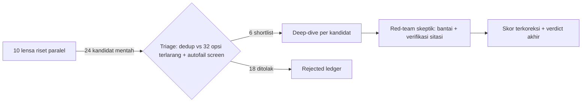

# Opsi 26 sampai 31: Beyond SURIOTA (Non-Government)

> [!NOTE]
> Riset 11-12 Juli 2026. Mandat: temukan kandidat entri BARU untuk Indonesia Web3 Hackathon 2026 yang (1) bukan turunan 32 opsi terdahulu, (2) non-government, (3) moat tidak bergantung aset SURIOTA (hardware SRT-MGATE, domain energi, Hermes/Artha), (4) lolos screen kill-shot (oracle-gap, AI-theater, trusted-single-wallet, mocking-heavy, solo-buildable sebelum 30 Sep, non-judi), (5) setiap klaim ber-URL nyata (argus), (6) skor dikalibrasi jujur vs WattSettle = 90.

## Metodologi

Pipeline 24 agen: 10 lensa riset paralel dengan grounding web nyata, triage kejam terhadap daftar terlarang, deep-dive per kandidat, lalu red-team skeptik independen yang memverifikasi sitasi dan mengoreksi skor.

Hasil Diverge: 24 kandidat mentah dari 10 lensa (BNB frontier, meta pemenang hackathon, DeFi x AI, consumer Indonesia, RWA non-energi, data economy, zk/privacy, machine economy, information markets, timing Q3-Q4 2026, wildcard).

## Ringkasan Eksekutif

| Opsi | Nama | Track | Skor deep-dive | Koreksi red-team | Skor akhir | Prob. juara 1 (terkoreksi) | Verdict akhir |
|:--:|:--|:--|:--:|:--:|:--:|:--|:--|
| 26 | **Nafkah** | Finance & Commerce (alternatif: AI Agents) | 79 | -5 | **74** | ~25-35% | Tetap layak jadi entri-utama bersyarat, tapi skor jujur 74 |
| 27 | **Karcis (merge Sitasi)** | AI Agents | 79 | -5 | **74** | 25-35% | Skor jujur 74 |
| 28 | **SafarVault (merge Berangkat!)** | Finance & Commerce | 78 | -6 | **72** | 30-40% pra-koreksi | cadangan-bersyarat |
| 29 | **KasKaca** | Finance & Commerce | 78 | -8 | **70** | 30-40% | cadangan-bersyarat, skor jujur 70 |
| 30 | **Jaring (Rescue-Intent Market)** | AI Agents (fallback: Finance & Commerce) | 76 | -6 | **70** | 22-30% pra-koreksi, lebih rendah pasca red-team | cadangan-biasa |
| 31 | **HafalanVault** | Consumer Apps | 74 | -6 | **68** | 30-40% pra-koreksi, tertahan fatwa MUI | cadangan-lemah |

> [!IMPORTANT]
> **Kesimpulan jujur:** tidak ada kandidat baru yang menembus benchmark WattSettle = 90. Dua teratas (Karcis 74, Nafkah 74) mengalahkan rekor ortogonal sebelumnya (Verum Arena 72), tetapi semuanya software-only dengan moat 52-68. Red-team memotong 5-8 poin dari SEMUA deep-dive karena prior art yang terlewat dan lubang mekanisme. Bila entri harus non-SURIOTA, Karcis adalah pilihan teratas DENGAN syarat redesain; bila tidak, WattSettle tetap entri terkuat.

---

## Opsi 26: Nafkah

**Track:** Finance & Commerce (alternatif: AI Agents)

> Credit line untuk AI agent di BSC: pinjaman dicairkan dari vault, ditagih otomatis lewat RevenueRouter yang memotong senior share dari setiap pemasukan x402 si agent, dan disetujui/ditolak oleh AI underwriter yang mengaudit graf penerimaan on-chain untuk mendeteksi wash income.

### Skor

Deep-dive **79** + koreksi red-team **-5** = **skor akhir 74** (kalibrasi WattSettle = 90, Verum Arena = 72).

| Novelty | Moat | Demo | BNB fit | Selera juri | Substansi AI | Substansi on-chain |
|:--:|:--:|:--:|:--:|:--:|:--:|:--:|
| 76 | 68 | 86 | 88 | 70 | 78 | 88 |

**Probabilitas juara 1 (deep-dive):** 30-40% juara 1 track Finance & Commerce (naik ke ~45% bila jembatan cerita agent-UMKM dieksekusi bagus dan demo head-to-head sybil berjalan mulus live)

**Verdict deep-dive:** entri-utama (bersyarat). Alasan: satu-satunya kandidat yang lolos SEMUA autofail kill-shot by construction (nol oracle-gap, nol mock, AI outcome-changing yang bisa dibuktikan head-to-head, buildable solo dengan margin), infra kuncinya terverifikasi live di BSC Testnet dari docs resmi Binance, dan fit narasi BNB 2026 sangat tinggi. Skor jujur 79 - di bawah WattSettle 90 karena moat hanya timing + desain (software-only, forkable), dan verifikasi menemukan prior art lebih padat dari klaim (Fund402, AgentCredit) sehingga klaim first-mover WAJIB dipersempit jadi 'income-side credit dengan senior-claim di endpoint penerimaan + underwriting graf, pertama di BNB'. Tiga syarat sebelum lock-in: (1) tabel perbandingan prior art proaktif di README + slide, (2) jembatan agent-UMKM sebagai narasi utama bukan tempelan, (3) jawaban Q&A siap untuk evasion-payTo (framing 'reputation-collateralized, penagihan programatik'). Bila tiga PR ini dikerjakan, ini entri dengan rasio effort-to-win terbaik di batch; bila juri ternyata sangat berat ke 'kasus nyata Indonesia', turunkan ekspektasi ke cadangan-kuat.

### Verdict terkoreksi (red-team)

> [!WARNING]
> Tetap layak jadi entri-utama bersyarat, tapi skor jujur 74 (bukan 79) dan probabilitas juara turun ke ~25-35%. Alasan penurunan: (a) mekanisme inti ternyata prior art 4 tahun (Debt DAO Spigot, kode publik forkable) yang deep-dive sama sekali tidak temukan - novelty 76 dan moat 68 di breakdown terbukti overstate; positioning harus menyempit lagi jadi 'Spigot untuk AI agent x402, pertama di BNB, plus underwriting graf' dan tabel prior art wajib tambah baris Debt DAO + Huma Finance; (b) klaim demo paling quotable ('terbelah otomatis dalam satu tx') secara teknis salah di rail B402 resmi karena transfer ERC-20 tidak memicu kode penerima - wajib redesain mekanika (settle -> router menahan dana -> split() permissionless di tx berikut, atau rail fallback custom yang settle-nya memanggil router) dan tulis ulang narasi enforcement dengan jujur; (c) substansi AI lebih rapuh dari pengakuan deep-dive (model dilatih di data seeding sendiri, baseline pembanding strawman). Kekuatan yang bertahan setelah dibantai: nol oracle-gap by construction, infra B402 BSC Testnet benar-benar live (terverifikasi dari docs resmi), celah kompetitor BNB nyata, buildable solo dengan margin, dan fit narasi BNB 2026 tinggi. Syarat lock-in bertambah dari 3 jadi 5: (1-3) syarat asli deep-dive, (4) reposisi proaktif vs Debt DAO Spigot dan Huma di README + slide, (5) perbaiki arsitektur split dua-tx sebelum menulis pitch enforcement. Bila juri berat ke kasus nyata Indonesia, ini turun ke cadangan-kuat.

### Temuan fatal red-team

1. PRIOR ART TERDEKAT TERLEWAT - Debt DAO Spigot (2022): revenue-based financing on-chain dengan kontrak Spigot yang mengunci cash flow borrower untuk auto-repay lender - IDENTIK dengan mekanisme inti RevenueRouter (kolateral = aliran penerimaan, senior claim otomatis dipotong di endpoint uang masuk). Kode Solidity publik dan forkable (github.com/debtdao/Line-of-Credit, SpigotedLine.sol: 'Line of Credit contract with additional functionality for integrating with a Spigot and revenue based collateral'), seed $3.5M dipimpin Dragonfly Ags 2022 (chaincatcher.com, cbinsights.com - DIBUKA). Deep-dive hanya menemukan prior art x402-era (Fund402/AgentCredit/Credius) dan melewatkan bahwa mekanisme intinya sendiri berumur 4 tahun. Bahkan masalah evasion-payTo sudah dihadapi Debt DAO dan solusi mereka LEBIH kuat (Spigot mengambil alih ownership kontrak revenue - hal yang mustahil untuk endpoint x402 yang payTo-nya cuma config off-chain). Juri kripto senior kemungkinan kenal Debt DAO; tabel prior art WAJIB ditambah baris ini, dan klaim 'senior-claim-on-income pertama' runtuh jadi sekadar 'Spigot untuk AI agent x402 di BNB'
2. NOVELTY KATEGORI JUGA MATI - Huma Finance: income/receivables-backed lending on-chain (PayFi) sudah kategori mapan, klaim $8B+ processed dan $2.3B kredit originated (huma.finance, messari.io - hasil search terverifikasi). 'Kredit modal kerja ditagih dari income stream on-chain' bukan ide baru sama sekali; yang baru hanya subjeknya (AI agent) dan rail-nya (x402/B402)
3. KLAIM DEMO SECARA TEKNIS SALAH DI RAIL B402 RESMI - docs B402 (dibuka & diverifikasi) menyatakan settlement = transfer token langsung buyer->payTo via EIP-3009 transferWithAuthorization atau Permit2, 'all token transfers occur strictly peer-to-peer... from the buyer's wallet directly to the merchant's wallet'. Transfer ERC-20 TIDAK mengeksekusi kode kontrak penerima, sehingga beat demo 2:00-2:35 'payment masuk RevenueRouter dan TERBELAH otomatis dalam satu tx' MUSTAHIL di rail B402 resmi - split butuh tx kedua (keeper/sweep/poke permissionless). Enforcement tetap valid (dana terkunci di router, agent hanya bisa withdraw via fungsi yang membayar senior share dulu) tapi kalimat andalan 'penagihan bukan janji - dia kode, satu tx' harus ditulis ulang jujur, atau demo harus pakai rail fallback custom di mana settle memanggil fungsi router - dan itu berarti klaim 'berjalan di atas B402 resmi' melemah. Juri teknis yang paham ERC-20 akan menangkap ini dalam 10 detik
4. AI-THEATER LEBIH DALAM DARI YANG DIAKUI - model scoring 'dilatih dari skenario seeding sintetis' buatan builder sendiri berarti label dan fitur dirancang agar terpisah sempurna (circular); fitur andalan seperti funding-source tracing dan umur wallet tidak bermakna di testnet (semua dana dari faucet, semua wallet baru). Head-to-head vs 'naive volume scoring' adalah baseline strawman - pembanding jujur adalah rule-based cycle detection tanpa ML, dan hasil demonya akan identik. Mitigasi deep-dive (commit hash on-chain) menjawab auditability, bukan substansi AI

**Cek sitasi:** 3 URL kunci dibuka langsung: (1) developers.binance.com/docs/onchainpay-x402/introduction - VALID via scrape (JS-wall di read biasa): mengonfirmasi 'B402 is live on BNB Smart Chain (BSC) Testnet for external partner onboarding', gas-sponsored, EIP-712, token U/USD1/USDT/USDC, x402 v2 spec + Bazaar - klaim deep-dive akurat, TAPI dokumen yang sama membuktikan settlement adalah transfer P2P langsung ke payTo (dasar temuan fatal #3), dan akses produksi/testnet butuh apply partner (risiko onboarding yang sudah diakui). (2) cambrian.org/blog/agentic-finance-landscape-q1-2026 - VALID: x402 kini support BSC dan Polygon, 15M+ tx/30 hari, kumulatif $50M+, ERC-8004 mainnet 29 Jan dengan 24k+ agent terdaftar, mayoritas volume x402 via Virtuals - semua angka yang dikutip deep-dive cocok. (3) github.com/nickthelegend/fund402-sdk - VALID via github_search: ekosistem fund402 nyata (5 repo: sdk, dashboard, mcp, rust core), deskripsi 'x402 HTTP endpoints settled by a Casper lending pool + agent client that pays them with JIT credit' cocok dengan karakterisasi deep-dive. Klaim celah BNB juga konsisten: github_search 'x402 credit BNB BSC' mengembalikan no_results per 12 Jul 2026.

### SWOT

<b>Strengths / Weaknesses / Opportunities / Threats</b>

**Strengths:**
- Nol oracle-gap by construction: kolateral ADALAH payment endpoint on-chain, tidak ada bukti dunia nyata yang perlu dijembatani - satu-satunya kandidat batch yang lolos autofail ini tanpa mitigasi tambahan
- Infra terverifikasi NYATA: docs resmi Binance menyatakan B402 live di BSC Testnet untuk partner onboarding, plus laporan Cambrian Q1 2026 konfirmasi x402 kini support BSC dan ERC-8004 sudah mainnet (24k+ agent terdaftar) - fondasi narasi bukan vaporware
- Substansi on-chain tebal: split payment per-tx, senior claim, mode delinquent, binding identitas ERC-8004 - puluhan tx bermakna di BscScan, jauh melampaui hard gate >=2 tx
- AI anti-theater yang bisa dibuktikan live: head-to-head volume-scoring naif (meloloskan sybil) vs graph analysis (menolak dengan bukti visual loop sirkular) - if/regex tidak bisa meniru hasil demo ini
- Demo 100% self-run (endpoint, payer, indexer di VPS sendiri) - nol mock pihak ketiga, deterministik penuh
- Fit sempurna dengan narasi BNB 2026: Agent Survival Pack (25 Mei) menutup sisi bayar, BNB umumkan L1 khusus agentic 2027 - Nafkah = missing piece yang BNB sendiri belum isi
- Cocok skill builder: kontrak sederhana (3 kontrak), indexer Python, graph analysis - semua dalam comfort zone solo senior engineer

**Weaknesses:**
- Klaim first-mover kategori TIDAK akurat setelah verifikasi: Fund402 (Casper, JIT credit pool fronting x402, e2e live di casper-test, Jun 2026) dan AgentCredit x402 (X Layer, streaming repayment dari earnings, Apr 2026) sudah ada - yang tersisa hanya first-mover di BNB + keunikan mekanisme senior-claim-on-income
- Moat software-only: RevenueRouter + graph underwriter bisa di-fork dalam hitungan minggu; tidak ada hardware, customer, atau data eksklusif - jujurnya di bawah benchmark WattSettle 90
- Enforcement bisa dihindari secara ekonomi: agent nakal cukup arahkan pembayar ke alamat payTo baru; sanksinya reputasional (riwayat hangus), bukan fisik - juri kripto tajam pasti menusuk di sini
- Narasi machine economy abstrak bagi juri lokal yang terbukti menyukai kasus konkret Indonesia (OwnaFarm: petani, invoice) - butuh jembatan cerita agent-UMKM yang tidak dipaksakan
- Riwayat penerimaan demo semuanya di-seed oleh satu orang (builder mengendalikan wallet Warta, Bodong, dan semua payer) - graf yang dipakai underwriter adalah data buatan sendiri
- Cold-start lender: vault demo diisi dana sendiri; pertanyaan sumber liquidity produksi hanya bisa dijawab roadmap

**Opportunities:**
- Jendela 4 bulan nyata di BNB: GitHub search 'x402 BNB Chain BSC' hanya menghasilkan 2 repo (0 bintang, keduanya trading bot, bukan credit layer) - celah kosong terverifikasi per 12 Jul 2026
- B402 Bazaar (discovery endpoint berbayar untuk agent) baru live - Nafkah bisa jadi proyek pertama yang menunjukkan credit layer di atasnya, sangat quotable untuk juri BNB
- Automaton (Conway) memvalidasi demand-side dengan framing dramatis 'if it cannot pay, it stops existing' + 4 survival tier - kutipan pembuka pitch yang kuat dan bisa diverifikasi
- ERC-8004 baru mainnet Jan 2026 dengan 24k+ agent - binding credit-line ke identitas agent adalah aplikasi standar yang timely
- Cerita agent-UMKM (bot ringkas berita/jasa berbayar milik pelaku usaha kecil Indonesia) bisa mengubah kelemahan abstraksi jadi kekuatan lokal
- Jika menang, positioning 'credit bureau untuk machine economy' adalah cerita lanjutan yang bisa dibawa ke grant BNB

**Threats:**
- Peserta lain di hackathon yang sama bisa mengambil tesis serupa (Survival Pack ramai diberitakan) - mitigasi: kecepatan commit harian publik sejak Sesi 2
- Binance/BNB bisa meluncurkan credit layer resmi sebelum Demo Day 31 Okt (mereka jelas sedang membangun agentic stack) - akan memakan narasi tapi juga memvalidasi
- Akses onboarding B402 testnet mungkin butuh approval partner yang tidak turun untuk solo hacker - fallback 402-flow sendiri wajib siap sejak minggu pertama
- Juri bisa mengklasifikasikan graph analysis sebagai 'algoritma, bukan AI' - harus ada model scoring nyata + explainer, bukan sekadar cycle detection
- Pasar bergeser cepat: laporan Cambrian mencatat sebagian besar volume x402 diproses Virtuals - jika standar payment agent terkonsolidasi ke rail lain, narasi B402 melemah

### Kompetitor dan prior art

| Nama | URL | Diferensiasi |
|:--|:--|:--|
| Credius (Solana) | https://github.com/CrediusX402/credius-sdk | VERIFIED LIVE. Layanan terpusat yang men-fronting USDC saat agent tidak mampu bayar resource x402 di Solana; repayment sukarela ('credit is earned', tier naik dari riwayat bayar), tanpa underwriting pendapatan, tanpa penagihan programatik. Nafkah: non-custodial, senior claim otomatis dipotong dari SETIAP payment masuk via RevenueRouter, underwriting AI dari graf penerimaan, dan di BSC yang masih kosong. |
| Fund402 (Casper) - prior art terdekat, TIDAK ada di data kandidat | https://github.com/nickthelegend/fund402-sdk | VERIFIED LIVE di casper-test (vault + CEP-18 + facilitator CSPR.cloud, e2e proven). JIT credit: pool men-fronting payment x402 si agent ke merchant, tier-based (agent baru wajib kolateral 150%, trusted 0%), repayment via repayLatestOnChain tetap inisiatif agent. Beda fundamental: Fund402 = kredit SISI-BAYAR (pinjam untuk membayar), Nafkah = kredit MODAL KERJA SISI-PENDAPATAN (drawdown tunai, ditagih otomatis dengan memotong income di endpoint penerimaan) + underwriting graf anti-wash-income yang Fund402 sama sekali tidak punya. Keberadaannya MEMATAHKAN klaim 'belum ada prior art JIT credit x402' - positioning wajib dipersempit. |
| AgentCredit x402 (X Layer, Build X Season 2 hackathon) | https://github.com/soccersd/agent-credit-x402 | VERIFIED. Micro-lending engine solo-dev (Rust): borrow via x402 payment mandate, streaming repayment dari earnings wallet, credit scoring dari wallet analytics OKX. Paling dekat secara semangat, tapi: repayment stream keluar dari wallet agent (agent tetap pegang uangnya dulu, bisa dialihkan), bukan endpoint penerimaan yang jadi kolateral; scoring rule-based dari portfolio, bukan deteksi wash-income berbasis graf; backend default mock data; di X Layer bukan BSC. Bukti tambahan bahwa kategori ini sedang crowding di hackathon lain. |
| Automaton (Conway Research) - demand-side, bukan pesaing | https://github.com/Conway-Research/automaton | VERIFIED. Runtime agent sovereign yang harus bayar biaya hidupnya sendiri: 4 survival tier (normal/low_compute/critical/dead), 'If it cannot pay, it stops existing', identitas ERC-8004 di Base. Ini CALON NASABAH Nafkah - kutipan dan tier-nya jadi framing masalah di pembuka pitch. |
| B402 resmi Binance (infra, bukan pesaing) + b402.ai (rail alternatif) | https://developers.binance.com/docs/onchainpay-x402/introduction | VERIFIED dari docs resmi: 'B402 is live on BNB Smart Chain (BSC) Testnet for external partner onboarding' - facilitator gas-sponsored, EIP-712, token U/USD1/USDT/USDC, x402 v2 spec-compatible, plus B402 Bazaar untuk discovery. Juga ada b402.ai (aixbt-labs, https://docs.b402.ai/evm/introduction): protokol terpisah multichain BNB+Base dengan ERC-8004 identity - rail cadangan bila onboarding B402 resmi tidak turun. Keduanya menutup sisi BAYAR; tidak satupun punya credit layer. |

### Kill-shots dan mitigasi

1. **Risiko:** Evasion payTo (kill-shot ekonomi paling tajam): agent delinquent cukup menyuruh pembayarnya memakai alamat endpoint BARU - RevenueRouter tidak bisa memaksa income lewat dirinya. Juri kripto akan bilang 'kolateralmu bisa kabur'
   **Mitigasi:** Jangan klaim 'trustless collateral' - framing jujur: 'reputation-collateralized credit dengan penagihan programatik'. Tiga lapis: (1) limit kredit terikat identitas ERC-8004 + alamat router; ganti endpoint = riwayat hangus = mulai lagi dari limit nol (sunk cost > utang, karena limit naik bertahap dan utang awal kecil), (2) senior share dibuat kecil (25-35%) sehingga patuh selalu lebih murah daripada membangun ulang reputasi, (3) event Delinquent dipublikasikan on-chain sebagai sinyal blacklist yang lender/facilitator lain bisa baca. Siapkan slide Q&A khusus untuk pertanyaan ini - jawaban yang disiapkan justru menunjukkan kedewasaan desain kredit (persis cara kerja credit card: unsecured, ditegakkan reputasi)
2. **Risiko:** Klaim first-mover runtuh saat juri riset 5 menit: Fund402 (Casper) dan AgentCredit (X Layer) sudah live duluan sebagai 'kredit untuk agent x402' - kandidat ketahuan overclaim, kredibilitas jatuh
   **Mitigasi:** Reposisi PROAKTIF sebelum ditanya: taruh tabel perbandingan di README dan satu slide pitch - Credius (fronting terpusat, Solana), Fund402 (pay-side JIT, Casper), AgentCredit (streaming repay, X Layer), Nafkah (income-side working capital + senior claim di endpoint penerimaan + underwriting graf anti-wash-income, PERTAMA di BNB). Mengakui prior art sambil menunjukkan beda mekanisme = sinyal riset matang, selera juri teknis
3. **Risiko:** AI-theater terselubung: cycle detection di graf adalah algoritma deterministik - juri bisa vonis 'ini graph theory, bukan AI', menggugurkan substansi AI
   **Mitigasi:** Underwriter = pipeline dua tahap yang eksplisit: (1) ekstraksi fitur graf deterministik (loop sirkular multi-hop, HHI konsentrasi payer, kedalaman funding-source, umur wallet payer, regularitas temporal) lalu (2) model scoring terlatih (anomaly/logistic pada fitur, dilatih dari skenario seeding sintetis) yang memberi skor kontinu + limit + haircut, plus LLM layer untuk penjelasan naratif ke lender. Demo head-to-head (naif loloskan Bodong, model tolak) adalah bukti outcome-changing. Commit hash (fitur+skor+keputusan) ditulis on-chain di setiap keputusan supaya underwriter off-chain auditable - sekaligus menjawab trusted-single-server
4. **Risiko:** Trusted-single-wallet versi halus: SEMUA data demo (payer Warta, payer Bodong, lender) di-seed dari wallet milik builder sendiri - skeptis bilang 'graf yang diaudit AI-mu adalah karangan sendiri'
   **Mitigasi:** Akui terbuka di pitch: testnet = simulasi skenario, dan justru ITULAH poinnya - underwriter menolak graf yang self-dealing meski volumenya besar, artinya di produksi menyerang sistem butuh mendanai banyak wallet payer independen dengan dana riil dari sumber berbeda (mahal, terlacak via funding-source tracing). Tambahkan: keputusan di-commit on-chain, dan skrip seeding open-source sehingga siapa pun bisa reproduce skenario dan hasil keputusan yang sama (determinisme = kejujuran)
5. **Risiko:** Onboarding B402 testnet butuh approval partner Binance yang mungkin tidak turun untuk solo hacker sebelum September
   **Mitigasi:** Minggu 1 (Sesi 2): daftar onboarding B402 resmi SEKALIGUS bangun fallback - flow HTTP 402 sendiri (server balas 402 + payment requirements, client tanda tangan EIP-712 permit, settle transferFrom BEP-20 di chainId 97, payTo = RevenueRouter). Fallback ini tetap on-chain, tetap x402-shaped (CDP wire-format), dan tetap valid untuk semua klaim demo; b402.ai jadi rail cadangan kedua. Keputusan rail final dikunci paling lambat 26 Jul
6. **Risiko:** Juri lokal tidak relate: 'AI agent pinjam uang' terdengar sci-fi dibanding petani OwnaFarm - kalah di kecocokan selera meski teknis unggul
   **Mitigasi:** Bangun jembatan agent-UMKM sebagai NARASI UTAMA, bukan tempelan: Warta = bot ringkas berita berbahasa Indonesia MILIK seorang pemilik warung media kecil - agent adalah karyawan digital UMKM, dan Nafkah = KUR-nya karyawan digital. Buka pitch dengan pemiliknya (manusia, punya nama), bukan dengan protokol. Satu kalimat kunci: 'UMKM Indonesia akan punya agent; agent itu butuh modal kerja; kami yang pertama meminjamkannya dengan aman.' Nama 'Nafkah' sendiri sudah kerja keras di sini

### Build plan (Sesi 2-9)

| Sesi | Deliverable |
|:--|:--|
| Sesi 2 - 12 Jul (Solidity) | Repo publik + commit harian dimulai. Spike kill-risk: daftar onboarding B402 testnet + uji coba endpoint /supported facilitator; tulis & deploy skeleton RevenueRouter (payTo, split senior/junior hardcoded) ke chainId 97 via Remix; 2 tx on-chain pertama (hard gate aman sejak minggu 1). Draft tabel perbandingan prior art di README (Credius/Fund402/AgentCredit) |
| Sesi 3 - 19 Jul (Foundry + token) | Proyek Foundry penuh: CreditVault (deposit lender, drawdown, akuntansi utang+bunga, event lengkap) + token settlement BEP-20 testnet (tUSD demo). Unit test split math & pelunasan (forge test). Deploy + verify keduanya di BscScan testnet |
| Sesi 4 - 26 Jul (Security) | Hardening: reentrancy guard di split, access control router (hanya vault yang bisa set delinquent), senior share immutable per loan, checks-effects-interactions; jalankan Slither; binding credit line ke identitas ERC-8004 (registry minimal di testnet). KEPUTUSAN FINAL rail payment: B402 resmi vs fallback 402-flow sendiri |
| Sesi 5 - 2 Ags (Indexing) | Indexer di VPS (Python/TS + viem/web3.py): scan event Payment/Drawdown/Repayment -> bangun graf penerimaan payer->agent di SQLite/Postgres. Skrip seeding deterministik: 30 hari riwayat 'Warta' (pembayar beragam) + 'Bodong' (loop sirkular 2 wallet, volume 3x) - skrip di-open-source |
| Sesi 6 - 9 Ags (API + AI auto-verify) | AI underwriter service: ekstraksi fitur graf (deteksi loop multi-hop, HHI konsentrasi payer, funding-source tracing, umur wallet, regularitas temporal) + model scoring (anomaly/logistic dilatih dari skenario sintetis) -> keputusan approve/deny/limit/haircut; commit hash(fitur+skor+keputusan) on-chain per keputusan. Panel pembanding: naive volume-scoring vs graph model (bahan demo head-to-head) |
| Sesi 7 - 16 Ags (dApp UI) | Dashboard web: posisi lender, status utang agent, visualisasi graf penerimaan interaktif (highlight merah loop sirkular Bodong), panel head-to-head, live feed split payment dari indexer. Semua state dari chain/indexer, nol data palsu di frontend |
| Sesi 8 - 25 Ags (AI integration) | Agent 'Warta' hidup: jasa ringkas berita Indonesia di balik 402-paywall (payTo = RevenueRouter); client payer + auto-drawdown saat saldo < ambang; LLM explanation layer (narasi kenapa Bodong ditolak, untuk lender). Gladi resik alur demo end-to-end pertama |
| Sesi 9 - 30 Ags (Pitch) | Narasi agent-UMKM final (pemilik Warta bernama, analogi KUR digital), deck + slide Q&A evasion-payTo, rekam video demo, tweet, README final + roadmap (vault permissionless, underwriting fee, credit bureau antar-lender) |
| 1-30 Sep (polish + submission) | Freeze fitur 15 Sep. Rehearsal demo 5x sampai deterministik (pre-seed ulang state bersih per rehearsal), buffer perbaikan, cek ulang hard gates (kontrak verified, puluhan tx, commit harian utuh), submit. Sisa waktu: latihan Q&A juri |

### Skrip demo 3 menit

<b>Beat-by-beat</b>

0:00-0:20 HOOK - Layar: kutipan Automaton 'If it cannot pay, it stops existing' + 4 survival tier. Narasi: 'BNB baru saja memberi AI agent kemampuan MEMBAYAR (B402, Agent Survival Pack). Tapi belum ada yang memberi mereka kemampuan MEMINJAM. Kenalkan Bu Sari, pemilik usaha media kecil - dan karyawan digitalnya: Warta.'

0:20-0:50 KONTEKS - Dashboard Nafkah terbuka: agent Warta (jasa ringkas berita Indonesia, dibayar per-call via 402) dengan 30 hari riwayat penerimaan NYATA di BSC testnet - graf pembayar beragam tampil, setiap node bisa diklik ke BscScan. Biaya inference melonjak, saldo Warta kritis: tier turun ke 'critical'. Warta otomatis mengajukan credit line ke CreditVault.

0:50-1:20 AI APPROVE - Panel underwriter: fitur graf dihitung live (konsentrasi payer rendah, tidak ada loop, sumber dana payer beragam) -> skor hijau, limit disetujui, haircut kecil. Tx drawdown muncul; klik hash -> BscScan chainId 97: dana cair dari vault ke treasury Warta. Hash keputusan AI ter-commit on-chain di tx yang sama.

1:20-2:00 AI DENY (beat pembunuh) - Agent kedua: 'Bodong', volume 3x Warta. Panel pembanding dibelah dua: scoring volume naif memberi Bodong skor LEBIH TINGGI dari Warta -> APPROVED. Model graf Nafkah: graf penerimaan Bodong menyala merah - loop sirkular dua wallet miliknya sendiri, dana berputar -> DENIED, dengan penjelasan LLM satu kalimat untuk lender. Narasi: 'Ini kenapa underwriter-nya harus AI graf, bukan if-else volume.'

2:00-2:35 ENFORCEMENT LIVE - Presenter jadi pelanggan: request ringkasan berita ke endpoint Warta -> 402 -> bayar (tanda tangan EIP-712) -> konten terkirim. Layar BscScan live: payment masuk RevenueRouter dan TERBELAH otomatis dalam satu tx - 30% ke CreditVault (cicilan), 70% ke Warta. 'Penagihan bukan janji - dia kode di alamat penerima uangnya.'

2:35-3:00 CLOSE - Fast-forward beberapa payment (pre-seeded): utang lunas, event LoanClosed, router kembali meneruskan 100% ke Warta. Warta selamat melewati gap kas; tier kembali normal. Layar akhir: 'Sisi bayar sudah dibangun BNB. Sisi pinjam - Nafkah. Kredit modal kerja pertama untuk jutaan karyawan digital UMKM Indonesia.' Semua klaim = tx hash yang bisa diklik juri.

### Referensi

- https://developers.binance.com/docs/onchainpay-x402/introduction - docs resmi B402: konfirmasi live di BSC Testnet, token/metode, facilitator gas-sponsored, Bazaar (DIBUKA & DIVERIFIKASI)
- https://github.com/CrediusX402/credius-sdk - Credius, credit fronting terpusat untuk agent x402 di Solana (DIBUKA & DIVERIFIKASI)
- https://github.com/nickthelegend/fund402-sdk - Fund402, JIT credit pool untuk x402 di Casper, e2e live casper-test; prior art terdekat, tidak ada di data kandidat awal (DIBUKA & DIVERIFIKASI)
- https://github.com/soccersd/agent-credit-x402 - AgentCredit, micro-lending agent X Layer dengan streaming repayment (DIBUKA & DIVERIFIKASI)
- https://github.com/Conway-Research/automaton - Automaton Conway Research, runtime agent survival-tier, validasi demand (DIBUKA & DIVERIFIKASI)
- https://docs.b402.ai/evm/introduction - b402.ai (aixbt-labs), rail x402 alternatif multichain BNB+Base dengan ERC-8004 (DIBUKA & DIVERIFIKASI)
- https://www.cambrian.org/blog/agentic-finance-landscape-q1-2026 - laporan Cambrian Q1 2026: x402 kini support BSC, 15M+ tx/30 hari, ERC-8004 mainnet 29 Jan 2026 dengan 24k+ agent (DIBUKA & DIVERIFIKASI)
- https://www.msn.com/en-us/technology/cryptocurrencies/bnb-chain-launches-agent-survival-pack-to-fund-onchain-ai-payments/ar-AA242mEj - berita Agent Survival Pack 25 Mei 2026, 6 integrasi (snippet terverifikasi, konten penuh terhalang paywall JS)
- Catatan negatif terverifikasi: GitHub search 'x402 BNB Chain BSC' = hanya 2 repo (0 bintang, trading bot) dan 'x402 credit lending agent' = 4 repo kecil, tidak satupun credit layer di BNB - celah first-mover BNB nyata per 12 Jul 2026

---

## Opsi 27: Karcis (merge Sitasi)

**Track:** AI Agents

> Pay-per-crawl non-custodial untuk penerbit Indonesia: crawler/agen riset AI membayar lisensi konten on-chain di BSC dengan delivery atomik (hash-locked key reveal), License Receipt NFT permanen, dan royalti terpecah otomatis ke penerbit/penulis.

### Skor

Deep-dive **79** + koreksi red-team **-5** = **skor akhir 74** (kalibrasi WattSettle = 90, Verum Arena = 72).

| Novelty | Moat | Demo | BNB fit | Selera juri | Substansi AI | Substansi on-chain |
|:--:|:--:|:--:|:--:|:--:|:--:|:--:|
| 76 | 68 | 88 | 91 | 76 | 70 | 87 |

**Probabilitas juara 1 (deep-dive):** 30-40% juara 1 track AI Agents (naik ke ~45% bila eksekusi demo mulus dan framing licensing tegas; turun <25% bila juri membaca AI-layer sebagai tipis atau menganggapnya "x402 paywall ke-sekian")

**Verdict deep-dive:** entri-utama (untuk jajaran ortogonal non-WattSettle). Alasan: skor jujur 79 - tertinggi di antara semua kandidat ortogonal yang pernah diriset (Verum Arena 72), meski tetap di bawah WattSettle 90. Yang membuatnya layak entri-utama: (1) satu-satunya kandidat yang lolos DUA autofail terberat (oracle-gap, trusted-single-wallet) by construction lewat hash-locked fair-exchange, bukan lewat mitigasi; (2) semua klaim timing terverifikasi nyata dan malah menguat (B402 live BSC Testnet Mei 2026, momentum revisi UU Hak Cipta masih berjalan Juni 2026); (3) demo deterministik full self-hosted tanpa mock = risiko eksekusi rendah untuk solo builder; (4) fit narasi BNB 2026 nyaris sempurna (layer konten di atas rail yang baru diluncurkan tuan rumah). Dua syarat WAJIB sebelum commit penuh: (a) desain kunci-unik-per-pembelian masuk kontrak sejak Sesi 3 (tanpa ini seluruh model runtuh - kunci reveal on-chain bocor publik), dan (b) framing licensing-bukan-paywall dipertajam karena CrawlPay-Vault sudah punya delivery terkunci-kriptografis (klaim keunikan harus dipersempit ke fair-exchange on-contract + receipt + royalti + Indonesia). Jika bisa onboard 1 blogger/media kecil nyata sebelum Demo Day, skor efektif naik ke 82-84 dan win probability ke ~45%.

### Verdict terkoreksi (red-team)

> [!WARNING]
> Skor jujur 74 (dari 79). Tetap kandidat ortogonal terkuat yang pernah diriset dan masih layak entri-utama BERSYARAT, tapi tiga pilar klaimnya keropos: (a) 'fair-exchange by construction' overstated - as-specced publisher bisa settle tanpa deliver ciphertext; wajib redesain ordering ciphertext-first di kontrak sejak Sesi 2-3, dan pitch harus berhenti mengklaim atomicity penuh; (b) keunikan receipt-NFT-compliance sudah didahului DATA Foundation/Trace ($140M a16z, Jun 2026) - repositioning wajib: Karcis = settlement per-artikel long-tail di BNB untuk media kecil Indonesia, bukan 'pertama di dunia untuk receipt licensing'; (c) kontradiksi dual-serve harus diselesaikan di level framing (compliance-receipt sebagai produk utama, fair-exchange sebagai jaminan untuk konten premium/paywalled saja) sebelum demo, atau juri kripto menusuknya dalam satu pertanyaan. Win probability turun ke 25-35% juara track AI Agents; risiko terbesar tetap AI-layer tipis di track bernama AI Agents. Bila ketiga koreksi masuk dan 1 publisher nyata ter-onboard, efektif kembali ke ~78, tidak lebih.

### Temuan fatal red-team

1. FAIR-EXCHANGE TIDAK ATOMIK AS-SPECCED: mitigasi kunci-unik-per-pembelian (ciphertext_i disajikan privat hanya ke pembeli) membuka lubang kebalikan yang deep-dive lewatkan - kontrak hanya verifikasi keccak(kunci)==commitment, TIDAK bisa verifikasi pembeli menerima ciphertext. Publisher bisa reveal kunci on-chain tanpa pernah serve ciphertext -> dana settle -> pembeli pegang kunci tanpa data. Klaim inti verdict 'lolos oracle-gap dan trusted-single-wallet BY CONSTRUCTION' runtuh; delivery ciphertext tetap trusted-server. Fixable dengan ordering wajib (pembeli unduh + verifikasi keccak(ciphertext) DULU, baru tx purchase mengikat commitment itu, reveal terakhir), tapi build plan Sesi 3 menulis commit ciphertext 'saat purchase' oleh daemon = spec as-written bolong, dan dispute-flag/reputasi yang diusulkan hanyalah mitigasi sosial, bukan kripto.
2. KONTRADIKSI EKONOMI DUAL-SERVE: demo sendiri menunjukkan manusia mendapat plaintext GRATIS di browser, jadi seluruh centerpiece kripto (escrow+hash-lock+reveal+refund) melindungi delivery konten yang tersedia publik gratis - bot tinggal fetch tanpa User-Agent bot dan dapat plaintext tanpa bayar. Deep-dive mengakui bypass bot di kill-shot #6 tapi tidak menarik konsekuensinya: kalau nilai riil = lisensi/receipt (bukan akses), fair-exchange delivery jadi ornamen (juri tajam: 'escrow hash-lock untuk konten publik = teater kriptografi'); kalau nilai riil = akses, model bocor by design. Harus pilih satu framing dan itu mengubah arsitektur.
3. PRIOR ART BESAR TERLEWAT - DATA FOUNDATION / TRACE (ex-Story Protocol): CoinDesk 25 Jun 2026 (saya buka dan verifikasi) - Story rebrand jadi DATA Foundation, $140M funding a16z crypto, meluncurkan Trace: 'unalterable cryptographic receipts' berisi content hash + consent terms + licensing + payment proof + timestamps on-chain, data tetap privat dan butuh transaksi berlisensi untuk akses, plus integrasi Kled 1,1-1,5 miliar records. Ini persis artefak 'License Receipt NFT = content hash + terms + harga + timestamp' yang Karcis jual sebagai keunikan compliance. Deep-dive hanya menyebut Story sebagai dependency CrawlPay-Vault. Diferensiasi tersisa menyempit ke fair-exchange on-contract (yang bolong di temuan #1) + BNB + Indonesia + granularitas per-artikel.
4. KLAIM STATUS B402 TIDAK BERSUMBER RESMI: blog resmi Binance (saya buka) TIDAK menyebut 'live BSC Testnet sejak 19 Mei / mainnet by-request' - malah mendaftar supported assets USDT/USDC/USD1 seolah produksi. Klaim testnet-only/by-request hanya dari ourcryptotalk (media kripto sekunder). Bila salah dan B402 sudah GA, narasi 'jendela first-mover' di pitch melemah; wajib verifikasi ulang dari landing page resmi sebelum dipakai.

**Cek sitasi:** 3 URL utama dibuka via argus: (1) https://www.binance.com/en/blog/payments/3167049502824930122 VALID - terbit 2026-05-19, benar menyebut 'datasets, content, and agent services' sebagai use case dan facilitator model EIP-3009/Permit2; TAPI tidak memuat klaim 'BSC Testnet only / mainnet by-request' yang dikutip deep-dive (klaim itu hanya dari ourcryptotalk). (2) CNN Indonesia 27 Jan 2026 VALID persis - KTP2JB/Perpres 32-2024 usul revisi Pasal 43 UU 28/2014, kutipan Ketua Suprapto Sastro Atmojo benar ada; catatan: artikel justru menegaskan karya jurnalistik teks BUKAN objek hak cipta saat ini, sehingga 'receipt = bukti kepatuhan' adalah klaim spekulatif atas hukum yang belum berlaku. (3) https://github.com/divergenttt/CrawlPay-Vault VALID - vault mode Story CDR TDH2, Base/Polygon/Arc, Privy/Supabase, deteksi User-Agent, sesuai deskripsi deep-dive. Bonus: CoinDesk 25 Jun 2026 (DATA Foundation/Trace) dibuka dan jadi dasar fatal finding #3. Pencarian RSL-on-chain tidak menemukan implementasi lain - klaim 'RSL-on-chain pertama' bertahan.

### SWOT

<b>Strengths / Weaknesses / Opportunities / Threats</b>

**Strengths:**
- Fair-exchange kriptografis PENUH by construction: escrow + commit keccak(kunci) + reveal on-chain + refund timeout. Lolos autofail oracle-gap dan trusted-single-wallet secara desain, bukan mitigasi - satu-satunya kandidat shortlist dengan properti ini.
- Timing tiga lapis SEMUA terverifikasi nyata per Juli 2026: (a) B402 live di BSC Testnet sejak 19 Mei 2026 (blog resmi Binance + liputan independen, mainnet masih by-request = jendela first-mover); (b) RSL standard live dengan vocabulary terms machine-readable, murni off-chain, belum ada yang mengikat ke settlement on-chain; (c) regulasi Indonesia bergerak SEKARANG - KTP2JB usul revisi Pasal 43 UU 28/2014 (CNN 27 Jan 2026) dan Dewan Pers masih menggelar forum revisi UU Hak Cipta per Juni 2026 (JawaPos/Pikiran Rakyat) - pain shot pitch tinggal kutip berita.
- Celah pasar riil terverifikasi: Cloudflare PPC = custodial Merchant of Record, per-zone USD, hanya crawler ter-onboard Cloudflare; ProRata = deal manual terpusat rev-share 50%; TIDAK ADA pemain licensing konten on-chain di BNB (facilitator x402 BNB yang ada - AEON, BNBChain402 - semuanya payment rail generik).
- Demo 100% self-hosted deterministik tanpa mock pihak ketiga: blog di VPS sendiri, publisher-daemon sendiri, agent sendiri, kontrak sendiri. 3-5 tx nyata per query, gampang lolos hard gates (>=2 tx, verified contract).
- Fit narasi BNB 2026 nyaris sempurna: Binance sendiri menyebut 'datasets, content, agent services' sebagai use case B402 di blog resminya - Karcis adalah layer konten di atas rail yang baru diluncurkan tuan rumah hackathon.
- Solo-buildable dengan skill Gifari: kontrak Solidity sederhana-tapi-substantif (hash-lock, bukan zk), daemon TS/Python, embedding lokal di VPS - semua dalam zona nyaman.

**Weaknesses:**
- Software-only tanpa hardware, tanpa customer nyata, tanpa pilot - moat cuma timing + lokalisasi; per kalibrasi jujur mentok di 78-82, jauh di bawah WattSettle 90.
- AI-layer adalah pilar tertipis: embedding relevance scoring + budget allocator itu deterministik dan mengubah set transaksi (bagus), tapi juri yang tajam bisa bilang 'ini information retrieval klasik, bukan AI agent' - butuh pertahanan verbal yang disiapkan.
- CrawlPay-Vault (Base/Polygon/Arc, ditemukan saat re-grounding, TIDAK ada di data kandidat) sudah punya 'vault mode: content cryptographically locked until payment clears' via Story CDR threshold decryption - klaim 'satu-satunya yang mengikat delivery ke pembayaran' TIDAK lagi akurat mentah-mentah; diferensiasi harus dipersempit ke: trustless on-contract (bukan bergantung jaringan Story), receipt NFT + terms RSL on-chain, royalty split, dan BNB.
- Fair-exchange hash-lock TIDAK membuktikan ciphertext = enkripsi dari plaintext yang di-commit (zkCP penuh butuh zk-SNARK, out of scope solo 10 minggu) - ada residual trust yang harus diakui jujur dan ditutup dengan challenge-window + reputasi.
- Pasar pay-per-crawl crypto mulai ramai (crawltoll sudah AP2-native, CrawlPay-Vault full-stack) - risiko juri melihatnya sebagai kategori yang sudah ada, bukan penemuan.
- Masalahnya abstrak secara visual: crawler bayar lisensi tidak se-visceral petani dapat pembiayaan (OwnaFarm) - demo harus mengkompensasi dengan narasi Dewan Pers.

**Opportunities:**
- Jadi implementasi RSL-on-chain PERTAMA di dunia yang bisa ditunjuk: parser terms RSL -> struct kontrak; bisa di-tweet ke komunitas RSL untuk validasi eksternal sebelum Demo Day.
- Onboarding 1-2 blogger/media kecil Indonesia NYATA sebelum 31 Okt (middleware 3-baris ala crawltoll) mengubah 'software-only' jadi 'ada publisher betulan' - satu testimoni saja menaikkan judge_taste signifikan.
- B402 mainnet masih by-request = cerita roadmap rapi: 'begitu mainnet terbuka, Karcis adalah layer licensing pertama di atasnya'.
- Momentum regulasi masih naik (forum Dewan Pers Juni 2026) - kemungkinan ada berita baru lagi menjelang Demo Day Oktober yang bisa dikutip live.
- Answer-layer sitasi-terikat-receipt (warisan Sitasi) adalah demo wow yang belum dilakukan siapa pun: klik sitasi di jawaban AI -> muncul receipt NFT di BscScan.

**Threats:**
- Cloudflare bisa membuka PPC ke non-enterprise atau menambah rail x402 (mereka backer x402 di Linux Foundation) kapan saja - mitigasi framing: Karcis melayani long-tail non-Cloudflare + receipt permanen yang Cloudflare tidak punya.
- Peserta hackathon lain memakai template x402/B402 yang sama (SDK-nya publik sejak Mei) - diferensiasi harus di licensing+fair-exchange+receipt, bukan di 402-nya.
- Juri menyamakan dengan Faktur402/AgentSure yang sudah di-banned internal - risiko framing, bukan risiko substansi; kontrak memang beda total.
- Kritik legal: 'receipt on-chain bukan lisensi sah menurut UU' - harus dijawab dengan framing artefak itikad baik/audit trail, jangan pernah klaim kekuatan hukum.
- Jika B402 berubah API/whitelist menjelang September, integrasi facilitator bisa pecah - mitigasi: kontrak escrow Karcis berdiri sendiri, B402 opsional sebagai on-ramp.

### Kompetitor dan prior art

| Nama | URL | Diferensiasi |
|:--|:--|:--|
| Cloudflare Pay Per Crawl (AI Crawl Control) | https://developers.cloudflare.com/ai-crawl-control/features/pay-per-crawl/what-is-pay-per-crawl/ | Diverifikasi live: harga per-zone, HTTP 402, Cloudflare = Merchant of Record (custodial) dan penyedia infra. Hanya situs di Cloudflare + crawler yang di-onboard Cloudflare. Karcis: non-custodial (escrow kontrak), permissionless dua arah, License Receipt NFT permanen + terms on-chain, fair-exchange kriptografis, dan melayani media kecil Indonesia non-Cloudflare. |
| CrawlPay-Vault (kompetitor terdekat - TIDAK ada di data kandidat awal) | https://github.com/divergenttt/CrawlPay-Vault | Diverifikasi: pay-per-crawl x402 di Base/Polygon/Arc dengan 'vault mode' - konten terkunci kriptografis sampai bayar via Story Protocol CDR (TDH2 threshold decryption). INI membantah klaim 'satu-satunya delivery terikat pembayaran'. Namun: dekripsi bergantung jaringan Story + server Privy/Supabase terpusat (API key Bearer, deteksi bot User-Agent), tidak ada registry terms lisensi on-chain, tidak ada receipt NFT, tidak ada royalty split penerbit/penulis, tidak ada answer-layer, bukan BNB, bukan Indonesia. Diferensiasi Karcis harus dipersempit: fair-exchange DI KONTRAK ITU SENDIRI (reveal+verify+refund atomik tanpa jaringan eksternal) + artefak kepatuhan publisher-rights. |
| crawltoll (Script Master Labs) | https://github.com/Timwal78/crawltoll | Diverifikasi: middleware 3-baris x402 USDC-on-Base, bahkan sudah AP2-native (verifikasi mandate W3C VC). Tapi murni paywall bayar-lalu-buka: percaya server publisher mengirim konten setelah bayar (trusted-server), tanpa registry lisensi, tanpa fair-exchange, tanpa receipt, tanpa royalty split, bukan BNB. Karcis meminjam UX onboarding-nya (npx init) tapi menambah lapisan trustless. |
| RSL Standard / RSL Collective | https://rslstandard.org/ | Diverifikasi live: standar XML terms lisensi (ai-train/attribution/pay-per-crawl/pay-per-inference) - SELURUHNYA off-chain, penegakan via collecting society. Karcis = settlement layer yang hilang: terms RSL di-encode ke struct on-chain, dibayar via escrow, dibuktikan via receipt. Posisi komplemen, bukan kompetitor - bisa dipakai sebagai validasi eksternal di pitch. |
| ProRata.ai / Gist Answers | https://www.prorata.ai/ | Diverifikasi: 1000+ publikasi partner, rev-share 50%, 'we only use licensed content'. Sepenuhnya terpusat dan deal manual - bukti demand publisher untuk kompensasi AI, sekaligus antitesis: Karcis permissionless, split royalti transparan on-chain, dan bisa diaudit pihak ketiga. |
| Binance x402 (B402) - infra, bukan kompetitor | https://www.binance.com/en/blog/payments/3167049502824930122 | Diverifikasi live di BSC Testnet sejak 19 Mei 2026 (mainnet by-request): off-chain facilitator EIP-712 -> settle EIP-3009/Permit2, gas disponsori, TANPA konsep lisensi/fair-exchange/receipt. Blog resminya sendiri menyebut 'datasets, content' sebagai use case. Karcis = layer licensing di atasnya; kontrak escrow Karcis berdiri sendiri sehingga tidak bergantung whitelist mainnet B402. |

### Kill-shots dan mitigasi

1. **Risiko:** KEBOCORAN KUNCI ON-CHAIN (kill-shot teknis paling fatal, belum ada di data kandidat): kalau publisher reveal kunci AES di chain publik dan ciphertext bisa diunduh siapa pun, maka SEMUA orang bisa dekripsi gratis setelah pembelian pertama - seluruh model bisnis runtuh di depan juri yang paham kripto.
   **Mitigasi:** Kunci AES UNIK PER PEMBELIAN: saat purchase, publisher-daemon mengenkripsi ulang konten dengan kunci segar, commit keccak(kunci_i) + keccak(ciphertext_i) ke escrow pembelian itu, dan menyajikan ciphertext_i HANYA ke alamat pembeli (request ditandatangani wallet pembeli). Reveal kunci on-chain jadi aman karena ciphertext-nya tidak publik. Ini WAJIB masuk desain kontrak sejak Sesi 3, bukan afterthought.
2. **Risiko:** Fair-exchange tidak lengkap secara formal: hash-lock membuktikan kunci cocok commitment, TAPI tidak membuktikan ciphertext = enkripsi dari plaintext yang di-commit (zkCP penuh butuh zk-SNARK - mustahil solo 10 minggu). Publisher nakal bisa commit hash konten bagus tapi kirim ciphertext sampah; juri kripto tajam bisa menusuk di Q&A.
   **Mitigasi:** Tiga lapis jujur: (1) commit keccak(plaintext) + keccak(ciphertext) + keccak(kunci) sekaligus - pembeli verifikasi off-chain pasca-dekripsi bahwa keccak(hasil) == commitment plaintext; (2) challenge window N blok: pembeli bisa raise disputeFlag on-chain yang menahan dana + membakar reputasi publisher (registry reputasi on-chain); (3) di pitch AKUI terbuka: 'zkCP penuh adalah roadmap, hari ini kami pakai commit 3-hash + dispute window - insentif ekonomi rasional'. Kejujuran teknis ini justru selera juri.
3. **Risiko:** AI-theater accusation: 'embedding scoring + budget allocator bisa diganti sort-by-keyword, mana AI-nya?' - pilar AI adalah yang tertipis dan track-nya bernama AI Agents.
   **Mitigasi:** (1) Demo DUA query berbeda live yang menghasilkan SET pembelian on-chain berbeda dan aliran royalti ke publisher berbeda - bukti AI mengubah outcome finansial, bukan kosmetik; (2) agent punya identitas ERC-8004 + budget on-chain yang dia kelola sendiri (keputusan alokasi = agentic); (3) answer-layer: jawaban riset disintesis LLM HANYA dari konten berlisensi dengan tiap sitasi terikat receipt - tunjukkan jawaban berubah ketika budget dinaikkan (beli 5 artikel vs 3). Siapkan satu kalimat pertahanan: 'AI-nya bukan di scoring, tapi di agent yang memutuskan uang siapa mengalir ke mana di bawah constraint'.
4. **Risiko:** Juri menyamakan dengan tren x402-paywall generik (crawltoll, CrawlPay-Vault, dan kemungkinan peserta lain yang pakai template B402 yang sama) - 'ini kan pay-per-crawl ke-lima yang saya lihat'.
   **Mitigasi:** Framing tegas sejak slide 1: Karcis BUKAN paywall, tapi PROTOKOL LISENSI: (a) terms RSL on-chain (train/RAG/quote berbeda harga), (b) fair-exchange atomik di kontrak (kompetitor semua trusted-server atau bergantung jaringan eksternal), (c) License Receipt NFT soulbound = artefak kepatuhan yang dibutuhkan perusahaan AI ketika revisi UU Hak Cipta berlaku, (d) royalty split penerbit/penulis. Tunjukkan tabel perbandingan 1-slide vs Cloudflare/crawltoll/CrawlPay-Vault - keberanian menyebut kompetitor by name menaikkan kredibilitas.
5. **Risiko:** Kedekatan permukaan dengan Faktur402/AgentSure (banned internal) dan pertanyaan 'jalur adopsi nyata - OpenAI tidak akan bayar'.
   **Mitigasi:** Untuk yang pertama: kontrak berbeda total (hash-locked escrow + receipt + splitter, bukan tax-split atau trust-scoring) dan framing licensing konsisten. Untuk adopsi: target BUKAN OpenAI, tapi (1) long-tail AI startup/agen riset yang BUTUH bukti legal murah ketika UU berubah, (2) media kecil Indonesia yang tidak akan pernah dapat deal ala NYT - dua sisi yang sama-sama tidak dilayani incumbent. Kutip Suprapto (KTP2JB) verbatim di pitch. Bonus kuat: onboard 1 blogger nyata sebelum Demo Day.
6. **Risiko:** Dual-serve mudah dibocorkan bot menyamar manusia (sama seperti Cloudflare) - juri bisa bilang 'bot tinggal ganti User-Agent'.
   **Mitigasi:** Akui frontal SEBELUM ditanya: deteksi bot bukan klaim protokol (Cloudflare dengan seluruh infranya juga tidak menang perang ini). Klaim Karcis: bot yang MAU patuh kini punya jalur legal + bukti, dan tekanan regulasi (revisi UU) yang membuat 'mau patuh' jadi rasional secara bisnis. Analogi pitch: Spotify tidak membunuh pembajakan dengan DRM, tapi dengan jalur legal yang lebih murah dari risiko.

### Build plan (Sesi 2-9)

| Sesi | Deliverable |
|:--|:--|
| Sesi 2 - 12 Jul (Solidity dasar) | Repo publik + README + roadmap (hard gate mulai dicicil, commit harian sejak hari ini). Spec protokol v0: struct Listing (keccak plaintext, harga, terms RSL enum train/RAG/quote, alamat splitter), state machine escrow (Listed -> Purchased -> Revealed/Refunded -> Disputed). Prototipe ListingRegistry di Remix, deploy pertama ke chainId 97 (tx on-chain #1). |
| Sesi 3 - 19 Jul (Foundry + token) | Proyek Foundry penuh: ListingRegistry + PurchaseEscrow dengan kunci-unik-per-pembelian (commit keccak(kunci_i)+keccak(ciphertext_i) saat purchase - keputusan kill-shot #1), refund timeout N blok, pembayaran BEP-20 testnet (mock USD1/BUSD). Unit test happy-path + refund-path. Deploy + verified BscScan (hard gate). |
| Sesi 4 - 26 Jul (Security) | Path reveal+settle: verifikasi keccak(kunci) on-chain sebelum release dana; soulbound License Receipt ERC-721 (non-transferable) mint saat settle, metadata = content hash + terms + harga + timestamp. Slither + foundry invariant tests (dana tidak pernah stuck, tidak ada double-settle, reentrancy). disputeFlag + challenge window + registry reputasi publisher (kill-shot #2). |
| Sesi 5 - 2 Ags (Indexing) | RoyaltySplitter per-listing (split penerbit/penulis, pull-payment pattern). Indexer event di VPS (viem watchContractEvent -> SQLite) untuk feed dashboard: listing, pembelian, reveal, receipt, saldo royalti. Halaman receipt-explorer sederhana (link dari sitasi nanti). |
| Sesi 6 - 9 Ags (API + AI verify) | Publisher-daemon (TypeScript, VPS sendiri): middleware 402 untuk blog demo (manusia lolos, bot dapat 402 + harga + terms RSL), enkripsi AES kunci-segar per purchase, serve ciphertext hanya ke signed request pembeli, auto-reveal kunci on-chain saat pembayaran terdeteksi. Parser rsl.xml -> parameter listing. Seed 3 publisher demo x 8 artikel (konten kopi Gayo, El Nino, dst - angka fiktif konsisten). |
| Sesi 7 - 16 Ags (dApp UI) | UI publisher: onboarding listing (upload artikel -> hash -> set terms -> tx), dashboard earnings/royalti, galeri receipt. UI verifier publik: paste alamat crawler -> daftar lisensi yang dipegang (nilai kepatuhan untuk juri). Semua baca dari indexer Sesi 5. |
| Sesi 8 - 25 Ags (AI integration) | Research agent (Python di VPS): identitas ERC-8004 di chain 97, wallet budget on-chain, embedding lokal fixed-seed (mis. bge-small) untuk skor preview gratis semua listing, budget allocator deterministik (top-k dalam budget), eksekusi purchase -> tunggu reveal -> dekripsi -> verifikasi keccak(plaintext) == commitment -> sintesis jawaban LLM dengan sitasi terikat receipt-id. Uji 2 query berbeda menghasilkan set pembelian berbeda (amunisi kill-shot AI-theater). |
| Sesi 9 - 30 Ags (Pitch) | Slide pitch: hook Dewan Pers/KTP2JB, tabel perbandingan vs Cloudflare/crawltoll/CrawlPay-Vault, arsitektur fair-exchange 1 diagram, roadmap (zkCP, B402 mainnet, onboarding media). Dry-run demo deterministik end-to-end 3x. Draf video demo. |
| September (polish + submission) | Minggu 1-2: hardening + kasus publisher-nakal-refund di demo + coba onboard 1 blogger nyata (opportunity terbesar). Minggu 3: rekam video final, tweet, README final + roadmap, cek ulang semua hard gates (repo commit harian, verified contract, >=2 tx - realistis sudah puluhan tx), submit. Sisa waktu sampai 31 Okt: latihan pitch + siapkan jawaban Q&A dari daftar kill-shot. |

### Skrip demo 3 menit

<b>Beat-by-beat</b>

TOTAL 3:00, semua pre-seeded dan deterministik, full self-hosted (blog + daemon + agent + kontrak sendiri, zero mock).

0:00-0:25 HOOK REGULASI. Layar: headline CNN Indonesia 27 Jan 2026 'Komite Publisher Rights Usul Revisi UU Hak Cipta Cegah AI Curi Konten'. Narasi: 'Berita Indonesia hari ini TIDAK dilindungi hak cipta - AI bebas menyedot konten media kita tanpa bayar. Regulasi sedang berubah. Karcis adalah jalur bayarnya.'

0:25-0:50 PAIN SHOT TEKNIS. Split screen: (kiri) browser manusia membuka blog demo media lokal - artikel normal, gratis. (kanan) terminal: curl -A GPTBot url yang sama -> HTTP 402 + JSON harga + terms lisensi RSL (train/RAG/quote beda harga). Satu kalimat: 'Manusia gratis. Bot dapat tagihan lisensi machine-readable.'

0:50-2:00 AGENT MEMBELI (inti demo, satu take). Jalankan research agent dengan pertanyaan: 'Bagaimana dampak El Nino ke harga kopi Gayo?'. Layar agent menampilkan berurutan: (1) tabel 8 listing dari 3 penerbit + skor relevansi embedding masing-masing; (2) keputusan: pilih 3 teratas yang muat budget 5 token - highlight bahwa 2 listing mahal-tapi-kurang-relevan DITOLAK; (3) 3 tx purchase masuk escrow (tx hash tampil live); (4) publisher-daemon auto-reveal kunci -> kontrak verifikasi hash -> dana settle -> 3 License Receipt NFT ter-mint; (5) agent dekripsi, verifikasi hash plaintext cocok commitment, lalu menjawab pertanyaan - TIAP SITASI di jawaban adalah link. Klik satu sitasi -> terbuka halaman receipt: NFT di BscScan dengan content hash + terms + harga. Kalimat kunci: 'AI ini memutuskan uang mengalir ke penerbit mana. Ganti pertanyaan, transaksi on-chain-nya beda.'

2:00-2:35 BUKTI ON-CHAIN + KASUS GAGAL. Tab BscScan testnet: tx escrow, tx reveal+settle, receipt NFT, saldo RoyaltySplitter - tunjuk split 70/30 penerbit/penulis yang masuk otomatis. Lalu kasus publisher nakal (pre-seeded): 1 pembelian di mana daemon sengaja tidak reveal -> tunggu timeout (di-set pendek, beberapa blok) -> klik refund -> dana kembali ke agent. Kalimat: 'Penerbit tidak bisa dibayar tanpa membuka kunci yang benar. Pembeli tidak bisa rugi. Tanpa pihak ketiga.'

2:35-3:00 CLOSING. Slide tunggal: tabel Karcis vs Cloudflare PPC (custodial) vs crawltoll (trusted-server) vs CrawlPay-Vault (bergantung jaringan eksternal) - Karcis satu-satunya fair-exchange di kontrak + receipt + royalti + BNB. Roadmap 3 poin: B402 mainnet on-ramp, onboarding media kecil Indonesia, zkCP penuh. Tutup: 'Ketika UU Hak Cipta direvisi, perusahaan AI butuh bukti lisensi. Karcis sudah mencetaknya hari ini, on-chain, di BNB.'

CATATAN DETERMINISME: embedding model fixed + seed fixed + korpus pre-seeded = skor selalu sama; timeout refund pre-seeded di blok yang sudah lewat agar tidak menunggu live; siapkan recording cadangan untuk tiap beat sesuai aturan demo.

### Referensi

- https://developers.cloudflare.com/ai-crawl-control/features/pay-per-crawl/what-is-pay-per-crawl/ (dibuka, terverifikasi: custodial Merchant of Record, per-zone, HTTP 402)
- https://rslstandard.org/ (dibuka, terverifikasi live: terms XML ai-train/attribution/pay-per-crawl/pay-per-inference)
- https://www.prorata.ai/ (dibuka, terverifikasi: 1000+ publikasi partner, rev-share 50%, terpusat)
- https://github.com/Timwal78/crawltoll (dibuka, terverifikasi: x402 USDC Base, AP2-native mandate verification, MIT, update Jun 2026)
- https://github.com/divergenttt/CrawlPay-Vault (dibuka, KOMPETITOR BARU tak ada di data kandidat: vault mode Story CDR TDH2, Base/Polygon/Arc, Privy/Supabase)
- https://ourcryptotalk.com/news/binance-x402-bnb-chain-ai-agent-payments (dibuka, terverifikasi: B402 launch 19 Mei 2026, live BSC Testnet, mainnet by-request, EIP-712 + EIP-3009/Permit2, gas sponsored)
- https://www.binance.com/en/blog/payments/3167049502824930122 (blog resmi Binance x402 - ditemukan via search, menyebut 'datasets, content, agent services' sebagai use case)
- https://www.cnnindonesia.com/nasional/20260127171408-20-1321680/komite-publisher-rights-usul-revisi-uu-hak-cipta-cegah-ai-curi-konten (dibuka, terverifikasi persis: KTP2JB/Perpres 32-2024 usul revisi Pasal 43 UU 28/2014, kutipan Ketua Suprapto Sastro Atmojo, 27 Jan 2026)
- Berita Dewan Pers Jun 2026 (bing/ddg news, 12-15 Jun 2026): 'Dewan Pers dorong revisi UU Hak Cipta, karya jurnalistik diusulkan punya hak ekonomi' (JawaPos via MSN), 'Komite Publisher Rights Desak Revisi UU Hak Cipta' (Pikiran Rakyat via MSN) - momentum regulasi MASIH berjalan, lebih segar dari klaim kandidat
- https://github.com/AEON-Project/bnb-x402 dan https://github.com/BNBChain402/B402 (search hits: facilitator x402 di BNB semuanya payment rail generik - konfirmasi belum ada layer licensing konten di BNB)

---

## Opsi 28: SafarVault (merge Berangkat!)

**Track:** Finance & Commerce

> Escrow milestone programmable untuk dana jamaah umrah: dana cair bertahap per bukti layanan yang dikonfirmasi kuorum jamaah via co-signature QR bilateral, dengan AI risk-agent yang menentukan kurva pencairan dan membekukan vault berpola Ponzi.

### Skor

Deep-dive **78** + koreksi red-team **-6** = **skor akhir 72** (kalibrasi WattSettle = 90, Verum Arena = 72).

| Novelty | Moat | Demo | BNB fit | Selera juri | Substansi AI | Substansi on-chain |
|:--:|:--:|:--:|:--:|:--:|:--:|:--:|
| 75 | 70 | 85 | 80 | 85 | 70 | 85 |

**Probabilitas juara 1 (deep-dive):** 30-40% juara 1 track Finance & Commerce (naik ke ~45% bila framing anti-duplikasi dan demo QR multi-HP berjalan mulus; turun ke ~20% bila juri melabelinya "escrow milestone generik + AI skor")

**Verdict deep-dive:** cadangan-kuat (78) - kandidat ortogonal terkuat di batch ini dan layak dieksekusi bila slot utama kosong. Alasan naik: timing terverifikasi luar biasa (BSI escrow 28 Jun + op-ed industri 1 Jul yang MEMESAN persis produk ini), ceruk crypto terbukti kosong lewat riset (WadzPay=payment, UmrahCash=fintech tradisional, GitHub=freelance generik), substansi on-chain tebal, demo self-contained deterministik, dan fit sempurna ke selera juri (luka nasional + pola zkPull). Alasan tidak jadi entri-utama: moat hanya timing + lokalisasi (fork-able, pas kalibrasi 60-75 + premi timing = 78, bukan 85+), risiko struktural dicap turunan DropProof/JanjiChain butuh pengawalan framing terus-menerus, dan oracle-gap residual (kolusi cohort awal) hanya termitigasi sebagian oleh cohort-flow analysis. Syarat eksekusi: slide 'kenapa ini bukan escrow-arbiter' wajib, aktor pemerintah nol di seluruh materi, ganti evidence tempo.co dengan sumber First Travel langsung, dan gladi co-sign QR minimal 10x dengan fallback pre-signed.

### Verdict terkoreksi (red-team)

> [!WARNING]
> cadangan-bersyarat (72) - timing dan evidence terverifikasi sangat kuat (semua sitasi kunci valid, ceruk on-chain benar-benar kosong, momentum berita 2 minggu terakhir riil), demo self-contained, dan fit selera juri tetap nyata. Tapi skor 78 inflated karena tiga inkoherensi mekanisme yang belum terjawab: (1) Beat 3 deteksi-Ponzi bertentangan dengan desain vault per-cohort-nya sendiri - fitur AI andalan mendeteksi hal yang kontraknya sudah cegah, sementara Ponzi riil terjadi off-chain di luar jangkauan analyzer; (2) co-sign QR fisik tidak bisa memverifikasi milestone awal (tiket/visa) yang paling menentukan cashflow, sehingga klaim 'jalan tengah cashflow' tidak dipenuhi oleh mekanisme unggulannya sendiri; (3) griefing kuorum dan paradoks custodial produksi meruntuhkan 'beneficiary-as-oracle' saat digali juri tajam. ai_substance jujurnya 5-6 (underwriting = threshold parameterisasi konstruktor, if/else menghasilkan 'struktur kontrak berbeda' yang sama persis), bukan 7. Layak dieksekusi HANYA setelah Beat 3 didesain ulang (sinyal velocity/timing lintas-vault yang koheren on-chain) dan ada jawaban desain (bukan kalimat pitch) untuk griefing kuorum + custodial. Tanpa redesign itu, proyek rapuh di Q&A justru pada dua fitur pembedanya.

### Temuan fatal red-team

1. INKOHERENSI BEAT 3 (AI-theater tersembunyi, paling fatal): skenario demo 'Travel Kilat menerima deposit cohort B lalu mencoba pakai untuk milestone cohort A' MUSTAHIL terjadi on-chain dalam desain SafarVault sendiri - vault per-cohort dengan release hanya via milestone co-sign berarti kontrak sudah mencegah cross-cohort talangan secara struktural. Analyzer Ponzi jadi mendeteksi ancaman yang produk itu sendiri sudah eliminasi. Agar Beat 3 bisa jalan, kontrak harus sengaja commingle dana antar-cohort (kontradiksi dengan pitch keamanan) atau skenarionya fiksi. Di produksi, pola Ponzi First Travel terjadi OFF-chain (dana yang sudah cair dipakai bayar vendor cohort lama via rekening bank rupiah) - analyzer tidak pernah melihatnya. Tagline 'tidak bisa memalsukan aritmetika aliran dana antar-cohort di ledger publik' hanya benar bila seluruh operasional travel on-chain, yang tidak realistis. Fitur AI unggulan harus didesain ulang total (mis. sinyal velocity: cohort baru dibuka makin cepat sementara milestone cohort lama tertunda/refund naik) sebelum layak dipitch.
2. MISMATCH CASHFLOW vs MEKANISME CO-SIGN (ekonomi produk): op-ed rmol (dibuka) menjelaskan keberatan industri = vendor (tiket, hotel, visa) harus dibayar DI MUKA sebelum keberangkatan. Co-sign bilateral QR 'di tempat dan waktu yang sama' berarti tranche baru cair saat jamaah SUDAH menerima layanan (sudah di Saudi) - LEBIH LAMBAT dari model rmol ('cair setelah tiket diterbitkan') dan lebih lambat dari kebutuhan cashflow yang produk klaim jawab. Milestone awal (tiket/visa terbit) tidak bisa diverifikasi dengan kehadiran fisik jamaah - kembali ke 'travel upload hash e-tiket, jamaah countersign sesuatu yang tidak bisa mereka verifikasi keasliannya' = oracle-gap yang deep-dive sendiri akui, kini menjangkiti justru milestone yang paling menentukan cashflow. Mekanisme unggulan hanya koheren untuk milestone akhir; klaim 'menjawab keberatan cashflow minggu ini' setengah benar.
3. KUORUM GRIEFING TANPA MITIGASI DESAIN: insentif jamaah terbalik - jamaah yang sudah menerima layanan justru untung MENOLAK scan (dana tertahan, refund waterfall bisa mengembalikan uang padahal layanan sudah dikonsumsi). 40%+1 jamaah bisa memeras travel. Deep-dive menyebutnya di threats sebagai 'jawaban satu kalimat yang dilatih' tapi TIDAK ada mekanisme (timeout, bukti alternatif, stake jamaah) - dan solusi alaminya adalah arbiter, yang justru diharamkan oleh framing anti-duplikasi DropProof/JanjiChain. Diferensiator utama proyek dan lubang mekanismenya adalah hal yang sama.
4. PARADOKS CUSTODIAL PRODUKSI: jamaah umrah riil mayoritas 40-65+ non-crypto; satu-satunya jalan produksi adalah wallet custodial - dan pihak paling natural memegangnya adalah travel, yang berarti travel bisa countersign sendiri semua 'jamaah'-nya dan seluruh kuorum beneficiary runtuh jadi trusted-single-party. Deep-dive hanya menyentuh 'onboarding wallet berat' tapi tidak menyadari implikasi ini menghancurkan mekanisme inti, bukan sekadar friksi adopsi. Butuh jawaban Q&A yang disiapkan (custodian pihak ketiga netral / bank / asosiasi), belum ada.

**Cek sitasi:** 3 URL dibuka langsung via argus. (1) Republika khazanah.republika.co.id/berita/thg1k7368 VALID: terbit 30 Jun 2026, isi persis seperti diklaim - BSI x Kias/Arfa/Rahmah, diteken 28/6/2026 di International Islamic Expo JCC, dana cair 'setelah layanan benar-benar diberikan', kutipan Dirut Kias soal Kementerian Haji menyusun tata kelola juga akurat. (2) rmol.id/publika/.../jalan-tengah-escrow-umrah VALID: op-ed Ahmadie Thaha 1 Jul 2026, memang mengusulkan milestone escrow bertahap (tiket/visa/hotel/pulang), risk-based regulation, dan 'sistem peringkat kesehatan PPIU yang dapat diakses publik'; angka First Travel 63 ribu/Rp900 M dan Hanania 2.500/Rp100 M terkonfirmasi di teks. (3) Klaim ceruk GitHub kosong dicek ulang via GitHub API langsung: query 'umrah blockchain' hanya menghasilkan 1 repo 0-star (abdallahelbaggari/Haramain, Pi Network payment ecosystem, bukan escrow), 'umroh escrow' nol hasil - klaim NOL pemain on-chain escrow dana jamaah TERKONFIRMASI. Catatan: semua sitasi jujur dan mendukung klaim; kelemahan proyek bukan di evidence melainkan di koherensi mekanisme.

### SWOT

<b>Strengths / Weaknesses / Opportunities / Threats</b>

**Strengths:**
- Timing terverifikasi SANGAT panas: BSI x 3 PPIU escrow baru diteken 28 Jun 2026 (Republika, dibuka), dan op-ed industri 1 Jul 2026 (rmol.id, dibuka) persis meminta 'milestone escrow' + 'risk-based regulation' - dua hal yang smart contract lakukan native dan bank lakukan buruk; produk ini menjawab keberatan cashflow yang sedang diperdebatkan MINGGU INI
- Ceruk crypto kosong terkonfirmasi riset: WadzPay x BPKH hanya payment rail cashless di Saudi (bukan escrow perlindungan dana), UmrahCash fintech tradisional tanpa on-chain escrow, dan semua repo GitHub milestone-escrow adalah freelance generik 0-3 stars - NOL pemain on-chain escrow dana jamaah
- Substansi on-chain tebal dan riil: per-cohort vault, tranche milestone, kuorum >=60% beneficiary, co-signature bilateral QR-nonce (EIP-712), freeze, refund waterfall, slash bond - 6+ tipe tx substantif, jauh melampaui hard gate 2 tx
- Fit selera juri ganda: kasus nyata Indonesia berskala luka nasional (First Travel Rp900 M / 63 ribu jamaah, Hanania Rp100 M / 2.500 jamaah - angka terverifikasi di rmol) + pola 'event nyata -> verifikasi -> auto-release' yang persis memenangkan zkPull
- Demo 100% self-contained: semua peran (travel + 4 jamaah) dimainkan presenter dengan wallet berbeda, tanpa integrasi pihak ketiga, tanpa mock marketplace/bank - deterministik penuh
- Buildable solo: kontrak Solidity menengah + service Python AI + dApp ringan, semuanya dalam skill-set builder; kurikulum Sesi 2-9 memetakan hampir 1:1 ke komponen produk

**Weaknesses:**
- Kerabat-pola dengan opsi terlarang DropProof/JanjiChain (milestone escrow + AI) - risiko dicap turunan adalah kelemahan struktural nomor satu; nyawa proyek bergantung pada disiplin framing 'kuorum-beneficiary + handshake bilateral, TANPA arbiter'
- Moat = timing + lokalisasi saja, tanpa aset fisik/data unik - siapa pun bisa fork dalam 2 minggu setelah demo day; jujurnya ini yang menahan skor di 78, bukan >85
- Oracle-gap residual: e-tiket/visa tetap tidak terikat kriptografis ke penerbit (Garuda/Kemenlu Saudi); co-signature bilateral membuktikan 'dua pihak setuju di satu tempat-waktu', bukan 'tiket asli' - juri tajam akan menggoreng kolusi travel-jamaah awal ala Ponzi klasik yang justru puas di batch pertama
- AI cohort-flow analysis bekerja paling baik dengan banyak vault dan riwayat - di demo hanya 2 vault seeded, sehingga klaim 'deteksi Ponzi' bertumpu pada skenario sintetis
- Aliran masuk dana produksi butuh rupiah/IDRT dan onboarding wallet jamaah non-crypto - cerita adopsi pasca-hackathon berat (kritik yang sama yang memangkas TrustPay)
- URL evidence tempo.co lemah (kasus open-trip 2018 generik, bukan umrah) - ganti dengan sumber putusan First Travel agar deck tahan digali

**Opportunities:**
- Kementerian Haji dan Umrah sedang menyusun tata kelola perlindungan jemaah (dikonfirmasi kutipan Dirut Kias di Republika) - SafarVault bisa diposisikan sebagai referensi teknis 'jalan tengah' yang industri minta, TANPA menjadi produk pemerintah
- BSI escrow baru punya 3 PPIU pionir dari ribuan PPIU - pasar 'PPIU yang mau membuktikan amanah tapi butuh cashflow' terbuka lebar; konsorsium Kias/Arfa/Rahmah adalah bukti willingness-to-adopt yang bisa dikutip di pitch
- Narasi BNB Chain 2026 (RWA + payments + AI agent) cocok: dana jamaah = RWA flow riil terbesar di segmen muslim Indonesia (~1,5 juta jamaah umrah/tahun)
- Pola co-signature bilateral QR-nonce reusable ke vertikal lain (wisata, pendidikan, wedding organizer) - roadmap ekspansi kredibel untuk README
- Skor risiko PPIU on-chain yang publik bisa menjadi 'sistem peringkat kesehatan PPIU yang dapat diakses publik' - persis instrumen yang op-ed rmol sebut belum ada

**Threats:**
- Peserta lain di batch hackathon yang sama membaca berita BSI/escrow yang sama - tema umrah-escrow bisa muncul ganda di Demo Day; mitigasi: kedalaman mekanisme (co-sign bilateral + cohort-flow AI) harus jelas lebih dalam dari versi naif
- Juri keamanan bisa menyerang skenario 'jamaah menolak scan demi refund gratis' atau 'travel membagikan QR ke jamaah kolusif' - wajib punya jawaban satu kalimat yang sudah dilatih
- Regulasi: bila Kementerian Haji mendadak mewajibkan escrow bank penuh sebelum Oktober, narasi 'jalan tengah' berubah jadi 'melawan regulasi' - pantau berita, siapkan framing 'complement bank escrow, bukan pengganti'
- Sensitivitas syariah: token/crypto untuk dana ibadah bisa dipersoalkan secara syariah di Q&A - siapkan jawaban: testnet demo = bukti mekanisme, produksi memakai stable rupiah tokenized di rail berizin
- Fatigue juri terhadap keluarga 'escrow + AI' bila banyak submission serupa - beda nasib dua vault di demo harus terasa dramatis, bukan tabel skor

### Kompetitor dan prior art

| Nama | URL | Diferensiasi |
|:--|:--|:--|
| Escrow Account BSI x 3 PPIU (Kias Travel, Arfa Tours, Rahmah Travel) | https://khazanah.republika.co.id/berita/thg1k7368/tutup-celah-penipuan-umrah-3-ppiu-ini-resmi-jadi-pionir-escrow-account-di-indonesia | Terverifikasi (dibuka, terbit 30 Jun 2026): escrow bank sentralistik - dana cair 'setelah layanan benar-benar diberikan', tanpa milestone programmable, tanpa audit publik real-time, tanpa deteksi Ponzi lintas-cohort, dan justru memicu protes cashflow industri (rmol 1 Jul 2026). SafarVault = milestone tranche programmable + kuorum jamaah + kurva risk-based AI; memposisikan BSI sebagai validasi masalah, bukan musuh. |
| WadzPay Pilgrim Program x BPKH | https://www.wadzpay.com/press-releases/bpkh-selects-wadzpays-unique-blockchain-based-pilgrim-program-to-create-cashless-journey-for-indonesias-hajj-and-umrah-pilgrims | Terverifikasi (dibuka, MoU Nov 2023): private blockchain untuk PAYMENT cashless jamaah DI Saudi (top-up e-wallet, belanja merchant) - sama sekali tidak menyentuh perlindungan dana pra-keberangkatan atau fraud travel. Justru amunisi pitch: institusi haji Indonesia (BPKH) sudah menerima blockchain, tapi celah escrow anti-Ponzi masih kosong. |
| UmrahCash (fintech syariah Saudi, masuk Indonesia Okt 2025) | https://himpuh.or.id/blog/detail/3239/fintech-syariah-saudi-resmi-masuk-indonesia-sasar-potensi-ekonomi-dari-jemaah-haji-dan-umrah | Terverifikasi (dibuka): fintech tradisional dengan narasi anti-penipuan, gandeng KNEKS/Vida/LPHU Muhammadiyah - tapi solusinya kepatuhan + transfer berlisensi, bukan smart contract; dana tetap dikelola pihak sentral yang harus dipercaya. SafarVault: aturan pencairan terprogram publik yang tidak bisa dinego oleh operator mana pun. |
| Repo milestone-escrow generik (mis. hilmikt/mintaro-escrow-mvp, Avalanche hackathon) | https://github.com/hilmikt/mintaro-escrow-mvp | Terverifikasi via GitHub API: puluhan escrow milestone Solidity untuk freelance/invoice, semua 0-3 stars, oracle-nya klik approve klien tunggal atau arbiter. Tidak ada satu pun yang memakai kuorum beneficiary cohort + co-signature bilateral QR-nonce, dan NOL yang menyasar dana jamaah - membuktikan pola dasarnya commodity tapi kombinasi oracle + domain SafarVault belum ada. |
| Escrowiva (milestone invoice factoring, Polkadot MVP) | https://github.com/irobinda01/Escrowiva | Terverifikasi via GitHub API (update Mar 2026): terdekat secara mekanik (invoice milestone + LP financing + settlement on-chain) tapi B2B factoring, verifikasi oleh klien tunggal, tanpa dimensi konsumen massal, tanpa deteksi pola Ponzi antar-cohort, dan bukan BSC. Bukti tidak ada first-mover di kombinasi SafarVault. |

### Kill-shots dan mitigasi

1. **Risiko:** Dicap turunan DropProof/JanjiChain (pola milestone-escrow + AI) oleh panel internal maupun juri - ini kill-shot eksistensial nomor satu
   **Mitigasi:** Disiplin framing tiga lapis yang ditegakkan di kode, README, dan pitch: (1) TIDAK ADA arbiter dan TIDAK ADA AI yang memutus milestone - milestone hanya valid via kuorum >=60% wallet jamaah cohort yang countersign QR-nonce bilateral (beneficiary-as-oracle, mekanisme yang tidak ada di DropProof/JanjiChain); (2) AI hanya menyentuh KURVA pencairan dan FREEZE tingkat vault (underwriting + cohort-flow), tidak pernah menyentuh klaim individual; (3) unit analisis = aliran dana ANTAR-cohort (deteksi Ponzi), konsep yang tidak eksis di escrow deliverable. Satu slide khusus 'kenapa ini bukan escrow-arbiter' disiapkan untuk Q&A.
2. **Risiko:** Oracle-gap residual: co-signature membuktikan kesepakatan dua pihak, bukan keaslian e-tiket; kolusi travel-jamaah cohort awal (pola Ponzi klasik: batch pertama selalu puas dan mau countersign)
   **Mitigasi:** Jujur di pitch bahwa co-sign = bukti layanan diterima, lalu tunjukkan lapis kedua yang menangkap kolusi: cohort-flow analyzer bekerja pada pola DANA on-chain (deposit cohort baru menalangi draw cohort lama, rasio deposit-vs-milestone anomali) yang tidak bisa disembunyikan oleh countersign kolusif karena semua aliran tercatat di vault; plus hash PNR/e-tiket di-commit on-chain sehingga auditable retrospektif, dan bond travel ter-slash saat freeze terbukti. Jawaban satu kalimat untuk juri: 'kolusi bisa memalsukan satu milestone, tapi tidak bisa memalsukan aritmetika aliran dana antar-cohort di ledger publik'.
3. **Risiko:** AI-theater: underwriting harga dan flow-scoring dituduh regex-able (threshold sederhana)
   **Mitigasi:** Skor multi-faktor deterministik yang tiap faktornya terlihat beda di demo: (a) harga paket vs benchmark komponen (tiket+hotel+visa) yang di-fetch dan di-snapshot, (b) fitur graph aliran antar-cohort (bukan satu threshold: rasio talangan silang, tenor deposit-ke-keberangkatan, konsentrasi outflow), (c) profil PPIU (umur, bond). Model + versi + input di-hash dan di-anchor on-chain sebelum keputusan; LLM hanya menulis penjelasan freeze. Bukti anti-theater di panggung: dua vault dengan parameter berbeda mendapat KURVA KONTRAK berbeda yang terbaca di BscScan - if/regex tunggal tidak menghasilkan perbedaan struktur kontrak itu.
4. **Risiko:** Trusted-single-wallet: wallet AI risk-agent bisa membekukan (griefing) atau operator memalsukan status
   **Mitigasi:** Desain fail-safe asimetris: agent hanya punya hak FREEZE (menahan draw), tidak pernah bisa menarik atau mengalihkan dana; freeze mempublikasikan hash evidence on-chain; unfreeze via kuorum jamaah cohort atau timelock; milestone release tidak bisa dilakukan wallet mana pun secara sepihak (butuh commit travel + kuorum co-sign). Ditunjukkan eksplisit di demo: 'bahkan kami sebagai deployer tidak bisa mencairkan dana Travel Kilat'.
5. **Risiko:** Stage-risk demo: co-sign QR live dengan 3-4 HP bisa gagal (jaringan venue, wallet crash) dan membunuh demo deterministik
   **Mitigasi:** Tiga lapis: (1) wallet mobile pre-funded + RPC testnet pribadi di VPS sendiri (bukan RPC publik rate-limited), gladi 10x; (2) fallback pre-signed EIP-712 signatures yang tinggal di-broadcast satu tombol bila scan gagal; (3) video backup 15 detik untuk beat tersebut. Sisa demo (deploy, underwriting, freeze) berjalan dari skrip seeded yang tidak bergantung HP.
6. **Risiko:** Tergelincir ke narasi program pemerintah (Kementerian Haji/BPKH) yang masuk tema terlarang
   **Mitigasi:** Aktor di seluruh materi HANYA swasta: PPIU + jamaah + bond travel. Regulator disebut satu kali sebagai konteks pasar ('industri sedang mencari jalan tengah'), tidak pernah sebagai pengguna, integrator, atau sumber data. Kata 'Kemenag/Kementerian Haji/BPKH' dilarang muncul di arsitektur.
7. **Risiko:** Cold-start dua sisi dipertanyakan (butuh travel DAN jamaah)
   **Mitigasi:** Untuk demo: nol network dibutuhkan (self-contained). Untuk cerita adopsi: kutip fakta terverifikasi bahwa konsorsium 3 PPIU SUDAH sukarela masuk escrow bank yang lebih kaku - artinya sisi supply terbukti mau; SafarVault menawarkan versi yang lebih murah cashflow-nya, dan satu PPIU pilot cukup karena jamaah dibawa oleh travelnya (bukan marketplace dua sisi sejati).

### Build plan (Sesi 2-9)

| Sesi | Deliverable |
|:--|:--|
| Sesi 2 - 12 Jul (Solidity dasar) | Repo publik dibuat (commit harian mulai hari ini). Spec arsitektur di README (vault per-cohort, tranche 30/30/20/20, kuorum, freeze). Skeleton CohortVault.sol: deposit per-wallet, struct Milestone, struct Cohort, event lengkap. Remix deploy pertama ke chainId 97 (faucet tBNB sudah diklaim). |
| Sesi 3 - 19 Jul (Foundry + token) | Proyek Foundry penuh: unit test deposit/tranche/refund. Mock stable token (mIDR) ERC-20 untuk deposit jamaah. VaultFactory (deploy vault per travel per cohort). Deploy v0 verified di BscScan testnet - hard gate kontrak verified terpenuhi lebih awal. |
| Sesi 4 - 26 Jul (Security) | Mekanisme inti yang paling sensitif: co-signature bilateral EIP-712 (travel commit hash bukti + QR nonce; jamaah countersign; verifikasi ecrecover on-chain), proteksi replay nonce, kuorum >=60%, freeze fail-safe (agent hanya bisa menahan, tidak menarik), refund waterfall + slash bond, timelock unfreeze. Invariant/fuzz test Foundry: 'dana tidak pernah bisa keluar tanpa kuorum'. |
| Sesi 5 - 2 Ags (Indexing) | Indexer event (deposit, commit, co-sign, release, freeze) ke Postgres di VPS sendiri + endpoint query. Dashboard explorer publik sederhana: semua vault, status tranche, skor risiko - cikal bakal 'peringkat kesehatan PPIU publik'. |
| Sesi 6 - 9 Ags (API + AI verify) | AI risk-agent (Python, di VPS): (1) underwriter - benchmark harga komponen di-snapshot, skor kewajaran paket -> kurva pencairan yang ditulis ke kontrak saat vault dibuat; (2) cohort-flow analyzer - fitur graph aliran antar-cohort dari data indexer, skor Ponzi deterministik -> tx freeze otomatis. Hash model+versi+input di-anchor on-chain. Unit test dengan 3 skenario seeded (sehat, marjinal, Ponzi). |
| Sesi 7 - 16 Ags (dApp UI) | dApp Next.js: (a) mode jamaah - deposit, lihat status cohort, scan QR + countersign (mobile, WalletConnect); (b) mode travel - buka cohort, commit milestone, tampilkan QR nonce; (c) explorer publik dari indexer. Diuji ujung-ke-ujung di 4 HP. |
| Sesi 8 - 25 Ags (AI integration) | Wiring penuh AI -> kontrak: freeze live dari analyzer, lapis penjelasan LLM ('kenapa vault ini dibekukan' dalam bahasa manusia, keputusan tetap deterministik). Skrip seed dua travel (Amanah vs Kilat) yang bisa diulang identik - fondasi demo deterministik. Gladi demo pertama. |
| Sesi 9 - 30 Ags (Pitch) | Deck pitch (satu slide khusus 'kenapa ini bukan escrow-arbiter'), narasi First Travel -> BSI -> jalan tengah, dry-run 3 menit dengan timer. Draft video demo. |
| September (polish + submission) | Hardening + gladi demo 10x (termasuk fallback pre-signed sig), >=2 tx on-chain terekam permanen di BscScan, README final + roadmap (ekspansi vertikal wisata/wedding), video demo final, tweet, submission lengkap sebelum deadline. Buffer 3 minggu untuk hal tak terduga. |

### Skrip demo 3 menit

<b>Beat-by-beat</b>

TOTAL 3:00, semua on-chain live di BSC testnet (chainId 97), RPC pribadi, dua layar: kiri dApp, kanan BscScan.

0:00-0:20 HOOK. Layar: foto antrean korban First Travel. "63 ribu jamaah, Rp900 miliar hilang. 2026: terulang lagi, Hanania, 2.500 jamaah. Dua minggu lalu tiga travel dan BSI meneken escrow bank - dan industri langsung protes: escrow kaku membunuh cashflow. Industri minta jalan tengah: milestone escrow berbasis risiko. Bank tidak bisa. Smart contract bisa. Ini SafarVault."

0:20-0:50 BEAT 1 - AI UNDERWRITING MENGUBAH KONTRAK. Deploy dua vault dari factory: 'Travel Amanah' (paket Rp32 jt, wajar) dan 'Travel Kilat' (paket Rp14 jt, di bawah harga pokok ala First Travel). AI underwriter menskor keduanya - layar kanan menunjukkan dua kontrak berbeda di BscScan: Amanah dapat kurva 30/30/20/20 dengan early-draw, Kilat dipaksa escrow penuh 0/0/0/100. "Perhatikan: AI tidak memberi opini - ia menulis STRUKTUR kontrak yang berbeda. Hash model dan input ter-anchor on-chain."

0:50-1:40 BEAT 2 - CO-SIGNATURE BILATERAL LIVE (puncak demo). Empat jamaah cohort Amanah sudah deposit (tx tampak). Travel commit hash e-tiket, HP presenter (peran travel) menampilkan QR ber-nonce. Tiga HP jamaah di meja scan dan countersign satu per satu - counter kuorum di dApp naik 1/4, 2/4, 3/4 -> kuorum 60% tercapai -> tranche 30% CAIR OTOMATIS. Layar kanan: tx release live di BscScan. "Tidak ada arbiter. Tidak ada AI yang memutus. Yang mencairkan dana adalah tanda tangan kriptografis dua pihak: travel yang memberi layanan dan jamaah yang menerimanya, di tempat dan waktu yang sama."

1:40-2:20 BEAT 3 - AI MEMBEKUKAN POLA PONZI. Jalankan skrip seeded: Travel Kilat menerima deposit cohort B, lalu mencoba pakai untuk milestone cohort A. Grafik aliran antar-cohort di dApp memerah - analyzer mendeteksi rasio talangan silang anomali -> tx FREEZE muncul live di BscScan, jalur refund waterfall aktif untuk semua jamaah Kilat, bond travel ter-slash. LLM menampilkan penjelasan satu paragraf 'kenapa dibekukan'. "Kolusi bisa memalsukan satu milestone. Tapi tidak bisa memalsukan aritmetika aliran dana di ledger publik. Ini yang tidak dilihat siapa pun pada First Travel selama 8 tahun."

2:20-3:00 CLOSING. Side-by-side: "First Travel 2017: dana gelap, terdeteksi setelah 63 ribu korban. SafarVault 2026: dana kaca, dibekukan sejak deposit ke-dua." Lalu satu kalimat pasar: "1,5 juta jamaah umrah per tahun; tiga travel sudah membuktikan mau masuk escrow yang bahkan lebih kaku dari ini. Kami memberi industri jalan tengah yang mereka minta sendiri di koran dua minggu lalu - berjalan hari ini di BNB Chain." Tampilkan QR repo + alamat kontrak verified.

FALLBACK DETERMINISTIK: seluruh beat bisa dijalankan dari skrip seed identik; bila scan QR gagal, pre-signed EIP-712 di-broadcast satu tombol; video backup 15 detik untuk beat 2.

### Referensi

- https://khazanah.republika.co.id/berita/thg1k7368/tutup-celah-penipuan-umrah-3-ppiu-ini-resmi-jadi-pionir-escrow-account-di-indonesia (dibuka, terbit 30 Jun 2026 - BSI x Kias/Arfa/Rahmah escrow pionir, ditandatangani 28 Jun 2026 di International Islamic Expo JCC)
- https://rmol.id/publika/read/2026/07/01/712761/jalan-tengah-escrow-umrah (dibuka, op-ed Ahmadie Thaha 1 Jul 2026 - industri terbelah; mengusulkan persis milestone escrow bertahap tiket/visa/hotel/pulang + risk-based regulation; sumber angka First Travel 63 ribu/Rp900 M dan Hanania 2.500/Rp100 M)
- https://www.wadzpay.com/press-releases/bpkh-selects-wadzpays-unique-blockchain-based-pilgrim-program-to-create-cashless-journey-for-indonesias-hajj-and-umrah-pilgrims (dibuka, Nov 2023 - blockchain payment rail jamaah, bukan escrow)
- https://himpuh.or.id/blog/detail/3239/fintech-syariah-saudi-resmi-masuk-indonesia-sasar-potensi-ekonomi-dari-jemaah-haji-dan-umrah (dibuka, Okt 2025 - UmrahCash fintech syariah Saudi masuk Indonesia)
- https://github.com/hilmikt/mintaro-escrow-mvp (via GitHub API - milestone escrow hackathon Avalanche, oracle klien tunggal)
- https://github.com/irobinda01/Escrowiva (via GitHub API - milestone invoice factoring Polkadot, terdekat secara mekanik)
- https://docs.bnbchain.org/bnb-smart-chain/developers/faucet/ (dibuka - faucet resmi tBNB 0.3/hari, chainId 97 live untuk deploy)
- https://www.tempo.co/hukum/kronologi-penipuan-agen-travel-open-trip-versi-pelapor-937703 (dibuka - CATATAN: kasus open-trip generik 2018, BUKAN umrah; evidence lemah, sebaiknya diganti sumber putusan First Travel di materi final)

---

## Opsi 29: KasKaca

**Track:** Finance & Commerce

> Kas koperasi simpan pinjam yang strukturnya tidak bisa ponzi: simpanan IDRX di vault dengan invariant solvensi on-chain, pencairan pinjaman digerbang memo risiko AI + quorum anggota, dan AI auditor yang mem-freeze deposit saat pola Indosurya terdeteksi.

### Skor

Deep-dive **78** + koreksi red-team **-8** = **skor akhir 70** (kalibrasi WattSettle = 90, Verum Arena = 72).

| Novelty | Moat | Demo | BNB fit | Selera juri | Substansi AI | Substansi on-chain |
|:--:|:--:|:--:|:--:|:--:|:--:|:--:|
| 78 | 64 | 88 | 84 | 85 | 72 | 88 |

**Probabilitas juara 1 (deep-dive):** 30-40% juara 1 di track Finance & Commerce (demo klimaks kuat + selera juri pas, tapi moat software-only dan klaim "tidak bisa ponzi" rawan digempur di Q&A)

**Verdict deep-dive:** cadangan-kuat. Alasan: skor jujur 78 - di bawah WattSettle (90) karena moat software-only (lokalisasi hukum + desain invariant, tanpa aset fisik/customer nyata), tapi ini kandidat cadangan terbaik di batch untuk track Finance & Commerce: satu-satunya yang lolos oracle-gap secara struktural (ekonomi on-chain murni), punya klimaks demo paling deterministik dan sinematik (revert 'PONZI_PATTERN_BLOCKED' live di BscScan), dan gap prior-art-nya terverifikasi nyata (Archa/Armina/WeTrust semua ROSCA pot, nol yang menyentuh neraca lembaga simpan pinjam). Syarat maju: (1) ganti klaim 'tidak bisa ponzi' jadi 'ponzi klasik revert, ponzi canggih terdeteksi-dibekukan' + trust model jujur di README, (2) tutup pertanyaan round-tripping dengan concentration cap + graph analysis SEBELUM Demo Day, (3) nol asosiasi dengan program pemerintah/Koperasi Merah Putih.

### Verdict terkoreksi (red-team)

> [!WARNING]
> cadangan-bersyarat, skor jujur 70. Deep-dive jujur soal round-tripping dan moat software-only, tapi tiga pilar jualannya masing-masing punya lubang yang belum diakui: (1) klimaks 'PONZI_PATTERN_BLOCKED' adalah tautologi self-labeling - kontrak hanya menghukum penipu yang memilih fungsi berlabel ponzi, sehingga momen paling sinematik justru titik terlemah di Q&A; (2) klaim 'mengamankan neraca' terbantah oleh Goldfinch yang baru wind-down Juni 2026 karena $100M kredit macet - risiko dominan lembaga simpan pinjam (default) tidak disentuh invariant sama sekali, dan ini prior art mekanik terdekat yang deep-dive lewatkan (novelty 78 terlalu tinggi); (3) AI-gate-nya menumpuk trusted-single-server dan AI-theater di satu komponen. Ditambah domain koperasi digital baru saja jadi arena resmi Kemenkop (hackathon simkopdes.go.id, Juli 2026), asosiasi government sulit dihindari. Masih layak cadangan karena ekonomi on-chain murni, demo deterministik, dan buildable solo - tapi hanya maju bila: klimaks di-redesign dari 'ponzi revert' menjadi 'semua outflow tertipe + default/haircut accounting on-chain' (jawab Goldfinch, bukan hanya Indosurya), AI diberi peran yang benar-benar mengubah outcome (bukan gate threshold yang bisa jadi konstanta), dan framing menjauh total dari kata koperasi ke 'lembaga penghimpun dana komunitas'. Tanpa tiga itu, 30-40% win probability terlalu optimis; realistisnya 15-25%.

### Temuan fatal red-team

1. TAUTOLOGI KLIMAKS DEMO (kill-shot terkuat, dilewatkan total): invariant payoutBunga <= interestPoolBalance hanya menghukum pelaku yang MEMILIH memanggil fungsi berlabel 'bayar imbal hasil'. Penipu nyata tidak men-tag transaksinya: dia pakai jalur pencairan pinjaman, biaya operasional, atau janji bunga off-chain lalu transfer biasa. 'PONZI_PATTERN_BLOCKED' = kontrak menolak transaksi yang presenter sendiri labeli ponzi. Pertanyaan juri satu kalimat yang lebih dasar dari round-tripping: 'kenapa Henry Surya memakai fungsi yang menghukum dirinya, bukan jalur lain?' Deep-dive hanya mengakui round-tripping; bypass-fungsi adalah lubang di bawahnya. Menutupnya (semua outflow wajib lewat fungsi tertipe) hanya memindahkan serangan kembali ke pinjaman fiktif, yang mitigasinya cuma heuristik graph analysis, bukan jaminan kripto. Klimaks '4 tahun pengadilan vs 1 blok' runtuh jadi 'accounting label yang jujur menghukum orang jujur'.
2. GOLDFINCH COUNTER-NARRATIVE SEGAR (prior art dekat + risiko dominan yang tidak disentuh): arsitektur KasKaca (pool simpanan -> pinjaman undercollateralized via penilaian kredit + vote lender -> bunga dari cicilan riil) adalah Goldfinch mini dengan framing koperasi. Goldfinch, protokol a16z-backed dengan model persis ini, wind-down via GIP-87 pada JUNI 2026 (sebulan sebelum event) setelah ~$100 juta pinjaman macet (terverifikasi: gov.goldfinch.finance GIP-87 + thedefiant.io 'Goldfinch Finance Confirms Wind-Down After $100M in Loans Sours'). Goldfinch mati BUKAN karena ponzi, tapi karena default, dan invariant KasKaca sama sekali tidak menyentuh kredit macet: dashboard 'proof-of-liabilities' menilai pinjaman outstanding at face value, persis window-dressing yang menyembunyikan cara lembaga simpan pinjam riil bangkrut. Juri track Finance & Commerce yang membaca berita sebulan terakhir mematikan klaim 'mengamankan neraca' dalam satu pertanyaan: 'Anda blokir Indosurya, tapi Goldfinch mati bulan lalu karena kredit macet, dan sistem Anda menghitung pinjaman macet sebagai aset penuh.'
3. AI-GATE = TRUSTED-SINGLE-SERVER + AI-THEATER SEKALIGUS (klaim 'lolos oracle-gap struktural' overstated): benar untuk arus uang, salah untuk gate kredit. Skor+hash memo di-post oleh satu server VPS milik presenter; hash on-chain membuktikan determinisme replay, BUKAN kebenaran memo/skor (server bisa post skor 74 untuk dokumen apa pun = 'upload lalu percaya server'). Karena kontrak MENOLAK vote tanpa skor >= threshold, server tunggal itu punya veto power (trusted-single-wallet pada komponen kredit); dan karena keputusan final tetap vote manusia 3/5, threshold AI bisa diganti konstanta hardcoded tanpa mengubah apa pun di demo (AI-theater by definisi autofail-nya sendiri). Dua autofail menempel di komponen yang sama, mitigasi deep-dive (memo wajib sebelum vote) justru memperkuat veto server.
4. GOVERNMENT-ADJACENCY LEBIH LENGKET DARI YANG DIAKUI: Kemenkop RI x PEBS FEB UI baru saja menggelar 'Hackathon Digital Cooperatives Expo 2026' (hackathon.simkopdes.go.id, awarding 12 Jul 2026, dibuka & diverifikasi) dengan pilar eksplisit 'transparansi tata kelola koperasi', plus opini Republika mendorong blockchain untuk Koperasi Merah Putih. Per Oktober 2026, 'koperasi + transparansi digital' di benak juri Indonesia hampir otomatis terasosiasi program Kemenkop/KMP, wilayah yang daftar larangan tema (a) tutup. Mitigasi 'jangan sebut program pemerintah' tidak mengendalikan asosiasi di kepala juri; satu pertanyaan 'ini buat Koperasi Merah Putih ya?' memaksa jawaban defensif di Q&A.
5. MINOR TAPI PASTI DITANYA: simpanan yang dipinjamkan = tidak likuid; 'withdrawal queue anti-rush' artinya dana anggota terkunci saat rush, dashboard real-time tidak membuat simpanan bisa ditarik. Enam wallet demo semuanya dikendalikan presenter, jadi 'quorum 3/5 anggota' di demo adalah satu orang memvote dirinya sendiri, memperlemah teater governance di mata juri teliti.

**Cek sitasi:** 3 URL kunci dibuka penuh via argus, SEMUA VALID dan mendukung klaim: (1) hackquest.io Archa - benar ROSCA arisan murni di Mantle Sepolia, kolateral 125%, AI = yield optimizer 8,5% APY lintas 5 protokol DeFi, tanpa lending ke anggota/invariant solvensi (catatan kecil: 'VRF integration' tercantum di roadmap, jadi klaim VRF-nya Archa sebagian aspirasional). (2) github.com/Nicholandn22/Armina - benar arisan trustless Base Sepolia dengan Chainlink VRF/Automation/Functions/CCIP/Data Feeds, reputasi SBT, dan IDRX.sol mock + faucet 500K; preseden mock IDRX terkonfirmasi; tetap ROSCA pot, tanpa lending berbasis risiko. (3) market.bisnis.com 3 Jul 2026 - benar artikel nyata: CEO IDRX Nathanael Christian di MASA 2026 Singapura, fokus remitansi PMI + tokenisasi IP; mendukung klaim timing stablecoin rupiah. Tambahan verifikasi baru oleh red-team: GIP-87 Goldfinch (gov.goldfinch.finance + thedefiant.io, quick-hits terkonfirmasi) dan hackathon.simkopdes.go.id (dibuka penuh).

### SWOT

<b>Strengths / Weaknesses / Opportunities / Threats</b>

**Strengths:**
- Lolos oracle-gap secara struktural: simpanan, pinjaman, cicilan, bunga semua bergerak on-chain (IDRX-mock BEP-20); dokumen hanya decision-support untuk vote manusia, bukan sumber kebenaran
- Momen demo terkuat di batch: 'replay Indosurya' - transaksi bayar imbal hasil dari pokok anggota baru REVERT live di BscScan dengan reason string; deterministik penuh, tanpa integrasi pihak ketiga
- Pola narasi persis selera juri terbukti (OwnaFarm): satu kasus konkret raksasa (Indosurya Rp106T, 23 ribu korban, PPATK sebut skema ponzi - terverifikasi Tempo/Kompas/Katadata) + visi besar (127 ribu koperasi aktif)
- Gap prior-art terverifikasi: SEMUA proyek serumpun (Archa, Armina, WeTrust) adalah ROSCA/arisan custody pot bergilir; tidak ada satu pun yang menyentuh lending koperasi + invariant solvensi + AI gate kredit
- Narasi IDRX pas timing: stablecoin rupiah sedang panas (Bisnis.com Jul 2026: IDRX dibidik jadi infrastruktur pembayaran lintas negara; IDRX live di jaringan Binance per reserve report resmi) - preseden mock IDRX di hackathon sudah ada (Armina punya IDRX.sol + faucet)
- Cocok skill builder: kontrak = kurikulum Sesi 2-9, AI underwriter/auditor = Python di VPS sendiri, tidak butuh hardware

**Weaknesses:**
- Software-only: moat = lokalisasi hukum + desain invariant, bisa ditiru tim lain dalam hitungan minggu setelah demo day; tidak ada aset fisik/data unik/customer nyata
- Klaim 'tidak bisa ponzi' terlalu kuat: invariant hanya menutup satu vektor (bayar bunga dari pokok); round-tripping via pinjaman fiktif ke wallet terafiliasi tetap bisa mengisi pool bunga secara 'legal'
- AI underwriter rawan tuduhan theater: keputusan akhir tetap threshold + vote manusia; nilai AI ada di parsing dokumen bebas, harus dibuktikan live dengan format beragam
- Model ekonomi koperasi disederhanakan (bunga flat, tanpa SHU/simpanan wajib-pokok riil) - anggota koperasi sungguhan akan lihat gap-nya
- Adopsi produksi butuh wallet custodial + on-ramp rupiah untuk anggota koperasi non-kripto; di demo disembunyikan di balik testnet wallet

**Opportunities:**
- 127 ribu koperasi aktif; kasus terus berulang (Kospin Prima Artha 2025, KSP MSI Magetan) - pipeline kasus baru menjaga relevansi narasi sampai Demo Day
- UU P2SK sedang menggeser koperasi open-loop ke OJK - posisikan KasKaca sebagai infrastruktur transparansi yang regulator butuhkan tapi belum punya (bukan program pemerintah)
- IDRX nyata di BNB Chain: jalur partnership/mainnet yang kredibel untuk slide roadmap
- Bisa direframe jadi modul proof-of-solvency generik untuk lembaga penghimpun dana komunitas (BPR, paguyuban, komunitas diaspora)

**Threats:**
- Tema arisan/koperasi populer di hackathon Indonesia (Archa menang di Mantle, Armina di Base) - juri mungkin lelah dengan domain serumpun; diferensiasi lending+invariant harus dikomunikasikan dalam 30 detik pertama
- Juri teknis bisa menjatuhkan klaim anti-ponzi lewat pertanyaan round-tripping satu kalimat
- Narasi 'celah KSP di luar OJK' melemah bila transisi pengawasan OJK (UU P2SK) dikutip juri
- LLM parsing gagal/lambat saat demo live bila tidak di-cache dengan fallback deterministik

### Kompetitor dan prior art

| Nama | URL | Diferensiasi |
|:--|:--|:--|
| Archa - Arisan On-Chain (Mantle Global Hackathon 2025) | https://www.hackquest.io/en/projects/Mantle-Global-Hackathon-2025-Archa-Arisan-On-Chain | Terverifikasi (halaman dibuka): ROSCA arisan murni di Mantle Sepolia - kolateral 125%, AI-nya yield optimizer DeFi (Lendle/Merchant Moe dll, klaim 8,5% APY), VRF winner. Tidak ada lending ke anggota, tidak ada invariant solvensi, tidak ada keputusan kredit. KasKaca = lembaga simpan-PINJAM dengan solvensi enforced di kontrak, bukan pot bergilir. |
| Armina (Base Indonesia Hackathon, repo GitHub) | https://github.com/Nicholandn22/Armina | Terverifikasi (README dibuka): arisan trustless di Base Sepolia dengan full Chainlink stack (VRF, Automation, Functions, CCIP), reputasi SBT, dan IDRX.sol mock + faucet. Tetap custody pot ROSCA: uang keluar via undian, bukan pinjaman berbasis risiko; tidak ada proof-of-liabilities, tidak ada anti-ponzi. Preseden penting: mock IDRX di hackathon Indonesia sudah diterima. |
| WeTrust Trusted Lending Circles (rosca-contracts) | https://github.com/WeTrustPlatform/rosca-contracts | Terverifikasi (repo dibuka): implementasi ROSCA tertua di Ethereum (2016, ICO TRST), sudah mati. Membuktikan dua hal untuk pitch: (1) ide 'lending circle on-chain' berumur 10 tahun tapi TIDAK pernah menyentuh solvensi lembaga simpan pinjam, (2) tanpa kasus lokal konkret + AI, kategori ini gagal - persis celah yang KasKaca isi. |

### Kill-shots dan mitigasi

1. **Risiko:** Round-tripping mengalahkan invariant: pengurus membuat wallet 'anggota' fiktif, meminjam dari vault, lalu membayar 'bunga' dari pokok pinjaman itu sendiri - pool bunga terisi secara sah dan imbal hasil ponzi tetap terbayar. Ini pertanyaan satu kalimat yang bisa meruntuhkan klaim 'tidak bisa ponzi' di Q&A.
   **Mitigasi:** Tiga lapis + kejujuran framing: (1) concentration cap on-chain (maks X% outstanding per borrower + per cluster alamat yang pernah saling transfer), (2) AI auditor melakukan graph analysis event log untuk menandai cluster terafiliasi lalu freeze deposit baru, (3) GANTI klaim dari 'tidak bisa ponzi' menjadi 'ponzi klasik revert on-chain, ponzi canggih terdeteksi dan dibekukan' - tulis batas trust-model jujur di README. Juri menghargai kejujuran ini (pola OwnaFarm).
2. **Risiko:** AI-theater: gating threshold skor bisa dituduh 'bisa diganti rules engine'; jika demo cuma satu template slip gaji, tuduhan itu benar.
   **Mitigasi:** Demo parsing live 2 dokumen beda format ekstrem (foto slip gaji + teks bebas WhatsApp usaha warung); hash memo wajib on-chain SEBELUM vote bisa dibuka (kontrak menolak vote tanpa memo). AI auditor juga bukan if/else: rekonsiliasi arus + deteksi pola dari event stream. Sediakan slide 'kenapa regex tidak bisa': input tidak terstruktur, output terstruktur ter-hash.
3. **Risiko:** Trusted-single-wallet via role freeze: kunci AI auditor jadi single point - bisa disalahgunakan untuk membekukan koperasi atau dipalsukan.
   **Mitigasi:** Freeze role dibatasi di kontrak: HANYA bisa menahan deposit BARU (tidak pernah bisa menyentuh/menyita dana), auto-expire 72 jam kecuali diperpanjang quorum anggota, setiap attestation ditandatangani + di-log on-chain. Invariant solvensi tetap enforced di level kontrak terlepas dari auditor - auditor adalah alarm, bukan otoritas.
4. **Risiko:** Demo non-deterministik: LLM parsing gagal/lambat/berubah output saat live di depan juri.
   **Mitigasi:** Dokumen demo pre-seeded; memo + hash sudah dihitung dan di-commit on-chain sebelum sesi, demo menampilkan pipeline berjalan ulang dengan output identik (hash match = bukti determinisme); fallback cache di VPS sendiri; klimaks (revert) sepenuhnya on-chain sehingga kebal kegagalan AI.
5. **Risiko:** Kelelahan domain: juri sudah melihat Archa/Armina/arisan dapps menang di hackathon lain; 30 detik pertama salah framing = dianggap 'arisan lagi'.
   **Mitigasi:** Buka pitch dengan Indosurya (Rp106T, vonis MA 18 tahun), bukan dengan kata 'koperasi on-chain'. Satu slide kontras eksplisit: 'arisan dapps mengamankan pot; tidak ada yang mengamankan NERACA'. Jangan sebut kata arisan sama sekali.
6. **Risiko:** Framing government: Koperasi Merah Putih 2025 sedang ramai - satu asosiasi salah bisa kena larangan tema government.
   **Mitigasi:** Posisikan eksplisit untuk koperasi swasta/komunitas; jangan sebut program pemerintah mana pun di README/pitch; regulator disebut hanya sebagai konteks celah pengawasan (fakta Indosurya), bukan sebagai user.

### Build plan (Sesi 2-9)

| Sesi | Deliverable |
|:--|:--|
| Sesi 2 (12 Jul) - Solidity | Repo publik + commit pertama; spec KasKaca.md (trust model jujur incl. batas anggota-fiktif); data model kontrak: KoperasiVault, LoanBook, InterestPool; IDRX-mock BEP-20 draft di Remix; latihan revert dengan custom error/reason string (bahan klimaks demo). |
| Sesi 3 (19 Jul) - Foundry + token | Proyek Foundry; deploy IDRX-mock + KoperasiVault ke BSC testnet chainId 97, verified di BscScan; fungsi setor/tarik simpanan + event ProofOfLiabilities; unit test dasar; faucet script (pola Armina). |
| Sesi 4 (26 Jul) - Security | Invariant solvensi inti: payoutBunga <= interestPoolBalance (transfer imbal hasil dari pokok -> revert 'PONZI_PATTERN_BLOCKED'); withdrawal queue anti-rush; concentration cap per borrower; freeze role terbatas (deposit baru saja, auto-expire); Foundry invariant/fuzz test + ReentrancyGuard/AccessControl. |
| Sesi 5 (2 Ags) - Indexing | Indexer event log (viem watcher di VPS atau Ponder) -> dashboard proof-of-liabilities real-time: total simpanan vs outstanding pinjaman vs pool bunga, update per blok. |
| Sesi 6 (9 Ags) - API + AI verify | AI underwriter di VPS (FastAPI + LLM): parse dokumen bebas (foto slip gaji, teks usaha) -> memo risiko JSON + skor; hash memo di-post on-chain; kontrak menolak buka vote tanpa hash memo valid + skor >= threshold. Uji 2 format dokumen berbeda. |
| Sesi 7 (16 Ags) - dApp UI | dApp Next.js + wagmi: alur setor, ajukan pinjaman (upload dokumen), vote quorum 3/5, pencairan, bayar cicilan, dashboard solvensi; 6 wallet demo (1 pengurus + 5 anggota) ter-seed. |
| Sesi 8 (25 Ags) - AI integration | AI auditor kontinu: rekonsiliasi arus vs liabilities + deteksi cluster alamat terafiliasi (graph dari event log) -> attestation bertanda tangan on-chain + trigger freeze; skenario 'replay Indosurya' end-to-end berjalan mulus dan berulang (deterministik). |
| Sesi 9 (30 Ags) - Pitch | Pitch deck (buka dengan Indosurya, kontras vs arisan dapps); dry-run demo 3 menit x3; skrip video demo; README final (arsitektur Mermaid, roadmap, trust model jujur). |
| September (1-30) - Polish + submission | Puluhan tx verified di BscScan (>=2 wajib, target 30+); commit harian dijaga; video demo direkam; tweet submission; buffer perbaikan dari feedback dry-run; freeze fitur 20 Sep. |

### Skrip demo 3 menit

<b>Beat-by-beat</b>

TOTAL 3:00 - BSC testnet chainId 97, 6 wallet pre-seeded (1 pengurus + 5 anggota), IDRX-mock, semua dokumen dan memo AI sudah di-commit hash-nya sebelum sesi (determinisme dibuktikan lewat hash match, bukan dijanjikan).

[0:00-0:20] HOOK. Layar: headline Tempo 'Indosurya rugikan 23 ribu korban Rp106 T'. Satu kalimat: 'PPATK menyebutnya ponzi: bunga 9-12% dibayar dari pokok anggota baru - dan tidak ada satu pun sistem yang bisa MENOLAK transaksi itu. KasKaca membuatnya revert.'

[0:20-0:50] SETOR + TRANSPARANSI. Anggota A setor 1.000.000 IDRX ke vault (tx live). Dashboard proof-of-liabilities update per blok dari event log: total simpanan naik, pool bunga = 0, semua angka bisa dicek siapa pun di BscScan. Kalimat kunci: 'Untuk pertama kalinya anggota koperasi melihat neraca lembaganya real-time.'

[0:50-1:50] PINJAMAN DIGERBANG AI + QUORUM. Anggota B ajukan pinjaman: upload foto slip gaji + deskripsi bebas usaha warung (dua format berbeda). AI underwriter di VPS parse -> memo risiko terstruktur + skor 74/100; hash memo masuk on-chain (tunjukkan hash di dashboard = hash di BscScan). Kontrak baru mengizinkan vote SETELAH hash memo ada - coba buka vote tanpa memo: revert. 3 dari 5 anggota vote setuju -> dana cair ke B (tx live). B bayar cicilan pertama + bunga -> dashboard: pool bunga terisi dari cicilan riil, bukan dari setoran.

[1:50-2:40] KLIMAKS: REPLAY INDOSURYA. Narasi: 'Sekarang saya jadi Henry Surya.' Wallet pengurus mencoba bayar imbal hasil 12% ke anggota lama - sumber dananya pokok setoran anggota E yang baru masuk. Kirim tx -> REVERT live di BscScan, reason string terbaca di layar: PONZI_PATTERN_BLOCKED - interest exceeds earned pool. Beberapa detik kemudian AI auditor publish attestation merah bertanda tangan on-chain + freeze deposit baru (freeze hanya menahan deposit baru, auto-expire, dana anggota tidak pernah bisa disita). Kalimat kunci: 'Yang di Indosurya butuh 4 tahun pengadilan, di sini ditolak dalam satu blok.'

[2:40-3:00] CLOSE. Satu slide: 127 ribu koperasi aktif; celah pengawasan KSP; roadmap IDRX mainnet + wallet custodial untuk anggota non-kripto. 'Arisan dapps mengamankan pot. KasKaca mengamankan neraca.' Kontrak verified, repo publik, semua tx di BscScan.

### Referensi

- https://www.hackquest.io/en/projects/Mantle-Global-Hackathon-2025-Archa-Arisan-On-Chain (dibuka: detail Archa, kontrak Mantle Sepolia, AI yield optimizer)
- https://github.com/Nicholandn22/Armina (dibuka: arisan Base Sepolia + Chainlink stack + IDRX.sol mock/faucet - preseden mock IDRX)
- https://github.com/WeTrustPlatform/rosca-contracts (dibuka: ROSCA Ethereum 2016, WeTrust, sudah mati)
- https://www.tempo.co/ekonomi/profil-indosurya-koperasi-simpan-pinjam-yang-rugikan-23-ribu-korban-hingga-rp-106-triliun-223353 (Indosurya: 23 ribu korban, Rp106 T)
- https://nasional.kompas.com/read/2022/09/29/16422941/kronologi-kasus-penipuan-investasi-ksp-indosurya-senilai-rp-106-t-jadi-yang (kronologi, kasus terbesar)
- https://news.detik.com/berita/d-6912398/ma-ungkap-dosa-bos-indosurya-himpun-dana-rp-106-triliun-layaknya-bank (vonis MA 18 tahun Henry Surya)
- https://katadata.co.id/finansial/keuangan/68e5a6b9e250b/deret-kasus-investasi-bodong-yang-ramai-disorot-kerugian-capai-triliunan (PPATK: skema ponzi Indosurya)
- https://docs.idrx.co/ (dibuka: dokumentasi resmi IDRX; reserve report resmi menyebut IDRX berjalan di jaringan Binance dan Polygon)
- https://market.bisnis.com/read/20260703/94/1985487/stablecoin-rupiah-idrx-dibidik-jadi-infrastruktur-pembayaran-lintas-negara (timing narasi stablecoin rupiah, Jul 2026)

---

## Opsi 30: Jaring (Rescue-Intent Market)

**Track:** AI Agents (fallback: Finance & Commerce)

> Pasar solver permissionless untuk penyelamatan posisi lending di BNB: borrower memasang rescue intent on-chain (target health factor + fee cap), solver AI bersaing mengeksekusi deleverage, dan kontrak memverifikasi post-condition secara atomik sebelum bounty dibayar.

### Skor

Deep-dive **76** + koreksi red-team **-6** = **skor akhir 70** (kalibrasi WattSettle = 90, Verum Arena = 72).

| Novelty | Moat | Demo | BNB fit | Selera juri | Substansi AI | Substansi on-chain |
|:--:|:--:|:--:|:--:|:--:|:--:|:--:|
| 74 | 60 | 82 | 86 | 62 | 70 | 92 |

**Probabilitas juara 1 (deep-dive):** 22-30% juara 1 di track AI Agents (naik ke ~35% bila field track didominasi chatbot-wrapper; turun ke ~15% bila ada kompetitor dengan kasus nyata Indonesia yang kuat, karena juri terbukti condong ke OwnaFarm/zkPull-style)

**Verdict deep-dive:** cadangan-kuat. Alasan: ini kandidat software-only paling bersih secara teknis di seluruh shortlist - zero oracle-gap by construction, settlement atomik yang substantif, tidak kena satu pun autofail, dan timing narasi BNB (Agent Studio 1 Jul + roadmap L1 agentic) terverifikasi nyata. Semua klaim prior-art tervalidasi: gap 'liquidation protection trust-minimized di BNB' memang kosong (Singularry trusted, DeFi Saver terpusat tanpa BNB, Morpho kaku dan hanya Ethereum/Base). Tapi dua hal menahannya dari entri-utama: (1) selera juri terbukti (OwnaFarm, zkPull) condong ke kasus nyata Indonesia dengan wajah manusia - Jaring adalah infra DeFi global tanpa sudut lokal, dan itu kelemahan struktural yang hanya bisa diredam, tidak dihilangkan; (2) beban build tertinggi di kelasnya untuk solo builder yang baru mulai kurikulum Solidity 12 Jul - money market + settlement + 2 solver + UI, dengan satu titik gagal tunggal (market belum stabil = seluruh demo runtuh). Skor 76 konsisten dengan kalibrasi: jauh di bawah WattSettle 90 (tanpa moat dunia nyata), di puncak rentang software-only 60-75 plus premi kecil untuk zero oracle-gap dan timing. Pakai Jaring bila kandidat ber-moat-nyata gagal jalan; bila dipakai, patuhi gate 10 Agustus dan pangkas scope tanpa ampun.

### Verdict terkoreksi (red-team)

> [!WARNING]
> cadangan-biasa (turun dari cadangan-kuat), skor 70. Kandidat ini tetap yang paling bersih secara kriptografis di kelas software-only: zero oracle-gap by construction, settlement atomik nyata, timing BNB Agent Studio/L1 agentic terverifikasi akurat, dan tidak kena autofail keras mana pun. Tapi tiga hal memaksa koreksi turun: (1) novelty dinilai terlalu tinggi - 'rescue orchestration untuk liquidation protection' sudah dikerjakan berulang di hackathon lain (Reprieve Polkadot Mar 2026 dengan bentuk demo hampir identik, EthOnline 2021, Monad 2026), dan diferensiasi terhadap Morpho lebih tipis dari yang dijual karena preLIF dinamis Morpho sudah berfungsi sebagai kompetisi quasi-Dutch-auction; (2) mekanisme intinya punya lubang ekonomi yang belum dijawab (solver rasional menunggu likuidasi 10% ketimbang rescue 1%) - bisa didesain ulang, tapi deep-dive tidak menyadarinya; (3) klaim demo/pitch mengandung dua titik yang bisa dipatahkan juri teknis dalam satu pertanyaan (approval vToken = standing power atas kolateral; auction yang kedua pesertanya bot presenter). Dikombinasikan dengan kelemahan struktural yang sudah diakui (nol sudut Indonesia di hadapan juri ber-selera OwnaFarm, beban build terberat untuk pemula Solidity), Jaring layak disimpan sebagai cadangan hanya bila mekanisme insentif solver diperbaiki dan pitch ditulis ulang jujur soal approval - jangan dipakai sebagai entri utama.

### Temuan fatal red-team

1. DIFERENSIASI MORPHO RUNTUH SEBAGIAN: deep-dive menjual Morpho pre-liquidation sebagai 'parameter kaku TANPA kompetisi harga/auction', tapi README yang sama (saya baca langsung) eksplisit menyebut preLIF1<preLIF2 menghasilkan 'health dependent liquidation... similar to a Quasi Dutch Auction (as in Euler liquidations)' dan oracle bebas dipilih (termasuk OEV). Artinya mekanisme headline Jaring - kompetisi yang menekan fee borrower - sudah ada secara ekonomis di Morpho sebagai kurva insentif dinamis; kompetisi terjadi lewat sumbu waktu/health, bukan bid. Diferensiasi nyata menyusut jadi 'di BNB + intent UX + AI planner'. Slide matriks trust yang jadi mitigasi utama kill-shot #1 deep-dive akan ditelanjangi juri DeFi-native yang membaca README yang sama.
2. PRIOR ART TEMA JAUH LEBIH RAMAI DARI YANG DILAPORKAN - liquidation-protection adalah trope hackathon berulang: (a) Reprieve (github.com/nvq2309/reprieve-polkadot, Mar 2026, hackathon Polkadot Hub) = 'Decentralised rescue orchestration for DeFi liquidation protection' dengan bentuk demo HAMPIR IDENTIK dengan rencana Jaring: deploy lending market sendiri (Aave-like/Compound-like/Morpho-like) + MockPriceOracle + RescueExecutor + RescueEscrow + RescueLog + backend indexer risiko; (b) lonesomeshark/protection (EthOnline 2021): Aave flash loans + Chainlink Keepers liquidation protection; (c) mobra-sabi/defi-liquidation-protection (Monad 2026, ML XGBoost atas 28k posisi Aave); (d) CushionFi (Colosseum 2026). Jaring memang beda di mekanisme (intent+auction+bond permissionless vs orkestrasi operator-sentris Reprieve), tapi klaim novelty 74 dan framing 'gap kosong' overstated - juri yang googling 'DeFi liquidation rescue' menemukan barisan proyek ini dalam 5 menit, dan bentuk demo 'market sendiri + oracle mock + rescue' persis sudah dikerjakan 6 bulan sebelum Demo Day.
3. LUBANG EKONOMI MEKANISME YANG TIDAK DIBAHAS SAMA SEKALI: pasar rescue bersaing dengan pasar likuidasi untuk aktor modal yang sama. Solver rasional yang bisa rescue (fee cap <=1%) juga bisa menunggu HF turun di bawah 1 dan melikuidasi dengan bonus 10% (angka Venus yang dikutip deep-dive sendiri). Bila fee cap borrower jauh di bawah ekspektasi profit likuidasi (disesuaikan risiko race), ekuilibriumnya solver DIAM - intent tidak dieksekusi tepat ketika paling dibutuhkan (harga jatuh cepat). Morpho memitigasi ini dengan preLIF yang naik mendekati 1/LLTV; Jaring versi deep-dive tidak punya jawaban. Di demo tidak kelihatan karena kedua solver adalah bot presenter, tapi satu pertanyaan juri 'kenapa solver tidak menunggu dan melikuidasi saja?' meruntuhkan klaim mekanisme inti. Harus dijawab di desain (mis. fee floor dinamis terhadap jarak ke likuidasi) sebelum kandidat ini dipakai.
4. KLAIM PITCH 'borrower tidak menyerahkan kunci apa pun' SALAH SECARA TEKNIS di market ala Compound v2/Venus: tidak ada mekanisme otorisasi pre-liquidation native (Morpho punya authorization di protokolnya; Compound v2/Venus tidak). Agar kontrak settlement pihak ketiga bisa menyita/menyesuaikan kolateral borrower secara atomik, borrower harus memberi approval ERC-20 atas vToken kolateral (atau delegasi setara) ke kontrak Jaring - itu standing power atas kolateral, kategori yang sama dengan yang dikritik pada Singularry, hanya targetnya kontrak immutable vs agent runtime. Masih bisa dijual dengan reframing jujur, tapi kalimat demo script 2:10 dan mitigasi kill-shot #6 as-written bisa dipatahkan juri teknis dalam satu pertanyaan; deep-dive tidak menyadari detail implementasi ini padahal ia menentukan alur approve di UI dan narasi trust.
5. KOMPETISI AUCTION DI DEMO JUGA SELF-SEEDED (closed-loop lebih dalam dari yang diakui): deep-dive mengakui closed-loop pada market+oracle, tapi tidak pada sisi pasar solver - kedua bidder adalah bot milik presenter, dengan kedalaman mock-DEX yang sengaja di-set agar 'AI planner' menang melawan 'naive'. Berarti klaim inti 'kompetisi menekan fee' tidak pernah didemonstrasikan oleh pihak independen mana pun, dan head-to-head naive-vs-AI adalah pertandingan yang panggungnya dirancang pemenangnya. Sekaligus mempertegas AI-theater pada skala demo: dengan 2 aset dan <=3 rute, 'AI planner' = argmin atas enumerasi kecil yang literally bisa ditulis sebagai beberapa if/else - mitigasi deep-dive hanya memperpanjang if/else-nya. ai_substance 70 dan framing 'AI yang mengubah angka' inflated untuk track AI Agents yang jurinya akan membandingkan dengan agent sungguhan.

**Cek sitasi:** 3 URL dibuka penuh via argus, 1 terkorroborasi: (1) github.com/morpho-org/pre-liquidation - VALID untuk klaim 'deployed on Ethereum and Base' dan callback onPreLiquidate tanpa flashloan, TAPI MEMBANTAH klaim 'parameter kaku tanpa kompetisi': README menyebut preLIF1<preLIF2 = quasi Dutch auction ala Euler dan oracle bebas (termasuk OEV) - sitasi ini jadi pedang bermata dua bagi Jaring. (2) docs-v4.venus.io/guides/liquidation - VALID: liquidation incentive 110%, protocol share 5%, contoh resmi repay $1.000 -> seize $1.100 -> liquidator $1.050/protokol $50 persis seperti dikutip; juga mengonfirmasi Venus tidak punya pre-liquidation native (hanya liquidateBorrow/liquidateAccount/healAccount + forced liquidation). (3) chainwire.org 1 Jul 2026 BNB Agent Studio - VALID: ERC-8004, AWS Bedrock AgentCore, update fortnightly, sesuai klaim timing. (4) docs.singularry.org - terkorroborasi via snippet hasil search ('Venus Liquidation Protection monitors your health factor and takes protective action'), konsisten dengan klaim agent trusted. Tidak ada URL yang dikarang; semua klaim angka yang saya cek akurat.

### SWOT

<b>Strengths / Weaknesses / Opportunities / Threats</b>

**Strengths:**
- Zero oracle-gap by construction: trigger (health factor) dan hasil (post-condition) semuanya state on-chain, dicek atomik dalam tx yang sama dengan revert-on-fail. Satu-satunya autofail yang paling sering membunuh kandidat lain tidak berlaku di sini.
- Substansi on-chain kelas atas: intent registry + escrow bounty + eksekusi callback (pola preLiquidate Morpho, terverifikasi di repo morpho-org/pre-liquidation) + solver bond/slashing. Bukan token-stempel.
- Timing narasi BNB sangat pas dan TERVERIFIKASI: BNB Agent Studio rilis 1 Jul 2026 (chainwire, resmi, ERC-8004 + AWS AgentCore) dan roadmap H2 2026 L1 baru untuk agentic trading (Decrypt 8 Jul 2026). Pitch 'rel eksekusi trust-minimized untuk agent DeFi' menempel persis di dua rilis ini.
- Gap pasar nyata terverifikasi: satu-satunya liquidation protection di BNB adalah Singularry yang TRUSTED (agent memegang smart wallet user, terverifikasi di docs mereka); DeFi Saver = backend terpusat, tidak melayani BNB/Venus; Morpho pre-liquidation = parameter kaku, hanya Ethereum/Base (dinyatakan eksplisit di README-nya).
- Angka masalah konkret dan bisa dikutip: Venus liquidation incentive 110% + protocol share 5% terverifikasi di docs-v4.venus.io, borrower kehilangan ~10% kolateral yang disita plus bagian protokol.
- Demo 100% deterministik dan self-contained: money market sendiri + mock oracle yang dikontrol presenter, nol dependensi pihak ketiga, nol mocking terhadap integrasi eksternal.
- Feasibility teknis ditopang open source: repo venus-protocol punya script hardhat-deploy untuk bsctestnet (terverifikasi), jadi men-deploy market ala Venus di chainId 97 bukan riset dari nol.

**Weaknesses:**
- Tidak ada sudut Indonesia sama sekali. Juri lokal terbukti memenangkan kasus nyata Indonesia (OwnaFarm petani, zkPull event); Jaring adalah infra DeFi global generik. Ini kelemahan terbesar terhadap selera juri.
- Moat software-only tipis: seluruh kontrak bisa di-fork dalam seminggu oleh tim mana pun; satu-satunya pertahanan adalah first-mover di BNB dan eksekusi.
- Demo closed-loop: money market di-deploy sendiri + oracle mock = juri skeptis bisa bilang 'kamu mengontrol seluruh papan permainan'. Harus dijelaskan bahwa arsitektur identik dengan Venus dan mock oracle hanya pengganti Chainlink demi determinisme.
- AI = optimizer deterministik. Kuat secara anti-theater, tapi rentan dibaca 'ini cuma solver matematika, mana AI-nya?' oleh juri non-teknis; perlu framing 'agent yang merencanakan' plus LLM explainer.
- Beban build terberat di antara kandidat software-only: money market + intent/settlement + 2 bot solver + indexer + UI untuk solo builder yang BARU belajar Solidity mulai 12 Jul.
- Butuh borrower nyata untuk bermakna pasca-hackathon; cold-start satu sisi (solver bisa di-seed sendiri, borrower tidak).

**Opportunities:**
- Menunggangi gelombang rilis resmi BNB: Agent Studio update fortnightly + testnet L1 agentic akhir 2026, cerita 'infra yang BNB sendiri butuhkan' bisa dipakai di pitch dan tweet wajib.
- Crash-crash 2025 (likuidasi >$20B Okt 2025) masih segar sebagai hook emosional pembuka pitch.
- Bisa daftarkan solver sebagai agent ERC-8004 via Agent Studio untuk bonus keselarasan narasi (opsional, jangan jadi dependency).
- Kalau menang/notable, jalur nyata: propose sebagai extension resmi ke komunitas Venus (VIP) atau grant BNB Chain.

**Threats:**
- Kompetitor hackathon dengan kasus nyata Indonesia + on-chain substantif akan mengalahkan Jaring di mata juri yang sama yang memilih OwnaFarm.
- Singularry atau Venus sendiri bisa merilis fitur protective-automation sebelum Demo Day 31 Okt, mematikan klaim 'satu-satunya'.
- Juri DeFi-native bisa menohok: 'kenapa borrower tidak set stop-loss sendiri via keeper? untuk apa auction?' - jawaban (kompetisi menekan fee + tidak butuh percaya satu operator) harus siap.
- Scope creep adalah pembunuh nyata: kalau minggu ke-6 money market belum stabil di testnet, seluruh rantai demo runtuh.

### Kompetitor dan prior art

| Nama | URL | Diferensiasi |
|:--|:--|:--|
| Morpho Pre-Liquidation | https://github.com/morpho-org/pre-liquidation | TERVERIFIKASI (repo dibaca langsung): parameter pre-liquidation kaku yang di-set borrower di awal (preLltv, preLCF1/2, preLIF1/2 linier), liquidator siapa pun boleh eksekusi via preLiquidate + callback, TANPA kompetisi harga/auction, TANPA perencanaan rute, factory hanya deployed di Ethereum dan Base (dinyatakan di README), khusus Morpho Blue. Jaring beda: intent fleksibel (target HF + fee cap), auction solver yang menekan biaya, post-condition dicek atomik, dan di BNB. Sekaligus validasi teknis: pola callback preLiquidate Morpho adalah blueprint langsung untuk executeRescue Jaring. |
| Singularry (Venus Liquidation Protection) | https://docs.singularry.org/ecosystem/venus-protocol/ | TERVERIFIKASI (docs dibaca langsung): agent AI trusted yang beroperasi lewat Singularry Smart Wallet user dengan role-based access; strategi 'Venus Liquidation Protection' memonitor HF dan repay/add collateral preventif. Trust ada di operator dan runtime agent-nya. Jaring memindahkan trust ke kontrak: solver permissionless mana pun, hasil diverifikasi post-condition on-chain, gagal = revert. Ini kontras satu-slide yang harus di-front-load di pitch. |
| DeFi Saver Automation | https://defisaver.com/features/automation | TERVERIFIKASI (halaman dibaca langsung): automation 24/7 (auto-repay, stop-loss, leverage management) untuk Aave/Maker/Liquity dst, dieksekusi backend terpusat milik DeFi Saver, bukan pasar solver terbuka, dan tidak menyebut BNB/Venus sama sekali. Jaring beda di dua sumbu: (1) siapa yang mengeksekusi (pasar terbuka vs satu backend), (2) siapa yang menjamin hasil (kontrak vs reputasi perusahaan). |
| Venus Protocol (underlying, bukan pesaing langsung) | https://docs-v4.venus.io/guides/liquidation | TERVERIFIKASI: liquidation incentive 110% + protocol share 5% (contoh resmi di docs: repay $1.000 -> seize $1.100, liquidator terima $1.050, protokol $50). Venus TIDAK punya mekanisme pre-liquidation/rescue bawaan - hanya likuidasi penuh yang menghukum borrower. Repo venus-protocol (dibaca langsung) punya deploy script bsctestnet, membuktikan market ala Venus bisa di-deploy sendiri di chainId 97. |

### Kill-shots dan mitigasi

1. **Risiko:** Persepsi 'DeFi Saver / Morpho clone' - juri teknis langsung mengenali pola pre-liquidation dan menganggap ini porting.
   **Mitigasi:** Front-load slide matriks trust 30 detik pertama: DeFi Saver = percaya backend perusahaan; Singularry = percaya agent operator; Morpho = parameter kaku tanpa kompetisi, tidak ada di BNB; Jaring = percaya matematika kontrak + kompetisi menekan fee. Kutip README Morpho ('deployed on Ethereum and Base') dan docs Singularry (smart wallet trusted) sebagai bukti gap. Posisikan Morpho sebagai validasi desain, bukan pesaing: 'pola callback-nya benar, kami tambahkan pasar di atasnya dan bawa ke BNB'.
2. **Risiko:** AI-theater: perencanaan solver terlihat trivial (cuma threshold repay), juri bilang bisa diganti if/else.
   **Mitigasi:** Desain skenario demo yang MEMAKSA planning bernilai: posisi 2 kolateral (mis. BTCB + USDT) dengan kedalaman DEX mock yang beda, sehingga rute optimal = jual campuran + partial repay, bukan repay tunggal. Solver naive (threshold-repay aset terbesar) vs AI planner (optimizer rute atas slippage+utilization) diadu head-to-head; selisih biaya borrower tampil sebagai angka on-chain di event settlement. LLM hanya menjelaskan rencana ke user (pola yang sama dengan yang lolos di WattSettle AI Verifier). Sebutkan eksplisit di pitch: 'keputusan deterministik, auditable, bukan halusinasi'.
3. **Risiko:** Closed-loop demo: money market sendiri + mock oracle = 'kamu kontrol semua variabel, ini simulasi'.
   **Mitigasi:** Tiga lapis: (1) deploy market memakai codebase Venus asli (repo publik punya script bsctestnet) sehingga bisa bilang 'bytecode kelas produksi, bukan mainan'; (2) jelaskan mock oracle = pengganti feed Chainlink testnet SEMATA demi demo deterministik 3 menit, arsitektur tidak berubah untuk mainnet; (3) tunjukkan satu tx rescue tambahan yang dieksekusi sehari sebelumnya di BscScan testnet (bukan live) sebagai bukti sistem jalan tanpa tangan presenter.
4. **Risiko:** Tidak buildable solo sebelum 30 September: 4 komponen (market, intent/settlement, 2 solver, UI) untuk builder yang baru mulai Solidity 12 Jul.
   **Mitigasi:** Pangkas keras dari hari pertama: 1 pool, 2 aset, 1 rute rescue wajib (partial repay) + 1 rute pembeda (collateral swap via mock DEX). Money market = deploy dari repo venus-protocol/fork Compound v2, BUKAN tulis sendiri. Auction = lowest-fee-bid dalam window N blok, bukan sealed-bid/VRF. UI = 2 layar saja (borrower intent + solver race). Gate keputusan 10 Agustus: kalau settlement contract belum lolos invariant test Foundry, buang collateral-swap dan demo dengan partial-repay saja.
5. **Risiko:** Trusted-single-wallet terselubung: kalau cuma solver milik presenter yang pernah eksekusi, juri bisa bilang 'ini tetap satu operator'.
   **Mitigasi:** Trust bukan di solver melainkan di post-condition check kontrak - solver jahat/gagal = tx revert, bond kena slash. Buktikan di demo: jalankan satu 'solver nakal' yang mencoba mengambil fee di atas cap atau mengalihkan aset, tunjukkan tx-nya REVERT di BscScan. Ini 10 detik demo yang mematikan keberatan trust sekaligus jadi wow-moment.
6. **Risiko:** Adjacent ke tema banned #13 Mandat (spending mandate) dan framing 'agent pegang uang user'.
   **Mitigasi:** Jaga vokabulari: Jaring TIDAK memberi agent kuasa belanja; borrower tidak menyerahkan kunci apa pun. Yang di-escrow hanya bounty; solver membawa modal sendiri (callback ala Morpho meniadakan flashloan). Satu kalimat pitch: 'agent tidak pernah memegang aset user - kontrak yang menahan janji, agent hanya bersaing memenuhinya'.
7. **Risiko:** Juri selera lokal: tidak ada wajah Indonesia dalam cerita.
   **Mitigasi:** Tidak bisa dihilangkan sepenuhnya (ini kelemahan struktural), tapi bisa diredam: buka pitch dengan retail borrower Indonesia di Venus/BNB (BNB = chain paling ramai dipakai retail Indonesia), angka 10% penalti dalam rupiah pada posisi Rp50 juta, dan tutup dengan roadmap 'rel proteksi untuk gelombang agent Agent Studio'. Kalau ada waktu, tambah UI berbahasa Indonesia + notifikasi Telegram - murah, tapi menyentuh selera juri.

### Build plan (Sesi 2-9)

| Sesi | Deliverable |
|:--|:--|
| Sesi 2 - 12 Jul (Solidity dasar) | Repo publik dibuat (commit harian mulai hari ini). Baca dan anotasi kontrak preLiquidation Morpho + VToken/Comptroller Venus sebagai latihan Solidity. Tulis spec 1 halaman: struct RescueIntent {targetHF, feeCap, deadline}, alur executeRescue, invariants (HF naik >= target, fee <= cap, tidak ada aset keluar ke alamat asing). Draft interface kontrak. |
| Sesi 3 - 19 Jul (Foundry + token) | Foundry project jalan. Deploy ke BSC testnet chainId 97: 2 mock token (mock-BTCB, mock-USDT), MockPriceOracle (settable oleh presenter), dan money market minimal ala Compound v2/Venus (pakai codebase venus-protocol, pool tunggal). Semua verified di BscScan. Script Foundry untuk buka posisi borrow. Ini komponen berisiko tertinggi - dikerjakan PALING AWAL. |
| Sesi 4 - 26 Jul (Security) | Kontrak inti Jaring: IntentRegistry (post intent + escrow bounty), RescueSettlement dengan executeRescue(callback) yang mengecek post-condition atomik dan revert-on-fail, solver bond + slashing sederhana. Invariant/fuzz test Foundry untuk 3 invariants. Reentrancy guard, checks-effects-interactions. Materi sesi security dipakai langsung ke kontrak sendiri. |
| Sesi 5 - 2 Ags (Indexing) | Indexer event (Ponder atau subgraph) untuk Borrow/RepayBorrow/IntentPosted/RescueExecuted; API health-factor per posisi. Ini feed data untuk solver dan UI. GATE 10 Ags: settlement contract harus sudah lolos invariant test; kalau tidak, potong rute collateral-swap. |
| Sesi 6 - 9 Ags (API + AI auto-verify) | Solver engine di VPS (Python/TS): (a) solver naive = threshold-repay aset terbesar; (b) AI planner = optimizer rute (enumerasi partial-repay vs collateral-swap vs campuran, cost model slippage mock-DEX + utilization), bid fee otomatis. Auction on-chain lowest-fee window N blok. Uji head-to-head: selisih biaya harus konsisten dan terlihat. |
| Sesi 7 - 16 Ags (dApp UI) | UI 2 layar: (1) borrower - lihat posisi + pasang rescue intent (target HF, fee cap); (2) solver race - dua solver menghitung, bid masuk, pemenang, hasil settlement dengan angka biaya. Tombol presenter untuk menurunkan mock oracle. Split-screen posisi kembar (dengan vs tanpa Jaring). |
| Sesi 8 - 25 Ags (AI integration) | LLM explainer: terjemahkan rencana solver + hasil settlement ke bahasa manusia (Indonesia) di UI - AI menjelaskan, optimizer memutuskan. Tambah demo 'solver nakal' yang revert. Freeze fitur. Latihan demo end-to-end pertama, ukur waktu tiap beat. |
| Sesi 9 - 30 Ags (Pitch) | Deck: hook likuidasi -> matriks trust (Singularry/DeFi Saver/Morpho vs Jaring) di menit pertama -> demo -> roadmap Agent Studio/agentic L1. Rekam video demo cadangan. Draft tweet. |
| September (polish + submission) | Hardening: 20+ tx on-chain terekam (jauh di atas syarat >=2), semua kontrak verified, README + roadmap + arsitektur (Mermaid), video demo final, tweet, dry-run demo deterministik 5x berturut-turut tanpa gagal. Buffer 2 minggu untuk hal tak terduga - JANGAN tambah fitur baru. |

### Skrip demo 3 menit

<b>Beat-by-beat</b>

SKRIP DEMO 3 MENIT (deterministik penuh, BSC testnet chainId 97, semua trigger di tangan presenter)

0:00-0:20 HOOK. Layar: posisi Venus-style di BNB, kolateral Rp50 juta. "Oktober 2025, lebih dari $20 miliar posisi terlikuidasi dalam sehari. Di Venus, protokol lending terbesar BNB, borrower yang kena likuidasi kehilangan 10% kolateralnya sebagai penalti - itu aturan resminya. Satu-satunya proteksi di BNB hari ini? Menyerahkan wallet Anda ke agent milik orang lain."

0:20-0:40 SETUP. Layar UI borrower: posisi borrow live di money market kami (verified BscScan, codebase Venus asli). Presenter klik "Pasang Rescue Intent": target HF 1.5, fee maksimum 1%. Tx masuk, bounty ter-escrow. "Ini janji on-chain: siapa pun yang bisa menyelamatkan posisi saya di bawah harga ini, silakan bersaing."

0:40-1:00 TRIGGER. Presenter menekan tombol yang menurunkan mock oracle -20%. HF jatuh 1.8 -> 1.05, bar merah. "Di dunia nyata ini Chainlink; di demo, saya pegang tombolnya supaya Anda melihat semuanya dalam 3 menit."

1:00-1:40 SOLVER RACE (inti AI). Split-screen dua solver: NAIVE menghitung: repay 40% pakai jual BTCB, biaya borrower 2,1%. AI PLANNER mengenumerasi rute: kedalaman DEX BTCB tipis -> jual campuran BTCB+USDT + partial repay, biaya 0,9%. Kedua bid masuk on-chain, AI planner menang auction. Panel LLM menjelaskan dalam bahasa Indonesia KENAPA rute itu dipilih. "Perencanaannya deterministik dan auditable - AI yang mengubah angka, bukan teater."

1:40-2:10 SETTLEMENT ATOMIK. Tx rescue masuk. Layar BscScan: dalam SATU transaksi - solver repay, kolateral disesuaikan, kontrak mengecek HF pulih 1.52 >= 1.5 DAN fee 0,9% <= cap 1% - baru bounty cair. "Tidak ada yang percaya siapa-siapa di sini. Kalau salah satu syarat gagal, seluruh transaksi batal."

2:10-2:30 KILL-OBJECTION. Presenter jalankan solver ketiga - "solver nakal" yang mencoba menarik fee 3%. Layar: tx REVERT di BscScan. "Ini bedanya dengan agent trusted: solver jahat tidak dihukum reputasi, dia dihentikan matematika."

2:30-2:50 KONTRAS. Split-screen posisi kembar TANPA intent: oracle sama turunnya, likuidator menyita, borrower kehilangan 10% - angka merah berdampingan dengan 0,9% milik posisi ber-Jaring.

2:50-3:00 CLOSE. "BNB baru saja merilis Agent Studio dan sedang membangun L1 untuk agentic trading. Ribuan agent akan bergerak di DeFi BNB - Jaring adalah rel yang membuat mereka tidak perlu dipercaya, cukup diverifikasi."

### Referensi

- https://github.com/morpho-org/pre-liquidation (dibaca: pola callback preLiquidate, parameter preLltv/preLCF/preLIF, deployed Ethereum+Base saja)
- https://docs.singularry.org/ecosystem/venus-protocol/ (dibaca: agent trusted via Singularry Smart Wallet, strategi Venus Liquidation Protection)
- https://defisaver.com/features/automation (dibaca: automation 24/7 terpusat, tanpa BNB/Venus)
- https://docs-v4.venus.io/guides/liquidation (dibaca: liquidation incentive 110%, protocol share 5%, contoh perhitungan resmi, forced liquidations)
- https://github.com/VenusProtocol/venus-protocol (dibaca: codebase open-source, hardhat-deploy dengan network bsctestnet - dasar feasibility deploy market sendiri di chainId 97)
- https://chainwire.org/2026/07/01/bnb-chain-launches-bnb-agent-studio-the-ai-agent-infrastructure-behind-smart-money/ (dibaca: Agent Studio rilis 1 Jul 2026, ERC-8004, AWS AgentCore, update fortnightly)
- https://decrypt.co/373042/bnb-chain-new-layer-1-ai-agents-high-speed-trading-quantum (dibaca: roadmap H2 2026 L1 agentic trading, testnet akhir 2026)

---

## Opsi 31: HafalanVault

**Track:** Consumer Apps

> Vault beasiswa tahfidz yang mencairkan dana donatur per milestone hafalan yang diverifikasi AI: chain memilih ayat tantangan secara acak (anti pre-record), ASR Quran open-source menilai setoran, pesantren co-sign, dana mengalir on-chain.

### Skor

Deep-dive **74** + koreksi red-team **-6** = **skor akhir 68** (kalibrasi WattSettle = 90, Verum Arena = 72).

| Novelty | Moat | Demo | BNB fit | Selera juri | Substansi AI | Substansi on-chain |
|:--:|:--:|:--:|:--:|:--:|:--:|:--:|
| 82 | 52 | 76 | 68 | 85 | 88 | 72 |

**Probabilitas juara 1 (deep-dive):** 30-40% untuk juara 1 track Consumer Apps (wow-factor dan kecocokan selera juri tinggi, tapi residual trusted-verifier, risiko framing keagamaan, dan moat software-only menahan plafonnya)

**Verdict deep-dive:** cadangan-kuat. Alasan: ini kandidat Consumer Apps terbaik di batch untuk kecocokan selera juri (kasus Indonesia sangat konkret, AI benar-benar tak tergantikan, pola verifikasi->auto-release ala zkPull, wow-factor demo besar) dan seluruh klaim enabler-nya terverifikasi nyata. Tapi ada dua alasan tidak jadi entri utama: (1) deep-dive menemukan dua lubang desain yang shortlist lewatkan - prevrandao tidak acak di BSC (wajib ganti Chainlink VRF, untungnya terverifikasi live di chapel) dan celah playback rekaman qari (butuh nonce lisan + speaker verification) - keduanya termitigasi tapi menambah beban build dan permukaan serangan Q&A juri; (2) moat software-only tetap tipis (52) dan trusted-verifier residual tidak pernah hilang penuh, sehingga skor jujur 74 jauh di bawah benchmark WattSettle 90. Layak dieksekusi bila slot Consumer Apps kosong atau WattSettle batal; framing keagamaan wajib diuji ke pihak pesantren sebelum komit.

### Verdict terkoreksi (red-team)

> [!WARNING]
> cadangan-lemah (skor 68). Enabler teknis semuanya nyata dan terverifikasi (model HF, VRF chapel, whitespace on-chain), demo buildable solo, dan pola zkPull memang cocok selera juri. Tapi deep-dive melewatkan landmine terbesar justru di jantung narasi: fatwa MUI/NU/Muhammadiyah 2021 mengharamkan kripto sebagai mata uang, sehingga produk 'beasiswa pesantren dibayar USDT' berhadapan frontal dengan otoritas agama segmen targetnya sendiri - judge_taste 85 tidak realistis, mitra kelembagaan (satu-satunya penambal trusted-verifier) hampir pasti mundur karena fatwa, dan mitigasi playback yang dibanggakan runtuh ke enrollment gaming + voice cloning. Ditambah dua cacat desain teknis (nonce tidak bisa ditranskripsi model Quran-only, OOD suara anak), beban build dan permukaan Q&A membengkak. Layak dieksekusi HANYA bila framing diubah total menjadi rel pencatatan/escrow rupiah-referenced (bukan pembayaran kripto) dan diuji ke pihak pesantren sebelum komit; selain itu biarkan tetap di laci.

### Temuan fatal red-team

1. FATWA MUI KRIPTO HARAM (missed total): Ijtima Ulama MUI ke-VII Nov 2021 menetapkan penggunaan cryptocurrency SEBAGAI MATA UANG haram (gharar, dharar, bertentangan UU 7/2011) - terverifikasi via mirror.mui.or.id/berita/32209 + PDF fatwamui.com/storage/614/HUKUM-CRYPTOCURRENCY.pdf; NU Jatim (Okt 2021) dan Muhammadiyah juga haram. HafalanVault membayar beasiswa pesantren dalam tUSDT = persis kategori haram tersebut. Target mitra kelembagaan (pesantren/rumah tahfidz) tunduk pada fatwa ini, sehingga rencana 'surat dukungan rumah tahfidz' (opportunity utama) kemungkinan besar tertolak, dan juri Muslim Indonesia tahu fatwa ini - narasi 'filantropi Islam on-chain pakai stablecoin' bisa memantik antipati alih-alih simpati. Preseden Fasset x Kitabisa bukan tameng penuh (kanal zakat khusus, tetap kontroversial). Bukan autofail (mitigasi: settlement rupiah/IDRX di roadmap, framing 'rel pencatatan bukan mata uang'), tapi ini lubang Q&A terbesar yang deep-dive sama sekali tidak sentuh.
2. ENROLLMENT GAMING meruntuhkan mitigasi playback: speaker-verification ECAPA berasumsi enrollment jujur, padahal enrollment suara tidak diattest siapa pun - santri/operator bisa enroll memakai suara qari atau clone TTS, lalu semua setoran playback qari lolos cosine-similarity; nonce lisan pun bisa disintesis voice-cloning open-source (XTTS dkk). Penutup satu-satunya adalah co-sign pesantren = trusted wallet yang saat demo dipegang presenter sendiri. Rantai anti-fraud yang dijual sebagai 'momen teknis pembeda' runtuh kembali ke trusted-verifier; lebih dalam dari 'residual' yang diakui deep-dive.
3. CACAT DESAIN NONCE vs MODEL QURAN-ONLY: tarteel-ai/whisper-base-ar-quran di-fine-tune 5000 step sampai loss 0.0008 khusus teks Quran berbahasa Arab; meminta model yang sama mendeteksi nonce angka Indonesia ('delapan-empat-dua-satu') di transkrip hampir pasti gagal/terhalusinasi menjadi teks Arab. Butuh pipeline ASR kedua (Whisper general) + logika penggabungan - buildable tapi tidak ada di build plan Sesi 6, menambah beban dan permukaan bug pada komponen paling kritis.
4. OUT-OF-DISTRIBUTION SUARA ANAK (PLAUSIBLE): model card HuggingFace kosong (dataset 'None') - WER 5,75% diukur pada rekaman qari dewasa; literatur (arxiv.org/abs/2307.13008 'Adaptation of Whisper models to child speech recognition', Kid-Whisper) mendokumentasikan degradasi besar Whisper pada suara anak. Santri anak beraksen Indonesia + mic HP + noise pesantren bisa false-reject masif = dana santri jujur terkunci; demo pre-seeded aman tapi klaim produk lemah dan juri yang paham ML bisa menusuk di Q&A.
5. PRIOR ART QuraniVerse (minor): quraniverse.net (dibuka) memaketkan blockchain authentication of reciters + Quranic competitions + crowdfunding + 2172 NFT 'Hafiz Chains' di satu ekosistem - masih vaporware membership tanpa ASR-gated disbursement, jadi whitespace inti bertahan, tapi klaim 'tidak satu pun mengikat verifikasi hafalan ke chain' terlalu absolut untuk pitch.

**Cek sitasi:** 3 URL dibuka dan diverifikasi. (1) https://huggingface.co/tarteel-ai/whisper-base-ar-quran - VALID: WER 5,7544 dan 517.679 download/bulan persis seperti diklaim; catatan tambahan: model card kosong (dataset 'None'), justru menguatkan temuan OOD suara anak. (2) https://docs.chain.link/vrf/v2-5/supported-networks - VALID: BNB Chain testnet Coordinator 0xDA3b641D438362C440Ac5458c57e00a712b66700, LINK 0x84b9B910527Ad5C03A9Ca831909E21e236EA7b06, 50 gwei key hash, minimum 3 konfirmasi, faucet faucets.chain.link/bnb-chain-testnet - semua angka klaim mitigasi VRF akurat. (3) https://quraniverse.net/ (cek prior art tambahan) - dibuka, konfirmasi hanya NFT membership/vaporware tanpa verifikasi hafalan on-chain. Kerja sitasi deep-dive jujur; tidak ada URL karangan yang terdeteksi.

### SWOT

<b>Strengths / Weaknesses / Opportunities / Threats</b>

**Strengths:**
- AI anti-theater paling bersih: tanpa ASR tidak ada cara menilai setoran audio sama sekali; tidak bisa diganti if/regex (model tarteel-ai/whisper-base-ar-quran terverifikasi: WER 5,75%, 517.679 download/bulan, open-source, jalan di VPS sendiri)
- Whitespace on-chain nyata dan terverifikasi ulang: seluruh kelas aplikasi hifz-AI (Tarteel, Hifz-Helper, HifzAI, GetHifz, Itqan) berhenti di app belajar; tidak satu pun mengikat verifikasi hafalan ke pencairan dana on-chain
- Pola persis selera juri terbukti (zkPull): real-world event -> verifikasi -> auto-release, dengan kasus Indonesia yang sangat konkret (laporan manual '< Geser Foto >' PPPA Daqu terverifikasi ada)
- Timing Indonesia tervalidasi: Fasset x Kitabisa sudah meluncurkan zakat via USDT (Mar 2025) - rel kripto untuk filantropi Islam Indonesia sudah dibuka, tapi belum ada yang memverifikasi outcome
- Demo bisa 100% deterministik dengan audio pre-seeded + kasus negatif yang jelas (surah salah -> skor 8% -> reject on-chain)
- Buildable solo: kontrak vault standar + VRF + pipeline ASR Python (keahlian inti builder) + UI - semua komponen matang

**Weaknesses:**
- Desain as-written CACAT: prevrandao di BSC (Parlia PoSA) bukan sumber acak - nilai warisan difficulty yang konstan/prediktabel; wajib pindah ke Chainlink VRF v2.5 (untungnya terverifikasi live di chapel) atau commit+future-blockhash
- Klaim 'pre-record/playback tidak mungkin' SALAH sebagian: randomness mematikan pre-record diri sendiri tapi TIDAK mematikan playback rekaman qari profesional (murattal semua surah tersedia gratis) - butuh nonce lisan + speaker verification
- Moat tipis khas software-only: model ASR open-source bisa dipakai siapa pun; lokalisasi pesantren + first-mover adalah satu-satunya pertahanan
- Trusted-verifier residual: ASR jalan di server sendiri; commit hash model + audio memungkinkan re-run tapi juri kripto tetap bisa menekan 'server kamu tetap gatekeeper'
- ASR word-level saja (Tarteel sendiri belum letter-level/tajwid, terverifikasi dari blognya) - klaim harus dijaga jujur: kelancaran, bukan kualitas bacaan
- Tanpa mitra kelembagaan nyata saat demo, 'co-sign pesantren' hanyalah wallet kedua yang dipegang presenter - kurang meyakinkan dibanding customer B2B nyata ala WattSettle

**Opportunities:**
- Menggandeng 1 rumah tahfidz kecil nyata (surat dukungan + nama di deck) akan menaikkan kredibilitas drastis dengan usaha kecil - analog petani OwnaFarm
- Ekspansi natural pasca-hackathon: wakaf produktif, beasiswa non-tahfidz (sertifikasi skill), pasar donatur diaspora Timur Tengah/Malaysia
- Narasi 'RWA untuk filantropi' segar di BNB 2026 - milestone-verified giving belum digarap ekosistem BNB
- Speaker-embedding enrollment (suara santri terdaftar saat pendaftaran) bisa jadi diferensiator teknis yang juri ingat

**Threats:**
- Backlash framing keagamaan: 'AI menilai ibadah' atau kesan 'anak dibayar per ayat' bisa mematikan simpati juri Muslim justru karena salah rasa - framing harus dana-ke-lembaga, transparansi penyaluran
- Juri kripto keras bisa menganggap attestation 2-of-2 (AI server sendiri + wallet pesantren yang di-demo dipegang presenter juga) sebagai trusted-single-operator terselubung
- Kandidat lain di track Consumer Apps dengan settlement lebih 'komersial' bisa terasa lebih relevan bagi juri Coinvestasi/BNB
- Ketergantungan VRF: subscription LINK testnet macet saat demo = tantangan tidak muncul (mitigasi: pre-request + rekaman cadangan)

### Kompetitor dan prior art

| Nama | URL | Diferensiasi |
|:--|:--|:--|
| Tarteel AI (mistake detection) | https://tarteel.ai/blog/introducing-mistake-detection/ | Terverifikasi: app belajar B2C proprietary, deteksi kesalahan word-level (missed/incorrect/extra), eksplisit BELUM tajwid/letter-level, 75.000 menit data latih. Tidak ada keterikatan dana, chain, atau anti-replay. HafalanVault memakai kelas teknologi sama untuk fungsi berbeda: gerbang pencairan beasiswa on-chain. |
| Hifz-Helper (open-source, Des 2025) | https://github.com/moshbari/Hifz-Helper | Prior art teknis TERDEKAT yang shortlist lewatkan: app verifikasi hafalan Whisper (OpenAI API) + GPT-4 + teacher review mode, React+Express+Supabase. Membuktikan pipeline verifikasi feasible, sekaligus membuktikan whitespace: berhenti di progress tracking, nol chain, nol randomness anti-replay, nol keterikatan dana. |
| Fasset x Kitabisa (crypto zakat Indonesia) | https://cryptodamus.io/en/articles/news/crypto-zakat-revolution-fasset-kitabisa-pioneer-islamic-finance-in-indonesia | Zakat via USDT sudah live di Indonesia (MoU Jakarta, mitra Salam Setara/Kitabisa) - memvalidasi timing rel kripto filantropi Islam Indonesia. Tapi murni rel pembayaran: tidak ada verifikasi outcome, tidak ada pencairan terikat milestone. HafalanVault adalah lapisan verifikasi yang hilang di atas tren ini. |
| PPPA Daarul Qur'an (incumbent Web2) | https://kabardaqu.pppa.id/laporan-penyaluran-beasiswa-untuk-santri-penghafal-quran-sepanjang-2024 | Terverifikasi: laporan tahunan campaign 'Sejuta Beasiswa Santri Penghafal Qur'an' berupa artikel + '< Geser Foto >' - persis trust gap yang jadi masalah. Incumbent galang dana besar tanpa verifikasi independen dan tanpa pencairan terikat progres; ini musuh naratif di pitch, bukan pesaing teknologi. |
| tarteel-ai/whisper-base-ar-quran (HuggingFace) | https://huggingface.co/tarteel-ai/whisper-base-ar-quran | Bukan pesaing melainkan enabler terverifikasi: fine-tune whisper-base, WER final 5,7544, 517.679 download/bulan, bisa self-host di VPS. Klaim buildable-solo kandidat valid. |

### Kill-shots dan mitigasi

1. **Risiko:** FATAL-AS-WRITTEN (oracle/randomness): block.prevrandao di BSC BUKAN sumber acak. BSC memakai Parlia PoSA (validator round-robin, terverifikasi via dokumentasi konsensus bnb-chain/bsc); tidak ada beacon randomness EIP-4399 - nilai prevrandao adalah warisan difficulty PoSA yang konstan/prediktabel penuh oleh siapa pun. Tantangan ayat jadi bisa diprediksi = anti-replay runtuh.
   **Mitigasi:** Ganti ke Chainlink VRF v2.5 - TERVERIFIKASI live di BSC testnet chapel: Coordinator 0xDA3b641D438362C440Ac5458c57e00a712b66700, LINK 0x84b9B910527Ad5C03A9Ca831909E21e236EA7b06, key hash 50 gwei tersedia, faucet LINK di faucets.chain.link/bnb-chain-testnet, minimum 3 konfirmasi (~10-20 detik, aman untuk demo live). Fallback murah: commit-request lalu pakai blockhash blok masa depan. Bonus: VRF justru menaikkan substansi on-chain di mata juri.
2. **Risiko:** PLAYBACK QARI (celah yang klaim shortlist lewatkan): randomness hanya mematikan pre-record diri sendiri. Murattal SEMUA surah oleh qari profesional tersedia gratis; penipu tinggal memutar rekaman Alafasy untuk ayat yang ditantang dalam jendela 10 menit - ASR akan memberi skor ~100%.
   **Mitigasi:** Tiga lapis, semuanya buildable solo: (1) nonce lisan - kontrak/UI menerbitkan kode acak yang wajib diucapkan sebelum mulai ('kode delapan-empat-dua-satu'), ASR memverifikasi nonce ada di transkrip; (2) speaker verification - embedding suara santri di-enroll saat registrasi (SpeechBrain ECAPA-TDNN, open-source), setoran dicocokkan cosine-similarity; (3) co-sign pesantren sebagai attestasi kehadiran fisik. Jelaskan lapisan ini proaktif di pitch - ini justru jadi momen teknis yang membedakan.
3. **Risiko:** TRUSTED-VERIFIER RESIDUAL: ASR jalan di server presenter; ditambah saat demo wallet 'pesantren' juga dipegang presenter - juri kripto bisa menilai 2-of-2 ini sebagai satu operator terselubung.
   **Mitigasi:** Buat verifikasi re-runnable secara publik: commit on-chain hash audio + digest image Docker verifier + versi model; decoding deterministik (greedy, temperature 0); sediakan skrip 'verify-yourself' di repo yang siapa pun bisa jalankan untuk mereproduksi skor dari audio+model yang di-hash. Jujur di pitch: 'hari ini 1 verifier re-runnable + co-sign kelembagaan; roadmap: N verifier independen'. Jangan mengklaim trustless penuh - juri menghukum overclaim lebih keras daripada keterbatasan yang diakui.
4. **Risiko:** FRAMING KEAGAMAAN SALAH RASA: kesan 'anak dibayar untuk mengaji' atau 'AI menghakimi ibadah' bisa membalik simpati juri Indonesia (mayoritas Muslim) menjadi antipati - fatal justru di kekuatan utamanya.
   **Mitigasi:** Disiplin bahasa di semua artefak (deck, README, UI, video): dana mengalir ke LEMBAGA (pesantren/rumah tahfidz) sebagai beasiswa operasional, bukan ke anak per ayat; AI memverifikasi KELANCARAN progres program (bukan menilai amal/pahala/tajwid); posisikan sebagai 'laporan donatur yang self-verifying' menggantikan PDF manual. Uji framing ke 2-3 orang tua santri/ustadz sebelum submission.
5. **Risiko:** DEMO LIVE AUDIO GAGAL DI PANGGUNG: mic venue, noise, atau latency ASR merusak momen kunci 3 menit.
   **Mitigasi:** Jalur utama demo = upload file audio pre-seeded (positif + negatif) yang sudah dilatih puluhan kali; live recitation hanya bonus jika kondisi ideal. Pre-fund subscription VRF dan pre-warm model di VPS sebelum naik panggung; siapkan video rekaman cadangan sesuai kebiasaan hard-gate submission.

### Build plan (Sesi 2-9)

| Sesi | Deliverable |
|:--|:--|
| Sesi 2 - 12 Jul (Solidity) | Repo publik init + commit harian mulai. Spec kontrak v0 di README: struct Vault/Milestone/Challenge, alur deposit -> challenge -> attest -> release -> refund. Prototipe Remix sederhana untuk latihan sesi. |
| Sesi 3 - 19 Jul (Foundry + token) | Scaffold Foundry. Mock tUSDT (ERC20) + HafalanVault v1: deposit donatur, jadwal 30 milestone per juz, refund pasca-deadline. Unit test alur happy-path. Deploy pertama ke chapel (chainId 97), verified di BscScan. |
| Sesi 4 - 26 Jul (Security) | Integrasi Chainlink VRF v2.5 (buat subscription chapel, isi LINK dari faucet, requestChallenge -> fulfillRandomWords memetakan ke rentang ayat dalam juz). Attestation EIP-712 2-of-2 (verifier + pesantren). Pull-payment, reentrancy guard, jendela jawab enforced on-chain. Slither bersih. |
| Sesi 5 - 2 Ags (Indexing) | Event ChallengeRequested/ChallengeFulfilled/SubmissionCommitted/MilestoneReleased/Refunded. Indexer ringan (viem watcher atau Ponder) di VPS -> registry progres publik per santri (data untuk dashboard donatur). |
| Sesi 6 - 9 Ags (API + AI verify) | Pipeline verifier di VPS: faster-whisper + tarteel-ai/whisper-base-ar-quran (greedy decode deterministik), normalisasi teks Arab, diff vs mushaf digital (quran-json standar Kemenag) -> skor kata-benar. Deteksi nonce lisan di transkrip + speaker-embedding ECAPA (enroll & match). Endpoint: terima audio -> hash audio + digest model -> skor -> attestation EIP-712. Skrip verify-yourself di repo. |
| Sesi 7 - 16 Ags (dApp UI) | UI donatur: deposit, vault progress bar juz, link BscScan tiap event. UI setoran: tombol Minta Tantangan (VRF), tampilan ayat tantangan + timer, upload/rekam audio, hasil skor + status pencairan. Kasus negatif tampil dengan reason code. |
| Sesi 8 - 25 Ags (AI integration) | LLM hanya untuk laporan naratif donatur (ringkasan progres, bukan keputusan). Rehearsal end-to-end penuh: 4 tx on-chain berurutan dengan audio pre-seeded positif + negatif; ukur waktu tiap beat; perbaiki bottleneck. |
| Sesi 9 - 30 Ags (Pitch) | Deck dengan framing 'transparansi penyaluran beasiswa': hook laporan '< Geser Foto >' PPPA vs dashboard self-verifying. Skrip demo 3 menit final. Rekam video demo. Uji framing keagamaan ke 2-3 pihak pesantren; incar surat dukungan 1 rumah tahfidz. |
| September (polish + submission) | Hard gates: kontrak verified, >=2 tx (target 4+ per siklus demo), README + roadmap, video, tweet. Hardening verifier, seed data dashboard, buffer 2 minggu untuk kejutan. Submission jauh sebelum deadline. |

### Skrip demo 3 menit

<b>Beat-by-beat</b>

0:00-0:20 HOOK - Tampilkan laporan tahunan PPPA Daarul Qur'an di layar: artikel + '< Geser Foto >'. "Donatur beasiswa tahfidz di Indonesia menyumbang puluhan-ratusan juta, dan inilah satu-satunya bukti yang mereka terima. HafalanVault menggantinya dengan bukti yang bisa diverifikasi siapa pun."

0:20-0:50 DEPOSIT (TX 1) - Buka dApp sebagai donatur. Deposit 100 tUSDT ke vault "Santri Ahmad - Target Juz 30" (30 milestone, refund otomatis jika macet). Tunjukkan tx di BscScan chapel. "Dana terkunci; hanya progres terverifikasi yang mencairkannya."

0:50-1:25 TANTANGAN VRF (TX 2 + fulfillment) - Klik "Minta Tantangan". Jelaskan sambil menunggu ~15 detik fulfillment: "Kami tidak pakai prevrandao - di BSC itu konstan, bisa diprediksi. Chainlink VRF memilih ayat tantangan yang tidak bisa diketahui siapa pun sebelumnya - setoran tidak mungkin direkam dari kemarin." Event fulfillment muncul: "An-Naba' ayat 1-10", timer jendela jawab 10 menit berjalan, plus kode nonce lisan "8-4-2-1" tampil. "Nonce ini wajib diucapkan - memutar rekaman qari pun tidak lolos."

1:25-2:05 SETORAN LOLOS (TX 3) - Upload audio pre-seeded: Ahmad mengucap nonce lalu melafalkan An-Naba' 1-10 dengan benar. Verifier di VPS: transkripsi whisper-quran -> diff vs mushaf -> skor 96%, nonce terdeteksi, voice-match hijau. Attestation AI + co-sign wallet pesantren -> tranche 1 cair on-chain. Tunjukkan tx BscScan + progress bar naik + hash audio & digest model tercatat on-chain. "Siapa pun bisa re-run model yang sama pada audio yang sama dan mendapat skor yang sama."

2:05-2:35 SETORAN GAGAL (TX 4, deterministik) - Upload audio kedua: surah LAIN dari yang ditantang. Skor 8% -> kontrak menolak dengan reason code WRONG_VERSES; dana tetap terkunci. "Inilah bedanya dengan laporan PDF: kegagalan pun tercatat, dan uang tidak bergerak."

2:35-3:00 CLOSER - Dashboard donatur self-verifying berdampingan dengan laporan '< Geser Foto >'. "Zakat kripto sudah masuk Indonesia lewat Fasset x Kitabisa - yang belum ada adalah verifikasi outcome-nya. HafalanVault: milestone-verified giving. Mulai dari 30 juta penghafal Quran, meluas ke semua beasiswa berbasis capaian." Logo + alamat kontrak verified.

Catatan determinisme: semua audio pre-recorded dan sudah diuji; VRF subscription pre-funded; model pre-warmed; 4 tx on-chain live tapi tiap beat punya hasil yang sudah dipastikan saat rehearsal.

### Referensi

- https://huggingface.co/tarteel-ai/whisper-base-ar-quran (dibuka: WER 5,7544, 517.679 download/bulan)
- https://tarteel.ai/blog/introducing-mistake-detection/ (dibuka: word-level only, belum tajwid, 75.000 menit data)
- https://github.com/moshbari/Hifz-Helper (dibuka: Whisper+GPT-4 verification app, tanpa chain - prior art teknis terdekat)
- https://kabardaqu.pppa.id/laporan-penyaluran-beasiswa-untuk-santri-penghafal-quran-sepanjang-2024 (dibuka: laporan manual '< Geser Foto >')
- https://cryptodamus.io/en/articles/news/crypto-zakat-revolution-fasset-kitabisa-pioneer-islamic-finance-in-indonesia (dibuka: zakat USDT Fasset x Kitabisa Indonesia)
- https://docs.chain.link/vrf/v2-5/supported-networks (dibuka: VRF v2.5 live di BNB testnet - Coordinator 0xDA3b641D438362C440Ac5458c57e00a712b66700, LINK 0x84b9B910527Ad5C03A9Ca831909E21e236EA7b06, faucet tersedia)
- Konsensus Parlia PoSA bnb-chain/bsc (hasil search terarah: deepwiki.com/bnb-chain/bsc/6.1-parlia-consensus-engine + github.com/bnb-chain/bsc/blob/master/consensus/parlia/parlia.go - dasar penilaian prevrandao tidak acak di BSC)

---

## Kandidat yang ditolak di triage (18 dari 24)

<b>Ledger penolakan lengkap</b>

SITASI: di-merge ke Karcis. Duplikat langsung (pay-per-crawl licensing media Indonesia via x402); Karcis dipilih sebagai basis karena delivery atomik hash-locked menutup oracle-gap dan trusted-single-wallet secara konstruksi, sedangkan Sitasi masih "bayar lalu percaya publisher". Kontribusi Sitasi yang diserap: answer-layer agen riset, identitas ERC-8004, royalty splitter penerbit/penulis.

KORPUSNUSA + SUARANUSA + SWARABOUNTY: triplikat korpus suara/teks bahasa daerah dengan AI quality-gate. Versi merge terkuat (Greenfield cross-chain permission + royalti merkle + anti-sintetis) tetap mentok skor jujur 72-75: oracle-gap residual "suara benar-benar penutur asli manusia" tidak terbukti kriptografis (anti-spoof kalah lomba senjata vs voice cloning), prior art Ta-da/Poseidon dekat, dan beban build dua chain (97 + Greenfield 5600) + pipeline audio adalah yang terberat untuk solo 10 minggu. Kalah bersaing dengan 6 shortlist. SwaraBounty tambahan gugur karena skor 70 pas dengan cold-start dua sisi.

BALAI AGEN (bursa sewa BAP-578): turunan dekat Karmakhet (banned #4, reputasi/track-record agent terverifikasi) - periset sendiri mengakui "kalau juri/panitia menganggap terlalu dekat, kandidat ini gugur". Plus trusted-single-wallet residual: learning tree diisi operator agen sendiri, Merkle proof hanya membuktikan konsistensi klaim, bukan kebenarannya. Autofail ganda.

BALAI AGEN (M&A agent berbasis cashflow): problem belum berdarah (demand akuisisi agent 2026 masih spekulatif, skor jujur ~72), cold-start dua sisi lebih berat, dan overlap teknis penuh dengan Nafkah (router + engine graf sama) - periset sendiri melarang submit keduanya. Nafkah dipilih karena pain-nya nyata dan terdokumentasi.

BERANGKAT!: di-merge ke SafarVault. Mekanisme terbaiknya (co-signature bilateral QR nonce sebagai bukti kriptografis layanan diterima) diserap sebagai oracle milestone SafarVault. Sebagai vertikal standalone kalah: pain open trip (ratusan juta) jauh lebih kecil dari umrah (ratusan miliar, First Travel), timing umrah lebih panas (escrow BSI baru Jun 2026), dan sebagai escrow konsumen generik lebih rawan dicap turunan JanjiChain/TrustCart.

LURINGPAY: autofail AI-theater tanpa mitigasi meyakinkan - periset sendiri mengakui "substansi AI paling tipis di antara kandidat"; gate akseptasi pembayaran offline realistis bisa diganti threshold rules tanpa beda demo yang terasa. Wow-factor tiga HP airplane-mode tinggi, tapi di hackathon bertema AI x Web3, AI tempelan = kill-shot juri. Skor 75 tidak menyelamatkan.

SEKRING: skor jujur 68-72 (di bawah gate 70), adjacency ke banned #25 (keluarga firewall/ScamShield - risiko diskualifikasi-persepsi diakui periset sebagai "terbesar"), prior art Forta/Hypernative dekat, dan periset sendiri memposisikannya hanya sebagai cadangan bila Jaring gugur. Jaring tidak gugur.

ARISEMAS: prior art arisan on-chain sudah jenuh (Armina, Archa, Arisan Aman - lensa consumer-id sendiri meng-auto-buang arisan). "AI actuarial engine" adalah simulasi cashflow deterministik murni - juri tajam akan bilang itu matematika, bukan AI (AI-theater terbalik: tidak ada ML sama sekali di jalur keputusan inti). Narasi anti-ponzi tumpang tindih dengan KasKaca yang lebih dalam (invariant solvensi level kontrak + lending + kasus Indosurya yang lebih besar). Satu slot anti-ponzi savings cukup: KasKaca menang.

TIKETBALIK + PASTINONTON: duplikat satu sama lain (escrow tiket konser + AI refund adjudicator + quorum/attestation). Versi merge pun mentok 73-75: pola zkPull-derivative (real-world event -> verify -> auto-release) yang juri sudah lihat menang, sybil check-in promotor hanya termitigasi ekonomi, cold-start promotor diakui sendiri (promotor mapan tak mau dananya dikunci), dan di keluarga escrow-vertikal kalah dari SafarVault yang timing serta pain-nya lebih besar. Diversitas shortlist tidak butuh dua escrow konsumen.

SETLISTPAY + SETLIS: duplikat (proof-of-performance royalti pertunjukan via audio fingerprinting). Gugur di autofail oracle-gap tanpa mitigasi kripto memadai: tidak ada freshness binding - rekaman audio APA PUN bisa diumpankan ke pipeline dan diklaim "dari venue" (kontras dengan HafalanVault yang mengikat freshness via chain randomness). Commit-reveal hash + bond + dispute window hanya mitigasi ekonomi atas input yang sepenuhnya dikontrol satu pihak. Plus risiko hukum frontal: LMKN menegaskan royalti konser wajib lewat LMKN, dan fingerprint versi live vs studio rawan gagal. Wow-factor demo tinggi tapi fondasi trust-nya keropos di Q&A.

RESBERCHAIN (RekberChain): kill-shot framing - bisnis intinya memfasilitasi jual-beli akun game yang melanggar TOS platform (HoYoverse/Moonton), satu pertanyaan juri bisa meruntuhkan legitimasi produk; pivot "transfer kepemilikan akun digital apa pun" melemahkan demo. Plus demo bergantung perilaku pihak ketiga (cooldown/proteksi perangkat saat ganti email binding = mocking/fragility risk yang tak dikontrol presenter), dan AI holdback engine rawan dituduh theater. zkTLS binding-nya kuat, tapi risiko fatal non-teknis membuatnya kalah dari 6 shortlist.

AMANAH: model reimbursement cacat struktural (penggalang harus punya dana talangan sebelum klaim tranche - membunuh use-case penggalang kecil yang justru jadi target), celah refund pasca-proof diakui sendiri, moat diakui "lebih tipis dari RekberChain", zkTLS ke m-banking Indonesia berat (TLS pinning), dan polanya escrow-verify-release generik ala zkPull dengan first-mover window yang periset akui sempit. Regulasi PUB Kemensos menambah beban framing.

FIRASAT: turunan dekat ProofOfAlpha (banned #3). Skeleton inti identik: commit-reveal prediksi -> oracle resolusi (di ProofOfAlpha price oracle, di Firasat zkTLS) -> skor akurasi -> reputasi/pembayaran. Ganti domain (trading -> pertanyaan bisnis) dan ganti oracle tidak mengubah mekanisme dasarnya. Ditambah tightrope framing judi pasca blokir Polymarket (satu slide salah = mati) dan ketersediaan Primus di chainId 97 belum terverifikasi. Gugur karena aturan derivatif.

PANELJUJUR: novelty akademik tertinggi tapi kelemahan teoretis inti (uninformative/collusion equilibria) diakui tak terhindarkan, pitch 3 menit "dibayar berdasar korelasi dengan peer" hampir mustahil dicerna juri non-akademik, jawaban "kenapa on-chain" paling lemah di batch, dan periset sendiri menaruhnya di bawah Firasat - yang sudah gugur. Resonansi ke selera juri (kasus konkret Indonesia) paling rendah.

Catatan komposisi shortlist: 6 kandidat mencakup AI Agents (Karcis, Jaring), Finance & Commerce (Nafkah, KasKaca, SafarVault), Consumer Apps (HafalanVault). Tidak ada yang menembus benchmark WattSettle=90 - rentang jujur 76-82, semuanya software-only dengan moat timing/lokalisasi/desain. Nafkah dan Karcis adalah dua teratas karena keduanya menutup oracle-gap by construction, bukan by mitigation.

---

Copyright 2026 PT Surya Inovasi Prioritas (SURIOTA). Riset internal hackathon, 12 Juli 2026.
