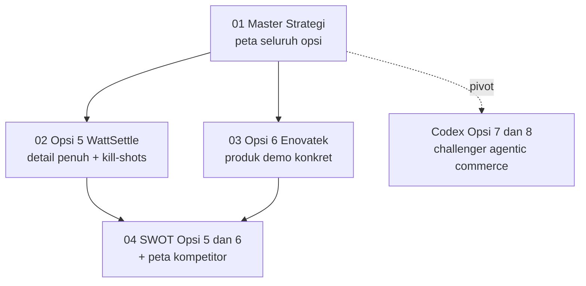

<svg width="100%" height="10" viewBox="0 0 1200 10" preserveAspectRatio="none" xmlns="http://www.w3.org/2000/svg" role="img" aria-label="accent">
  <defs><linearGradient id="docsbar" x1="0" y1="0" x2="1" y2="0">
    <stop offset="0" stop-color="#06b6d4"/><stop offset="1" stop-color="#22c55e"/>
    <animate attributeName="x2" values="1;1.5;1" dur="4s" repeatCount="indefinite"/>
  </linearGradient></defs>
  <rect width="1200" height="10" rx="5" fill="url(#docsbar)"/>
</svg>

# 📚 Dokumen Strategi

### Indonesia Web3 Hackathon 2026 · SURIOTA

Kembali ke [hub utama](../README.md).

---

## 🧭 Urutan Baca

---

## ⭐ Dokumen Fokus

| # | Dokumen | Isi | Prioritas |
|:--:|:--|:--|:--:|
| 01 | [`01 Master Strategi.md`](<01 Master Strategi.md>) | Ringkasan lintas opsi, papan skor, keputusan submission, path to 90 | 🟢 baca dulu |
| 02 | [`02 Opsi 5 WattSettle.md`](<02 Opsi 5 WattSettle.md>) | Master doc WattSettle: arsitektur, kontrak, bisnis, MVP, pitch, kill-shots | 🟢 tinggi |
| 03 | [`03 Opsi 6 Enovatek.md`](<03 Opsi 6 Enovatek.md>) | Penerapan ke produk nyata Enovatek PM20H20Q (mesin demo) | 🟢 tinggi |
| 04 | [`04 SWOT Opsi 5 6.md`](<04 SWOT Opsi 5 6.md>) | SWOT kedua opsi + peta kompetitor + verdict posisi | 🟢 tinggi |

## 🔬 Riset Challenger

| Folder | Isi |
|:--|:--|
| [`Codex Opsi 7 8/`](<Codex Opsi 7 8/>) | Deep analysis agentic commerce (AgentCart TrustPay, SafePay, TrustCart Escrow), source ledger 25 sumber, scoring matrix |

## 🗄️ Arsip

| Folder | Isi |
|:--|:--|
| [`Archive/`](Archive/) | Opsi 1 ProofOfWatt, 2 JanjiChain, 3 ProofOfAlpha, 4 Karmakhet, 9 sampai 13 Finance Commerce, analisa awal, prompt build website, versi lama master dan SWOT |

---

Semua dokumen bebas em-dash, en-dash, dan hyphen sebagai pemisah kalimat. Update: 7 Juli 2026.

