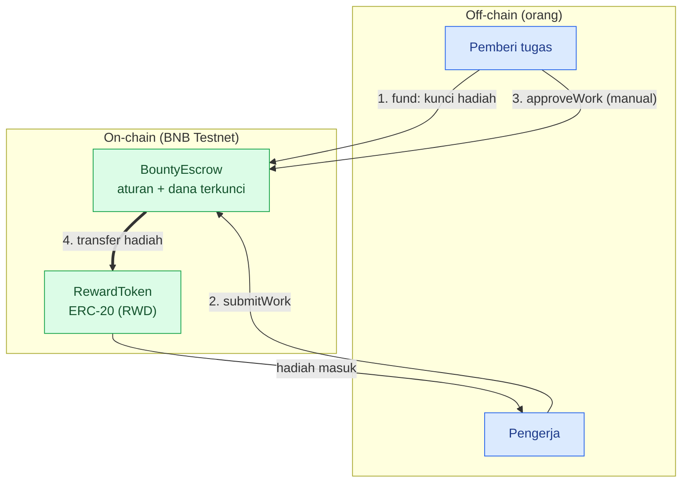
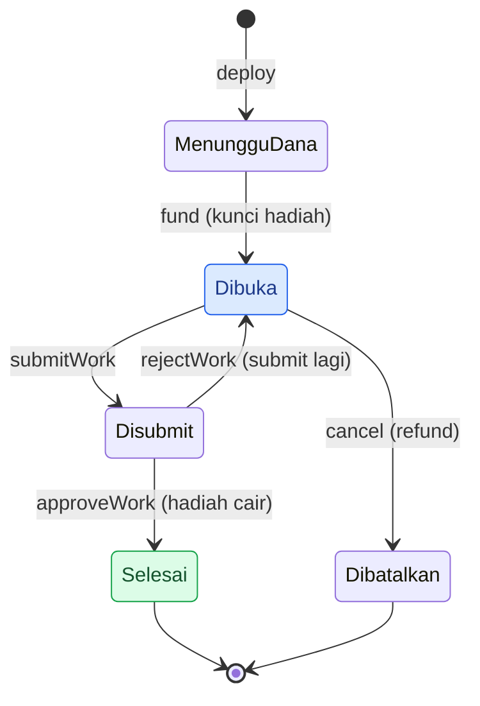
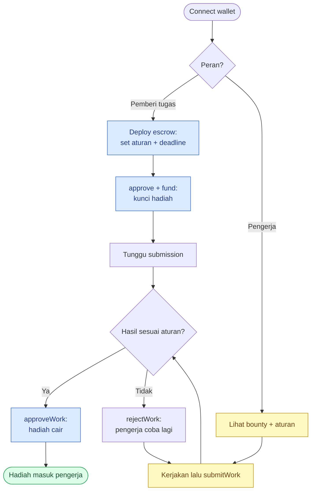
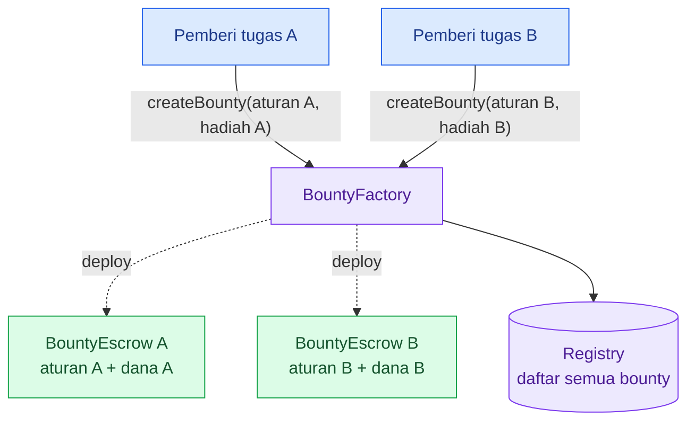
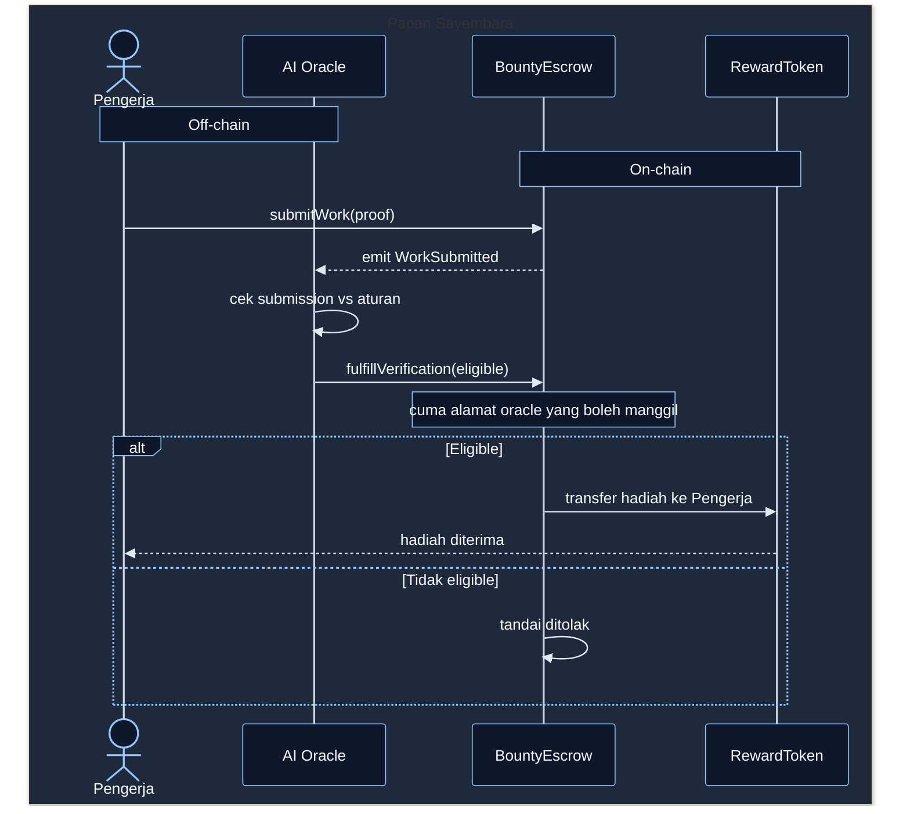

# Pertemuan 3: Papan Sayembara (Bounty)

> **DevWeb3 Jogja - Online Bootcamp.** Sesi praktek: bikin, test, dan deploy kontrak escrow buat Papan Sayembara.

> **Prasyarat & repo:** kelarin dulu** ****[Sesi 2: Foundry & Dasar Solidity](https://app.notion.com/p/39683efb869d817e9ecddda0753b856b)** (setup Foundry + RewardToken). Semua kode bootcamp ada di **[GitHub repo](https://github.com/DevWeb3Jogja/boootcamp-indonesia-web3-hacathon)****.**

Papan Sayembara itu dApp tempat orang posting tugas berhadiah (bounty). Tiap bounty punya kontrak escrow yang nahan hadiah dan cuma ngelepasnya kalau kerjaan di-approve. Sesi 3 ini kita bikin **inti escrow-nya**: satu bounty, deploy manual, rilis di-approve creator. Factory (escrow per bounty) dan AI oracle nyusul di Sesi 4.

> **Jembatan dari Sesi 2:** RewardToken yang kalian bikin minggu lalu jadi hadiahnya, dan minggu ini kita deploy dia bareng escrow. Konsep mapping, event, custom error, modifier kebawa lagi. Yang baru: `enum`, `IERC20`, transfer token antar-kontrak, dan checks-effects-interactions.

### Isi halaman ini (3 tab)

1. **Tab 1: Konsep & Arsitektur.** Escrow itu apa, arsitektur Sesi 3, siklus hidup bounty, plus preview Factory + AI oracle Sesi 4.
2. **Tab 2: Bikin BountyEscrow.** Bangun kontrak dari nol secara bertahap, dari kerangka sampai versi best practice.
3. **Tab 3: Test + Deploy.** 20 test, deploy script, lalu deploy + verify ke BNB Testnet bareng RewardToken.

> Buka sub-halaman di bawah untuk materi lengkapnya.

### Target sesi

- [ ] Paham konsep escrow: kunci dana, rilis bersyarat, refund
- [ ] `BountyEscrow.sol` jadi + 20 test hijau
- [ ] RewardToken + BountyEscrow ke-deploy dan ke-verify di BNB Testnet
- [ ] Alur `submitWork` lalu `approveWork` jalan on-chain

> **Fokus Sesi 3: escrow-nya dulu.** Factory + AI oracle sengaja ditunda ke Sesi 4 biar konsep escrow benar-benar nempel.

## Tab 1: Konsep & Arsitektur (scope Sesi 3)

Sebelum ngoding, samain dulu gambaran besarnya. Sesi 3 fokus ke **inti escrow**: satu bounty, hadiah dikunci di kontrak, cair kalau kerjaan di-approve. Factory dan AI oracle sengaja ditunda ke Sesi 4 biar kamu paham dulu logika escrow-nya.

> **Jembatan dari Sesi 2:** RewardToken yang kamu bikin minggu lalu jadi hadiahnya. Konsep mapping, event, custom error, msg.sender, modifier kepakai lagi. Yang baru: enum, interface (IERC20), transfer token antar-kontrak, dan pola checks-effects-interactions.

---

### Apa itu Papan Sayembara

Papan Sayembara itu dApp tempat orang posting tugas berhadiah (bounty). Tiap bounty punya kontrak escrow sendiri yang nyimpen aturan, nahan hadiah, dan cuma ngelepas hadiah kalau syaratnya kepenuhan.

Sesi 3 kita bikin **satu escrow dulu** dan deploy manual. Sesi 4 baru bikin Factory yang nyetak escrow per bounty otomatis.

---

### Konsep escrow (kunci dana)

Escrow itu pihak ketiga yang nahan uang sampai syarat kepenuhan. Di sini pihak ketiganya bukan orang, tapi smart contract, jadi gak perlu saling percaya.

1. Pemberi tugas kunci hadiah ke kontrak (`fund`).
2. Pengerja submit hasil (`submitWork`).
3. Kalau di-approve, kontrak transfer hadiah ke pengerja. Kalau gak ada yang ngerjain, pemberi tugas tarik lagi (`cancel` lalu refund).

> **Buat yang dari JS:** bayangin escrow kayak `Promise` yang megang dana. `approveWork` itu `resolve` (hadiah ke pengerja), `cancel` itu balikin ke pemberi tugas. Bedanya, uangnya beneran dan aturannya dipaksa kode.

---

### Arsitektur Sesi 3

Di Sesi 3 belum ada backend, indexer, atau oracle. Cuma dua peran (pemberi tugas + pengerja) dan dua kontrak (BountyEscrow + RewardToken).



Biru = orang (off-chain), hijau = kontrak (on-chain). Di Sesi 4, approve manual (panah 3) diganti sama AI oracle.

---

### Siklus hidup bounty (state machine)



Dana kekunci pas `fund`, cuma cair lewat `approveWork` (Sesi 3: manual oleh creator). Kalau ditolak, pengerja boleh submit lagi. Kalau gak ada yang ngerjain, creator `cancel` dan tarik dananya.

---

### User flow (dua peran)



---

### Komponen Sesi 3

> RewardToken belum pernah di-deploy. Di Tab 3 kita deploy dia bareng BountyEscrow ke BNB Testnet.

---

### Yang datang di Sesi 4 (preview)

Sesi 3 sengaja dipangkas biar fokus ke escrow. Dua hal besar nyusul minggu depan.

**1. Factory: satu escrow per bounty.** Daripada satu kontrak raksasa nampung semua bounty, Factory nge-deploy BountyEscrow terpisah tiap ada bounty baru, plus simpan registry alamatnya.



**2. AI oracle: ganti approve manual jadi verdict on-chain.** AI dengar event submit, cek eligibility, lalu kirim transaksi `fulfillVerification(eligible)` ke kontrak. Kontrak yang eksekusi hasilnya. Inilah yang bikin proyek ini web3 beneran: AI nulis on-chain, bukan cuma notifikasi ke manusia.



Jadi di Sesi 4, `approveWork` yang manual kita ganti jadi `fulfillVerification` yang dipanggil oracle. Struktur escrow-nya sama, cuma pemicunya beda.

---

### Peta  sesi

---

**Navigasi:** Sebelumnya [Pertemuan 3 (induk)](https://app.notion.com/p/39683efb869d813e894fdc9769577e6d)  -  Selanjutnya [Tab 2: Bikin BountyEscrow](https://app.notion.com/p/3a183efb869d81fa89e3fcfacef0eeba)

## Tab 2: Bikin BountyEscrow (bertahap)

BountyEscrow itu jantung Papan Sayembara: satu kontrak nahan hadiah satu bounty, dan cuma ngelepasnya kalau kerjaan di-approve. Di sini kamu bikin dari nol sambil ketemu konsep baru: `enum`, interface `IERC20`, transfer token antar-kontrak, dan checks-effects-interactions.

---

### Siapin project

```bash
forge init bootcamp-web3id-s3
cd bootcamp-web3id-s3
forge install OpenZeppelin/openzeppelin-contracts
forge remappings > remappings.txt
```

Salin `RewardToken.sol` (ke `src/`) dan `RewardToken.t.sol` (ke `test/`) dari Sesi 2 (Tab 3). Escrow butuh token ini sebagai hadiah, dan test-nya biar `forge coverage` repo 100%. Setup wallet, `.env`, dan `foundry.toml` sama persis kayak Sesi 2 Tab 1.

---

### Kode utuh (hasil akhir)

```solidity
// SPDX-License-Identifier: MIT
pragma solidity ^0.8.20;

import {IERC20} from "@openzeppelin/contracts/token/ERC20/IERC20.sol";
import {SafeERC20} from "@openzeppelin/contracts/token/ERC20/utils/SafeERC20.sol";

/// @title BountyEscrow - satu bounty berhadiah, dana dikunci sampai tugas di-approve
/// @notice Sesi 3: inti escrow (tanpa Factory, tanpa AI oracle). Rilis di-approve manual oleh creator.
contract BountyEscrow {
    using SafeERC20 for IERC20;

    enum Status { MenungguDana, Dibuka, Disubmit, Selesai, Dibatalkan }

    IERC20 public immutable rewardToken;
    address public immutable creator;
    uint256 public immutable rewardAmount;
    uint256 public immutable submissionDeadline;
    string public rulesURI;

    Status public status;
    address public worker;
    string public proofURI;

    event BountyFunded(uint256 rewardAmount);
    event WorkSubmitted(address indexed worker, string proofURI);
    event WorkRejected(address indexed worker);
    event RewardReleased(address indexed worker, uint256 rewardAmount);
    event BountyCancelled(uint256 refundAmount);

    error BukanCreator(address caller);
    error StatusSalah(Status butuh, Status sekarang);
    error DeadlineLewat();
    error RewardNol();
    error AturanKosong();
    error DeadlineHarusMasaDepan();

    modifier hanyaCreator() {
        if (msg.sender != creator) revert BukanCreator(msg.sender);
        _;
    }

    constructor(IERC20 _rewardToken, uint256 _rewardAmount, string memory _rulesURI, uint256 _submissionDeadline) {
        if (_rewardAmount == 0) revert RewardNol();
        if (bytes(_rulesURI).length == 0) revert AturanKosong();
        if (_submissionDeadline <= block.timestamp) revert DeadlineHarusMasaDepan();
        rewardToken = _rewardToken;
        rewardAmount = _rewardAmount;
        rulesURI = _rulesURI;
        submissionDeadline = _submissionDeadline;
        creator = msg.sender;
        status = Status.MenungguDana;
    }

    function fund() external hanyaCreator {
        if (status != Status.MenungguDana) revert StatusSalah(Status.MenungguDana, status);
        status = Status.Dibuka;
        rewardToken.safeTransferFrom(creator, address(this), rewardAmount);
        emit BountyFunded(rewardAmount);
    }

    function submitWork(string calldata _proofURI) external {
        if (status != Status.Dibuka) revert StatusSalah(Status.Dibuka, status);
        if (block.timestamp > submissionDeadline) revert DeadlineLewat();
        worker = msg.sender;
        proofURI = _proofURI;
        status = Status.Disubmit;
        emit WorkSubmitted(msg.sender, _proofURI);
    }

    function approveWork() external hanyaCreator {
        if (status != Status.Disubmit) revert StatusSalah(Status.Disubmit, status);
        status = Status.Selesai;
        address recipient = worker;
        rewardToken.safeTransfer(recipient, rewardAmount);
        emit RewardReleased(recipient, rewardAmount);
    }

    function rejectWork() external hanyaCreator {
        if (status != Status.Disubmit) revert StatusSalah(Status.Disubmit, status);
        address rejectedWorker = worker;
        worker = address(0);
        proofURI = "";
        status = Status.Dibuka;
        emit WorkRejected(rejectedWorker);
    }

    function cancel() external hanyaCreator {
        if (status != Status.Dibuka) revert StatusSalah(Status.Dibuka, status);
        status = Status.Dibatalkan;
        rewardToken.safeTransfer(creator, rewardAmount);
        emit BountyCancelled(rewardAmount);
    }
}
```

---

### Bangun bertahap (per bagian)

Kode di tiap blok bawah ini **bersih tanpa komentar**, tinggal copy satu-satu berurutan dari atas ke bawah, tempel jadi satu file. Penjelasan ada di teks bawah tiap blok. Blok pertama buka `contract {`, blok terakhir nutup `}`.

Urutan bagian: **enum -> state variables -> events -> errors -> modifier -> constructor -> functions.**

#### 1. Kerangka + enum

```solidity
// SPDX-License-Identifier: MIT
pragma solidity ^0.8.20;

import {IERC20} from "@openzeppelin/contracts/token/ERC20/IERC20.sol";
import {SafeERC20} from "@openzeppelin/contracts/token/ERC20/utils/SafeERC20.sol";

contract BountyEscrow {
    using SafeERC20 for IERC20;

    enum Status { MenungguDana, Dibuka, Disubmit, Selesai, Dibatalkan }
```

Baris `import` narik interface `IERC20` (buat manggil fungsi token) dan `SafeERC20`. `using SafeERC20 for IERC20` bikin kita bisa nulis `rewardToken.safeTransfer(...)`, versi transfer yang otomatis revert kalau gagal. `enum Status` itu daftar status terbatas, kebaca, dan hemat (disimpan sebagai `uint8`). Perhatiin: kurung `{` kontrak dibuka di sini dan belum ditutup, bagian-bagian berikut ditempel di bawahnya.

#### 2. State variables

```solidity
IERC20 public immutable rewardToken;
address public immutable creator;
uint256 public immutable rewardAmount;
uint256 public immutable submissionDeadline;
string public rulesURI;

Status public status;
address public worker;
string public proofURI;
```

Empat yang atas `immutable`: diisi sekali di constructor lalu terkunci, dan masuk ke bytecode jadi baca-nya murah (gak nyentuh storage). `rulesURI` sengaja `string` biar bisa link apa aja, dan karena `string` itu tipe referensi, dia **tidak bisa** `immutable`, jadi cukup di-set sekali di constructor. Tiga yang bawah (`status`, `worker`, `proofURI`) berubah selama bounty jalan, jadi storage biasa. `worker` dan `proofURI` baru keisi pas ada yang submit.

#### 3. Events

```solidity
event BountyFunded(uint256 rewardAmount);
event WorkSubmitted(address indexed worker, string proofURI);
event WorkRejected(address indexed worker);
event RewardReleased(address indexed worker, uint256 rewardAmount);
event BountyCancelled(uint256 refundAmount);
```

Event itu log murah buat dibaca off-chain (indexer, frontend, dan AI oracle di Sesi 4). Tiap aksi penting punya satu event. `indexed` bikin field bisa difilter pas nyari log (maks 3 per event), makanya `worker` di-index.

#### 4. Errors

```solidity
error BukanCreator(address caller);
error StatusSalah(Status butuh, Status sekarang);
error DeadlineLewat();
error RewardNol();
error AturanKosong();
error DeadlineHarusMasaDepan();
```

Semua validasi pakai custom error, bukan `require("string")`. Hemat gas karena teks pesan gak ikut ke-compile ke bytecode, dan error bisa bawa data: `StatusSalah(butuh, sekarang)` langsung ngasih tau status yang diharapkan vs yang sekarang, jadi gampang debug.

#### 5. Modifier

```solidity
modifier hanyaCreator() {
    if (msg.sender != creator) revert BukanCreator(msg.sender);
    _;
}
```

Modifier itu pembungkus buat ngecek syarat sebelum fungsi jalan (mirip middleware). `_;` artinya "lanjut jalanin isi fungsinya". Cek `msg.sender != creator` ditaruh sekali di sini, lalu dipakai ulang di `fund`, `approveWork`, `rejectWork`, `cancel` (DRY, gak nulis cek yang sama berkali-kali).

#### 6. Constructor

```solidity
constructor(IERC20 _rewardToken, uint256 _rewardAmount, string memory _rulesURI, uint256 _submissionDeadline) {
    if (_rewardAmount == 0) revert RewardNol();
    if (bytes(_rulesURI).length == 0) revert AturanKosong();
    if (_submissionDeadline <= block.timestamp) revert DeadlineHarusMasaDepan();
    rewardToken = _rewardToken;
    rewardAmount = _rewardAmount;
    rulesURI = _rulesURI;
    submissionDeadline = _submissionDeadline;
    creator = msg.sender;
    status = Status.MenungguDana;
}
```

Constructor jalan sekali pas deploy. Pola checks-effects: **validasi dulu** (tiga baris `if`) sebelum nulis state, biar kalau input salah langsung revert dan hemat gas. Cek string kosong caranya `bytes(_rulesURI).length == 0` (string gak punya `.length` langsung). Habis lolos, semua state diisi. `creator = msg.sender` artinya yang nge-deploy jadi pemilik bounty, dan `status` mulai dari `MenungguDana` (hadiah belum dikunci).

#### 7. fund()

```solidity
function fund() external hanyaCreator {
    if (status != Status.MenungguDana) revert StatusSalah(Status.MenungguDana, status);
    status = Status.Dibuka;
    rewardToken.safeTransferFrom(creator, address(this), rewardAmount);
    emit BountyFunded(rewardAmount);
}
```

Creator ngunci hadiah ke kontrak. `hanyaCreator` batasin cuma pembuat yang boleh. Cek status `MenungguDana` biar gak dobel-danai. Urutan **checks-effects-interactions**: ubah `status` jadi `Dibuka` dulu, baru narik token, biar aman dari reentrancy. `safeTransferFrom` narik token dari creator ke kontrak, jadi creator wajib `approve()` token ke kontrak ini dulu (dijelasin di Tab 3).

#### 8. submitWork()

```solidity
function submitWork(string calldata _proofURI) external {
    if (status != Status.Dibuka) revert StatusSalah(Status.Dibuka, status);
    if (block.timestamp > submissionDeadline) revert DeadlineLewat();
    worker = msg.sender;
    proofURI = _proofURI;
    status = Status.Disubmit;
    emit WorkSubmitted(msg.sender, _proofURI);
}
```

Siapa aja boleh submit (gak pakai `hanyaCreator`). Argumen pakai `calldata` (read-only, paling murah gas buat fungsi `external`). Cek bounty lagi `Dibuka` dan belum lewat deadline. Lalu catat pengerja + link buktinya, pindah status ke `Disubmit`, dan emit event (ini yang didengar AI oracle di Sesi 4).

#### 9. approveWork()

```solidity
function approveWork() external hanyaCreator {
    if (status != Status.Disubmit) revert StatusSalah(Status.Disubmit, status);
    status = Status.Selesai;
    address recipient = worker;
    rewardToken.safeTransfer(recipient, rewardAmount);
    emit RewardReleased(recipient, rewardAmount);
}
```

Creator nyetujui, hadiah cair. Lagi-lagi checks-effects-interactions: `status = Selesai` dulu, baru kirim token. `address recipient = worker` nyimpen `worker` ke variabel memory biar storage `worker` cuma dibaca sekali (hemat gas). `safeTransfer` ngirim hadiah ke pengerja. Di Sesi 4, fungsi manual ini diganti `fulfillVerification` yang dipanggil oracle.

#### 10. rejectWork()

```solidity
function rejectWork() external hanyaCreator {
    if (status != Status.Disubmit) revert StatusSalah(Status.Disubmit, status);
    address rejectedWorker = worker;
    worker = address(0);
    proofURI = "";
    status = Status.Dibuka;
    emit WorkRejected(rejectedWorker);
}
```

Creator nolak hasil. Kita simpan `worker` ke `rejectedWorker` dulu, karena habis ini `worker` di-reset ke `address(0)` tapi kita masih mau emit alamat aslinya. Reset `worker` + `proofURI`, balikin status ke `Dibuka` biar pengerja lain (atau yang sama) bisa submit lagi.

#### 11. cancel()

```solidity
function cancel() external hanyaCreator {
    if (status != Status.Dibuka) revert StatusSalah(Status.Dibuka, status);
    status = Status.Dibatalkan;
    rewardToken.safeTransfer(creator, rewardAmount);
    emit BountyCancelled(rewardAmount);
}
```

Creator batalin bounty selama belum ada yang submit (status masih `Dibuka`). Checks-effects-interactions lagi: `status = Dibatalkan` dulu, baru refund hadiah balik ke creator.

#### 12. Tutup kontrak

```solidity
}
```

Tutup kurung kontraknya. Hasil rakitan dari blok 1 sampai 12 harus sama persis dengan **Kode utuh** di atas. Jalanin `forge build` (harus bersih) lalu `forge test` (BountyEscrow 20 hijau; total repo 30 bareng RewardToken, lihat Tab 3).

---

### Konsep Solidity yang kamu pakai

- [x] `enum` (status siklus hidup bounty)
- [x] `immutable` (data terkunci setelah deploy) + kenapa `string` gak bisa immutable
- [x] interface `IERC20` (manggil kontrak token lain)
- [x] pola `approve` + `transferFrom` (escrow ERC-20)
- [x] `event` + `indexed`
- [x] custom `error` + `revert` (dipakai di semua validasi, bukan `require` string)
- [x] `modifier` (akses kontrol)
- [x] checks-effects-interactions (anti-reentrancy)
- [x] `block.timestamp` (deadline) + cek string kosong (`bytes(s).length`)
- [x] SafeERC20 (transfer token aman)

---

### Catatan best practice

**Urutan isi kontrak.** Susun dari atas: types (`enum`) -> state variables -> events -> errors -> modifier -> constructor -> functions. Rapi dan gampang diaudit.

**Penamaan eksplisit.** Nama harus kebaca maksudnya tanpa nebak: `rewardAmount` (bukan `reward`), `submissionDeadline` (bukan `deadline`), `rulesURI` (link aturan), `rewardToken` (alamat kontrak token). Konvensi: `mixedCase` buat variabel/fungsi, `CapWords` buat contract/enum/event/error.

**rulesURI vs simpan aturan on-chain.** Kita simpan **link** ke aturan, bukan teksnya. Lebih murah gas dan fleksibel (GitHub/website/dokumen/IPFS). Karena `string`, dia gak bisa `immutable`, jadi cukup di-set sekali di constructor. Kalau butuh aturan yang gak bisa diubah, pakai link IPFS (CID itu hash dari kontennya, jadi otomatis anti-ubah).

**Custom error, bukan **`**require**`** string.** Semua validasi pakai `if (..) revert NamaError()`. Lebih hemat gas (teks pesan gak masuk bytecode) dan error bisa bawa data (mis. `StatusSalah(butuh, sekarang)`).

**SafeERC20.** `transfer`/`transferFrom` bawaan ngembaliin `bool`; sebagian token gak revert pas gagal. `safeTransfer` maksa revert kalau gagal, jadi dana gak "hilang diam-diam".

**block.timestamp (deadline).** Buat gerbang waktu, `block.timestamp` itu primitif yang paling pas; gak ada yang lebih best practice. `block.number` malah lebih jelek karena durasi antar-blok gak pasti (nge-drift), jadi "7 hari" gak bisa dipetakan ke jumlah blok dengan akurat. `forge build` / `forge lint` tetap ngewarn `block.timestamp` karena validator bisa geser waktu blok beberapa detik. Buat deadline skala hari, geseran itu gak ngaruh. **Warning-nya dibiarin aja, jangan dimatiin** biar tetap teriak kalau suatu saat `block.timestamp` dipakai buat hal rawan: sumber acak (jangan pernah) atau timing presisi detik (lelang/opsi yang beres dalam hitungan detik).

**Reentrancy.** Sesi 3 pakai checks-effects-interactions (ubah status sebelum transfer). Sesi 4 ditambah `ReentrancyGuard` OpenZeppelin sebagai lapis kedua.

> Lanjut ke **Tab 3** buat nulis test dan deploy escrow + token ke BNB Testnet.

---

**Navigasi:** Sebelumnya [Tab 1: Konsep & Arsitektur](https://app.notion.com/p/3a183efb869d81788b77e2a0004d44dc)  -  Selanjutnya [Tab 3: Test + Deploy](https://app.notion.com/p/3a183efb869d81dc868fdc257211f8fa)

## Tab 3: Test + Deploy (bareng RewardToken)

Kontrak udah jadi. Sekarang kita pastiin logikanya bener lewat test (target coverage 100%), terus deploy ke BNB Testnet. Deploy-nya dipisah: **token dulu** (sekali, address-nya dicatat ke `.env`), baru **escrow** yang baca address token itu.

---

### 1. Test (coverage 100%)

Bikin `test/BountyEscrow.t.sol`. Test ini ngecover semua kasus: yang sukses dan yang diharapkan gagal (revert), tiap fungsi dan tiap cabang.

> Salin juga `RewardToken.t.sol` dari Sesi 2 (Tab 3) ke folder `test/`, biar `forge coverage` seluruh repo 100% (token + escrow).

```solidity
// SPDX-License-Identifier: MIT
pragma solidity ^0.8.20;

import {Test} from "forge-std/Test.sol";
import {RewardToken} from "../src/RewardToken.sol";
import {BountyEscrow} from "../src/BountyEscrow.sol";

contract BountyEscrowTest is Test {
    RewardToken token;
    BountyEscrow escrow;

    address creator = address(0xC0FFEE);
    address worker = address(0xB0B);
    address random = address(0xBEEF);

    uint256 rewardAmount = 100 ether;
    string rulesURI = "https://github.com/devweb3jogja/bounty-1/blob/main/RULES.md";
    uint256 submissionDeadline;

    function setUp() public {
        submissionDeadline = block.timestamp + 7 days;
        token = new RewardToken(1000 ether, creator);
        vm.prank(creator);
        escrow = new BountyEscrow(token, rewardAmount, rulesURI, submissionDeadline);
        vm.startPrank(creator);
        token.approve(address(escrow), rewardAmount);
        escrow.fund();
        vm.stopPrank();
    }

    // ---------- SUKSES ----------
    function test_Constructor_SetSemuaField() public view {
        assertEq(address(escrow.rewardToken()), address(token));
        assertEq(escrow.creator(), creator);
        assertEq(escrow.rewardAmount(), rewardAmount);
        assertEq(escrow.rulesURI(), rulesURI);
        assertEq(escrow.submissionDeadline(), submissionDeadline);
    }

    function test_Fund_KunciHadiah() public view {
        assertEq(token.balanceOf(address(escrow)), rewardAmount);
        assertEq(token.balanceOf(creator), 900 ether);
        assertEq(uint256(escrow.status()), uint256(BountyEscrow.Status.Dibuka));
    }

    function test_SubmitWork_CatatPengerja() public {
        vm.prank(worker);
        escrow.submitWork("ipfs://bukti");
        assertEq(escrow.worker(), worker);
        assertEq(escrow.proofURI(), "ipfs://bukti");
        assertEq(uint256(escrow.status()), uint256(BountyEscrow.Status.Disubmit));
    }

    function test_ApproveWork_CairkanHadiah() public {
        vm.prank(worker);
        escrow.submitWork("ipfs://bukti");
        vm.prank(creator);
        escrow.approveWork();
        assertEq(token.balanceOf(worker), rewardAmount);
        assertEq(token.balanceOf(address(escrow)), 0);
        assertEq(uint256(escrow.status()), uint256(BountyEscrow.Status.Selesai));
    }

    function test_RejectWork_BalikDibuka() public {
        vm.prank(worker);
        escrow.submitWork("ipfs://bukti");
        vm.prank(creator);
        escrow.rejectWork();
        assertEq(escrow.worker(), address(0));
        assertEq(escrow.proofURI(), "");
        assertEq(uint256(escrow.status()), uint256(BountyEscrow.Status.Dibuka));
    }

    function test_RejectWork_LaluBisaSubmitLagi() public {
        vm.prank(worker);
        escrow.submitWork("ipfs://v1");
        vm.prank(creator);
        escrow.rejectWork();
        vm.prank(worker);
        escrow.submitWork("ipfs://v2");
        assertEq(escrow.proofURI(), "ipfs://v2");
        assertEq(uint256(escrow.status()), uint256(BountyEscrow.Status.Disubmit));
    }

    function test_Cancel_RefundCreator() public {
        vm.prank(creator);
        escrow.cancel();
        assertEq(token.balanceOf(creator), 1000 ether);
        assertEq(uint256(escrow.status()), uint256(BountyEscrow.Status.Dibatalkan));
    }

    // ---------- GAGAL: constructor ----------
    function test_Revert_ConstructorRewardNol() public {
        vm.expectRevert(BountyEscrow.RewardNol.selector);
        new BountyEscrow(token, 0, rulesURI, submissionDeadline);
    }

    function test_Revert_ConstructorAturanKosong() public {
        vm.expectRevert(BountyEscrow.AturanKosong.selector);
        new BountyEscrow(token, rewardAmount, "", submissionDeadline);
    }

    function test_Revert_ConstructorDeadlineLewat() public {
        vm.expectRevert(BountyEscrow.DeadlineHarusMasaDepan.selector);
        new BountyEscrow(token, rewardAmount, rulesURI, block.timestamp);
    }

    // ---------- GAGAL: fund ----------
    function test_Revert_FundBukanCreator() public {
        vm.prank(creator);
        BountyEscrow baru = new BountyEscrow(token, rewardAmount, rulesURI, submissionDeadline);
        vm.expectRevert(abi.encodeWithSelector(BountyEscrow.BukanCreator.selector, random));
        vm.prank(random);
        baru.fund();
    }

    function test_Revert_FundDobel() public {
        vm.expectRevert(
            abi.encodeWithSelector(
                BountyEscrow.StatusSalah.selector,
                BountyEscrow.Status.MenungguDana,
                BountyEscrow.Status.Dibuka
            )
        );
        vm.prank(creator);
        escrow.fund();
    }

    // ---------- GAGAL: submitWork ----------
    function test_Revert_SubmitBelumDibuka() public {
        vm.prank(worker);
        escrow.submitWork("ipfs://bukti");
        vm.expectRevert(
            abi.encodeWithSelector(
                BountyEscrow.StatusSalah.selector,
                BountyEscrow.Status.Dibuka,
                BountyEscrow.Status.Disubmit
            )
        );
        vm.prank(random);
        escrow.submitWork("dobel");
    }

    function test_Revert_SubmitSetelahDeadline() public {
        vm.warp(submissionDeadline + 1);
        vm.prank(worker);
        vm.expectRevert(BountyEscrow.DeadlineLewat.selector);
        escrow.submitWork("telat");
    }

    // ---------- GAGAL: approveWork ----------
    function test_Revert_ApproveBukanCreator() public {
        vm.prank(worker);
        escrow.submitWork("ipfs://bukti");
        vm.expectRevert(abi.encodeWithSelector(BountyEscrow.BukanCreator.selector, random));
        vm.prank(random);
        escrow.approveWork();
    }

    function test_Revert_ApproveBelumDisubmit() public {
        vm.expectRevert(
            abi.encodeWithSelector(
                BountyEscrow.StatusSalah.selector,
                BountyEscrow.Status.Disubmit,
                BountyEscrow.Status.Dibuka
            )
        );
        vm.prank(creator);
        escrow.approveWork();
    }

    // ---------- GAGAL: rejectWork ----------
    function test_Revert_RejectBukanCreator() public {
        vm.prank(worker);
        escrow.submitWork("ipfs://bukti");
        vm.expectRevert(abi.encodeWithSelector(BountyEscrow.BukanCreator.selector, random));
        vm.prank(random);
        escrow.rejectWork();
    }

    function test_Revert_RejectBelumDisubmit() public {
        vm.expectRevert(
            abi.encodeWithSelector(
                BountyEscrow.StatusSalah.selector,
                BountyEscrow.Status.Disubmit,
                BountyEscrow.Status.Dibuka
            )
        );
        vm.prank(creator);
        escrow.rejectWork();
    }

    // ---------- GAGAL: cancel ----------
    function test_Revert_CancelBukanCreator() public {
        vm.expectRevert(abi.encodeWithSelector(BountyEscrow.BukanCreator.selector, random));
        vm.prank(random);
        escrow.cancel();
    }

    function test_Revert_CancelSetelahDisubmit() public {
        vm.prank(worker);
        escrow.submitWork("ipfs://bukti");
        vm.expectRevert(
            abi.encodeWithSelector(
                BountyEscrow.StatusSalah.selector,
                BountyEscrow.Status.Dibuka,
                BountyEscrow.Status.Disubmit
            )
        );
        vm.prank(creator);
        escrow.cancel();
    }
}
```

Jalanin test:

```bash
forge test
# Suite BountyEscrowTest: 20 passed. Plus RewardTokenTest: 10 passed = 30 passed.
```

Cek coverage (fokus ke kontrak di `src/`, skip folder script):

```bash
forge coverage --no-match-coverage "script/"
```

Targetnya semua 100%:

```bash
| File                 | % Lines         | % Statements    | % Branches      | % Funcs         |
| src/BountyEscrow.sol | 100.00% (42/42) | 100.00% (45/45) | 100.00% (10/10) | 100.00% (7/7)   |
| src/RewardToken.sol  | 100.00% (17/17) | 100.00% (18/18) | 100.00% (3/3)   | 100.00% (6/6)   |
| Total                | 100.00%         | 100.00%         | 100.00%         | 100.00%         |
```

> Pola: tiap fungsi punya minimal 1 test sukses + 1 test tiap kondisi revert (`hanyaCreator`, `StatusSalah`, deadline, dll). Itu yang bikin cabang (`if`) kepanggil semua.

---

### 2. Deploy: token dan escrow dipisah

Token itu fix, dipakai terus buat semua bounty. Jadi kita deploy **sekali**, catat address-nya, masukin ke `.env`. Escrow tiap bounty baru tinggal baca address token itu dari `.env`. Alur ini juga bikin peserta ngerasain: deploy token -> dapet address -> pakai address itu di kontrak lain.

> **Penting: deploy beneran WAJIB pakai **`**--rpc-url bsc_testnet --broadcast**`**.** Kalau jalanin `forge script` tanpa itu, dia cuma simulasi di EVM lokal kosong: kontrak gak ke-deploy ke mana-mana, dan `DeployBountyEscrow` bakal gagal karena RewardToken-nya gak beneran ada di situ (alamat dari simulasi token yang kepisah). Jadi urutannya: (1) `DeployRewardToken` dengan `--broadcast` ke testnet, (2) copy alamat ASLI dari output ke `.env`, (3) baru `DeployBountyEscrow` dengan `--broadcast`. Buat ngetes logika di lokal, pakai `forge test`, bukan script deploy.

> **Wallet: **`**--account**`** vs **`**--private-key**`**.** Script deploy baca `PRIVATE_KEY` dari `.env` (`vm.envUint`), jadi command deploy gak perlu `--account` atau `--private-key`, cukup `--broadcast`. Isi `PRIVATE_KEY=0x...` (wallet DEV yang ada tBNB-nya, jangan wallet utama) di `.env`; Foundry otomatis baca `.env`. Kalau mau lebih aman pakai keystore, ganti `vm.startBroadcast(vm.envUint("PRIVATE_KEY"))` di script jadi `vm.startBroadcast()` lalu tambah `--account deployer` di command.

> **Soal verify:** `--verify` baca config `[etherscan]` di `foundry.toml` (`chain = 97`) dan otomatis ke endpoint Etherscan V2 `https://api.etherscan.io/v2/api?chainid=97`. Satu API key jalan buat semua chain, jadi gak butuh config BscScan terpisah.

#### 2a. Deploy RewardToken (sekali aja)

Bikin `script/DeployRewardToken.s.sol`:

```solidity
// SPDX-License-Identifier: MIT
pragma solidity ^0.8.20;

import {Script, console} from "forge-std/Script.sol";
import {RewardToken} from "../src/RewardToken.sol";

// forge script script/DeployRewardToken.s.sol:DeployRewardToken --rpc-url bsc_testnet --broadcast --verify -vvvv --legacy
contract DeployRewardToken is Script {
    function run() external {
        uint256 pk = vm.envUint("PRIVATE_KEY");
        vm.startBroadcast(pk);
        RewardToken token = new RewardToken(1000 ether, vm.addr(pk));
        vm.stopBroadcast();
        console.log("RewardToken:", address(token));
    }
}
```

Deploy + verify:

```bash
source .env
forge script script/DeployRewardToken.s.sol:DeployRewardToken \
  --rpc-url bsc_testnet --broadcast --verify -vvvv --legacy
```

Copy alamat `RewardToken` dari output, lalu tambahin ke `.env`:

```bash
REWARD_TOKEN=0xalamat_token_hasil_deploy
```

#### 2b. Deploy BountyEscrow (baca token dari .env)

Bikin `script/DeployBountyEscrow.s.sol`. Alamat token diambil dari `.env` pakai `vm.envAddress`:

```solidity
// SPDX-License-Identifier: MIT
pragma solidity ^0.8.20;

import {Script, console} from "forge-std/Script.sol";
import {IERC20} from "@openzeppelin/contracts/token/ERC20/IERC20.sol";
import {BountyEscrow} from "../src/BountyEscrow.sol";

// forge script script/DeployBountyEscrow.s.sol:DeployBountyEscrow --rpc-url bsc_testnet --broadcast --verify -vvvv --legacy
contract DeployBountyEscrow is Script {
    function run() external {
        address rewardTokenAddr = vm.envAddress("REWARD_TOKEN");
        require(rewardTokenAddr.code.length > 0, "REWARD_TOKEN belum ke-deploy di chain ini");
        IERC20 rewardToken = IERC20(rewardTokenAddr);

        uint256 rewardAmount = 100 ether;
        string memory rulesURI = "https://github.com/devweb3jogja/bounty-1/blob/main/RULES.md";
        uint256 submissionDeadline = block.timestamp + 7 days;

        vm.startBroadcast(vm.envUint("PRIVATE_KEY"));
        BountyEscrow escrow = new BountyEscrow(rewardToken, rewardAmount, rulesURI, submissionDeadline);
        rewardToken.approve(address(escrow), rewardAmount);
        escrow.fund();
        vm.stopBroadcast();

        console.log("BountyEscrow:", address(escrow));
        console.log("Saldo escrow:", rewardToken.balanceOf(address(escrow)));
    }
}
```

Deploy + verify (pastiin `REWARD_TOKEN` udah ada di `.env`):

```bash
source .env
forge script script/DeployBountyEscrow.s.sol:DeployBountyEscrow \
  --rpc-url bsc_testnet --broadcast --verify -vvvv --legacy
```

> **Kalau transaksi nyangkut lama (pending) di BSC testnet:** bukan bug script. Biasanya gas price ke-estimate kekecilan (0.1 gwei) atau tipe EIP-1559 kurang cocok. Jalanin ulang dengan tambahan flag `--legacy --with-gas-price 3000000000 --slow` (tipe legacy, gas 3 gwei, kirim tx satu-satu). Kalau masih lama, RPC-nya lemot: ganti `BSC_TESTNET_RPC` di `.env` ke `https://data-seed-prebsc-1-s1.bnbchain.org:8545` atau `https://bsc-testnet.public.blastapi.io`. Cek status tx di [https://testnet.bscscan.com](https://testnet.bscscan.com).

> Kalau `--verify` gagal, verify manual. Constructor escrow: `(address, uint256, string, uint256)`:

```bash
forge verify-contract <ESCROW> src/BountyEscrow.sol:BountyEscrow \
  --verifier etherscan \
  --verifier-url "https://api.etherscan.io/v2/api?chainid=97" \
  --etherscan-api-key $ETHERSCAN_API_KEY \
  --constructor-args $(cast abi-encode "constructor(address,uint256,string,uint256)" $REWARD_TOKEN 100000000000000000000 "https://github.com/devweb3jogja/bounty-1/blob/main/RULES.md" <DEADLINE>) \
  --watch
```

---

### 3. Coba alur lengkap di testnet

Buat demo submit, pakai wallet kedua sebagai pengerja (keystore `pengerja`), atau demo pakai wallet yang sama. `<ESCROW>` = alamat escrow, `$REWARD_TOKEN` = dari `.env`.

```bash
# Pengerja submit bukti kerja
cast send <ESCROW> "submitWork(string)" "ipfs://bukti-kerja" \
  --rpc-url bsc_testnet --account pengerja

# Creator approve, hadiah langsung cair ke pengerja
cast send <ESCROW> "approveWork()" \
  --rpc-url bsc_testnet --account deployer

# Cek saldo pengerja (harus 100 RWD)
cast call $REWARD_TOKEN "balanceOf(address)(uint256)" <ALAMAT_PENGERJA> \
  --rpc-url bsc_testnet

# Cek status escrow: 0=MenungguDana 1=Dibuka 2=Disubmit 3=Selesai 4=Dibatalkan
cast call <ESCROW> "status()(uint8)" --rpc-url bsc_testnet

# Cek link aturan
cast call <ESCROW> "rulesURI()(string)" --rpc-url bsc_testnet
```

Status akhir `3` (Selesai) dan saldo pengerja `100 RWD` artinya escrow-mu jalan end-to-end di on-chain.

> Ingat urutannya: pengerja `submitWork` dulu (status jadi Disubmit) baru creator `approveWork`. Kalau kebalik, kena revert `StatusSalah`.

---

### Checklist akhir Sesi 3

- [ ] `forge build` bersih (import OZ ke-resolve)
- [ ] `forge test` 30 hijau (20 escrow + 10 token)
- [ ] `forge coverage` 100% (BountyEscrow + RewardToken)
- [ ] RewardToken ke-deploy, alamatnya masuk `.env` sebagai `REWARD_TOKEN`
- [ ] BountyEscrow ke-deploy pakai token dari `.env`, dua-duanya ke-verify di BscScan
- [ ] Alur `submitWork` lalu `approveWork` sukses, hadiah cair ke pengerja

> **Sesi 4:** BountyEscrow ini jadi cetakan buat BountyFactory (satu escrow per bounty), dan `approveWork` manual diganti `fulfillVerification` yang dipanggil AI oracle. Ditambah `ReentrancyGuard` + `Ownable`.

---

**Navigasi:** Sebelumnya [Tab 2: Bikin BountyEscrow](https://app.notion.com/p/3a183efb869d81fa89e3fcfacef0eeba)  -  Selanjutnya [Pertemuan 3 (induk)](https://app.notion.com/p/39683efb869d813e894fdc9769577e6d)

---

**Lanjut:** habis sesi ini, gas ke [Pertemuan 4: Factory & AI Oracle](https://app.notion.com/p/3a583efb869d81f18a34eceeb08d6b57)
