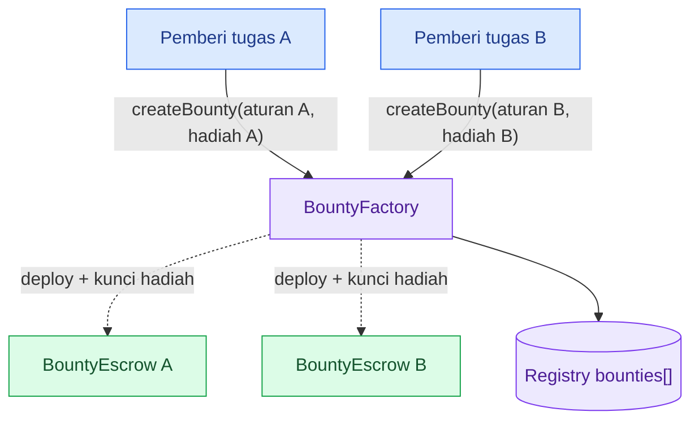
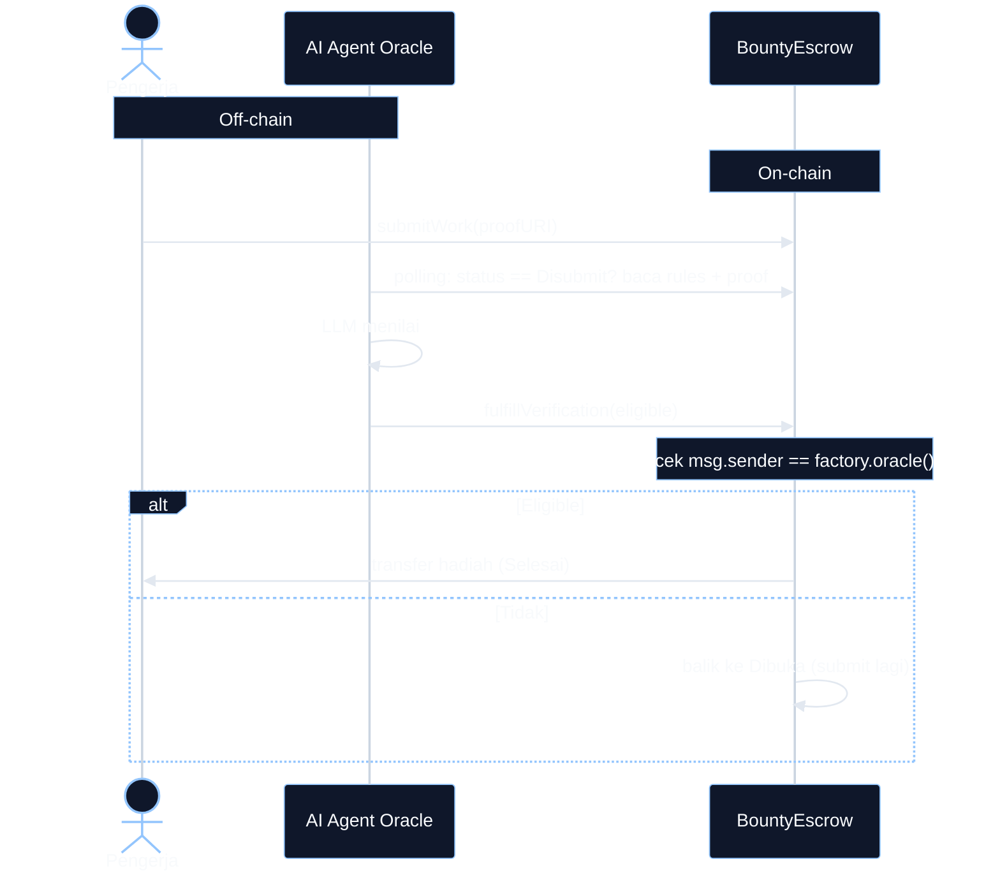

# Pertemuan 4: Factory & AI Oracle

> **DevWeb3 Jogja - Online Bootcamp.** Sesi praktek: bikin BountyFactory, ganti approve manual jadi AI oracle, lalu jalanin AI agent yang auto-approve submission on-chain.

> **Prasyarat & repo:** kelarin dulu **[Sesi 3: Papan Sayembara (Bounty)](https://app.notion.com/p/39683efb869d813e894fdc9769577e6d)** (BountyEscrow inti). Semua kode bootcamp ada di **[GitHub repo](https://github.com/DevWeb3Jogja/boootcamp-indonesia-web3-hacathon)**.

Minggu lalu Papan Sayembara kita baru satu escrow, deploy manual, dan hadiah cair kalau creator klik approve sendiri. Minggu ini dia naik level jadi dApp beneran: **BountyFactory** nyetak satu escrow per bounty secara otomatis, dan approve manual diganti **AI oracle**, agent dengan wallet sendiri yang menilai submission lalu nulis verdict-nya on-chain.

> **Jembatan dari Sesi 3:** BountyEscrow kamu tetap jadi inti, strukturnya sama. Yang baru: kontrak nge-deploy kontrak (factory pattern), cross-contract call (`factory.oracle()`), `ReentrancyGuard`, dan pola oracle (`fulfillVerification`). Konsep enum, custom error, modifier, SafeERC20 kepakai semua lagi.

### Isi halaman ini (2 tab, dipisah per use case)

1. **Tab 1: Smart Contract.** Semua ngoding di sini: clone repo minggu lalu, refactor escrow (factory + oracle) pakai diff, bikin `BountyFactory`, 48 test + coverage 100%, deploy + `createBounty` di BNB Testnet.
2. **Tab 2: AI Oracle.** Nol kode: bedah kontrak live di BscScan, demo "oracle manusia" via Write Contract, kenalan BNB Agent Studio, setup + jalankan AI agent, `setOracle`, hadiah cair otomatis.

> Buka sub-halaman di bawah untuk materi lengkapnya.

### Target sesi

- [ ] Paham factory pattern + kenapa oracle dibutuhkan
- [ ] `BountyFactory.sol` jadi, `BountyEscrow.sol` versi oracle jadi
- [ ] 48 test hijau, coverage 100% (escrow + factory + token)
- [ ] Factory ke-deploy dan ke-verify di BNB Testnet
- [ ] AI agent jalan: `submitWork` lalu hadiah cair tanpa approve manual

> **Fokus Sesi 4: konsep oracle dan komunikasi kontrak ke oracle.** AI agent-nya udah disiapin di folder `agent-oracle/` (dibangun pakai BNB Agent Studio), peserta tinggal setup dan jalankan. Isi dalamnya gak dibedah detail di sesi ini.

## Tab 1: Smart Contract (escrow final + factory, sampai deploy)

## Kode final (siap copas)

Dua kontrak inti Sesi 4, versi final yang lulus 48 test + coverage 100%. Mau langsung jalan: copas dua file ini, lompat ke Langkah 5 (test) dan Langkah 6 (deploy). Mau paham perubahannya baris per baris: ikuti Langkah 1 sampai 6 di bawah.

#### `src/BountyEscrow.sol`

```solidity
// SPDX-License-Identifier: MIT
pragma solidity ^0.8.20;

import {IERC20} from "@openzeppelin/contracts/token/ERC20/IERC20.sol";
import {SafeERC20} from "@openzeppelin/contracts/token/ERC20/utils/SafeERC20.sol";
import {ReentrancyGuard} from "@openzeppelin/contracts/utils/ReentrancyGuard.sol";

interface IBountyFactory {
    function oracle() external view returns (address);
}

/// @title BountyEscrow - satu bounty berhadiah, dana dikunci sampai kerjaan diverifikasi
/// @notice Sesi 4: di-deploy oleh BountyFactory, verifikasi utama oleh AI oracle via fulfillVerification.
contract BountyEscrow is ReentrancyGuard {
    using SafeERC20 for IERC20;

    enum Status {
        MenungguDana,
        Dibuka,
        Disubmit,
        Selesai,
        Dibatalkan
    }

    IBountyFactory public immutable factory;
    IERC20 public immutable rewardToken;
    address public immutable creator;
    uint256 public immutable rewardAmount;
    uint256 public immutable submissionDeadline;
    string public rulesURI;

    Status public status;
    address public worker;
    string public proofURI;

    event BountyFunded(uint256 rewardAmount);
    event WorkSubmitted(address indexed worker, string proofURI);
    event VerificationFulfilled(address indexed oracle, bool eligible);
    event WorkRejected(address indexed worker);
    event RewardReleased(address indexed worker, uint256 rewardAmount);
    event BountyCancelled(uint256 refundAmount);

    error BukanCreator(address caller);
    error BukanFactory(address caller);
    error BukanOracle(address caller);
    error StatusSalah(Status butuh, Status sekarang);
    error DeadlineLewat();
    error OracleMasihBertugas(uint256 deadline);
    error DanaKurang(uint256 butuh, uint256 saldo);
    error RewardNol();
    error AturanKosong();
    error DeadlineHarusMasaDepan();

    modifier hanyaCreator() {
        if (msg.sender != creator) revert BukanCreator(msg.sender);
        _;
    }

    modifier hanyaFactory() {
        if (msg.sender != address(factory)) revert BukanFactory(msg.sender);
        _;
    }

    modifier hanyaOracle() {
        if (msg.sender != factory.oracle()) revert BukanOracle(msg.sender);
        _;
    }

    constructor(
        IERC20 _rewardToken,
        address _creator,
        uint256 _rewardAmount,
        string memory _rulesURI,
        uint256 _submissionDeadline
    ) {
        if (_rewardAmount == 0) revert RewardNol();
        if (bytes(_rulesURI).length == 0) revert AturanKosong();
        if (_submissionDeadline <= block.timestamp) {
            revert DeadlineHarusMasaDepan();
        }
        factory = IBountyFactory(msg.sender);
        rewardToken = _rewardToken;
        creator = _creator;
        rewardAmount = _rewardAmount;
        rulesURI = _rulesURI;
        submissionDeadline = _submissionDeadline;
        status = Status.MenungguDana;
    }

    function confirmFunding() external hanyaFactory {
        if (status != Status.MenungguDana) {
            revert StatusSalah(Status.MenungguDana, status);
        }
        uint256 saldo = rewardToken.balanceOf(address(this));
        if (saldo < rewardAmount) revert DanaKurang(rewardAmount, saldo);
        status = Status.Dibuka;
        emit BountyFunded(rewardAmount);
    }

    function submitWork(string calldata _proofURI) external {
        if (status != Status.Dibuka) revert StatusSalah(Status.Dibuka, status);
        if (block.timestamp > submissionDeadline) revert DeadlineLewat();
        worker = msg.sender;
        proofURI = _proofURI;
        status = Status.Disubmit;
        emit WorkSubmitted(msg.sender, _proofURI);
    }

    function fulfillVerification(bool eligible) external hanyaOracle nonReentrant {
        if (status != Status.Disubmit) {
            revert StatusSalah(Status.Disubmit, status);
        }
        emit VerificationFulfilled(msg.sender, eligible);
        if (eligible) {
            _releaseReward();
        } else {
            _rejectSubmission();
        }
    }

    function approveWork() external hanyaCreator nonReentrant {
        if (status != Status.Disubmit) {
            revert StatusSalah(Status.Disubmit, status);
        }
        if (block.timestamp <= submissionDeadline) {
            revert OracleMasihBertugas(submissionDeadline);
        }
        _releaseReward();
    }

    function rejectWork() external hanyaCreator {
        if (status != Status.Disubmit) {
            revert StatusSalah(Status.Disubmit, status);
        }
        if (block.timestamp <= submissionDeadline) {
            revert OracleMasihBertugas(submissionDeadline);
        }
        _rejectSubmission();
    }

    function cancel() external hanyaCreator nonReentrant {
        if (status != Status.Dibuka) revert StatusSalah(Status.Dibuka, status);
        status = Status.Dibatalkan;
        rewardToken.safeTransfer(creator, rewardAmount);
        emit BountyCancelled(rewardAmount);
    }

    function _releaseReward() internal {
        status = Status.Selesai;
        address recipient = worker;
        rewardToken.safeTransfer(recipient, rewardAmount);
        emit RewardReleased(recipient, rewardAmount);
    }

    function _rejectSubmission() internal {
        address rejectedWorker = worker;
        worker = address(0);
        proofURI = "";
        status = Status.Dibuka;
        emit WorkRejected(rejectedWorker);
    }
}
```

#### `src/BountyFactory.sol`

```solidity
// SPDX-License-Identifier: MIT
pragma solidity ^0.8.20;

import {IERC20} from "@openzeppelin/contracts/token/ERC20/IERC20.sol";
import {SafeERC20} from "@openzeppelin/contracts/token/ERC20/utils/SafeERC20.sol";
import {Ownable} from "@openzeppelin/contracts/access/Ownable.sol";
import {BountyEscrow} from "./BountyEscrow.sol";

/// @title BountyFactory - nyetak satu BountyEscrow per bounty + registry alamatnya
/// @notice Sesi 4: createBounty atomic (deploy + kunci hadiah dalam 1 tx). Alamat oracle disimpan di sini.
contract BountyFactory is Ownable {
    using SafeERC20 for IERC20;

    IERC20 public immutable rewardToken;
    address public oracle;
    address[] public bounties;

    event OracleSet(address indexed oracle);
    event BountyCreated(
        uint256 indexed bountyId, address indexed escrow, address indexed creator, uint256 rewardAmount
    );

    error AlamatNol();

    constructor(IERC20 _rewardToken, address initialOwner, address initialOracle) Ownable(initialOwner) {
        if (address(_rewardToken) == address(0)) revert AlamatNol();
        if (initialOracle == address(0)) revert AlamatNol();
        rewardToken = _rewardToken;
        oracle = initialOracle;
        emit OracleSet(initialOracle);
    }

    function setOracle(address newOracle) external onlyOwner {
        if (newOracle == address(0)) revert AlamatNol();
        oracle = newOracle;
        emit OracleSet(newOracle);
    }

    function createBounty(uint256 rewardAmount, string calldata rulesURI, uint256 submissionDeadline)
        external
        returns (address)
    {
        BountyEscrow escrow = new BountyEscrow(rewardToken, msg.sender, rewardAmount, rulesURI, submissionDeadline);
        bounties.push(address(escrow));
        rewardToken.safeTransferFrom(msg.sender, address(escrow), rewardAmount);
        escrow.confirmFunding();
        emit BountyCreated(bounties.length - 1, address(escrow), msg.sender, rewardAmount);
        return address(escrow);
    }

    function totalBounties() external view returns (uint256) {
        return bounties.length;
    }
}
```

---

## Alur pengerjaan (Langkah 1-6)

Tab ini nyelesaiin SELURUH sisi smart contract: dari clone repo minggu lalu sampai factory ke-deploy dan bounty pertama tercipta di BNB Testnet. Habis ini gak ada ngoding Solidity lagi, Tab 2 (oracle) murni transaksi BscScan + jalanin agent.



> Buat yang dari JS: `createBounty` itu kayak function yang return `new BountyEscrow(...)`, tapi hasil `new`-nya kontrak beneran dengan alamat sendiri di chain.

---

### Langkah 1: Clone repo minggu lalu

```bash
git clone https://github.com/DevWeb3Jogja/boootcamp-indonesia-web3-hacathon.git pertemuan-4
cd pertemuan-4/SmartContract
forge install OpenZeppelin/openzeppelin-contracts foundry-rs/forge-std
cp .env.example .env
forge test
```

Isi `.env` pakai nilai kamu dari Sesi 3. `forge test` harus 20 hijau (baseline Sesi 3).

Sekalian rapikan utang Sesi 3: file `test/RewardToken.t.sol` isinya test escrow, sedangkan test token-nya gak ada. Benerin:

```bash
mv test/RewardToken.t.sol test/BountyEscrow.t.sol
```

Lalu bikin `test/RewardToken.t.sol` yang beneran, salin dari [Pertemuan 2 Tab 3](https://app.notion.com/p/39683efb869d81bf9537d811a029d38f) (10 test, gak berubah).

---

### Langkah 2: Ubah escrow bagian factory (3 titik)

Format diff: baris `+` ditambah, baris `-` dihapus, sisanya persis kode Sesi 3 kamu. Tiap titik ada versi bersih buat copas.

#### 2a. Escrow kenal factory-nya

```diff
 import {SafeERC20} from "@openzeppelin/contracts/token/ERC20/utils/SafeERC20.sol";

+interface IBountyFactory {
+    function oracle() external view returns (address);
+}

 contract BountyEscrow {
     using SafeERC20 for IERC20;

+    IBountyFactory public immutable factory;
     IERC20 public immutable rewardToken;

+    error BukanFactory(address caller);
+    error DanaKurang(uint256 butuh, uint256 saldo);

+    modifier hanyaFactory() {
+        if (msg.sender != address(factory)) revert BukanFactory(msg.sender);
+        _;
+    }
```

Interface-nya minimal (cuma `oracle()`), dideklarasi di file escrow biar gak circular import. Versi bersih, taruh di bagian masing-masing (atas kontrak, state, error, modifier):

```solidity
interface IBountyFactory {
    function oracle() external view returns (address);
}
```

```solidity
IBountyFactory public immutable factory;
```

```solidity
error BukanFactory(address caller);
error DanaKurang(uint256 butuh, uint256 saldo);
```

```solidity
modifier hanyaFactory() {
    if (msg.sender != address(factory)) revert BukanFactory(msg.sender);
    _;
}
```

#### 2b. Constructor: creator jadi parameter

Yang nge-deploy sekarang factory, bukan orangnya: `msg.sender` = alamat factory (disimpan), creator asli dikirim lewat parameter.

```diff
-    constructor(IERC20 _rewardToken, uint256 _rewardAmount, string memory _rulesURI, uint256 _submissionDeadline) {
+    constructor(
+        IERC20 _rewardToken,
+        address _creator,
+        uint256 _rewardAmount,
+        string memory _rulesURI,
+        uint256 _submissionDeadline
+    ) {
         if (_rewardAmount == 0) revert RewardNol();
         if (bytes(_rulesURI).length == 0) revert AturanKosong();
         if (_submissionDeadline <= block.timestamp) {
             revert DeadlineHarusMasaDepan();
         }
+        factory = IBountyFactory(msg.sender);
         rewardToken = _rewardToken;
+        creator = _creator;
         rewardAmount = _rewardAmount;
         rulesURI = _rulesURI;
         submissionDeadline = _submissionDeadline;
-        creator = msg.sender;
         status = Status.MenungguDana;
     }
```

Versi bersih (timpa constructor lama):

```solidity
constructor(
    IERC20 _rewardToken,
    address _creator,
    uint256 _rewardAmount,
    string memory _rulesURI,
    uint256 _submissionDeadline
) {
    if (_rewardAmount == 0) revert RewardNol();
    if (bytes(_rulesURI).length == 0) revert AturanKosong();
    if (_submissionDeadline <= block.timestamp) {
        revert DeadlineHarusMasaDepan();
    }
    factory = IBountyFactory(msg.sender);
    rewardToken = _rewardToken;
    creator = _creator;
    rewardAmount = _rewardAmount;
    rulesURI = _rulesURI;
    submissionDeadline = _submissionDeadline;
    status = Status.MenungguDana;
}
```

#### 2c. fund diganti confirmFunding

Yang narik token pindah ke factory (lihat `createBounty`), escrow tinggal verifikasi dana beneran masuk pakai `balanceOf`.

```diff
-    function fund() external hanyaCreator {
+    function confirmFunding() external hanyaFactory {
         if (status != Status.MenungguDana) {
             revert StatusSalah(Status.MenungguDana, status);
         }
+        uint256 saldo = rewardToken.balanceOf(address(this));
+        if (saldo < rewardAmount) revert DanaKurang(rewardAmount, saldo);
         status = Status.Dibuka;
-        rewardToken.safeTransferFrom(creator, address(this), rewardAmount);
         emit BountyFunded(rewardAmount);
     }
```

Versi bersih (timpa fungsi `fund` lama):

```solidity
function confirmFunding() external hanyaFactory {
    if (status != Status.MenungguDana) {
        revert StatusSalah(Status.MenungguDana, status);
    }
    uint256 saldo = rewardToken.balanceOf(address(this));
    if (saldo < rewardAmount) revert DanaKurang(rewardAmount, saldo);
    status = Status.Dibuka;
    emit BountyFunded(rewardAmount);
}
```

Checkpoint: `forge build` sukses.

---

### Langkah 3: Ubah escrow bagian oracle

Kenapa diketik sekarang padahal konsepnya dibedah di Tab 2: factory nyetak escrow dari bytecode ini, jadi kontrak harus lengkap SEBELUM deploy.

> Perubahannya MINIM: gak ada state variable baru (alamat oracle tinggal di factory), gak ada fungsi lama yang dihapus. Constructor, `confirmFunding`, `submitWork`, enum: tidak disentuh.

#### 3a. ReentrancyGuard, event, error

```diff
 import {SafeERC20} from "@openzeppelin/contracts/token/ERC20/utils/SafeERC20.sol";
+import {ReentrancyGuard} from "@openzeppelin/contracts/utils/ReentrancyGuard.sol";

-contract BountyEscrow {
+contract BountyEscrow is ReentrancyGuard {
```

```diff
     event WorkSubmitted(address indexed worker, string proofURI);
+    event VerificationFulfilled(address indexed oracle, bool eligible);
```

```diff
     error BukanFactory(address caller);
+    error BukanOracle(address caller);
     error DeadlineLewat();
+    error OracleMasihBertugas(uint256 deadline);
```

Versi bersih buat copas:

```solidity
import {ReentrancyGuard} from "@openzeppelin/contracts/utils/ReentrancyGuard.sol";
```

```solidity
contract BountyEscrow is ReentrancyGuard {
```

```solidity
event VerificationFulfilled(address indexed oracle, bool eligible);
```

```solidity
error BukanOracle(address caller);
error OracleMasihBertugas(uint256 deadline);
```

#### 3b. Modifier baru: hanyaOracle

Taruh di bawah `hanyaFactory`. Ini cross-contract call: escrow nanya factory tiap kali, jadi `setOracle` di factory langsung berlaku ke semua escrow.

```solidity
modifier hanyaOracle() {
    if (msg.sender != factory.oracle()) revert BukanOracle(msg.sender);
    _;
}
```

#### 3c. Fungsi baru: fulfillVerification + 2 internal

`fulfillVerification` taruh setelah `submitWork`. Dua fungsi internal taruh paling bawah kontrak; isinya persis isi `approveWork` dan `rejectWork` versi Sesi 3, cuma dipindah biar bisa dipakai dua jalur (oracle + fallback).

```solidity
function fulfillVerification(bool eligible) external hanyaOracle nonReentrant {
    if (status != Status.Disubmit) {
        revert StatusSalah(Status.Disubmit, status);
    }
    emit VerificationFulfilled(msg.sender, eligible);
    if (eligible) {
        _releaseReward();
    } else {
        _rejectSubmission();
    }
}
```

```solidity
function _releaseReward() internal {
    status = Status.Selesai;
    address recipient = worker;
    rewardToken.safeTransfer(recipient, rewardAmount);
    emit RewardReleased(recipient, rewardAmount);
}

function _rejectSubmission() internal {
    address rejectedWorker = worker;
    worker = address(0);
    proofURI = "";
    status = Status.Dibuka;
    emit WorkRejected(rejectedWorker);
}
```

#### 3d. approveWork dan rejectWork jadi fallback

Cuma boleh dipanggil creator SETELAH deadline lewat, biar dana gak kekunci kalau oracle mati.

```diff
-    function approveWork() external hanyaCreator {
+    function approveWork() external hanyaCreator nonReentrant {
         if (status != Status.Disubmit) {
             revert StatusSalah(Status.Disubmit, status);
         }
-        status = Status.Selesai;
-        address recipient = worker;
-        rewardToken.safeTransfer(recipient, rewardAmount);
-        emit RewardReleased(recipient, rewardAmount);
+        if (block.timestamp <= submissionDeadline) {
+            revert OracleMasihBertugas(submissionDeadline);
+        }
+        _releaseReward();
     }
```

```diff
     function rejectWork() external hanyaCreator {
         if (status != Status.Disubmit) {
             revert StatusSalah(Status.Disubmit, status);
         }
-        address rejectedWorker = worker;
-        worker = address(0);
-        proofURI = "";
-        status = Status.Dibuka;
-        emit WorkRejected(rejectedWorker);
+        if (block.timestamp <= submissionDeadline) {
+            revert OracleMasihBertugas(submissionDeadline);
+        }
+        _rejectSubmission();
     }
```

Versi bersih (timpa dua fungsi lama):

```solidity
function approveWork() external hanyaCreator nonReentrant {
    if (status != Status.Disubmit) {
        revert StatusSalah(Status.Disubmit, status);
    }
    if (block.timestamp <= submissionDeadline) {
        revert OracleMasihBertugas(submissionDeadline);
    }
    _releaseReward();
}

function rejectWork() external hanyaCreator {
    if (status != Status.Disubmit) {
        revert StatusSalah(Status.Disubmit, status);
    }
    if (block.timestamp <= submissionDeadline) {
        revert OracleMasihBertugas(submissionDeadline);
    }
    _rejectSubmission();
}
```

#### 3e. cancel: tambah 1 kata

```diff
-    function cancel() external hanyaCreator {
+    function cancel() external hanyaCreator nonReentrant {
```

Selesai. Cocokkan hasil akhirmu dengan blok "Kode final" di paling atas halaman. Checkpoint: `forge build` sukses.

---

### Langkah 4: Bikin src/BountyFactory.sol

Kontrak baru, dari nol. Copas dari blok "Kode final" di paling atas halaman. Poin pentingnya:

1. `createBounty` itu atomic: deploy escrow, catat registry, tarik hadiah dari creator langsung ke escrow (`safeTransferFrom`), lalu `confirmFunding`. Gagal satu, batal semua. Syaratnya creator `approve` ke FACTORY dulu.
2. `oracle` + `setOracle` (onlyOwner): satu alamat oracle buat SEMUA escrow, bisa dirotasi owner tanpa deploy ulang. Dipakai beneran di Tab 2.
3. `bounties` (public, auto getter) + `totalBounties()`: registry buat frontend dan agent.
4. Event `BountyCreated` pakai 3 indexed: bisa filter bounty per creator langsung dari log.

Checkpoint: `forge build` sukses (warning `block.timestamp` dibiarkan, sama kayak Sesi 3).

---

### Langkah 5: Test lengkap (48 hijau, coverage 100%)

Pertama, timpa `test/BountyEscrow.t.sol` (26 test; escrow sekarang lahir lewat `factory.createBounty` di `setUp`, ada aktor oracle, fallback dites pakai `vm.warp`):

```solidity
// SPDX-License-Identifier: MIT
pragma solidity ^0.8.20;

import {Test} from "forge-std/Test.sol";
import {RewardToken} from "../src/RewardToken.sol";
import {BountyEscrow} from "../src/BountyEscrow.sol";
import {BountyFactory} from "../src/BountyFactory.sol";

contract BountyEscrowTest is Test {
    RewardToken token;
    BountyFactory factory;
    BountyEscrow escrow;

    address factoryOwner = address(0xA11CE);
    address oracle = address(0x04AC1E);
    address creator = address(0xC0FFEE);
    address worker = address(0xB0B);
    address random = address(0xBEEF);

    uint256 rewardAmount = 100 ether;
    string rulesURI = "https://github.com/devweb3jogja/bounty-1/blob/main/RULES.md";
    uint256 submissionDeadline;

    function setUp() public {
        submissionDeadline = block.timestamp + 7 days;
        token = new RewardToken(1000 ether, creator);
        factory = new BountyFactory(token, factoryOwner, oracle);
        vm.startPrank(creator);
        token.approve(address(factory), rewardAmount);
        escrow = BountyEscrow(factory.createBounty(rewardAmount, rulesURI, submissionDeadline));
        vm.stopPrank();
    }

    // ---------- SUKSES ----------
    function test_Constructor_SetSemuaField() public view {
        assertEq(address(escrow.factory()), address(factory));
        assertEq(address(escrow.rewardToken()), address(token));
        assertEq(escrow.creator(), creator);
        assertEq(escrow.rewardAmount(), rewardAmount);
        assertEq(escrow.rulesURI(), rulesURI);
        assertEq(escrow.submissionDeadline(), submissionDeadline);
    }

    function test_CreateBounty_KunciHadiah() public view {
        assertEq(token.balanceOf(address(escrow)), rewardAmount);
        assertEq(token.balanceOf(creator), 900 ether);
        assertEq(uint256(escrow.status()), uint256(BountyEscrow.Status.Dibuka));
    }

    function test_SubmitWork_CatatPengerja() public {
        vm.prank(worker);
        escrow.submitWork("ipfs://bukti");
        assertEq(escrow.worker(), worker);
        assertEq(escrow.proofURI(), "ipfs://bukti");
        assertEq(uint256(escrow.status()), uint256(BountyEscrow.Status.Disubmit));
    }

    function test_Fulfill_EligibleCairkanHadiah() public {
        vm.prank(worker);
        escrow.submitWork("ipfs://bukti");
        vm.prank(oracle);
        escrow.fulfillVerification(true);
        assertEq(token.balanceOf(worker), rewardAmount);
        assertEq(token.balanceOf(address(escrow)), 0);
        assertEq(uint256(escrow.status()), uint256(BountyEscrow.Status.Selesai));
    }

    function test_Fulfill_TidakEligibleBalikDibuka() public {
        vm.prank(worker);
        escrow.submitWork("ipfs://bukti");
        vm.prank(oracle);
        escrow.fulfillVerification(false);
        assertEq(escrow.worker(), address(0));
        assertEq(escrow.proofURI(), "");
        assertEq(uint256(escrow.status()), uint256(BountyEscrow.Status.Dibuka));
    }

    function test_Fulfill_DitolakLaluBisaSubmitLagi() public {
        vm.prank(worker);
        escrow.submitWork("ipfs://v1");
        vm.prank(oracle);
        escrow.fulfillVerification(false);
        vm.prank(worker);
        escrow.submitWork("ipfs://v2");
        assertEq(escrow.proofURI(), "ipfs://v2");
        assertEq(uint256(escrow.status()), uint256(BountyEscrow.Status.Disubmit));
    }

    function test_ApproveWork_FallbackSetelahDeadline() public {
        vm.prank(worker);
        escrow.submitWork("ipfs://bukti");
        vm.warp(submissionDeadline + 1);
        vm.prank(creator);
        escrow.approveWork();
        assertEq(token.balanceOf(worker), rewardAmount);
        assertEq(uint256(escrow.status()), uint256(BountyEscrow.Status.Selesai));
    }

    function test_RejectWork_FallbackSetelahDeadline() public {
        vm.prank(worker);
        escrow.submitWork("ipfs://bukti");
        vm.warp(submissionDeadline + 1);
        vm.prank(creator);
        escrow.rejectWork();
        assertEq(escrow.worker(), address(0));
        assertEq(uint256(escrow.status()), uint256(BountyEscrow.Status.Dibuka));
    }

    function test_Cancel_RefundCreator() public {
        vm.prank(creator);
        escrow.cancel();
        assertEq(token.balanceOf(creator), 1000 ether);
        assertEq(uint256(escrow.status()), uint256(BountyEscrow.Status.Dibatalkan));
    }

    // ---------- GAGAL: constructor ----------
    function test_Revert_ConstructorRewardNol() public {
        vm.expectRevert(BountyEscrow.RewardNol.selector);
        new BountyEscrow(token, creator, 0, rulesURI, submissionDeadline);
    }

    function test_Revert_ConstructorAturanKosong() public {
        vm.expectRevert(BountyEscrow.AturanKosong.selector);
        new BountyEscrow(token, creator, rewardAmount, "", submissionDeadline);
    }

    function test_Revert_ConstructorDeadlineLewat() public {
        vm.expectRevert(BountyEscrow.DeadlineHarusMasaDepan.selector);
        new BountyEscrow(token, creator, rewardAmount, rulesURI, block.timestamp);
    }

    // ---------- GAGAL: confirmFunding ----------
    function test_Revert_ConfirmFundingBukanFactory() public {
        vm.expectRevert(abi.encodeWithSelector(BountyEscrow.BukanFactory.selector, random));
        vm.prank(random);
        escrow.confirmFunding();
    }

    function test_Revert_ConfirmFundingDobel() public {
        vm.expectRevert(
            abi.encodeWithSelector(
                BountyEscrow.StatusSalah.selector, BountyEscrow.Status.MenungguDana, BountyEscrow.Status.Dibuka
            )
        );
        vm.prank(address(factory));
        escrow.confirmFunding();
    }

    function test_Revert_ConfirmFundingDanaKurang() public {
        // test contract berperan sebagai factory (deployer langsung)
        BountyEscrow kosong = new BountyEscrow(token, creator, rewardAmount, rulesURI, submissionDeadline);
        vm.expectRevert(abi.encodeWithSelector(BountyEscrow.DanaKurang.selector, rewardAmount, 0));
        kosong.confirmFunding();
    }

    // ---------- GAGAL: submitWork ----------
    function test_Revert_SubmitBelumDibuka() public {
        vm.prank(worker);
        escrow.submitWork("ipfs://bukti");
        vm.expectRevert(
            abi.encodeWithSelector(
                BountyEscrow.StatusSalah.selector, BountyEscrow.Status.Dibuka, BountyEscrow.Status.Disubmit
            )
        );
        vm.prank(random);
        escrow.submitWork("dobel");
    }

    function test_Revert_SubmitSetelahDeadline() public {
        vm.warp(submissionDeadline + 1);
        vm.prank(worker);
        vm.expectRevert(BountyEscrow.DeadlineLewat.selector);
        escrow.submitWork("telat");
    }

    // ---------- GAGAL: fulfillVerification ----------
    function test_Revert_FulfillBukanOracle() public {
        vm.prank(worker);
        escrow.submitWork("ipfs://bukti");
        vm.expectRevert(abi.encodeWithSelector(BountyEscrow.BukanOracle.selector, random));
        vm.prank(random);
        escrow.fulfillVerification(true);
    }

    function test_Revert_FulfillBelumDisubmit() public {
        vm.expectRevert(
            abi.encodeWithSelector(
                BountyEscrow.StatusSalah.selector, BountyEscrow.Status.Disubmit, BountyEscrow.Status.Dibuka
            )
        );
        vm.prank(oracle);
        escrow.fulfillVerification(true);
    }

    // ---------- GAGAL: approveWork (fallback) ----------
    function test_Revert_ApproveBukanCreator() public {
        vm.prank(worker);
        escrow.submitWork("ipfs://bukti");
        vm.expectRevert(abi.encodeWithSelector(BountyEscrow.BukanCreator.selector, random));
        vm.prank(random);
        escrow.approveWork();
    }

    function test_Revert_ApproveBelumDisubmit() public {
        vm.expectRevert(
            abi.encodeWithSelector(
                BountyEscrow.StatusSalah.selector, BountyEscrow.Status.Disubmit, BountyEscrow.Status.Dibuka
            )
        );
        vm.prank(creator);
        escrow.approveWork();
    }

    function test_Revert_ApproveOracleMasihBertugas() public {
        vm.prank(worker);
        escrow.submitWork("ipfs://bukti");
        vm.expectRevert(abi.encodeWithSelector(BountyEscrow.OracleMasihBertugas.selector, submissionDeadline));
        vm.prank(creator);
        escrow.approveWork();
    }

    // ---------- GAGAL: rejectWork (fallback) ----------
    function test_Revert_RejectBukanCreator() public {
        vm.prank(worker);
        escrow.submitWork("ipfs://bukti");
        vm.expectRevert(abi.encodeWithSelector(BountyEscrow.BukanCreator.selector, random));
        vm.prank(random);
        escrow.rejectWork();
    }

    function test_Revert_RejectBelumDisubmit() public {
        vm.expectRevert(
            abi.encodeWithSelector(
                BountyEscrow.StatusSalah.selector, BountyEscrow.Status.Disubmit, BountyEscrow.Status.Dibuka
            )
        );
        vm.prank(creator);
        escrow.rejectWork();
    }

    function test_Revert_RejectOracleMasihBertugas() public {
        vm.prank(worker);
        escrow.submitWork("ipfs://bukti");
        vm.expectRevert(abi.encodeWithSelector(BountyEscrow.OracleMasihBertugas.selector, submissionDeadline));
        vm.prank(creator);
        escrow.rejectWork();
    }

    // ---------- GAGAL: cancel ----------
    function test_Revert_CancelBukanCreator() public {
        vm.expectRevert(abi.encodeWithSelector(BountyEscrow.BukanCreator.selector, random));
        vm.prank(random);
        escrow.cancel();
    }

    function test_Revert_CancelSetelahDisubmit() public {
        vm.prank(worker);
        escrow.submitWork("ipfs://bukti");
        vm.expectRevert(
            abi.encodeWithSelector(
                BountyEscrow.StatusSalah.selector, BountyEscrow.Status.Dibuka, BountyEscrow.Status.Disubmit
            )
        );
        vm.prank(creator);
        escrow.cancel();
    }
}
```

Kedua, bikin `test/BountyFactory.t.sol` (12 test):

```solidity
// SPDX-License-Identifier: MIT
pragma solidity ^0.8.20;

import {Test} from "forge-std/Test.sol";
import {IERC20} from "@openzeppelin/contracts/token/ERC20/IERC20.sol";
import {RewardToken} from "../src/RewardToken.sol";
import {BountyEscrow} from "../src/BountyEscrow.sol";
import {BountyFactory} from "../src/BountyFactory.sol";

contract BountyFactoryTest is Test {
    RewardToken token;
    BountyFactory factory;

    address factoryOwner = address(0xA11CE);
    address oracle = address(0x04AC1E);
    address oracleBaru = address(0x04AC2E);
    address creator = address(0xC0FFEE);
    address random = address(0xBEEF);

    uint256 rewardAmount = 100 ether;
    string rulesURI = "https://github.com/devweb3jogja/bounty-1/blob/main/RULES.md";
    uint256 submissionDeadline;

    event OracleSet(address indexed oracle);
    event BountyCreated(
        uint256 indexed bountyId, address indexed escrow, address indexed creator, uint256 rewardAmount
    );

    function setUp() public {
        submissionDeadline = block.timestamp + 7 days;
        token = new RewardToken(1000 ether, creator);
        factory = new BountyFactory(token, factoryOwner, oracle);
    }

    // ---------- SUKSES ----------
    function test_Constructor_SetSemuaField() public view {
        assertEq(address(factory.rewardToken()), address(token));
        assertEq(factory.oracle(), oracle);
        assertEq(factory.owner(), factoryOwner);
        assertEq(factory.totalBounties(), 0);
    }

    function test_SetOracle_GantiAlamat() public {
        vm.expectEmit(true, false, false, false);
        emit OracleSet(oracleBaru);
        vm.prank(factoryOwner);
        factory.setOracle(oracleBaru);
        assertEq(factory.oracle(), oracleBaru);
    }

    function test_CreateBounty_DeployDanDanai() public {
        vm.startPrank(creator);
        token.approve(address(factory), rewardAmount);
        address escrowAddr = factory.createBounty(rewardAmount, rulesURI, submissionDeadline);
        vm.stopPrank();

        BountyEscrow escrow = BountyEscrow(escrowAddr);
        assertEq(factory.totalBounties(), 1);
        assertEq(factory.bounties(0), escrowAddr);
        assertEq(escrow.creator(), creator);
        assertEq(token.balanceOf(escrowAddr), rewardAmount);
        assertEq(uint256(escrow.status()), uint256(BountyEscrow.Status.Dibuka));
    }

    function test_CreateBounty_EmitEvent() public {
        vm.startPrank(creator);
        token.approve(address(factory), rewardAmount);
        vm.expectEmit(true, false, true, true);
        emit BountyCreated(0, address(0), creator, rewardAmount);
        factory.createBounty(rewardAmount, rulesURI, submissionDeadline);
        vm.stopPrank();
    }

    function test_CreateBounty_DuaBountyBedaEscrow() public {
        vm.startPrank(creator);
        token.approve(address(factory), rewardAmount * 2);
        address escrowA = factory.createBounty(rewardAmount, rulesURI, submissionDeadline);
        address escrowB = factory.createBounty(rewardAmount, rulesURI, submissionDeadline);
        vm.stopPrank();

        assertEq(factory.totalBounties(), 2);
        assertTrue(escrowA != escrowB);
        assertEq(token.balanceOf(escrowA), rewardAmount);
        assertEq(token.balanceOf(escrowB), rewardAmount);
    }

    // ---------- GAGAL: constructor ----------
    function test_Revert_ConstructorTokenNol() public {
        vm.expectRevert(BountyFactory.AlamatNol.selector);
        new BountyFactory(IERC20(address(0)), factoryOwner, oracle);
    }

    function test_Revert_ConstructorOracleNol() public {
        vm.expectRevert(BountyFactory.AlamatNol.selector);
        new BountyFactory(token, factoryOwner, address(0));
    }

    // ---------- GAGAL: setOracle ----------
    function test_Revert_SetOracleAlamatNol() public {
        vm.expectRevert(BountyFactory.AlamatNol.selector);
        vm.prank(factoryOwner);
        factory.setOracle(address(0));
    }

    function test_Revert_SetOracleBukanOwner() public {
        vm.expectRevert(abi.encodeWithSignature("OwnableUnauthorizedAccount(address)", random));
        vm.prank(random);
        factory.setOracle(oracleBaru);
    }

    // ---------- GAGAL: createBounty ----------
    function test_Revert_CreateBountyTanpaApprove() public {
        vm.prank(creator);
        vm.expectRevert();
        factory.createBounty(rewardAmount, rulesURI, submissionDeadline);
    }

    function test_Revert_CreateBountyRewardNol() public {
        vm.prank(creator);
        vm.expectRevert(BountyEscrow.RewardNol.selector);
        factory.createBounty(0, rulesURI, submissionDeadline);
    }
}
```

Jalankan:

```bash
forge test
forge coverage --no-match-coverage "script/"
```

Target: 48 hijau (10 token + 26 escrow + 12 factory), coverage 100% ketiga kontrak.

---

### Langkah 6: Script deploy + eksekusi ke BNB Testnet

Escrow gak dideploy pakai script lagi (tugas itu diambil factory), hapus punya Sesi 3:

```bash
rm script/DeployBountyEscrow.s.sol
```

Tambah 2 variabel di `.env` (dan `.env.example`):

```bash
ORACLE_ADDRESS=0xisi_alamat_oracle
BOUNTY_FACTORY=0xisi_alamat_factory_setelah_deploy
```

> `ORACLE_ADDRESS` isi dulu pakai alamat wallet kamu sendiri. Wallet AI agent baru dibikin di Tab 2, nanti dirotasi pakai `setOracle` tanpa deploy ulang. Itu justru fiturnya.

Bikin `script/DeployBountyFactory.s.sol`:

```solidity
// SPDX-License-Identifier: MIT
pragma solidity ^0.8.20;

import {Script, console} from "forge-std/Script.sol";
import {IERC20} from "@openzeppelin/contracts/token/ERC20/IERC20.sol";
import {BountyFactory} from "../src/BountyFactory.sol";

// forge script script/DeployBountyFactory.s.sol:DeployBountyFactory --rpc-url bsc_testnet --broadcast --verify -vvvv --legacy
contract DeployBountyFactory is Script {
    function run() external {
        address rewardTokenAddr = vm.envAddress("REWARD_TOKEN");
        require(rewardTokenAddr.code.length > 0, "REWARD_TOKEN belum ke-deploy di chain ini");
        address oracleAddr = vm.envAddress("ORACLE_ADDRESS");

        uint256 pk = vm.envUint("PRIVATE_KEY");
        vm.startBroadcast(pk);
        BountyFactory factory = new BountyFactory(IERC20(rewardTokenAddr), vm.addr(pk), oracleAddr);
        vm.stopBroadcast();

        console.log("BountyFactory:", address(factory));
        console.log("Oracle:", factory.oracle());
    }
}
```

Bikin `script/CreateBounty.s.sol`:

```solidity
// SPDX-License-Identifier: MIT
pragma solidity ^0.8.20;

import {Script, console} from "forge-std/Script.sol";
import {BountyFactory} from "../src/BountyFactory.sol";

// forge script script/CreateBounty.s.sol:CreateBounty --rpc-url bsc_testnet --broadcast -vvvv --legacy
contract CreateBounty is Script {
    function run() external {
        address factoryAddr = vm.envAddress("BOUNTY_FACTORY");
        require(factoryAddr.code.length > 0, "BOUNTY_FACTORY belum ke-deploy di chain ini");
        BountyFactory factory = BountyFactory(factoryAddr);

        uint256 rewardAmount = 100 ether;
        string memory rulesURI = "https://github.com/devweb3jogja/bounty-1/blob/main/RULES.md";
        uint256 submissionDeadline = block.timestamp + 7 days;

        vm.startBroadcast(vm.envUint("PRIVATE_KEY"));
        factory.rewardToken().approve(factoryAddr, rewardAmount);
        address escrow = factory.createBounty(rewardAmount, rulesURI, submissionDeadline);
        vm.stopBroadcast();

        console.log("BountyEscrow:", escrow);
        console.log("Total bounty di registry:", factory.totalBounties());
    }
}
```

Urutan eksekusi (pakai `REWARD_TOKEN` Sesi 3 kalau masih ada, kalau enggak deploy dulu pakai `DeployRewardToken`):

```bash
source .env
forge script script/DeployBountyFactory.s.sol:DeployBountyFactory \
  --rpc-url bsc_testnet --broadcast --verify -vvvv --legacy
# catat alamat factory ke .env sebagai BOUNTY_FACTORY

source .env
forge script script/CreateBounty.s.sol:CreateBounty \
  --rpc-url bsc_testnet --broadcast -vvvv --legacy
# catat alamat escrow yang muncul di console
```

Cek tx `createBounty` di [testnet.bscscan.com](https://testnet.bscscan.com): di dalamnya ada contract creation, escrow lahir dari kontrak, bukan dari wallet kamu. Smart contract beres total. Lanjut Tab 2: ngidupin oracle-nya, tanpa nyentuh kode lagi.

## Tab 2: AI Oracle (BscScan + BNB Agent Studio, nol kode)

Use case tab ini: verifikasi submission otomatis oleh AI, hasilnya ditulis on-chain. Dan ini bagian enaknya: **NOL perubahan kode**. Kontrak yang kamu deploy di Tab 1 udah lengkap, tab ini isinya cuma transaksi di BscScan + ngidupin AI agent yang udah disiapkan.

Smart contract gak bisa fetch API atau manggil LLM, jadi penilaian dilakukan off-chain oleh AI agent, lalu agent kirim transaksi `fulfillVerification(eligible)`. Kontrak gak percaya "AI", kontrak cuma percaya satu alamat: `factory.oracle()`.



---

### Langkah 1: Bedah kontrak yang udah live

Buka escrow kamu di [testnet.bscscan.com](https://testnet.bscscan.com) (udah verified dari Tab 1), tab Contract > Code. Tiga hal yang dibaca bareng:

1. `fulfillVerification(bool eligible)`: satu-satunya pintu verdict. Nilai `true` = hadiah cair (`Selesai`), `false` = balik `Dibuka` dan worker boleh coba lagi. Event `VerificationFulfilled` jadi jejak tiap verdict.
2. `hanyaOracle`: kalau `msg.sender != factory.oracle()` langsung revert `BukanOracle`. Escrow nanya factory TIAP KALI (cross-contract call), makanya ganti oracle di factory langsung berlaku ke semua escrow.
3. `approveWork` dan `rejectWork`: fallback creator. Perhatiin error `OracleMasihBertugas`: selama deadline belum lewat, creator gak bisa nyerobot. Oracle mati? Dana gak kekunci selamanya.

> Poin paling penting sesi ini: keamanan on-chain-nya bukan "AI yang pintar", tapi access control biasa. Kontrak percaya alamat, titik. AI cuma otak di belakang alamat itu.

---

### Langkah 2: Demo "oracle manusia" (BscScan, tanpa AI)

Buktikan poin di atas. Sekarang `factory.oracle()` masih alamat KAMU (oracle sementara dari Tab 1), jadi kamu bisa jadi oracle-nya dulu:

1. Worker submit kerjaan (wallet mana pun):

```bash
source .env
cast send <ALAMAT_ESCROW> "submitWork(string)" "https://link-bukti" \
  --rpc-url $BSC_TESTNET_RPC --private-key $PRIVATE_KEY --legacy
```

1. Buka escrow di BscScan > Contract > Write Contract > Connect wallet kamu > panggil `fulfillVerification` dengan `eligible = true`.
2. Cek: status `Selesai`, hadiah pindah ke worker.

Hadiah barusan cair karena verdict, dan verdict-nya dari jari kamu. Sisa tab ini cuma satu ide: ganti jari itu sama robot.

---

### Langkah 3: Kenalan sama BNB Agent Studio

[BNB Agent Studio](https://www.bnbchain.org/en/bnb-agent-studio) itu toolkit resmi BNB Chain buat bikin dan deploy AI agent yang hidup on-chain ([docs](https://docs.bnbchain.org/developer-kit/bnbchain-studio/)). Komponen utamanya:

Yang dipakai di bootcamp: wallet management-nya (`bag wallet new`). Agent oracle kita ada di folder `agent-oracle/` repo, Python sederhana yang bisa kamu baca sendiri: `main.py` (polling), `judge.py` (LLM menilai), `chain.py` (kirim tx pakai wallet Studio), `abi.py` (ABI minimal). Cara "deploy" buat workshop: dijalankan lokal (`python main.py`). Level lanjut: scaffold penuh via `bag init` + `bag deploy` ke AgentCore plus identitas ERC-8004, di luar scope sesi.

---

### Langkah 4: Setup agent (sekali saja)

> Prasyarat: Python 3.10 atau lebih baru (`python3 --version`). Python bawaan macOS sering masih 3.9, kalau gitu `brew install python@3.12` lalu pakai `python3.12` di perintah venv.

```bash
cd agent-oracle
python3 -m venv .venv && source .venv/bin/activate
pip install --upgrade pip
pip install -r requirements.txt
```

Bikin wallet agent (keystore terenkripsi di `.studio/wallets/`, udah di-gitignore):

```bash
export WALLET_PASSWORD="password_kuat_minimal_12_karakter"
bag wallet new
```

Alamat yang muncul = identitas oracle kamu. Kirim dikit tBNB dari faucet ke alamat itu (gas buat kirim verdict).

Lalu isi `.env`:

```bash
cp .env.example .env
```

---

### Langkah 5: Rotasi oracle ke agent

Daftarkan alamat agent sebagai oracle. Buka factory di BscScan > Write Contract > Connect wallet OWNER (deployer) > `setOracle(alamatAgent)`. Atau via terminal:

```bash
cd ../SmartContract && source .env
cast send $BOUNTY_FACTORY "setOracle(address)" <ALAMAT_AGENT> \
  --rpc-url $BSC_TESTNET_RPC --private-key $PRIVATE_KEY --legacy
```

Cek Read Contract: `oracle()` sekarang alamat agent. Satu transaksi, SEMUA escrow (lama dan baru) langsung nurut ke oracle baru. Jari kamu resmi pensiun.

---

### Langkah 6: Jalankan agent + demo end-to-end

```bash
cd ../agent-oracle && source .venv/bin/activate
python main.py
```

```
Agent wallet : 0x8420...ba17
Oracle on-chain: 0x8420...ba17
Mulai polling tiap 15 detik. Ctrl+C buat berhenti.
```

Dua baris pertama HARUS sama (kalau beda, `setOracle` belum jalan, verdict bakal revert `BukanOracle`). Biarin jalan, lalu di terminal lain bikin bounty baru + submit:

```bash
cd ../SmartContract && source .env
forge script script/CreateBounty.s.sol:CreateBounty --rpc-url bsc_testnet --broadcast -vvvv --legacy
cast send <ALAMAT_ESCROW_BARU> "submitWork(string)" "https://link-bukti-beneran" \
  --rpc-url $BSC_TESTNET_RPC --private-key $PRIVATE_KEY --legacy
```

Dalam 1-2 putaran polling:

```
[bounty #1] 0xEscrow...
  worker: 0x...
  proof : https://link-bukti-beneran
  verdict AI: ELIGIBLE (bukti sesuai aturan bounty)
  tx: 0xabc... (sukses)
```

Cek BscScan: status `Selesai`, hadiah pindah ke worker, transaksinya dikirim alamat agent. Gak ada manusia yang klik approve. Coba juga proof ngasal: verdict DITOLAK, bounty balik `Dibuka`.

---

### Catatan keamanan (singkat)

- Kontrak percaya alamat, bukan AI. Keamanan on-chain = `hanyaOracle` + `setOracle` (owner). Key agent bocor? `bag wallet new` lagi + `setOracle`.
- Satu oracle = single point of trust. Makanya ada fallback creator setelah deadline. Versi production: multi-oracle / dispute window (bahasan lanjutan).
- Worker bisa nyoba prompt injection lewat isi proof. `judge.py` misahin rules dan proof, tapi pertahanan penuhnya topik lanjutan.
- API key LLM dan `WALLET_PASSWORD` cuma hidup di `.env` (gitignored). Habis workshop, rotasi/hapus key-nya.

---

**Navigasi:** Sebelumnya [Tab 1: Smart Contract](https://app.notion.com/p/3a583efb869d81789ff0fa9122f1ea78)  -  Balik ke [Pertemuan 4 (induk)](https://app.notion.com/p/3a583efb869d81f18a34eceeb08d6b57)
