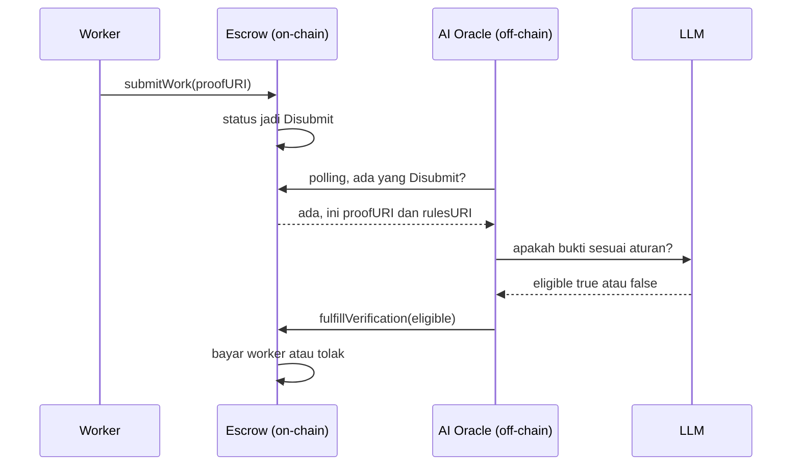

# Sesi 7 - Frontend: dApp UI

- Tanggal: Minggu, 16 Agustus 2026, 19.30-21.30 WIB
- Mentor: Fajar Jati Nugroho (@Beatless16) dan Fajar Ramadhan (@xfajarrr)
- Sumber: Notion, page id ad395160-5d98-8230-b6a7-81188b81c623
- Konversi: 16 Agustus 2026, lewat Notion internal API (loadPageChunk plus syncRecordValues untuk toggle children)
- Hasil render: 185 blok, 49 blok kode, 25 toggle, 0 blok gagal diresolusi
- Slide: Canva DAHSav2wvu8, 22 halaman, tersimpan di `Slide Canva/Sesi 7/` (gitignored), ringkasannya ada di bagian Lampiran di bawah
- Tautan pendek panitia: https://s.id/indonesia-web3-workshop-sesi-7

> [!NOTE]
> Materi ini menutup rangkaian: papan bounty yang selama ini cuma bisa disentuh lewat
> `cast` dan curl akhirnya punya antarmuka. Bagian 1 membangun papan baca-saja di atas
> backend Sesi 5-6 (tanpa wallet sama sekali), Bagian 2 memasang RainbowKit plus wagmi
> sehingga peserta menandatangani sendiri `approve`, `createBounty`, dan `submitWork`.
> Alamat kontrak di materi adalah deployment mentor (`0xd3ec...` token,
> `0xfecc...` factory), bukan deployment SURIOTA di `~/reward-token`.

> [!WARNING]
> Ini arsip verbatim materi mentor. Blok kode dipertahankan persis apa adanya, termasuk
> em-dash di dalam komentarnya. Yang diubah hanya em-dash pada PROSA, jadi hyphen, untuk
> kepatuhan gaya markdown. Catatan koreksi kami terhadap materi ini tidak ditulis di
> sini; tempatnya di `frontend/README.md` repo kode.

---


> [!NOTE]
> 

  **What You'll Learn In This Lesson:**

  <!-- table_of_contents -->

## 💠 Clone Starter


```bash
git clone https://github.com/DevWeb3Jogja/boootcamp-indonesia-web3-hacathon.git
cd boootcamp-indonesia-web3-hacathon

# terminal 1 — backend Sesi 6
cd backend && bun install && bun dev

# terminal 2 — frontend
cd frontend && bun install && bun dev
```


## Part 1


### 1.0 Setup

Install sdk yang diperlukan


```bash
bun install
```

tambahkan dependency untuk menjalankan papan sayembara


```bash
bun add viem @tanstack/react-query
```


> [!NOTE]
> 

  **Kenapa cuma viem di Bagian 1?** Karena seluruh papan dibaca dari **backend Sesi 5-6**, bukan langsung dari chain. viem di sini cuma dipakai untuk mengubah wei jadi angka RWD yang enak dibaca. Lapisan wallet baru dipasang di Bagian 2.


<details>
<summary>📋 `src/providers.tsx`- file baru + ubah `src/main.tsx`</summary>


```typescript
import { QueryClient, QueryClientProvider } from "@tanstack/react-query";
import type { ReactNode } from "react";

// Data papan tidak berubah tiap detik — tahan 10 detik biar tidak menghujani backend
const queryClient = new QueryClient({
  defaultOptions: { queries: { staleTime: 10_000 } },
});

export function Providers({ children }: { children: ReactNode }) {
  return <QueryClientProvider client={queryClient}>{children}</QueryClientProvider>;
}
```

Lalu di `src/main.tsx`:


```typescript
import { Providers } from "./providers";

createRoot(document.getElementById("root")!).render(
  <StrictMode>
    <Providers>
      <App />
    </Providers>
  </StrictMode>,
);
```


</details>


### 1.1 Ambil data backend


<details>
<summary>📋 `src/lib/api.ts` - file baru</summary>


```typescript
import type { Address } from "viem";
import type { Status } from "./contracts";

const BASE = (import.meta.env.VITE_API_URL ?? "http://localhost:3000").replace(/\/$/, "");

const get = async <T>(path: string): Promise<T> => {
  const res = await fetch(`${BASE}${path}`);
  if (!res.ok) throw new Error(`Backend balas ${res.status} untuk ${path}`);
  return res.json() as Promise<T>;
};

export type Bounty = {
  bounty_id: number;
  escrow: Address;
  creator: Address;
  reward_amount: string; // wei, string karena BigInt tidak muat di JSON
  tx_hash: string;
  block_number: number;
  created_at: number;
};

export type Verdict = {
  id: number;
  escrow: string;
  worker: string;
  eligible: 0 | 1;
  alasan: string;
  tx_hash: string | null;
  created_at: number;
};

export type EscrowDetail = {
  status: Status;
  creator: Address;
  rewardAmount: string;
  rulesURI: string;
  worker: Address;
  proofURI: string;
};

export const api = {
  board: () => get<{ total: number; bounties: Bounty[] }>("/board"),
  bounty: (escrow: string) => get<EscrowDetail>(`/bounty/${escrow}`),
  leaderboard: () =>
    get<{ leaderboard: { worker: Address; wins: number; total_reward: string }[] }>("/leaderboard"),
  verdicts: (escrow: string) => get<{ verdicts: Verdict[] }>(`/verdicts/${escrow}`),
  balance: (address: string) => get<{ balance: string }>(`/balance/${address}`),
};
```


</details>


### 1.2 Pemanis tampilan


<details>
<summary>📋 `src/lib/format.ts` - file baru</summary>


```typescript
import { formatEther } from "viem";

// 0x3B4f0135465d444a5bD06Ab90fC59B73916C85F5 → 0x3B4f…C85F5
export const pendek = (addr: string) => `${addr.slice(0, 6)}…${addr.slice(-4)}`;

// wei → "10 RWD"
export const rwd = (wei: string | bigint) =>
  `${Number(formatEther(BigInt(wei))).toLocaleString("id-ID")} RWD`;
```


</details>


### 1.3 Kartu bounty


<details>
<summary>📋 `src/components/bounty-card.tsx`- file baru</summary>


```typescript
import { Bot, ExternalLink } from "lucide-react";
import { useQuery } from "@tanstack/react-query";
import { Card, CardContent, CardHeader, CardTitle } from "@/components/ui/card";
import { api, type Bounty } from "@/lib/api";
import { EXPLORER, type Status } from "@/lib/contracts";
import { pendek, rwd } from "@/lib/format";

const warnaStatus: Record<Status, string> = {
  MenungguDana: "bg-muted text-muted-foreground",
  Dibuka: "bg-emerald-100 text-emerald-800",
  Disubmit: "bg-amber-100 text-amber-800",
  Selesai: "bg-blue-100 text-blue-800",
  Dibatalkan: "bg-red-100 text-red-800",
};

export function BountyCard({ bounty }: { bounty: Bounty }) {
  // Status live dari chain — tabel indexer bisa tertinggal beberapa detik
  const { data: detail } = useQuery({
    queryKey: ["bounty", bounty.escrow],
    queryFn: () => api.bounty(bounty.escrow),
  });
  const { data: verdictData } = useQuery({
    queryKey: ["verdicts", bounty.escrow],
    queryFn: () => api.verdicts(bounty.escrow),
  });

  const status = detail?.status;
  const verdicts = verdictData?.verdicts ?? [];

  return (
    <Card>
      <CardHeader>
        <CardTitle className="flex items-center justify-between gap-2">
          <span>Bounty #{bounty.bounty_id}</span>
          <span className="flex items-center gap-2">
            <span className="text-base">{rwd(bounty.reward_amount)}</span>
            <span className={`rounded-full px-2 py-0.5 text-xs font-normal ${status ? warnaStatus[status] : "bg-muted"}`}>
              {status ?? "…"}
            </span>
          </span>
        </CardTitle>
      </CardHeader>

      <CardContent className="space-y-3 text-sm">
        <div className="text-muted-foreground flex flex-wrap gap-x-4 gap-y-1">
          <span>Pembuat {pendek(bounty.creator)}</span>
          <a className="inline-flex items-center gap-1 hover:underline"
            href={`${EXPLORER}/address/${bounty.escrow}`} rel="noreferrer" target="_blank">
            Escrow {pendek(bounty.escrow)} <ExternalLink className="h-3 w-3" />
          </a>
        </div>

        {detail?.rulesURI && (
          <a className="text-primary inline-flex items-center gap-1 break-all hover:underline"
            href={detail.rulesURI} rel="noreferrer" target="_blank">
            Aturan bounty <ExternalLink className="h-3 w-3 shrink-0" />
          </a>
        )}

        {/* Alasan juri AI cuma ada di backend — chain simpan true/false doang */}
        {verdicts.map((v) => (
          <div key={v.id} className="bg-muted/40 rounded-lg border p-3">
            <p className="flex items-center gap-1.5 font-medium">
              <Bot className="h-4 w-4" />
              Juri AI: {v.eligible ? "DITERIMA" : "DITOLAK"}
            </p>
            <p className="text-muted-foreground mt-1">{v.alasan}</p>
          </div>
        ))}
      </CardContent>
    </Card>
  );
}
```


</details>


> [!NOTE]
> 

  Status diambil **live dari chain**, tapi **alasan** juri cuma ada di backend, chain hanya menyimpan `true`/`false`. Itulah kenapa Sesi 5-6 dibangun duluan.


### 1.4 Papan peringkat


<details>
<summary>📋 `src/components/leaderboard.tsx`- file baru</summary>


```typescript
import { Trophy } from "lucide-react";
import { useQuery } from "@tanstack/react-query";
import { Card, CardContent, CardHeader, CardTitle } from "@/components/ui/card";
import { Skeleton } from "@/components/ui/skeleton";
import { api } from "@/lib/api";
import { pendek, rwd } from "@/lib/format";

export function Leaderboard() {
  const { data, error, isPending } = useQuery({
    queryKey: ["leaderboard"],
    queryFn: api.leaderboard,
  });
  const rows = data?.leaderboard ?? [];

  return (
    <Card>
      <CardHeader>
        <CardTitle className="flex items-center gap-2">
          <Trophy className="h-4 w-4" />
          Peringkat Worker
        </CardTitle>
      </CardHeader>

      <CardContent>
        {isPending && <Skeleton className="h-24 w-full" />}
        {error && <p className="text-destructive text-sm">{error.message}</p>}
        {!isPending && !error && rows.length === 0 && (
          <p className="text-muted-foreground py-6 text-center text-sm">
            Belum ada yang menang. Jadilah yang pertama.
          </p>
        )}

        <ol className="space-y-2">
          {rows.map((r, i) => (
            <li key={r.worker} className="bg-muted flex items-center justify-between rounded-lg px-3 py-2 text-sm">
              <span className="flex items-center gap-3">
                <span className="w-5 text-center font-bold">{i + 1}</span>
                <span className="font-mono">{pendek(r.worker)}</span>
              </span>
              <span className="text-muted-foreground">
                {r.wins}× menang · <span className="text-foreground font-bold">{rwd(r.total_reward)}</span>
              </span>
            </li>
          ))}
        </ol>
      </CardContent>
    </Card>
  );
}
```


</details>


### 1.5 Rakit halaman


<details>
<summary>📋 `src/app.tsx` - ganti isi file</summary>


```typescript
import { RefreshCw } from "lucide-react";
import { useQuery } from "@tanstack/react-query";
import { Button } from "@/components/ui/button";
import { Skeleton } from "@/components/ui/skeleton";
import { Tabs, TabsContent, TabsList, TabsTrigger } from "@/components/ui/tabs";
import { BountyCard } from "@/components/bounty-card";
import { Leaderboard } from "@/components/leaderboard";
import { api } from "@/lib/api";

export function App() {
  const { data, error, isPending, isFetching, refetch } = useQuery({
    queryKey: ["board"],
    queryFn: api.board,
  });
  const bounties = data?.bounties ?? [];

  return (
    <div className="bg-background bg-grid min-h-screen">
      <header className="bg-background/80 sticky top-0 z-50 border-b backdrop-blur">
        <div className="mx-auto flex max-w-4xl items-center justify-between gap-3 px-4 py-3">
          <h1 className="font-bold">Papan Sayembara</h1>
        </div>
      </header>

      <main className="mx-auto max-w-4xl space-y-4 px-4 py-6">
        <Tabs defaultValue="papan">
          <TabsList>
            <TabsTrigger value="papan">Papan</TabsTrigger>
            <TabsTrigger value="peringkat">Peringkat</TabsTrigger>
          </TabsList>

          <TabsContent className="space-y-3" value="papan">
            <div className="flex items-center justify-between">
              <p className="text-muted-foreground text-sm">
                {data ? `${data.total} bounty on-chain, ${bounties.length} terindeks` : "Memuat…"}
              </p>
              <Button disabled={isFetching} size="sm" variant="outline" onClick={() => refetch()}>
                <RefreshCw className={`h-4 w-4 ${isFetching ? "animate-spin" : ""}`} />
                Muat ulang
              </Button>
            </div>

            {isPending && <Skeleton className="h-32 w-full" />}
            {error && (
              <p className="text-destructive text-sm">
                {error.message} — pastikan backend jalan (<code>bun dev</code> di folder backend).
              </p>
            )}

            {bounties.map((b) => (
              <BountyCard key={b.escrow} bounty={b} />
            ))}
          </TabsContent>

          <TabsContent value="peringkat">
            <Leaderboard />
          </TabsContent>
        </Tabs>
      </main>
    </div>
  );
}
```


</details>


### 🧪 Testing :

Buka `http://localhost:5173`. Yang harus kelihatan:

- daftar bounty dengan hadiah + status berwarna
- tab Peringkat berisi worker yang pernah menang
- kartu alasan juri AI di bounty yang sudah dinilai
**Wallet belum disentuh sama sekali,** buka di jendela penyamaran kalau mau membuktikan.


## Part 2


### 2.0 Pasang RainbowKit


```bash
bun add @rainbow-me/rainbowkit wagmi
```

Dua paket sekaligus karena RainbowKit berdiri di atas **wagmi** (logika chain). RainbowKit yang menyediakan modal "Connect Wallet", daftar wallet, dan pindah jaringan otomatis.


#### Ambil WalletConnect projectId

RainbowKit **menolak jalan** tanpa ini, halamannya blank total, bukan sekadar warning.

1. Buka [cloud.reown.com](https://cloud.reown.com), daftar (gratis)
2. Create project -> pilih tipe **AppKit** -> salin **Project ID**-nya
3. Bikin file `frontend/.env`:

```bash
VITE_API_URL=http://localhost:3000
VITE_WC_PROJECT_ID=projectid_punyamu_disini
```


<details>
<summary>📋 `src/shims/wagmi-connectors.ts` - file baru, tambalan versi</summary>

RainbowKit 2.2.11 masih mengimpor connector `gemini` dan `porto` dari `wagmi/connectors`, padahal **wagmi v3 sudah menghapus keduanya**. Tanpa file ini build gagal: `"gemini" is not exported`.


```typescript
export * from "wagmi-connectors-asli";

const dihapus = (nama: string) => () => {
  throw new Error(`Connector "${nama}" sudah dihapus di wagmi v3.`);
};

export const gemini = dihapus("gemini");
export const porto = dihapus("porto");
```

Lalu arahkan `wagmi/connectors` ke file itu di `vite.config.ts`:


```typescript
resolve: {
  alias: {
    // Urutan penting: yang spesifik dulu, baru alias umum
    "wagmi/connectors": path.resolve(__dirname, "./src/shims/wagmi-connectors.ts"),
    "wagmi-connectors-asli": path.resolve(__dirname, "./node_modules/wagmi/dist/esm/exports/connectors.js"),
    "@": path.resolve(__dirname, "./src"),
  },
},
```

Dan di `tsconfig.app.json`, tambahkan ke `paths` biar `tsc` ikut paham:


```json
"paths": {
  "@/*": ["./src/*"],
  "wagmi/connectors": ["./src/shims/wagmi-connectors.ts"],
  "wagmi-connectors-asli": ["./node_modules/wagmi/dist/types/exports/connectors.d.ts"]
}
```

Hapus semua ini begitu RainbowKit rilis versi yang mendukung wagmi v3.


</details>


### 2.1 Tambah ABI

Sekarang kita benar-benar memanggil kontrak, jadi butuh **ABI,** daftar fungsi yang boleh dipanggil.


<details>
<summary>📋 `src/lib/contracts.ts`- tambahkan ke file yang sudah ada</summary>

Import di paling atas:


```typescript
import { parseAbi } from "viem";
```

Lalu tempel di akhir file:


```typescript
export const bountyFactoryAbi = parseAbi([
  "function totalBounties() view returns (uint256)",
  "function oracle() view returns (address)",
  "function createBounty(uint256 rewardAmount, string rulesURI, uint256 submissionDeadline) returns (address)",
  "event BountyCreated(uint256 indexed bountyId, address indexed escrow, address indexed creator, uint256 rewardAmount)",
]);

export const bountyEscrowAbi = parseAbi([
  "function status() view returns (uint8)",
  "function submitWork(string proofURI)",
]);

export const rewardTokenAbi = parseAbi([
  "function balanceOf(address account) view returns (uint256)",
  "function allowance(address owner, address spender) view returns (uint256)",
  "function approve(address spender, uint256 amount) returns (bool)",
]);
```

Sama persis dengan `backend/src/contracts.ts` - memang sengaja, kontraknya kan satu.


</details>


### 2.2 Config chain & wallet


<details>
<summary>📋 `src/lib/wagmi.ts`- file baru</summary>


```typescript
import { getDefaultConfig } from "@rainbow-me/rainbowkit";
import {
  binanceWallet,
  injectedWallet,
  metaMaskWallet,
  walletConnectWallet,
} from "@rainbow-me/rainbowkit/wallets";
import { fallback, http } from "viem";
import { bscTestnet } from "wagmi/chains";

export const CHAIN = bscTestnet;

// RPC publik suka mati mendadak → fallback berperingkat, sama seperti backend
const RPC_URLS = [
  import.meta.env.VITE_RPC_URL,
  "https://bnb-testnet.api.onfinality.io/public",
  "https://bsc-testnet-rpc.publicnode.com",
].filter(Boolean) as string[];

export const config = getDefaultConfig({
  appName: "Papan Sayembara",
  projectId: import.meta.env.VITE_WC_PROJECT_ID,
  chains: [CHAIN],
  transports: {
    [CHAIN.id]: fallback(
      RPC_URLS.map((url) => http(url)),
      { rank: true },
    ),
  },
  wallets: [
    {
      groupName: "Direkomendasikan",
      // binanceWallet sudah bawaan RainbowKit — paket @binance/w3w-* tidak perlu
      wallets: [binanceWallet, metaMaskWallet, injectedWallet, walletConnectWallet],
    },
  ],
});
```


</details>


### 2.3 Tambah wallet ke pembungkus


<details>
<summary>📋 `src/providers.tsx`- file baru + ubah `src/main.tsx`</summary>


```typescript
import "@rainbow-me/rainbowkit/styles.css";

import { RainbowKitProvider } from "@rainbow-me/rainbowkit";
import { QueryClient, QueryClientProvider } from "@tanstack/react-query";
import type { ReactNode } from "react";
import { WagmiProvider } from "wagmi";
import { config } from "@/lib/wagmi";

const queryClient = new QueryClient();

export function Providers({ children }: { children: ReactNode }) {
  return (
    <WagmiProvider config={config}>
      <QueryClientProvider client={queryClient}>
        <RainbowKitProvider>{children}</RainbowKitProvider>
      </QueryClientProvider>
    </WagmiProvider>
  );
}
```

Urutannya tidak boleh tertukar: Wagmi -> Query -> RainbowKit. Lalu di `src/main.tsx`:


```typescript
import { Providers } from "./providers";

createRoot(document.getElementById("root")!).render(
  <StrictMode>
    <Providers>
      <App />
    </Providers>
  </StrictMode>,
);
```


</details>


### 2.4 Transaksi


<details>
<summary>📋 `src/lib/actions.ts`- file baru - inti sesi ini</summary>


```typescript
import { maxUint256, parseEther, parseEventLogs, type Address } from "viem";
import { getGasPrice, readContract, waitForTransactionReceipt, writeContract } from "wagmi/actions";
import { bountyEscrowAbi, bountyFactoryAbi, CONTRACTS, rewardTokenAbi } from "./contracts";
import { config } from "./wagmi";

// BSC testnet menolak EIP-1559 → gasPrice eksplisit bikin transaksi jadi legacy
const gasPrice = () => getGasPrice(config);

// Factory menarik RWD dari dompet pembuat saat createBounty → butuh izin sekali di awal
const ensureApproval = async (account: Address, amount: bigint) => {
  const allowance = await readContract(config, {
    address: CONTRACTS.rewardToken,
    abi: rewardTokenAbi,
    functionName: "allowance",
    args: [account, CONTRACTS.bountyFactory],
  });
  if (allowance >= amount) return;

  const hash = await writeContract(config, {
    address: CONTRACTS.rewardToken,
    abi: rewardTokenAbi,
    functionName: "approve",
    args: [CONTRACTS.bountyFactory, maxUint256],
    gasPrice: await gasPrice(),
  });
  await waitForTransactionReceipt(config, { hash });
};

// Bikin bounty: approve (bila perlu) → createBounty → alamat escrow diambil dari event
export const createBounty = async (
  account: Address,
  reward: string,
  rulesURI: string,
  deadlineJam: number,
) => {
  const amount = parseEther(reward); // RWD 18 desimal: "10" → 10e18
  await ensureApproval(account, amount);

  const deadline = BigInt(Math.floor(Date.now() / 1000) + deadlineJam * 3600);
  const hash = await writeContract(config, {
    address: CONTRACTS.bountyFactory,
    abi: bountyFactoryAbi,
    functionName: "createBounty",
    args: [amount, rulesURI, deadline],
    gasPrice: await gasPrice(),
  });

  // Alamat escrow tidak ada di return value tx — satu-satunya sumber adalah event
  const receipt = await waitForTransactionReceipt(config, { hash });
  const [log] = parseEventLogs({
    abi: bountyFactoryAbi,
    eventName: "BountyCreated",
    logs: receipt.logs,
  });
  return { hash, escrow: log?.args.escrow };
};

// Kirim bukti kerjaan ke satu bounty
export const submitWork = async (escrow: Address, proofURI: string) => {
  const hash = await writeContract(config, {
    address: escrow,
    abi: bountyEscrowAbi,
    functionName: "submitWork",
    args: [proofURI],
    gasPrice: await gasPrice(),
  });
  await waitForTransactionReceipt(config, { hash });
  return { hash };
};

// Pesan revert viem panjang sekali — ambil baris pertama yang berguna buat peserta
export const pesanError = (e: unknown) => {
  const msg = e instanceof Error ? (("shortMessage" in e && e.shortMessage) as string) || e.message : String(e);
  if (/User rejected|denied/i.test(msg)) return "Transaksi dibatalkan di wallet.";
  return msg.split("\n")[0];
};
```


</details>


> [!NOTE]
> 

  **Wallet bisa minta DUA tanda tangan** waktu pertama kali bikin bounty: `approve` dulu, baru `createBounty`. Bukan nge-hang - approve-nya `maxUint256`, jadi cuma sekali seumur wallet.


### 2.5 Tombol wallet


<details>
<summary>📋 `src/components/connect-wallet.tsx`- file baru</summary>


```typescript
import { ConnectButton } from "@rainbow-me/rainbowkit";
import { useQuery } from "@tanstack/react-query";
import { formatEther } from "viem";
import { useAccount } from "wagmi";
import { api } from "@/lib/api";

export function ConnectWallet() {
  const { address } = useAccount();
  const { data } = useQuery({
    queryKey: ["balance", address],
    queryFn: () => api.balance(address!),
    enabled: Boolean(address), // jangan jalan sebelum wallet tersambung
  });

  return (
    <div className="flex items-center gap-2">
      {data && (
        <span className="bg-muted rounded-lg px-3 py-1.5 text-sm font-bold">
          {Number(formatEther(BigInt(data.balance))).toLocaleString("id-ID")} RWD
        </span>
      )}
      <ConnectButton accountStatus="address" chainStatus="icon" showBalance={false} />
    </div>
  );
}
```

Seluruh modal wallet, ganti akun, dan pindah jaringan ditangani `<ConnectButton />`. Kita cuma menempelkan saldo RWD di sebelahnya.


</details>


### 2.6 Form bikin bounty


<details>
<summary>📋 `src/components/create-bounty.tsx`- file baru</summary>


```typescript
import { useState } from "react";
import { Loader2, PlusCircle } from "lucide-react";
import { useMutation, useQueryClient } from "@tanstack/react-query";
import type { Address } from "viem";
import { Button } from "@/components/ui/button";
import { Card, CardContent, CardDescription, CardHeader, CardTitle } from "@/components/ui/card";
import { Input } from "@/components/ui/input";
import { TransactionDialog } from "@/components/ui/dialog-transaction";
import { createBounty, pesanError } from "@/lib/actions";

export function CreateBounty({ account }: { account?: Address }) {
  const [reward, setReward] = useState("10");
  const [rulesURI, setRulesURI] = useState("");
  const [deadlineJam, setDeadlineJam] = useState("48");
  const queryClient = useQueryClient();

  const bikin = useMutation({
    // Bisa dua tanda tangan: approve dulu (kalau izinnya belum ada), baru createBounty
    mutationFn: () => createBounty(account!, reward, rulesURI.trim(), Number(deadlineJam)),
    onSuccess: () => {
      setRulesURI("");
      // Papan & saldo berubah setelah tx → suruh ambil ulang
      queryClient.invalidateQueries({ queryKey: ["board"] });
      queryClient.invalidateQueries({ queryKey: ["balance", account] });
    },
  });

  return (
    <Card>
      <CardHeader>
        <CardTitle className="flex items-center gap-2">
          <PlusCircle className="h-4 w-4" />
          Bikin Bounty
        </CardTitle>
        <CardDescription>
          Hadiah RWD dikunci di escrow sampai juri AI memutuskan. Butuh RWD di wallet-mu.
        </CardDescription>
      </CardHeader>

      <CardContent className="space-y-3">
        <label className="block space-y-1 text-sm">
          <span className="text-muted-foreground">Hadiah (RWD)</span>
          <Input type="number" value={reward} onChange={(e) => setReward(e.target.value)} />
        </label>

        <label className="block space-y-1 text-sm">
          <span className="text-muted-foreground">URL aturan bounty</span>
          <Input placeholder="https://raw.githubusercontent.com/…/DEMO-RULES.md"
            value={rulesURI} onChange={(e) => setRulesURI(e.target.value)} />
        </label>

        <label className="block space-y-1 text-sm">
          <span className="text-muted-foreground">Deadline (jam dari sekarang)</span>
          <Input type="number" value={deadlineJam} onChange={(e) => setDeadlineJam(e.target.value)} />
        </label>

        <Button className="w-full"
          disabled={!account || !rulesURI.trim() || !Number(reward) || bikin.isPending}
          onClick={() => bikin.mutate()}>
          {bikin.isPending ? <Loader2 className="mr-1 h-4 w-4 animate-spin" /> : null}
          {bikin.isPending ? "Menunggu tanda tangan…" : account ? "Bikin Bounty" : "Sambungkan wallet dulu"}
        </Button>

        {bikin.error && <p className="text-destructive text-sm">{pesanError(bikin.error)}</p>}
      </CardContent>

      <TransactionDialog
        description="Bounty-mu sudah dibuat. Indexer butuh beberapa detik untuk menampilkannya di papan."
        hash={bikin.data?.hash ?? ""}
        open={Boolean(bikin.data?.hash)}
        title="Bounty dibuat!"
        onOpenChange={() => bikin.reset()}
      />
    </Card>
  );
}
```


</details>


### 2.7 Form submit di kartu bounty


<details>
<summary>📋 `src/components/bounty-card.tsx` - tambahkan</summary>

Import tambahan:


```typescript
import { useState } from "react";
import { Bot, ExternalLink, Loader2, Send } from "lucide-react";
import { useMutation, useQuery, useQueryClient } from "@tanstack/react-query";
import type { Address } from "viem";
import { Button } from "@/components/ui/button";
import { Input } from "@/components/ui/input";
import { pesanError, submitWork } from "@/lib/actions";
```

Ganti tanda tangan fungsi + tambah mutation:


```typescript
export function BountyCard({ bounty, account }: { bounty: Bounty; account?: Address }) {
  const [proof, setProof] = useState("");
  const queryClient = useQueryClient();

  const kirim = useMutation({
    mutationFn: () => submitWork(bounty.escrow, proof.trim()),
    onSuccess: () => {
      setProof("");
      // Status berubah di chain → papan dan detail bounty ini wajib diambil ulang
      queryClient.invalidateQueries({ queryKey: ["board"] });
      queryClient.invalidateQueries({ queryKey: ["bounty", bounty.escrow] });
    },
  });
```

Tempel sebelum `</CardContent>`:


```typescript
{/* Cuma bounty yang masih Dibuka yang menerima submission */}
{status === "Dibuka" &&
  (account ? (
    <div className="flex gap-2 pt-1">
      <Input disabled={kirim.isPending} placeholder="URL bukti kerjaan (raw.githubusercontent.com/…)"
        value={proof} onChange={(e) => setProof(e.target.value)} />
      <Button disabled={!proof.trim() || kirim.isPending} onClick={() => kirim.mutate()}>
        {kirim.isPending ? <Loader2 className="h-4 w-4 animate-spin" /> : <Send className="h-4 w-4" />}
        Kirim
      </Button>
    </div>
  ) : (
    <p className="text-muted-foreground">Sambungkan wallet untuk mengirim bukti kerjaan.</p>
  ))}

{kirim.error && <p className="text-destructive">{pesanError(kirim.error)}</p>}
```


</details>


### 2.8 Pasang semuanya


<details>
<summary>📋 `src/app.tsx`- tambahkan wallet + tab Bikin Bounty</summary>

Import tambahan:


```typescript
import { useAccount } from "wagmi";
import { ConnectWallet } from "@/components/connect-wallet";
import { CreateBounty } from "@/components/create-bounty";
```

Di dalam `App()`:


```typescript
const { address } = useAccount();
```

Di header, sebelah `<h1>`:


```typescript
<ConnectWallet />
```

Tab baru + kartu yang sekarang tahu wallet:


```typescript
<TabsTrigger value="bikin">Bikin Bounty</TabsTrigger>

<TabsContent value="bikin">
  <CreateBounty account={address} />
</TabsContent>

{bounties.map((b) => (
  <BountyCard key={b.escrow} account={address} bounty={b} />
))}
```

Tidak ada lagi prop `onChanged`/`onCreated` - komponen memberi tahu perubahan lewat `invalidateQueries`, jadi induknya tidak perlu tahu apa-apa.


</details>


### 🧪 Testing :


> [!NOTE]
> 

  Bounty dari Sesi 6 sudah **kedaluwarsa** (deadline 24 jam). Submit ke sana akan revert `DeadlineLewat()`. Jadi mulai dengan bikin bounty baru pakai deadline yang panjang.

4. **Sambungkan wallet.** Klik Connect Wallet -> pilih wallet-mu. RainbowKit otomatis menawarkan pindah ke BSC Testnet.
5. **Bikin bounty.** Tab Bikin Bounty -> hadiah `5`, deadline `48` jam, dan aturan ini:

```
https://raw.githubusercontent.com/DevWeb3Jogja/boootcamp-indonesia-web3-hacathon/da87a895de207bb6cea797a4e52d6903216fa15a/DEMO-RULES.md
```

6. **Tunggu muncul di papan.** Indexer butuh beberapa detik - klik Muat ulang.
7. **Jadi worker.** Tukar bounty dengan teman sebelah, tempel URL bukti kerjaan, Kirim. Status berubah jadi `Disubmit`.
8. **Mentor menjalankan juri AI** (`bun oracle`). Beberapa detik kemudian kartu bounty menampilkan **DITERIMA/DITOLAK beserta alasannya**, status jadi `Selesai`, dan pemenangnya naik ke papan peringkat.

## Tambahan


### 1. Tab My Wallet :

Bounty yang kamu buat + submission-mu, dari `GET /wallet/:address`.


<details>
<summary>📋 `src/lib/api.ts` - tambahkan tipe + endpoint</summary>

Tipe baru, tempel di atas `Verdict`:


```typescript
export type Submission = {
  id: number;
  escrow: Address;
  worker: Address;
  proof_uri: string;
  status: "submitted" | "rewarded" | "rejected";
  reward_amount: string | null;
  tx_hash: string;
  block_number: number;
  created_at: number;
};
```

Lalu tambahkan satu baris di dalam objek `api`:


```typescript
wallet: (address: string) =>
  get<{ bounties: Bounty[]; submissions: Submission[] }>(`/wallet/${address}`),
```


</details>


<details>
<summary>📋 `src/components/punyaku.tsx` - file baru</summary>


```typescript
import { ExternalLink, Inbox } from "lucide-react";
import { useQuery } from "@tanstack/react-query";
import type { Address } from "viem";
import { Card, CardContent, CardHeader, CardTitle } from "@/components/ui/card";
import { Skeleton } from "@/components/ui/skeleton";
import { api } from "@/lib/api";
import { EXPLORER } from "@/lib/contracts";
import { pendek, rwd, waktu } from "@/lib/format";

const labelStatus = {
  submitted: "Menunggu juri",
  rewarded: "Menang",
  rejected: "Ditolak",
} as const;

export function Punyaku({ account }: { account?: Address }) {
  const { data, error, isPending } = useQuery({
    queryKey: ["wallet", account],
    queryFn: () => api.wallet(account!),
    enabled: Boolean(account),
  });

  if (!account)
    return (
      <Card>
        <CardContent className="text-muted-foreground py-8 text-center text-sm">
          Sambungkan wallet untuk melihat aktivitasmu.
        </CardContent>
      </Card>
    );

  if (isPending) return <Skeleton className="h-40 w-full" />;
  if (error) return <p className="text-destructive text-sm">{error.message}</p>;

  const { bounties = [], submissions = [] } = data ?? {};

  return (
    <div className="space-y-4">
      <Card>
        <CardHeader>
          <CardTitle className="flex items-center gap-2">
            <Inbox className="h-4 w-4" />
            Bounty yang kamu buat
            <span className="text-muted-foreground ml-auto text-sm font-normal">{bounties.length}</span>
          </CardTitle>
        </CardHeader>
        <CardContent className="space-y-2 text-sm">
          {bounties.length === 0 && (
            <p className="text-muted-foreground py-4 text-center">Belum ada. Bikin satu di tab sebelah.</p>
          )}
          {bounties.map((b) => (
            <div key={b.escrow} className="bg-muted flex items-center justify-between rounded-lg px-3 py-2">
              <span>
                Bounty #{b.bounty_id} · <span className="font-bold">{rwd(b.reward_amount)}</span>
              </span>
              <a
                className="text-muted-foreground inline-flex items-center gap-1 font-mono text-xs hover:underline"
                href={`${EXPLORER}/address/${b.escrow}`}
                rel="noreferrer"
                target="_blank"
              >
                {pendek(b.escrow)} <ExternalLink className="h-3 w-3" />
              </a>
            </div>
          ))}
        </CardContent>
      </Card>

      <Card>
        <CardHeader>
          <CardTitle className="flex items-center gap-2">
            Bukti kerjaan yang kamu kirim
            <span className="text-muted-foreground ml-auto text-sm font-normal">{submissions.length}</span>
          </CardTitle>
        </CardHeader>
        <CardContent className="space-y-2 text-sm">
          {submissions.length === 0 && (
            <p className="text-muted-foreground py-4 text-center">Belum ada submission.</p>
          )}
          {submissions.map((s) => (
            <div key={s.tx_hash} className="bg-muted space-y-1 rounded-lg px-3 py-2">
              <div className="flex items-center justify-between">
                <span className="font-medium">{labelStatus[s.status]}</span>
                <span className="text-muted-foreground text-xs">{waktu(s.created_at)}</span>
              </div>
              <a
                className="text-primary block truncate text-xs hover:underline"
                href={s.proof_uri}
                rel="noreferrer"
                target="_blank"
              >
                {s.proof_uri}
              </a>
              {s.reward_amount && <p className="text-xs font-bold">Hadiah {rwd(s.reward_amount)}</p>}
            </div>
          ))}
        </CardContent>
      </Card>
    </div>
  );
}
```


</details>


<details>
<summary>📋 `src/app.tsx` - pasang tabnya</summary>


```typescript
import { Punyaku } from "@/components/punyaku";
```


```typescript
<TabsTrigger value="punyaku">Punyaku</TabsTrigger>

<TabsContent value="punyaku">
  <Punyaku account={address} />
</TabsContent>
```


</details>


> [!NOTE]
> 

  `waktu()` dipakai di sini - kalau di `format.ts` kamu belum ada, tambahkan:

  `export const waktu = (ms: number) => new Date(ms).toLocaleString("id-ID", { dateStyle: "medium", timeStyle: "short" });`


---


### 2. Auto Refresh :

Dengarkan event chain pakai `useWatchContractEvent`, lalu suruh react-query mengambil ulang. Tombol Muat ulang jadi cadangan saja.


<details>
<summary>📋 `src/lib/contracts.ts` - tambahkan event escrow</summary>

Tempel ke dalam `bountyEscrowAbi`:


```typescript
"event WorkSubmitted(address indexed worker, string proofURI)",
"event RewardReleased(address indexed worker, uint256 rewardAmount)",
"event WorkRejected(address indexed worker)",
```


</details>


<details>
<summary>📋 `src/hooks/use-auto-refresh.ts` - file baru</summary>


```typescript
import { useQueryClient } from "@tanstack/react-query";
import type { Address } from "viem";
import { useWatchContractEvent } from "wagmi";
import { bountyEscrowAbi, bountyFactoryAbi, CONTRACTS } from "@/lib/contracts";

export function useAutoRefresh(escrows: Address[]) {
  const queryClient = useQueryClient();
  const segarkanPapan = () => queryClient.invalidateQueries({ queryKey: ["board"] });

  // Bounty baru dibuat orang lain → papan bertambah
  useWatchContractEvent({
    address: CONTRACTS.bountyFactory,
    abi: bountyFactoryAbi,
    eventName: "BountyCreated",
    onLogs: segarkanPapan,
  });

  // Status escrow berubah. Satu watcher per event, alamatnya semua escrow yang tampil.
  const segarkanEscrow = (logs: { address: Address }[]) => {
    segarkanPapan();
    for (const log of logs) {
      queryClient.invalidateQueries({ queryKey: ["bounty", log.address] });
      queryClient.invalidateQueries({ queryKey: ["verdicts", log.address] });
    }
  };

  useWatchContractEvent({
    address: escrows,
    abi: bountyEscrowAbi,
    eventName: "WorkSubmitted",
    onLogs: segarkanEscrow,
    enabled: escrows.length > 0,
  });

  useWatchContractEvent({
    address: escrows,
    abi: bountyEscrowAbi,
    eventName: "RewardReleased",
    onLogs: (logs) => {
      segarkanEscrow(logs);
      queryClient.invalidateQueries({ queryKey: ["leaderboard"] });
    },
    enabled: escrows.length > 0,
  });

  useWatchContractEvent({
    address: escrows,
    abi: bountyEscrowAbi,
    eventName: "WorkRejected",
    onLogs: segarkanEscrow,
    enabled: escrows.length > 0,
  });
}
```


</details>


<details>
<summary>📋 `src/app.tsx` - panggil hooknya</summary>


```typescript
import { useAutoRefresh } from "@/hooks/use-auto-refresh";
```

Tepat di bawah `const bounties = ...`:


```typescript
// Dengarkan event chain → papan menyegarkan dirinya sendiri
useAutoRefresh(bounties.map((b) => b.escrow));
```


</details>


> [!NOTE]
> 

  `address` boleh diisi **array** - viem menerima `Address | Address[]`. Tapi RPC publik gratis sering menolak `eth_newFilter`; viem otomatis mundur ke polling, jadi jedanya beberapa detik, bukan instan.


---


### 3. Hitung mundur deadline :


<details>
<summary>📋 `src/lib/contracts.ts` - tambahkan getternya</summary>

Tempel ke dalam `bountyEscrowAbi`:


```typescript
"function submissionDeadline() view returns (uint256)",
```


</details>


<details>
<summary>📋 `src/hooks/use-hitung-mundur.ts` - file baru</summary>


```typescript
import { useEffect, useState } from "react";

export function useHitungMundur(deadline?: bigint) {
  const [sekarang, setSekarang] = useState(() => Math.floor(Date.now() / 1000));
  const sisa = deadline === undefined ? undefined : Number(deadline) - sekarang;

  useEffect(() => {
    if (sisa === undefined || sisa <= 0) return;
    // Masih lama? cukup perbarui tiap 30 detik — biar tidak render 24 kartu tiap detik
    const jeda = sisa > 3600 ? 30_000 : 1000;
    const id = setInterval(() => setSekarang(Math.floor(Date.now() / 1000)), jeda);
    return () => clearInterval(id);
  }, [sisa === undefined, (sisa ?? 0) > 3600, (sisa ?? 0) <= 0]);

  if (sisa === undefined) return undefined;
  if (sisa <= 0) return { lewat: true, teks: "Deadline lewat" };

  const hari = Math.floor(sisa / 86400);
  const jam = Math.floor((sisa % 86400) / 3600);
  const menit = Math.floor((sisa % 3600) / 60);
  const detik = sisa % 60;

  const teks =
    hari > 0
      ? `${hari} hari ${jam} jam lagi`
      : jam > 0
        ? `${jam} jam ${menit} menit lagi`
        : `${menit}:${String(detik).padStart(2, "0")} lagi`;

  return { lewat: false, teks };
}
```


</details>


<details>
<summary>📋 `src/components/bounty-card.tsx` - pasang di kartu</summary>

Import tambahan:


```typescript
import { Bot, Clock, ExternalLink, Loader2, Send } from "lucide-react";
import { useReadContract } from "wagmi";
import { bountyEscrowAbi, EXPLORER, type Status } from "@/lib/contracts";
import { useHitungMundur } from "@/hooks/use-hitung-mundur";
```

Di dalam komponen, setelah query verdict:


```typescript
// Deadline tidak ada di API backend — baca langsung dari kontrak escrow
const { data: deadline } = useReadContract({
  address: bounty.escrow,
  abi: bountyEscrowAbi,
  functionName: "submissionDeadline",
});
const mundur = useHitungMundur(deadline);
```

Tampilkan di baris meta, sesudah link Escrow:


```typescript
{mundur && (
  <span className={`inline-flex items-center gap-1 ${mundur.lewat ? "text-destructive" : ""}`}>
    <Clock className="h-3 w-3" /> {mundur.teks}
  </span>
)}
```

Matikan tombol Kirim kalau sudah lewat:


```typescript
<Button
  disabled={!proof.trim() || kirim.isPending || mundur?.lewat}
  onClick={() => kirim.mutate()}
>
```

Dan beri tahu kenapa tombolnya mati - tempel sesudah blok form:


```typescript
{status === "Dibuka" && mundur?.lewat && (
  <p className="text-destructive">Deadline sudah lewat — submission ditolak kontrak.</p>
)}
```


</details>


> [!NOTE]
> 

  Saat diuji hari ini, ke-24 kartu menampilkan **"Deadline lewat"** - memang benar, semua bounty Sesi 6 dibuat dengan deadline 24 jam. Itu bukti hitung mundurnya membaca deadline asli dari chain, bukan tebakan.


---


### 4. Approve pas sejumlah hadiah :


<details>
<summary>📋 `src/lib/actions.ts` - dua baris</summary>

Buang `maxUint256` dari import:


```typescript
import { parseEther, parseEventLogs, type Address } from "viem";
```

Lalu di `ensureApproval`:


```typescript
args: [CONTRACTS.bountyFactory, amount], // pas sejumlah hadiah, bukan maxUint256
```


</details>

**Untung:** kalau factory-nya kena bug atau diganti jahat, yang bisa diambil cuma sejumlah hadiah bounty itu - bukan seluruh saldo RWD-mu selamanya. Ini pola yang dipakai wallet-wallet aman.

**Rugi:** izinnya habis tiap kali dipakai, jadi **tiap bikin bounty selalu dua tanda tangan**, bukan sekali seumur wallet. Gas naik, dan peserta lebih sering bingung mengira aplikasinya nge-hang.

<!-- button -->

> [!NOTE]
> 

  **Next Lesson:**


---

## Lampiran: ringkasan 22 slide Canva

Slide aslinya tersimpan sebagai gambar di `Slide Canva/Sesi 7/` yang sengaja tidak
ikut git (materi pihak ketiga, repo ini publik). Ringkasan di bawah dibuat supaya isinya
tetap terbaca tanpa berkas gambarnya. Isi slide seluruhnya konseptual: **tidak ada tugas,
PR, checklist penilaian, deadline, maupun kode absensi** di dalamnya.

| Slide | Pokok isi |
|---|---|
| 1 | Judul "Frontend - dApp UI", Bootcamp Sesi 07, Minggu 16 Agustus 2026 |
| 2 | Tautan code dan guide: https://s.id/indonesia-web3-workshop-sesi-7 |
| 3 | Rekap arsitektur Sesi 5-6: Backend API, AI Oracle, Smart Contract, Indexer, SQLite |
| 4 | Analogi API sebagai pelayan restoran |
| 5 | Sequence diagram verifikasi: Worker, Escrow, AI Oracle, LLM |
| 6 | Repo materi: github.com/DevWeb3Jogja/boootcamp-indonesia-web3-hacathon |
| 7 | Scope hari ini: frontend dApp duduk di atas semua yang dibangun minggu lalu |
| 8 | Tech stack: React, Vite, Bun, Node.js, viem, wagmi, RainbowKit |
| 9 | Prasyarat: terminal, Git, code editor, Node.js atau Bun |
| 10-13 | Teori frontend Web2: definisi, empat lapis, pipeline render browser, keamanan umum, penyimpanan di browser |
| 14 | Web2 vs Web3, alur dan tabel perbandingan |
| 15 | Flow READ: frontend, RPC node, blockchain, balik ke frontend. Tanpa wallet, tanpa gas |
| 16 | Flow WRITE: frontend, wallet menandatangani, RPC node, blockchain, tx receipt |
| 17-19 | RainbowKit: definisi dan perbandingan dengan membangun sendiri |
| 20-21 | wagmi (hooks React) dan viem (fondasi komunikasi blockchain) |
| 22 | Penutup, masuk sesi live coding |

### Tabel slide 14, Web2 vs Web3

| WEB2 | WEB3 |
|---|---|
| Ada server terpusat | Tidak ada server terpusat |
| Data disimpan di database | Data disimpan di blockchain |
| Frontend ke server ke database | Frontend ke wallet ke blockchain lewat node RPC |
| Server bisa mengubah atau menghapus data | Data transparan, immutable, tidak bisa diubah sepihak |

### Tabel slide 19, memakai RainbowKit atau tidak

| Tanpa RainbowKit, semua dibangun sendiri | Dengan RainbowKit, siap pakai |
|---|---|
| Membangun UI Connect Wallet dari nol | UI Connect Wallet yang modern dan konsisten |
| Integrasi banyak wallet dan connector | Dukungan banyak wallet populer |
| Mengurus state tersambung dan terputus | State management otomatis |
| Membuat UI pindah jaringan | UI pindah jaringan bawaan |
| Modal wallet dan QR WalletConnect | Modal dan QR bawaan |
| Menjaga responsif di mobile | Sudah responsif |
| Perawatan dan pembaruan berkelanjutan | Mudah diintegrasikan dan terus diperbarui |

### Tabel slide 12, empat lapis

| Lapisan | Tugas |
|---|---|
| User | Klik, isi form, atau melihat data |
| Frontend | Menampilkan tampilan dan mengirim request |
| Backend | Memproses request dan menjalankan logic |
| Database | Menyimpan atau mengambil data |

### Diagram slide 5, alur verifikasi



### Contoh kode slide 15 dan 16

Slide memakai abstraksi yang lebih rendah daripada kode Notion (Notion memakai hook
wagmi). Yang ditulis di slide:

```
// baca
const balance = await contract.balanceOf(address)
const data = await contract.getData(id)

// tulis
const tx = await contract.transfer(to, amount)
const signedTx = await walletClient.signTransaction(tx)
const hash = await publicClient.sendRawTransaction(signedTx)
```
