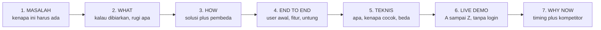

# Sesi 9 - Pitching Project (Learn How to Pitch dan Demo Day)

- Tanggal: **Minggu**, 30 Agustus 2026, 19.30-21.30 WIB (pengumuman panitia di Telegram menulis "Selasa", itu salah tulis; 30 Agustus 2026 jatuh hari Minggu, dan jadwal Luma resmi juga menulis Minggu)
- Mentor: Dev Web3 Jogja dan Alumni Dev Web3 Jogja (pembawa materi di slide: Ghoza / @godza256 dan Axel "bukan Rose" / @lexirieru)
- Slide (Canva): https://canva.link/gn69mo1sw84b9wx (deck `DAHTj7igjCk`, judul berkas "materi pitching", 43 halaman, arsip PNG di `Slide Canva/Sesi 9/`)
- Google Meet: https://meet.google.com/axr-bijz-wyi
- YouTube: https://youtube.com/live/j9oT6hzPHSA
- Absensi: https://bit.ly/AbsensiIndonesiaWeb3Hackathon
- Feedback workshop: https://bit.ly/web3jogja-feedback
- Dokumentasi komunitas: https://devweb3jogja.github.io/docs/
- Folder Drive Sesi 9: https://drive.google.com/drive/folders/1ImSaXULFBlX66yUQAMrrJhebNAIV_7sy (masih kosong per 30 Agustus 2026)
- Notion: belum ada halaman Sesi 9 saat arsip ini dibuat, jadi sumber tunggal sesi ini adalah slide

Empat QR di slide sudah dipecahkan supaya tautannya tidak hilang bersama gambarnya:

| Halaman | Label di slide | Tautan |
|:--:|:--|:--|
| 3 | All about Dev Web3 Jogja | https://linktr.ee/devweb3jogja |
| 4 | Join Slido yagesya!!! | https://app.sli.do/event/9XtGXtS6aUrqk1uyeLrHby |
| 33 | Ada pertanyaan? | https://app.sli.do/event/9XtGXtS6aUrqk1uyeLrHby (Slido yang sama dengan halaman 4) |
| 42 | Feedback | https://bit.ly/web3jogja-feedback |

> [!NOTE]
> Sesi 9 adalah sesi penutup kurikulum dan isinya bukan kode, melainkan cara
> menyusun pitch dan menjalankan demo. Inti materi ada di halaman 10 sampai 21 dan
> 24 sampai 26, ditambah halaman 32. Halaman 22, 23, dan 27 sampai 31 serta 34 sampai 37 adalah
> slide daur ulang dari deck Sesi 1 (perbandingan Web1/Web2/Web3, wallet, Remix,
> standar token) yang ikut terbawa di berkas Canva yang sama, bukan materi baru
> Sesi 9. Semuanya tetap ditranskripsi di bawah supaya arsip lengkap, tetapi
> diberi label asalnya.

> [!WARNING]
> Ini arsip transkripsi slide mentor. Teks dipertahankan sesuai isi slide.
> Yang diubah hanya gaya karakter di prosa (em-dash dan en-dash jadi hyphen,
> smart-quote jadi kutip lurus) demi kepatuhan gaya markdown repo ini.
> Tanggal "7 MEI 2026" yang tercetak di sampul dan penutup adalah sisa template
> Canva, bukan tanggal sesi.

---

## Peta halaman

| Halaman | Kelompok | Isi ringkas |
|:--:|:--|:--|
| 1 sampai 8 | Pembuka | Sampul, profil Dev Web3 Jogja, QR komunitas, QR Slido, profil Ghoza dan Axel |
| 9 | Pembuka | Peta perjalanan arsitektur (slide transisi) |
| 10 sampai 11 | Prinsip | "Jangan mulai dengan fitur", "Code wins arguments, but stories win hearts" |
| 12 sampai 14 | Beat 1 | MASALAH |
| 15 sampai 16 | Beat 2 | WHAT, apa yang terjadi jika masalah dibiarkan |
| 17 sampai 18 | Beat 3 | HOW, solusi dan nilainya |
| 19 sampai 20 | Beat 4 | Jelaskan projekmu, alur End to End tiga penjelasan |
| 21 | Beat 5 | Jelaskan hal teknis yang dipakai |
| 22 sampai 23 | Daur ulang Sesi 1 | Tabel banding Web1/Web2/Web3, judul perbandingan arsitektur data |
| 24 sampai 25 | Beat 6 | "Tidak hanya itu", Live demo |
| 26 | Beat 7 | Why, kenapa harus dibangun sekarang |
| 27 sampai 31 | Daur ulang Sesi 1 | Wallet sebagai solusi identitas, persiapan praktik, Remix, ERC20 dan ERC721 |
| 32 sampai 33 | Penutup materi | Contoh pitch video, QR sesi tanya jawab |
| 34 sampai 37 | Daur ulang Sesi 1 | Judul live coding, testing, deploy |
| 38 sampai 40 | Eksplorasi ide | Amati Tiru Modifikasi, tiga contoh ide, tiga platform hackathon |
| 41 sampai 43 | Penutup | Dokumentasi, QR feedback, terima kasih |

---

## Prinsip pembuka (halaman 10 sampai 11)

**Halaman 10.** "Jangan mulai dengan fitur"

**Halaman 11.**

> "Code wins arguments, but stories win hearts."

Banyak peserta hackathon terlalu terburu-buru membicarakan fitur teknis.
Juri tidak tertarik pada "apa" yang kamu buat di awal, tapi "mengapa" itu penting.

---

## Beat 1, MASALAH (halaman 12 sampai 14)

Mulai dari "kenapa projek ini harus ada".
Angkat masalah nyata yang relate dengan audiens atau juri.

Bagian pembuka ini penting banget karena di sinilah kamu bikin audiens peduli.
Jangan langsung lompat ke solusi. Mulai dari cerita sederhana tentang situasi yang
sering dialami orang, data singkat, atau contoh nyata yang relatable. Tujuannya
supaya audiens merasa, "Oh iya, ini memang masalah yang layak diselesaikan."
Semakin konkret masalahnya, semakin kuat pondasi pitch kamu.

---

## Beat 2, WHAT (halaman 15 sampai 16)

**Apa yang terjadi jika masalah ini dibiarkan?**

Setelah audiens paham masalahnya, kamu tarik mereka lebih dalam. Jelaskan
konsekuensinya kalau masalah ini dibiarkan. Bisa berupa dampak ekonomi, waktu yang
terbuang, risiko keamanan, atau pengalaman pengguna yang buruk. Bagian ini bikin
urgensi. Audiens jadi mengerti kenapa projekmu bukan sekadar eksperimen, tapi
sesuatu yang layak.

---

## Beat 3, HOW (halaman 17 sampai 18)

Tunjukkan bagaimana idemu **menjawab** masalah tadi dengan jelas.
Jangan jelaskan dengan nada datar, **beri energi** pada solusi ini.

Baru setelah urgensinya jelas, kamu masuk ke solusinya. Jelaskan inti konsepmu
tanpa bertele-tele. Fokus pada nilai yang ditawarkan dan apa yang membuat
pendekatanmu berbeda atau lebih baik dibanding yang sudah ada. Gaya jelasin di
bagian ini harus bikin audiens merasa, "Oh, ternyata simpel ya idenya," meskipun
di dalamnya ada teknologi yang kompleks.

---

## Beat 4, Jelaskan Projekmu dengan alur End to End (halaman 19 sampai 20)

Tiga penjelasan yang wajib ada, berurutan:

| Urutan | Pertanyaan yang dijawab |
|:--:|:--|
| Penjelasan 1 | Apa yang harus user lakukan di awal? |
| Penjelasan 2 | Penggunaan fitur fitur |
| Penjelasan 3 | Bagaimana user mendapatkan keuntungan? |

---

## Beat 5, Jelaskan hal teknis yang kamu gunakan (halaman 21)

Tidak perlu menjabarkan semua detail engineering yang rumit.
Cukup jelaskan teknologi apa yang dipakai, kenapa cocok, dan apa pembedanya.

---

## Beat 6, Live demo (halaman 24 sampai 25)

**Halaman 24.** "Tidak hanya itu"

**Halaman 25.** Live demo adalah jantung dari presentasi hackathon. Teori di poin
sebelumnya tidak ada gunanya tanpa bukti.

- **Fokus.** Jangan tunjukkan fitur login atau sign-up, itu membosankan. Langsung ke fitur utama yang menyelesaikan masalah.
- **Skenario.** Buat skenario pengguna yang sukses dari A sampai Z tanpa error.
- **Backup.** Selalu siapkan video rekaman kalau-kalau live demo gagal, karena koneksi atau bug tiba-tiba.

---

## Beat 7, Why (halaman 26)

Ide bagus di waktu yang salah itu percuma.
Kamu harus menjawab: **Kenapa solusi ini harus dibangun sekarang?**

Konteks Web3, misalnya, "Dulu ini tidak mungkin karena gas fee mahal, tapi dengan
L2/Blob transactions, model bisnis ini jadi masuk akal."

Sertakan data kompetitor yang valid.

---

## Contoh pitch video (halaman 32 sampai 33)

Halaman 32 adalah judul "Contoh Pitch Video" (video diputar langsung saat sesi,
tidak ada tautan tercetak di slide). Halaman 33 adalah QR "Ada pertanyaan?".

---

## Eksplorasi ide (halaman 38 sampai 40)

**Halaman 38.** Amati -> Tiru -> Modifikasi

**Halaman 39.** Tiga contoh ide turunan:

1. Absensi onchain
2. KTM onchain
3. Beasiswa transparan

**Halaman 40.** Tiga platform tempat mencari referensi dan mengikuti hackathon:

1. DoraHacks
2. Devfolio
3. HackQuest

---

## Slide daur ulang dari deck Sesi 1

Bagian ini bukan materi baru Sesi 9. Ditranskripsi supaya arsip halaman 1 sampai 43
lengkap dan nomor halaman tetap cocok dengan berkas PNG di `Slide Canva/Sesi 9/`.

### Tabel banding Web1, Web2, Web3 (halaman 22)

| Comparison | Web1 | Web2 | Web3 |
|:--|:--|:--|:--|
| **Fungsi Utama** | Halaman web statis berisi informasi yang hanya bisa dibaca. User hanya sebagai konsumen konten, tidak ada interaksi dua arah. (Read-only) | Aplikasi berjalan di server terpusat milik perusahaan. User berinteraksi langsung, platform mengontrol data dan aturan. (Platform-centric) | Aplikasi berjalan di atas smart contract pada blockchain. User berinteraksi langsung dengan protokol, tanpa perantara. (User-centric) |
| **Infrastruktur** | Static HTML files di web server (Apache, Nginx). Hosting sederhana, no database atau minimal flat-file. Konten di-update manual oleh webmaster. (Server statis) | AWS, GCP, Azure. Single point of failure. Scalable tapi bergantung pada provider. Data disimpan di database relasional (PostgreSQL, MySQL). (Server sentral) | Ribuan node menjalankan consensus. No single point of failure. Data on-chain immutable, off-chain via IPFS atau Arweave. Indexer (Ponder, The Graph) untuk query. (Node terdesentralisasi) |
| **Autentikasi** | Umumnya tidak ada. Jika ada, pakai HTTP Basic Auth atau session sederhana. Sebagian besar konten publik, tidak ada konsep user account. (Anonymous access) | Email plus password, OAuth (Google, GitHub). Platform menyimpan credentials dan session. User tidak memiliki identity-nya sendiri. (Identity via platform) | Wallet-based auth (MetaMask, Passkey). User menandatangani transaksi dengan private key. Tidak perlu registrasi, identity portable lintas dApps. (Self-sovereign identity) |
| **Distribusi nilai** | Tidak ada model monetisasi jelas. Web dipakai sebagai brosur digital atau informasi. Banner ads statis mulai muncul di era akhir. (Value ke publisher) | Revenue dari iklan atau subscription. Data user dimonetisasi oleh platform. Creator mendapat sebagian kecil. (Value ke platform) | Token incentives, fee langsung ke protokol atau LP. User memiliki aset digital (NFT, token). Governance via DAO, komunitas memiliki aset protokol. (Value ke user) |

### Halaman lain yang ikut terbawa

| Halaman | Isi |
|:--:|:--|
| 23 | Judul "Perbandingan Arsitektur Data" |
| 27 | "Solusi Identitas", wallet mengatasi fragmentasi identitas Web2 |
| 28 | "Persiapan praktik": instalasi MetaMask, amankan seed phrase, koneksi jaringan BSC (Sepolia/Testnet) lewat Chainlist, klaim faucet lewat https://forms.gle/3gSe5TqqeCALLJe1A |
| 29 | "Hands on", buka Remix IDE https://remix.ethereum.org/ |
| 30 | "Dualitas Nilai Token", ERC20 dan ERC721 |
| 31 | "Standar Token EVM", ERC20 dan ERC721 adalah standar token utama dalam ekosistem EVM |
| 34 | Judul "Let's create smart contract!" |
| 35 | Judul "End to end testing" |
| 36 | Judul "Let's deploy it!" |
| 37 | Judul "Exploring ideas" |

> [!TIP]
> Ejaan "BSC Sepolia" di halaman 28 adalah salah tulis mentor yang terbawa dari
> deck lama. Jaringan yang dipakai kurikulum ini adalah BSC Testnet chainId 97.
> Sepolia adalah testnet Ethereum, bukan BNB Chain.

---

## Kerangka pitch yang bisa dipakai ulang

Tujuh beat di atas dirangkum jadi satu urutan. Ini yang dipakai untuk menyusun
naskah pitch WattSettle di [WattSettle/15 Demo dan Pitch.md](../../WattSettle/15%20Demo%20dan%20Pitch.md).

Dua aturan yang paling sering dilanggar peserta menurut mentor:

1. Membuka pitch dengan daftar fitur, bukan dengan masalah.
2. Menghabiskan waktu live demo di layar login dan sign-up, bukan di fitur inti.

---

Arsip materi pihak ketiga untuk keperluan belajar. Slide milik Dev Web3 Jogja.

