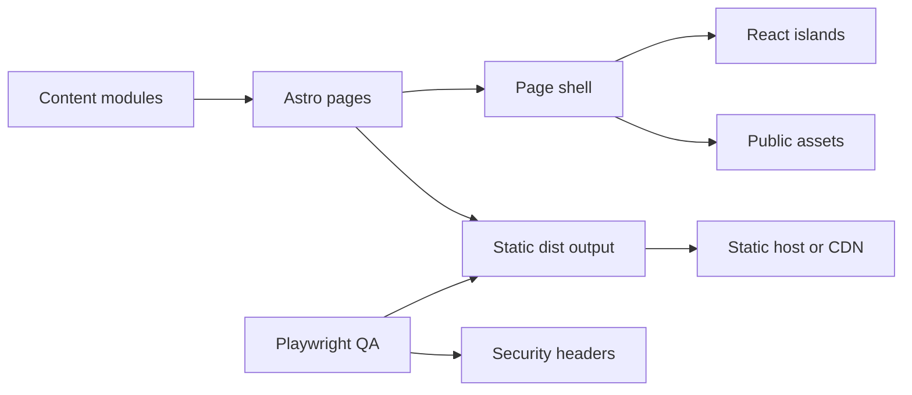

# 🧭 Architecture

  <svg width="720" height="120" viewBox="0 0 720 120" xmlns="http://www.w3.org/2000/svg" role="img" aria-label="WattSettle architecture icon">
    <rect x="10" y="18" width="150" height="72" rx="14" fill="#102018" stroke="#b8ff4d"/>
    <rect x="205" y="18" width="150" height="72" rx="14" fill="#111827" stroke="#4fd1ff"/>
    <rect x="400" y="18" width="150" height="72" rx="14" fill="#1d1722" stroke="#f5c451"/>
    <rect x="595" y="18" width="110" height="72" rx="14" fill="#161616" stroke="#f27d6b"/>
    <text x="48" y="58" fill="#f7f7ef" font-family="Arial" font-size="15">Content</text>
    <text x="248" y="58" fill="#f7f7ef" font-family="Arial" font-size="15">Astro</text>
    <text x="440" y="58" fill="#f7f7ef" font-family="Arial" font-size="15">Islands</text>
    <text x="617" y="58" fill="#f7f7ef" font-family="Arial" font-size="15">QA</text>
    <path d="M160 54 H205 M355 54 H400 M550 54 H595" stroke="#9bb0a5" stroke-width="3"/>
  </svg>

## 🎯 System Goal

WattSettle Web is a static pitch deck application. It presents a Finance and Commerce hackathon thesis with enough interactivity to make the settlement idea tangible in a browser.

| Goal | Architecture response |
|---|---|
| Fast pitch delivery | Static Astro build with minimal hydrated islands |
| Demo credibility | Deterministic simulator and settlement machine |
| Clear narrative control | Content modules in `src/content` |
| Production readiness | Static security headers, SEO, sitemap, and QA |
| Low operational burden | No backend service inside this web app |

## 🧱 Runtime Containers

## 📦 Components

| Component | Path | Responsibility |
|---|---|---|
| App shell | `src/layouts/PageShell.astro` | Document head, SEO, chrome, menu, navigation |
| Route map | `src/pages/[...slug].astro` | Maps slug to section component |
| Sitemap | `src/pages/sitemap.xml.ts` | Generates XML sitemap from nav data |
| Content | `src/content` | Single source of truth for pitch text and scoring |
| Sections | `src/components/sections` | One route level slide per component |
| Islands | `src/components/islands` | Interactive React widgets |
| Utilities | `src/lib` | Navigation, theme, sound, canvas |
| QA harness | `tests/e2e` | Static server and Playwright checks |
| Reports | `reports/qa` | Machine report and screenshots |

## 🔄 Data Flow

| Step | Source | Destination | Notes |
|---|---|---|---|
| 1 | `src/content` | Astro pages | Static import at build time |
| 2 | Astro pages | `dist` | HTML, CSS, JS, assets |
| 3 | Static host | Browser | Headers from the static header file or `vercel.json` |
| 4 | React islands | Browser state | UI only, no secret storage |
| 5 | Playwright | `reports/qa` | Writes test report and screenshots |

## 🔐 Security Boundary

| Boundary | Rule |
|---|---|
| Browser code | Public by design, no secrets |
| Local storage | Only UI preference such as `ws-theme` |
| Network | No runtime API dependency in this static app |
| Third party JS | None loaded from remote CDNs |
| CSP | Enforced in QA through production headers |

## 🧠 Architecture Decisions

| Decision | Reason | Tradeoff |
|---|---|---|
| Static Astro | Fast, cheap, reliable for pitch website | No server side personalization |
| React islands | Interactivity stays scoped | Hydration bootstrap needs CSP hashes |
| Content modules | Narrative is reviewable in TypeScript | Editors need code access |
| Playwright E2E | Catches visual, route, console, and CSP regressions | Slower than unit tests |
| Proprietary license | Protects hackathon pitch assets | External reuse requires permission |

## ✅ Quality Bar

| Quality | Target |
|---|---|
| Build | 18 pages plus sitemap |
| Console | 0 warnings and 0 errors |
| Security audit | 0 npm vulnerabilities |
| Visual QA | Desktop and mobile screenshots |
| Accessibility | Keyboard, focus, reduced motion, menu state |
