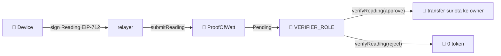

<div align="center">

<svg width="100%" height="12" viewBox="0 0 1200 12" preserveAspectRatio="none" xmlns="http://www.w3.org/2000/svg" role="img" aria-label="accent">
  <defs><linearGradient id="cbar" x1="0" y1="0" x2="1" y2="0">
    <stop offset="0" stop-color="#22c55e"/><stop offset="1" stop-color="#06b6d4"/>
    <animate attributeName="x2" values="1;1.5;1" dur="4s" repeatCount="indefinite"/>
  </linearGradient></defs>
  <rect width="1200" height="12" rx="6" fill="url(#cbar)"/>
</svg>

# 📄 ProofOfWatt.sol

### Kontrak DePIN energy oracle (base untuk WattSettle)

`Foundry` · `Solidity ^0.8.24` · `OpenZeppelin` · `EIP-712` · `6 test PASS`

</div>

> 🧭 Kontrak base Opsi 1 (ProofOfWatt). Opsi 5 dan 6 (WattSettle) adalah evolusinya: tambah struct attestation on-chain dan fee split. Strategi: [`../docs/02 Opsi 5 WattSettle.md`](<../docs/02 Opsi 5 WattSettle.md>).

---

## ⚙️ Cara Kerja



| Fungsi | Akses | Peran |
|:--|:--|:--|
| `registerDevice` | `DEFAULT_ADMIN_ROLE` | daftarkan device (signer, owner) |
| `submitReading` | publik | relay reading ter-sign, cek EIP-712, ts monotonic, anti-replay |
| `verifyReading` | `VERIFIER_ROLE` | approve (bayar) atau reject (0), keputusan AI |
| `setRewardPerKwh` | `DEFAULT_ADMIN_ROLE` | atur reward per kWh |

---

## 🔒 Catatan Audit

| Aspek | Status |
|:--|:--:|
| Verifikasi tanda tangan EIP-712 (ECDSA recover ke signer terdaftar) | ✅ |
| Anti replay (`usedDigest`) plus timestamp monotonic (`lastTs`) | ✅ |
| Access control terpisah (admin vs verifier) | ✅ |
| Checks effects interactions (status di-set sebelum transfer) | ✅ |
| Return value transfer dicek dengan `require` | ✅ |
| Overflow (Solidity 0.8 built in checks) | ✅ |
| Reward pool perlu **pre-fund** (payout dari saldo kontrak, bukan mint) | ⚠️ wajib |

> ⚠️ **Sebelum demo:** transfer kira kira 500.000 `suriota` ke alamat kontrak. Jika reward pool kosong, `verifyReading(approve)` akan revert saat transfer.

---

## 🧪 Menjalankan Test (Git Bash, bukan PowerShell)

```shell
cd proofofwatt
forge test -vvv
```

Cakupan 6 test: happy path (sign, submit, approve, pay), reject tanpa payout, revert bad signature, revert replay, revert stale timestamp, revert non verifier.

---

## ⛓️ Deploy Target

| Item | Nilai |
|:--|:--|
| Network | BNB Smart Chain Testnet |
| chainId | 97 |
| RPC | `https://bsc-testnet-rpc.publicnode.com` |
| Token reward | `suriota` `0x5f730750388176206cC3A7FE894c413675381B05` |
| Status | belum deploy, rencana Sesi 3 |

> 🔐 Private key ada di [`../.secrets/Wallet Testnet.txt`](<../.secrets/Wallet Testnet.txt>) (testnet only, gitignored). Jangan hardcode di script deploy, pakai variabel lingkungan.
