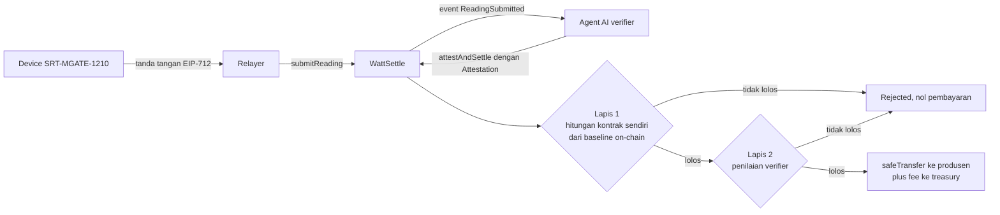

<div align="center">


&nbsp;

&nbsp;

&nbsp;


# WattSettle.sol

### Rel settlement energi DePIN: bacaan meter bertanda tangan, di-attest AI, dibayar on-chain

`Foundry` - `Solidity 0.8.30` - `OpenZeppelin 5.1` - `EIP-712` - `28 test PASS` - `ERC-8004 agentId 2116`

</div>

> [!NOTE]
> Kontrak ini adalah evolusi terkendali dari `ProofOfWatt.sol`, bukan proyek baru. Seluruh jalur
> kriptografis lama (EIP-712 recover, replay guard, monotonic guard) dipertahankan apa adanya,
> termasuk domain separator `ProofOfWatt/1`, supaya fixture tanda tangan device yang sudah ada
> tetap sah. Yang berubah hanya lapisan keputusan dan settlement.

---

## Daftar Isi

- [Alamat Live](#alamat-live)
- [Properti Keamanan Utama](#properti-keamanan-utama)
- [Bukti On-chain](#bukti-on-chain)
- [Cara Kerja](#cara-kerja)
- [Yang Membuat Keputusan AI Bisa Diaudit](#yang-membuat-keputusan-ai-bisa-diaudit)
- [Integrasi ERC-8004](#integrasi-erc-8004)
- [Catatan Keamanan](#catatan-keamanan)
- [Menjalankan](#menjalankan)
- [Struktur Repo](#struktur-repo)

---

## Alamat Live

Semuanya di BNB Smart Chain Testnet, chainId 97.

| Peran | Alamat |
|:--|:--|
| Kontrak `WattSettle` | [`0xCA0A97a70fF720447051bDa247F8EE87e7B8Bb12`](https://testnet.bscscan.com/address/0xCA0A97a70fF720447051bDa247F8EE87e7B8Bb12) |
| Token settlement `suriota` | [`0x5f730750388176206cC3A7FE894c413675381B05`](https://testnet.bscscan.com/address/0x5f730750388176206cC3A7FE894c413675381B05) |
| Agent AI verifier (`VERIFIER_ROLE`) | [`0xce4D51524eDECD04B5417F6C8B6E6B6b9e594291`](https://testnet.bscscan.com/address/0xce4D51524eDECD04B5417F6C8B6E6B6b9e594291) |
| Device SRT-MGATE-1210-#001 (signer) | `0xA532b1e8773EC9d7db671d346f801C9f8d0c8D49` |
| Produsen (penerima pembayaran) | [`0xE07aE16B2Ca0fA9Df8A667FD34729307C3333f8d`](https://testnet.bscscan.com/address/0xE07aE16B2Ca0fA9Df8A667FD34729307C3333f8d) |
| Treasury (penerima fee protokol) | [`0x703629a46690e30D546e80AA9B8F03538F3F5b0E`](https://testnet.bscscan.com/address/0x703629a46690e30D546e80AA9B8F03538F3F5b0E) |
| Source verified | [Sourcify `exact_match`](https://repo.sourcify.dev/97/0xCA0A97a70fF720447051bDa247F8EE87e7B8Bb12) |

> [!NOTE]
> `exact_match` berlaku untuk creation maupun runtime bytecode. Membangun ulang dari repo ini
> menghasilkan bytecode yang sama, dan satu-satunya selisih terhadap bytecode on-chain adalah
> nilai `immutable` yang memang baru disuntikkan saat konstruksi, yaitu alamat token settlement
> serta cache domain EIP-712 milik OpenZeppelin. Karena itu setiap perubahan pada berkas sumber,
> komentar sekalipun, akan mengubah metadata hash dan memutus kecocokan ini. Sumber di repo
> sengaja dijaga persis seperti yang di-deploy.

> [!IMPORTANT]
> Deployer **melepas** `VERIFIER_ROLE` miliknya sendiri di transaksi deploy. Sejak saat itu
> satu-satunya alamat yang bisa memicu settlement adalah wallet agent AI. Otonomi agent bukan
> klaim slide, ia bisa dibuktikan dengan satu panggilan `hasRole` di BscScan.

---

## Properti Keamanan Utama

Pertanyaan paling tajam yang bisa diajukan ke arsitektur mana pun yang memakai AI untuk
memutus pembayaran adalah: **apa yang terjadi kalau AI-nya berbohong?**

Jawabannya ada di kode, bukan di slide. Kontrak menyimpan `baselineKwh` per device on-chain
dan **menghitung sendiri** penyimpangan tiap bacaan. Gate-nya berlapis dua dan keduanya
harus lolos.

```solidity
// Lapis satu, hitungan kontrak sendiri dari baseline on-chain. Verifier tidak bisa mempengaruhinya.
(int256 chainDelta, uint16 chainAnomalyBps) = _assess(devices[s.deviceId].baselineKwh, s.kWh);
bool contractApproves = (chainAnomalyBps <= maxAnomalyBps) && (_abs(chainDelta) <= maxDeltaBound);

// Lapis dua, penilaian verifier. Hanya bisa memperketat, tidak pernah melonggarkan.
bool verifierApproves = (a.anomalyScoreBps <= maxAnomalyBps) && (_abs(a.kwhDeltaVsBaseline) <= maxDeltaBound);

bool approved = contractApproves && verifierApproves;
```

Konsekuensinya satu kalimat: **verifier yang berbohong tidak bisa memaksa pembayaran. Ia
memegang hak veto, bukan hak meloloskan.**

Verifier tetap berguna justru karena hak veto itu. Ia bisa menolak bacaan yang secara
aritmetika terlihat sempurna, misalnya karena melihat pola cuaca, kesehatan perangkat, atau
sinyal kecurangan yang tidak terlihat on-chain. Yang tidak bisa ia lakukan adalah meloloskan
apa yang sudah ditolak kontrak.

Ini **dibuktikan on-chain, bukan diklaim**. Sebuah attestation sengaja dibuat berbohong untuk
bacaan 900 kWh terhadap baseline 100, mengaku `kwhDeltaVsBaseline = 0` dan
`anomalyScoreBps = 0`. Kontrak menghitung sendiri 800 dan 10000 bps, lalu menolak, dan tidak
membayar sepeser pun:

[`0x7e8ba5a7...391781`](https://testnet.bscscan.com/tx/0x7e8ba5a7b1e09f33a8015c043383500276fda8ad59e61bac861f78ce98391781)

Siapa pun bisa mensimulasikan penilaian kontrak lebih dulu, tanpa mengirim apa pun, lewat tab
Read Contract:

```bash
cast call 0xCA0A97a70fF720447051bDa247F8EE87e7B8Bb12 \
  "assess(bytes32,uint256)(int256,uint16)" \
  0x0031a129f3c56572aefe8bb776a9bf495063f06a5388adb62ae2ee56455c1eb8 900 \
  --rpc-url https://bsc-testnet-rpc.publicnode.com
# 800
# 10000
```

---

## Bukti On-chain

Loop penuh sudah berjalan nyata, bukan simulasi.

| Langkah | Transaksi |
|:--|:--|
| Deploy `WattSettle` | [`0xe1b2fefc...f31e00`](https://testnet.bscscan.com/tx/0xe1b2fefcd43ad357b57a32f8b5cb2bc78c463bdc3b6bc998e25421f17cf31e00) |
| Daftar device dengan baseline 100 | [`0x196129ce...dc0c04`](https://testnet.bscscan.com/tx/0x196129ce1d95f05163540b9c4361ae7dae55c9c96a6b2053cf181ef571dc0c04) |
| Serahkan `VERIFIER_ROLE` ke agent | [`0x65813269...bc1283`](https://testnet.bscscan.com/tx/0x65813269a68ab835d3b58dc9bd227af13c1d0e2bea841bed567b424bacbc1283) |
| Deployer lepas `VERIFIER_ROLE` | [`0x90a9b8dd...f9003c`](https://testnet.bscscan.com/tx/0x90a9b8dd86db228c49d185a244732d495868c3e4c6e64e34f1ccb8a0c7f9003c) |
| Pre-fund reward pool | [`0x30e1d998...6c7dbc`](https://testnet.bscscan.com/tx/0x30e1d99874395fa3653813c600cc56705bddd9ac7fe49f9b36180c08516c7dbc) |
| `submitReading` 105 kWh, bersih | [`0xa917b196...51d853`](https://testnet.bscscan.com/tx/0xa917b1967bc221808308a6e67f9374d1895df277b700d738d93e01a95251d853) |
| `submitReading` 4200 kWh, anomali | [`0x87772b04...87c8e0`](https://testnet.bscscan.com/tx/0x87772b040699c8395985f76813bb77de4ac1e73bcffcf406a36d782eab87c8e0) |
| `submitReading` 900 kWh, bahan uji | [`0xb054108d...a5fbd4`](https://testnet.bscscan.com/tx/0xb054108de5ed38970b5a0b39100b435703eb0f6818c6142268b21b3c49a5fbd4) |
| `attestAndSettle` **APPROVED** | [`0xff78c3ec...e9254c`](https://testnet.bscscan.com/tx/0xff78c3ec3c97d0ef43b80c025e664d165d60ba09616f58a69f28304e4ee9254c) |
| `attestAndSettle` **REJECTED**, agent jujur | [`0xbf21a819...f49934`](https://testnet.bscscan.com/tx/0xbf21a81936edbde6d380444bd3d5badd63bc44ebb7bfd1acf929e5f71af49934) |
| `attestAndSettle` **REJECTED walau verifier berbohong** | [`0x7e8ba5a7...391781`](https://testnet.bscscan.com/tx/0x7e8ba5a7b1e09f33a8015c043383500276fda8ad59e61bac861f78ce98391781) |
| Daftar agent di ERC-8004 | [`0x7216d78d...cbaa5d`](https://testnet.bscscan.com/tx/0x7216d78dc573bb5b1f9b780cf4a8fbdca7c1cbab882ec633051e488a3ecbaa5d) |

Hasil settlement, dibaca ulang dari chain bukan dari log lokal:

| Pihak | Saldo `suriota` | Asal |
|:--|--:|:--|
| Produsen | 103,95 | 105 kWh dikali 1 suriota, dikurangi fee 1 persen |
| Treasury | 1,05 | fee protokol `feeBps = 100` |
| Reward pool kontrak | 49.895 | 50.000 dikurangi reward kotor 105 |

Reputasi device setelah tiga bacaan: `approvedReadings = 1`, `rejectedReadings = 2`,
`avgAnomalyBps = 6833`.

---

## Cara Kerja


```mermaid
flowchart LR
  DEV["Device SRT-MGATE-1210"] -->|tanda tangan EIP-712| REL["Relayer"]
  REL -->|submitReading| C["WattSettle"]
  C -->|event ReadingSubmitted| AG["Agent AI verifier"]
  AG -->|attestAndSettle dengan Attestation| C
  C --> G1{"Lapis 1<br/>hitungan kontrak sendiri<br/>dari baseline on-chain"}
  G1 -->|tidak lolos| REJ["Rejected, nol pembayaran"]
  G1 -->|lolos| G2{"Lapis 2<br/>penilaian verifier"}
  G2 -->|tidak lolos| REJ
  G2 -->|lolos| PAY["safeTransfer ke produsen<br/>plus fee ke treasury"]
```

Urutan dua kotak gate itulah intinya. Agent tidak mengirim boolean approve, ia hanya memasok
angka. Dan angkanya pun tidak dipercaya sendirian, karena kontrak punya angka versinya sendiri.

| Fungsi | Akses | Peran |
|:--|:--|:--|
| `registerDevice` | `DEFAULT_ADMIN_ROLE` | daftarkan device (signer, owner, baseline), tolak alamat nol |
| `setDeviceBaseline` | `DEFAULT_ADMIN_ROLE` | kalibrasi ulang baseline tanpa mereset `lastTs` |
| `submitReading` | publik | relay bacaan ter-sign, cek EIP-712, monotonic, anti-replay, batas kewajaran |
| `attestAndSettle` | `VERIFIER_ROLE` | terima rationale AI, jalankan gate dua lapis, settle plus fee split |
| `assess` | publik, view | simulasikan penilaian kontrak tanpa mengirim transaksi |
| `setRewardPerKwh` | `DEFAULT_ADMIN_ROLE` | atur reward per kWh |
| `setTreasury` | `DEFAULT_ADMIN_ROLE` | atur penerima fee |
| `setFeeBps` | `DEFAULT_ADMIN_ROLE` | atur take rate, dibatasi keras 1000 bps |
| `setGateParams` | `DEFAULT_ADMIN_ROLE` | atur ambang anomali dan delta |

---

## Yang Membuat Keputusan AI Bisa Diaudit

Event `ReadingAttested` membawa **dua penilaian bersebelahan**, apa yang dikatakan verifier
dan apa yang dihitung kontrak. Selisih di antara keduanya adalah sinyal, bukan detail teknis.

```solidity
event ReadingAttested(
    uint256 indexed id,
    bytes32 indexed deviceId,
    bool approved,
    Attestation a,          // apa yang DIKATAKAN verifier
    int256 chainDelta,      // apa yang DIHITUNG kontrak
    uint16 chainAnomalyBps
);
```

`Attestation` sendiri membawa lima field, dan dua di antaranya kunci auditabilitas:

```solidity
struct Attestation {
    int256  kwhDeltaVsBaseline;  // selisih terhadap baseline device, boleh negatif
    uint16  anomalyScoreBps;     // skor anomali 0..10000 basis points
    bytes32 modelVersionHash;    // keccak256 versi logic yang dipin
    bytes32 rulesetHash;         // keccak256 isi file ruleset di repo ini
    uint64  evaluatedAt;         // kapan verifier mengevaluasi
}
```

`rulesetHash` adalah keccak256 dari byte file [`ruleset/anomaly_v1.json`](ruleset/anomaly_v1.json)
persis. Hitung sendiri dan cocokkan dengan nilai di event:

```bash
cast keccak 0x$(xxd -p -c 999999 ruleset/anomaly_v1.json)
# 0xcce6c15c459cd085ae0c5d364227022f59f70d7036819c7b023598a590df6b41
```

> [!WARNING]
> Awalan `0x` itu wajib. Tanpa awalan itu `cast keccak` meng-hash **teks heksnya**, bukan byte
> filenya, dan hasilnya akan berbeda. Berkas ruleset juga ditandai `-text` di
> [`.gitattributes`](../.gitattributes), sebab tanpa itu git akan mengubah akhir baris menjadi
> CRLF saat checkout di Windows. File yang isinya sama akan menghasilkan hash berbeda di sistem
> operasi berbeda, dan seluruh klaim "hitung sendiri dan buktikan" jadi patah tanpa suara.

> [!TIP]
> LLM tidak berada di jalur keputusan. `evaluate()` di [`agent/verifier.py`](agent/verifier.py)
> murni aritmetika bilangan bulat terhadap baseline, jadi keputusan uang selalu reproducible.
> LLM dipakai untuk menyusun penjelasan bagi manusia, sesudah keputusan diambil.

---

## Integrasi ERC-8004

Agent verifier terdaftar sebagai agent nyata di **Identity Registry ERC-8004 yang live di chain 97**,
bukan tiruan lokal.

| Item | Nilai |
|:--|:--|
| Identity Registry (live, chain 97) | [`0x8004A818BFB912233c491871b3d84c89A494BD9e`](https://testnet.bscscan.com/address/0x8004A818BFB912233c491871b3d84c89A494BD9e) |
| agentId WattSettle verifier | **2116** |
| Pemilik agentId | `0xce4D51524eDECD04B5417F6C8B6E6B6b9e594291` |
| Agent card | [`agent/agent-card.json`](agent/agent-card.json) |

> [!WARNING]
> Per 5 September 2026, **tidak ada Validation Registry ERC-8004 yang di-deploy di chain 97**,
> baik oleh proyek kanonik maupun BRC8004. Tabel deployment resmi hanya memuat Identity dan
> Reputation Registry, dan bagian Validation Registry di EIP-nya masih dalam revisi aktif.
> Karena itu rationale attestation untuk sementara hidup di event `ReadingAttested` milik kontrak
> ini, yang nama fieldnya sengaja mencerminkan semantik `validationResponse` ERC-8004 supaya bisa
> dipindahkan begitu registry-nya rilis.

---

## Catatan Keamanan

| Aspek | Status |
|:--|:--:|
| Verifikasi tanda tangan EIP-712 (ECDSA recover ke signer terdaftar) | aman |
| Anti replay (`usedDigest`) dan timestamp monotonic (`lastTs`) | aman |
| **Verifier berbohong tidak bisa memaksa pembayaran** (gate dua lapis) | aman, terbukti on-chain |
| Device belum dikalibrasi (baseline nol) tidak pernah dibayar | aman |
| Bacaan di luar batas kewajaran ditolak di pintu masuk | aman |
| Access control terpisah, admin dan verifier | aman |
| Checks-effects-interactions, status di-set sebelum transfer | aman |
| `nonReentrant` di jalur payout, diuji dengan malicious token | aman |
| `SafeERC20.safeTransfer` menggantikan raw transfer | aman |
| Solvency check sebelum transfer (`InsufficientRewardPool`) | aman |
| Fee protokol dibatasi keras 1000 bps, admin tidak bisa menyedot produsen | aman |
| Admin **tidak punya** fungsi tarik reward pool | disengaja |
| Reward pool wajib **pre-fund**, payout dari saldo kontrak bukan mint | wajib dijaga |

Dua catatan yang layak dibaca utuh.

**Tidak ada fungsi tarik, dan itu disengaja.** Begitu token masuk ke reward pool, admin tidak
bisa menariknya kembali. Produsen jadi tahu uang yang sudah disisihkan untuk mereka tidak bisa
diambil lagi. Harganya adalah pool yang berlebih tidak bisa didaur ulang, dan itu dianggap
sepadan untuk sebuah rel pembayaran.

**Guard `ReplayedReading` tidak bisa dicapai pengiriman ulang biasa**, sebab `timestamp` ikut
masuk digest sehingga kiriman identik selalu tertahan `StaleTimestamp` lebih dulu. Satu-satunya
jalur yang benar-benar menyentuh `usedDigest` adalah mendaftar ulang device (yang mereset
`lastTs` ke nol) lalu mengirim ulang bacaan lama. Test `testReplayGuardReverts` menempuh jalur
itu persis, sehingga guard-nya terbukti kode hidup, bukan kode mati.

---

## Menjalankan

Foundry dijalankan dari WSL Ubuntu atau Git Bash, bukan PowerShell.

```bash
cd proofofwatt

forge build --sizes      # WattSettle 8322 byte
forge test               # 28 test, semua hijau
forge lint src/ script/  # nol warning
forge coverage
```

Fokus per kelompok test:

```bash
forge test --match-contract WattSettleBaseTest   # 9 guard kriptografis dan pintu masuk
forge test --match-contract WattSettleDeltaTest  # 19 test settlement, gate, dan reputasi
forge test --match-test "testLyingVerifierCannotForcePayout" -vvv
```

<details>
<summary>Deploy ulang dari nol</summary>

```bash
set -a; source ../.secrets/wattsettle-roles.env; set +a
export DEPLOYER_PK=0x...
export PREFUND_WEI=50000000000000000000000
export DEVICE_BASELINE_KWH=100    # WAJIB sama dengan expected_kwh di ruleset

forge script script/Deploy.s.sol:Deploy --rpc-url "$BSC_TESTNET_RPC" --broadcast --slow
```

Satu broadcast melakukan lima hal: deploy, pasang treasury, daftarkan device beserta
baselinenya, serahkan `VERIFIER_ROLE` ke agent lalu cabut dari deployer, dan isi reward pool.

</details>

<details>
<summary>Kirim satu bacaan dan jalankan agent</summary>

```bash
# device menandatangani, relayer membayar gas
KWH=105 READING_TS=$(date +%s) READING_NONCE=1 \
  forge script script/SubmitReading.s.sol:SubmitReading --rpc-url "$BSC_TESTNET_RPC" --broadcast

# agent membaca, menghitung ulang, membandingkan dengan hitungan kontrak, lalu settle
python agent/verifier.py --dry-run   # lihat prediksi dulu
python agent/verifier.py             # kirim transaksi sungguhan
```

</details>

<details>
<summary>Rehearsal end to end melawan RPC nyata</summary>

Unit test membuktikan logika, demo dimenangkan oleh determinisme. Script ini menjalankan rantai
penuh berulang kali dengan timestamp dan nonce segar, dan tiap putaran kelima sengaja mengirim
bacaan anomali supaya jalur penolakan ikut terlatih. Statusnya diverifikasi dengan membaca ulang
dari chain, bukan dari keluaran script.

```bash
bash scripts/rehearse-loop.sh 20
# Selesai: 20 berhasil, 0 gagal dari 20 putaran.
```

Hasil terakhir: **20 dari 20 putaran lolos melawan RPC BSC testnet yang sungguhan**, mencakup
16 persetujuan yang membayar dan 4 penolakan tanpa pembayaran.

Titik awal timestamp disemai dari `lastTs` device di rantai, bukan dari jam dinding. Rehearsal
menuliskan timestamp yang sengaja dimajukan, jadi menyemai dari jam dinding membuat putaran
pertama run berikutnya tertahan `StaleTimestamp`. Itu bukan hipotesis, itu yang terjadi pada
run pertama sebelum diperbaiki.

</details>

<details>
<summary>Pengunci state sebelum demo</summary>

```bash
bash scripts/night-before.sh
```

Membaca chain sungguhan dan keluar dengan status bukan nol bila ada assert gagal, sehingga
tidak mungkin memulai demo di atas state yang salah.

</details>

<details>
<summary>Verifikasi source</summary>

Sudah terverifikasi di Sourcify dengan status `exact_match`, tanpa perlu API key:

```bash
forge verify-contract 0xCA0A97a70fF720447051bDa247F8EE87e7B8Bb12 \
  src/WattSettle.sol:WattSettle --chain 97 --verifier sourcify \
  --constructor-args $(cast abi-encode "constructor(address)" 0x5f730750388176206cC3A7FE894c413675381B05) \
  --watch
```

Lencana Verified di BscScan adalah sistem terpisah dan menuntut kunci Etherscan V2 (kunci khusus
bscscan.com ditolak, ambil di https://etherscan.io/myapikey):

```bash
forge verify-contract 0xCA0A97a70fF720447051bDa247F8EE87e7B8Bb12 \
  src/WattSettle.sol:WattSettle --chain 97 --verifier etherscan \
  --etherscan-api-key "$ETHERSCAN_API_KEY" \
  --constructor-args $(cast abi-encode "constructor(address)" 0x5f730750388176206cC3A7FE894c413675381B05) \
  --watch
```

</details>

---

## Struktur Repo

```
proofofwatt/
  src/WattSettle.sol              kontrak settlement, 8322 byte
  test/WattSettle.t.sol           28 test, base plus delta, malicious token reentrancy
  script/Deploy.s.sol             deploy plus setup role plus pre-fund dalam satu broadcast
  script/SubmitReading.s.sol      device menandatangani, relayer me-relay
  agent/verifier.py               agent AI otonom, scan lalu recompute lalu attest lalu settle
  agent/agent-card.json           kartu agent ERC-8004, dirujuk tokenURI agentId 2116
  ruleset/anomaly_v1.json         ruleset yang di-hash ke on-chain, bisa dihitung ulang siapa pun
  scripts/night-before.sh         pengunci state sebelum demo
  scripts/rehearse-loop.sh        rehearsal end to end melawan RPC nyata
  scripts/demo.sh                 runner demo tiga beat, mencetak tautan BscScan tiap tx
```

## Arah Selanjutnya

Roadmap pasca-hackathon lengkap ada di
[`WattSettle/18 Roadmap Pasca-Hackathon.md`](<../WattSettle/18 Roadmap Pasca-Hackathon.md>).
Tiga hal terdekat yang menyentuh kontrak ini:

- menulis rationale ke Validation Registry ERC-8004 begitu registry itu di-deploy di chain 97
- menangkap tanda tangan EIP-712 nyata dari unit SRT-MGATE-1210 di lapangan sebagai fixture
- rotasi dan pencabutan kunci perangkat saat RMA

---

> [!CAUTION]
> Kunci privat ada di `../.secrets/` yang gitignored, testnet-only. Jangan pernah di-commit dan
> jangan pernah pakai ulang polanya di mainnet.

---

<div align="center">
<sub>Copyright 2026 PT Surya Inovasi Prioritas (SURIOTA) - <a href="../WattSettle/README.md">Build Bible WattSettle</a></sub>
</div>
