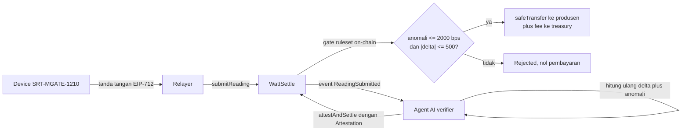

<div align="center">


&nbsp;

&nbsp;

&nbsp;


# WattSettle.sol

### Rel settlement energi DePIN: bacaan meter bertanda tangan, di-attest AI, dibayar on-chain

`Foundry` - `Solidity 0.8.30` - `OpenZeppelin 5.1` - `EIP-712` - `20 test PASS` - `ERC-8004 agentId 2116`

</div>

> [!NOTE]
> Kontrak ini adalah evolusi terkendali dari `ProofOfWatt.sol`, bukan proyek baru. Seluruh jalur
> kriptografis lama (EIP-712 recover, replay guard, monotonic guard) dipertahankan apa adanya,
> termasuk domain separator `ProofOfWatt/1`, supaya fixture tanda tangan device yang sudah ada
> tetap sah. Yang berubah hanya lapisan keputusan dan settlement.

---

## Daftar Isi

- [Alamat Live](#alamat-live)
- [Bukti On-chain](#bukti-on-chain)
- [Cara Kerja](#cara-kerja)
- [Yang Membuat Keputusan AI Bisa Diaudit](#yang-membuat-keputusan-ai-bisa-diaudit)
- [Integrasi ERC-8004](#integrasi-erc-8004)
- [Catatan Keamanan](#catatan-keamanan)
- [Menjalankan](#menjalankan)
- [Struktur Repo](#struktur-repo)

---

## Alamat Live

Semuanya di BNB Smart Chain Testnet, chainId 97.

| Peran | Alamat |
|:--|:--|
| Kontrak `WattSettle` | [`0xdA149c0939c0C3450EDE5c8a0A0e8cF3AF36481a`](https://testnet.bscscan.com/address/0xdA149c0939c0C3450EDE5c8a0A0e8cF3AF36481a) |
| Token settlement `suriota` | [`0x5f730750388176206cC3A7FE894c413675381B05`](https://testnet.bscscan.com/address/0x5f730750388176206cC3A7FE894c413675381B05) |
| Agent AI verifier (`VERIFIER_ROLE`) | [`0xce4D51524eDECD04B5417F6C8B6E6B6b9e594291`](https://testnet.bscscan.com/address/0xce4D51524eDECD04B5417F6C8B6E6B6b9e594291) |
| Device SRT-MGATE-1210-#001 (signer) | `0xA532b1e8773EC9d7db671d346f801C9f8d0c8D49` |
| Produsen (penerima pembayaran) | [`0xE07aE16B2Ca0fA9Df8A667FD34729307C3333f8d`](https://testnet.bscscan.com/address/0xE07aE16B2Ca0fA9Df8A667FD34729307C3333f8d) |
| Treasury (penerima fee protokol) | [`0x703629a46690e30D546e80AA9B8F03538F3F5b0E`](https://testnet.bscscan.com/address/0x703629a46690e30D546e80AA9B8F03538F3F5b0E) |
| Source verified | [Sourcify `exact_match`](https://repo.sourcify.dev/97/0xdA149c0939c0C3450EDE5c8a0A0e8cF3AF36481a) |

> [!IMPORTANT]
> Deployer **melepas** `VERIFIER_ROLE` miliknya sendiri di transaksi deploy. Sejak saat itu
> satu-satunya alamat yang bisa memicu settlement adalah wallet agent AI. Otonomi agent bukan
> klaim slide, ia bisa dibuktikan dengan satu panggilan `hasRole` di BscScan.

---

## Bukti On-chain

Loop penuh sudah berjalan nyata, bukan simulasi. Yang paling penting: satu bacaan disetujui dan
dibayar, satu bacaan **ditolak** tanpa pembayaran sepeser pun.

| Langkah | Transaksi |
|:--|:--|
| Deploy `WattSettle` | [`0x9cc1cd17...bd017e`](https://testnet.bscscan.com/tx/0x9cc1cd173cb6164312b4de14e40ad43c0e183ed38ba797ec591e4e452ebd017e) |
| Daftar device | [`0xa990f69c...3aafd3`](https://testnet.bscscan.com/tx/0xa990f69ce4825192bf07383bd41050b35bf26dba88303a8273e0a49bae3aafd3) |
| Serahkan `VERIFIER_ROLE` ke agent | [`0x59b51622...2b3199`](https://testnet.bscscan.com/tx/0x59b5162239c8a8c34f081d02bb0fbe448e4fe7dfce24437f27d0990eee2b3199) |
| Deployer lepas `VERIFIER_ROLE` | [`0x697a6058...d301ab`](https://testnet.bscscan.com/tx/0x697a6058e3c903638fc1befd2b2c87912d6ea3c5f76c15ccb24dfb9cd3d301ab) |
| Pre-fund pool 500.000 suriota | [`0x5ed3d825...a1107f`](https://testnet.bscscan.com/tx/0x5ed3d825d342157bbd747d30723a515524cd0628fd802e6e016686aac5a1107f) |
| `submitReading` #0, 105 kWh, bersih | [`0x7630a99d...2a4544`](https://testnet.bscscan.com/tx/0x7630a99d896ae1794e943f840d8877b584bb3ee8d2b67ee96e5cfaf5542a4544) |
| `submitReading` #1, 4200 kWh, anomali | [`0x3aa5c594...b80fc8`](https://testnet.bscscan.com/tx/0x3aa5c59415bd3c34912fe8a3040507792aba26c1c80358a518ad400c62b80fc8) |
| `attestAndSettle` #0, **APPROVED** | [`0xebc53654...0d553`](https://testnet.bscscan.com/tx/0xebc5365420395715815d912ee6b75c337039fc858358412debae319a64d0d553) |
| `attestAndSettle` #1, **REJECTED** | [`0xdca33d63...5d8d40`](https://testnet.bscscan.com/tx/0xdca33d634ca3bb317fcf33a7983975cee87395246bfb2ca04c710b0fbc5d8d40) |
| Daftar agent di ERC-8004 | [`0x7216d78d...cbaa5d`](https://testnet.bscscan.com/tx/0x7216d78dc573bb5b1f9b780cf4a8fbdca7c1cbab882ec633051e488a3ecbaa5d) |

Hasil settlement, dibaca ulang dari chain bukan dari log lokal:

| Pihak | Saldo `suriota` | Asal |
|:--|--:|:--|
| Produsen | 103,95 | 105 kWh dikali 1 suriota, dikurangi fee 1 persen |
| Treasury | 1,05 | fee protokol `feeBps = 100` |
| Reward pool kontrak | 499.895 | 500.000 dikurangi reward kotor 105 |

Reputasi device setelah dua bacaan: `approvedReadings = 1`, `rejectedReadings = 1`,
`avgAnomalyBps = 5250`.

---

## Cara Kerja


```mermaid
flowchart LR
  DEV["Device SRT-MGATE-1210"] -->|tanda tangan EIP-712| REL["Relayer"]
  REL -->|submitReading| C["WattSettle"]
  C -->|event ReadingSubmitted| AG["Agent AI verifier"]
  AG -->|hitung ulang delta plus anomali| AG
  AG -->|attestAndSettle dengan Attestation| C
  C -->|gate ruleset on-chain| G{"anomali &lt;= 2000 bps<br/>dan |delta| &lt;= 500?"}
  G -->|ya| PAY["safeTransfer ke produsen<br/>plus fee ke treasury"]
  G -->|tidak| REJ["Rejected, nol pembayaran"]
```

Titik pentingnya ada di kotak `G`. Agent **tidak** mengirim boolean approve. Agent hanya
memasok angka, dan kontrak yang memutus. Verifier yang berbohong pun tidak bisa memaksa
pembayaran, karena gate-nya dievaluasi di dalam kontrak terhadap parameter kontrak.

| Fungsi | Akses | Peran |
|:--|:--|:--|
| `registerDevice` | `DEFAULT_ADMIN_ROLE` | daftarkan device (signer, owner), tolak alamat nol |
| `submitReading` | publik | relay bacaan ter-sign, cek EIP-712, monotonic, anti-replay |
| `attestAndSettle` | `VERIFIER_ROLE` | terima rationale AI, jalankan gate, settle plus fee split |
| `setRewardPerKwh` | `DEFAULT_ADMIN_ROLE` | atur reward per kWh |
| `setTreasury` | `DEFAULT_ADMIN_ROLE` | atur penerima fee |
| `setFeeBps` | `DEFAULT_ADMIN_ROLE` | atur take rate, dibatasi keras 1000 bps |
| `setGateParams` | `DEFAULT_ADMIN_ROLE` | atur ambang anomali dan delta |

---

## Yang Membuat Keputusan AI Bisa Diaudit

Struct `Attestation` yang ditulis on-chain membawa lima field, dan dua di antaranya adalah
kunci auditabilitas.

```solidity
struct Attestation {
    int256  kwhDeltaVsBaseline;  // selisih terhadap baseline device, boleh negatif
    uint16  anomalyScoreBps;     // skor anomali 0..10000 basis points
    bytes32 modelVersionHash;    // keccak256 versi logic yang dipin
    bytes32 rulesetHash;         // keccak256 isi file ruleset di repo ini
    uint64  evaluatedAt;         // kapan verifier mengevaluasi
}
```

`rulesetHash` adalah keccak256 dari byte file [`ruleset/anomaly_v1.json`](ruleset/anomaly_v1.json)
persis. Siapa pun bisa menghitungnya sendiri dan mencocokkannya dengan nilai di event
`ReadingAttested`:

```bash
cast keccak $(xxd -p -c 999999 ruleset/anomaly_v1.json)
# 0xcce6c15c459cd085ae0c5d364227022f59f70d7036819c7b023598a590df6b41
```

Ini mengubah "percaya AI kami" menjadi "hitung sendiri dan buktikan".

> [!TIP]
> LLM tidak berada di jalur keputusan. `evaluate()` di [`agent/verifier.py`](agent/verifier.py)
> murni aritmetika bilangan bulat terhadap baseline, jadi keputusan uang selalu reproducible.
> LLM dipakai untuk menyusun penjelasan bagi manusia, sesudah keputusan diambil.

---

## Integrasi ERC-8004

Agent verifier terdaftar sebagai agent nyata di **Identity Registry ERC-8004 yang live di chain 97**,
bukan tiruan lokal.

| Item | Nilai |
|:--|:--|
| Identity Registry (live, chain 97) | [`0x8004A818BFB912233c491871b3d84c89A494BD9e`](https://testnet.bscscan.com/address/0x8004A818BFB912233c491871b3d84c89A494BD9e) |
| agentId WattSettle verifier | **2116** |
| Pemilik agentId | `0xce4D51524eDECD04B5417F6C8B6E6B6b9e594291` |
| Agent card | [`agent/agent-card.json`](agent/agent-card.json) |

> [!WARNING]
> Per 5 September 2026, **tidak ada Validation Registry ERC-8004 yang di-deploy di chain 97**,
> baik oleh proyek kanonik maupun BRC8004. Tabel deployment resmi hanya memuat Identity dan
> Reputation Registry, dan bagian Validation Registry di EIP-nya masih dalam revisi aktif.
> Karena itu rationale attestation untuk sementara hidup di event `ReadingAttested` milik kontrak
> ini, yang nama fieldnya sengaja mencerminkan semantik `validationResponse` ERC-8004 supaya bisa
> dipindahkan begitu registry-nya rilis.

---

## Catatan Keamanan

| Aspek | Status |
|:--|:--:|
| Verifikasi tanda tangan EIP-712 (ECDSA recover ke signer terdaftar) | aman |
| Anti replay (`usedDigest`) dan timestamp monotonic (`lastTs`) | aman |
| Access control terpisah, admin dan verifier | aman |
| Checks-effects-interactions, status di-set sebelum transfer | aman |
| `nonReentrant` di jalur payout, diuji dengan malicious token | aman |
| `SafeERC20.safeTransfer` menggantikan raw transfer | aman |
| Solvency check sebelum transfer (`InsufficientRewardPool`) | aman |
| Fee protokol dibatasi keras 1000 bps, admin tidak bisa menyedot produsen | aman |
| `registerDevice` menolak signer atau owner alamat nol | aman |
| Reward pool wajib **pre-fund**, payout dari saldo kontrak bukan mint | wajib dijaga |

Satu temuan yang layak dicatat: guard `ReplayedReading` **tidak bisa dicapai** oleh pengiriman
ulang biasa, sebab `timestamp` ikut masuk digest sehingga kiriman identik selalu tertahan
`StaleTimestamp` lebih dulu. Satu-satunya jalur yang benar-benar menyentuh `usedDigest` adalah
mendaftar ulang device (yang mereset `lastTs` ke nol) lalu mengirim ulang bacaan lama. Test
`testReplayGuardReverts` menempuh jalur itu persis, sehingga guard-nya terbukti kode hidup,
bukan kode mati.

---

## Menjalankan

Foundry dijalankan dari WSL Ubuntu atau Git Bash, bukan PowerShell.

```bash
cd proofofwatt

forge build --sizes      # WattSettle 7409 byte
forge test               # 20 test, semua hijau
forge lint src/ script/  # nol warning
forge coverage
```

Fokus per kelompok test:

```bash
forge test --match-contract WattSettleBaseTest   # 8 guard kriptografis warisan
forge test --match-contract WattSettleDeltaTest  # 12 test settlement dan gate
forge test --match-test "testReentrancyAttemptReverts|testFeeSplitCorrect" -vvv
```

<details>
<summary>Deploy ulang dari nol</summary>

```bash
set -a; source ../.secrets/wattsettle-roles.env; set +a
export DEPLOYER_PK=0x...
export PREFUND_WEI=500000000000000000000000

forge script script/Deploy.s.sol:Deploy --rpc-url "$BSC_TESTNET_RPC" --broadcast --slow
```

Satu broadcast melakukan lima hal: deploy, pasang treasury, daftarkan device, serahkan
`VERIFIER_ROLE` ke agent lalu cabut dari deployer, dan isi reward pool.

</details>

<details>
<summary>Kirim satu bacaan dan jalankan agent</summary>

```bash
# device menandatangani, relayer membayar gas
KWH=105 READING_TS=$(date +%s) READING_NONCE=1 \
  forge script script/SubmitReading.s.sol:SubmitReading --rpc-url "$BSC_TESTNET_RPC" --broadcast

# agent membaca, menghitung ulang, lalu settle
python agent/verifier.py --dry-run   # lihat prediksi dulu
python agent/verifier.py             # kirim transaksi sungguhan
```

</details>

<details>
<summary>Verifikasi source</summary>

Sudah terverifikasi di Sourcify dengan status `exact_match`, tanpa perlu API key:

```bash
forge verify-contract 0xdA149c0939c0C3450EDE5c8a0A0e8cF3AF36481a \
  src/WattSettle.sol:WattSettle --chain 97 --verifier sourcify \
  --constructor-args $(cast abi-encode "constructor(address)" 0x5f730750388176206cC3A7FE894c413675381B05) \
  --watch
```

Lencana Verified di BscScan adalah sistem terpisah dan menuntut kunci Etherscan V2 (kunci khusus
bscscan.com ditolak, ambil di https://etherscan.io/myapikey):

```bash
forge verify-contract 0xdA149c0939c0C3450EDE5c8a0A0e8cF3AF36481a \
  src/WattSettle.sol:WattSettle --chain 97 --verifier etherscan \
  --etherscan-api-key "$ETHERSCAN_API_KEY" \
  --constructor-args $(cast abi-encode "constructor(address)" 0x5f730750388176206cC3A7FE894c413675381B05) \
  --watch
```

</details>

---

## Struktur Repo

```
proofofwatt/
  src/WattSettle.sol              kontrak settlement, 7409 byte
  test/WattSettle.t.sol           20 test, base plus delta, malicious token reentrancy
  script/Deploy.s.sol             deploy plus setup role plus pre-fund dalam satu broadcast
  script/SubmitReading.s.sol      device menandatangani, relayer me-relay
  agent/verifier.py               agent AI otonom, scan lalu recompute lalu attest lalu settle
  agent/agent-card.json           kartu agent ERC-8004, dirujuk tokenURI agentId 2116
  ruleset/anomaly_v1.json         ruleset yang di-hash ke on-chain, bisa dihitung ulang siapa pun
  scripts/night-before.sh         pengunci state sebelum demo, menolak start bila ada assert gagal
```

> [!CAUTION]
> Kunci privat ada di `../.secrets/` yang gitignored, testnet-only. Jangan pernah di-commit dan
> jangan pernah pakai ulang polanya di mainnet.

---

<div align="center">
<sub>Copyright 2026 PT Surya Inovasi Prioritas (SURIOTA) - <a href="../WattSettle/README.md">Build Bible WattSettle</a></sub>
</div>
